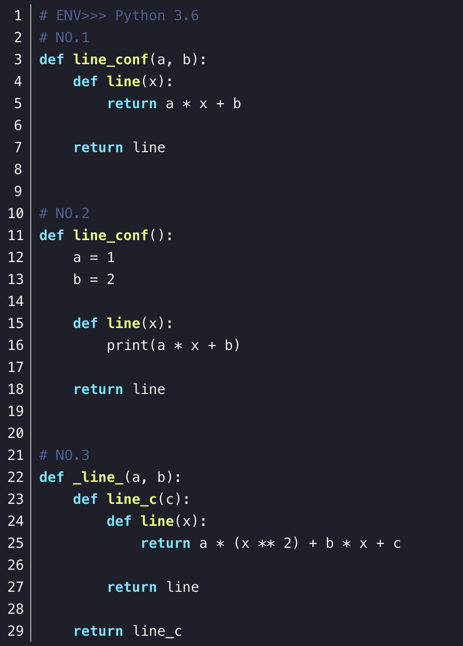

### 函数

#### 引言

- 什么是函数？
  - 前面在讲解Python数据类型的时候，我们已经接触过函数了。我们说，所谓的函数其实就是Python语言中的一种工具，基于该工具可以完成不同的具体操作。函数可以分为两种，一种是内置函数，另一种是自定义函数，我们可以这么理解：
  - 内置函数：
    - 内置函数其实就是Python语言的开发者已经给我们设计好的工具，我们可以直接使用这些已经被设计好的工具或者函数完成相关的操作
  - 自定义函数：
    - 当然，Python语言的开发者们也无法将我们在不同需求中要使用的操作都设计成不同的函数或者工具，那么我们也可以向开发者那样自行设计定制我们专属功能的工具函数。
  - 案例：当你在野外露营的时候，如果想生火，如果你身上恰好带了打火机，则可以直接使用该工具自行完成生火操作，否则，你也可以自己利用现有环境下的资源自行制作取火工具。

- 那么，为什么要使用函数呢？
  - 第一：
    - 函数的使用可以重用代码，省去重复性代码的编写，提高代码的重复利用率。如果程序中需要多次使用某种特定的功能，那么只需要编写一个合适的函数就可以了。程序可以在任何需要的地方调用该函数，并且同一个函数可以在不同的程序中调用，就像我们经常使用的print()和input()函数一样。
  - 第二：
    - 函数能封装内部实现，保护内部数据。很多时候，我们把函数看做“黑盒子”，即对应一定的输入会产生特定的结果或返回某个对象。往往函数的使用者并不是函数的编写者，函数的使用者对黑盒子的内部行为并不需要考虑，可以把精力投入到自身业务逻辑的设计而不是函数的实现细节。只有函数的设计者或者说编写者，才需要考虑函数内部实现的细节，如何暴露对外的接口，返回什么样的数据，也就是API的设计。

#### 函数基础

- 自定义函数的使用要经过两个过程

  - 函数的定义（制定）
  - 函数的调用（使用）

- 函数定义语法

  - ```
    def 函数名(参数)：
    	#内部代码
    	return 表达式
    ```

  - ```python
    def myFunc(): #函数定义的时候，函数体是不会被执行的
        #函数体
        a = 1
        b = 2
        c = a + b
        print('a和b的计算结果为:',c)
    ```
  
- 函数调用语法

  - 函数编写出来就是给人调用的。

  - 要调用一个函数，必须使用函数名后跟圆括号的方式才能调用函数。

  - 调用的同时要根据函数的定义体，提供相应个数和类型的参数，每个参数之间用逗号分隔，否则就会报错。

  - ```python
    myFunc() #函数调用，函数定义中的函数体才会被执行
    ```
  
- 函数定义规范使用


#### 返回值

- return语句
  - 当一个函数被调用结束后，该函数势必已经将一组操作执行结束了，如果在操作执行结束后，想要将一个结果返回给调用者，则就可以使用return语句实现。

```python
#返回一个表达式
def func():
    return 1 + 2 #返回一个表达式

result = func()
print(result)
```

```python
#不写return默认返回None(空)
def func():
    a = 10
    b = 20
    sum = a + b

result = func()
print(result)
```

```python
#返回多个结果
def func():
    return 1,'two',3.3

r1,r2,r3 = func()
print(r1,r2,r3)


######################
def func():
    return 1,'two',3.3

result = func() #使用一个变量接收多个返回值，多个返回值会被封装到一个元组中
print(result)
```

```python
#return后面的代码无意义：程序执行到return语句后，表示函数调用结束
def func():
    return 'bobo'
  	print('i love bobo') #会执行吗？不会执行的（报错）！
func() 
```

```python
def outer():
    print('我是外部函数outer')
    def inner():
        print('我是内部函数inner')
#想要调用inner函数？
outer()
```

```python
#如何调用inner这个内部函数呢？
def outer():
    print('我是外部函数outer')
    def inner():
        print('我是内部函数inner')
    return inner #返回的是内部函数名，不加括号的！

result = outer() # outer() == inner, result == inner
result() # inner()
```

```python
#返回函数调用（了解）
def outer():
    print('我是外部函数outer')
    def inner():
        print('我是内部函数inner')
    return inner()  #return None
outer()  
```

- 闭包函数（简单了解即可）：
  - 首先给出[闭包](https://so.csdn.net/so/search?q=闭包)函数的必要条件：
    - 闭包函数必须返回一个函数对象/内部函数名
    - 闭包函数返回的那个函数必须引用外部变量，而返回的那个函数内部不一定要return返回值
  - 

#### 函数参数

- 增加函数的通用性

- ```python
  #定义一个函数可以计算出两个数据的和
  def my_add():
      num1 = 1
      num2 = 2
      return num1 + num2
  result = my_add()
  print(result)
  #局限性：只可以计算指定两个数的和，无法实现具有较高的通用性
  ```

- ```python
  #定义一个函数可以计算出两个数据的和:具有更强的通用性
  def my_add(num1,num2): #num1=5,num2=9
      return num1 + num2
  
  result = my_add(5,9)
  print(result)
  ```

- 绝大多数函数在定义的时候需要接收一定数量的参数，然后根据实际调用时提供的参数的不同，输出不同的结果。注意将函数内部的参数名字，定义得和外部变量的名字一样是一种不好的习惯，它容易混淆思维，甚至发生错误。

- 参数的两种称谓
  - 形参(形式参数)
    - 函数定义时，制定的参数叫做形参
  - 实参(实际参数)
    - 函数调用时，传递的参数叫做实参
  - 而我们通常讨论的参数，指的都是形参

- 参数传递

  - 函数通常都有参数，用于将外部的实际数据传入函数内部进行处理。但是，在处理不同数据类型的参数时，会有不同的情况发生。这一切都是因为以下一点。

    - Python的函数参数传递的是实际数据的内存地址。
    
  - 例子1：不可变类型参数
  
    - ```python
      a = 1 
      def func(b):
          b = 2 
          print('形参b的内存地址为:%s'%id(b))
          print('函数内部的b为：',b)
          
      print('变量a的内存地址为：',id(a))
      func(a) 
      print('函数调用后，函数外部的变量a为:',a)
      ```
    
  - 例子2：上面例子说的是不可变类型参数，如果是可变类型的，比如列表呢？
  
    - ```python
      a = [1,2,3] 
      def func(b): 
          b.append(4)
          print('变量b的内存地址为：',id(b))
          print('函数内部的b为：',b)
      
      print('变量a的内存地址为：',id(a))
      func(a) 
      print('函数外部的变量a为：',a)
      ```
    
  - 调用函数时将列表对象a的地址传递给了函数内部的变量b。b.append(4)的时候，根据传进来的内存地址，找到[1,2,3]这个列表对象，在它的后面添加了4。
  
  - 可以看出，此时的a和b实际指向了同一个对象。为什么会这样？因为最关键的b.append(4)这句代码，它不同于“=”赋值语句，不会创建新的变量，而列表作为可变类型，具有append方法，这个方法只是对列表的一种调用而已。因此，a和b实际还是同一个对象。

#### 参数类型

- 参数的不同种类
  - 定义函数时，参数的名字和位置确定下来，函数的接口就固定了。对于函数的调用者来说，只需要知道如何传递正确的参数，以及函数将返回什么样的值就够了，函数内部的复杂逻辑被封装起来，调用者无需了解。Python函数的参数定义灵活度非常大。除了正常定义的位置参数外，还可以使用：
    - 位置参数
    - 默认参数
    - 动态参数

##### 位置参数

- 也叫必传参数或者顺序参数，是最重要的、也是必须在调用函数时明确提供的参数！位置参数必须按先后顺序，一一对应，个数不多不少的传递！

- ```python
  def add(a,b,c):
      return a+b+c
  
  x = y = 5
  r1 = add(x,y,x)
  r2 = add(4,5,6)
  print(r1,r2)
  ```
  
- 上面例子中的a，b，c就是位置参数，我们在使用add(4, 5, 6)调用时，就是将4的地址传给a，5的传给b，6的传给c的一一对应传递。

  - 类似add(4, 5, 6, 7)、add(4)这种“画蛇添足”、“缺胳膊少腿”和“嫁错郎”类型的调用都是错误的。

- **注意: Python在做函数参数传递的时候不会对数据类型进行检查，理论上你传什么类型都可以！**

- ```python
  def add(a,b,c):
      return a+b+c
  
  add(1,2,'haha')
  ```

- 但是，上面的add函数，如果你传递了一个字符串和两个数字，结果是弹出异常，因为字符串无法和数字相加。

  - 这就是Python的弱数据类型和动态语言的特点。在简单、方便的时候，需要你自己去实现数据类型检查。

##### 默认参数

- 在函数定义时，如果给某个参数提供一个默认值，这个参数就变成了默认参数，不再是位置参数了。在调用函数的时候，我们可以给默认参数传递一个自定义的值，也可以使用默认值。

- ```python
  def power(x,n=2): #x是位置参数，n是默认参数
      return x * n
  
  power(10)
  power(10,4)
  ```

- 上面例子中的n就是个默认参数。默认参数可以简化函数的调用，在为最常用的情况提供简便调用的同时，还可以在特殊情况时传递新的值。

- 默认参数的注意事项：
  - 默认参数必须在位置参数后面！
  - 使用参数名传递参数
  
- ```python
  def student(name,sex,age,classroom='101',tel='1323333333',address='...'):
      pass
  #下述函数调动是否可以？
  student('jack','male',17) #？
  student('tom','male',18,'102','666','Beijing') #？
  student('marry','female',18,'102',address='SH') #？
  student('mary','female',address='Bj',18)   #？
  ```

- 首先先来看一道面试真题：输出程序运行后的结果

  - ```python
    def func(a=[]): #将可变类型数据作为了默认参数的默认值
        a.append('A')
        return a
    
    print(func()) 
    print(func()) 
    print(func()) 
    ```
  
  - 解释：

    - 因为Python函数体在被读入内存的时候，默认参数a指向的空列表对象就会被创建，并放在内存里了。因为默认参数a本身也是一个变量，保存了指向对象[]的地址。每次调用该函数，往a指向的列表里添加一个A。a没有变，始终保存的是指向列表的地址，变的是列表内的数据！

##### 动态参数

- 顾名思义，动态参数就是传入的参数的个数是动态的，可以是1个、2个到任意个，还可以是0个。在不需要的时候，你完全可以忽略动态函数，不用给它传递任何值。
- Python的动态参数有两种，分别是：
  - *args
  - **kwargs
  - 这里面的关键是一个和两个星号的区别，而不是args和kwargs在名字上的区别
- 注意：
  
  - 动态参数，必须放在所有的位置参数和默认参数后面！
- *args
  
- 一个星号表示接收任意个参数。调用时，会将实际参数打包成一个元组传入形式参数。如果参数是个列表，会将整个列表当做一个参数传入。例如：
  
- ```python
  def func(*args):#动态参数
      print(args)
      for param in args:
          print(param) #param就是接收到的每一个参数
  func(1,2,3)
  ```
  
  - 问题：

    - 通过循环args，我们可以获得传递的每个参数。但是li这个列表，我们本意是让它内部的1,2,3分别当做参数传递进去，但实际情况是列表本身被当做一个整体给传递进去了。怎么办呢？

    - ```python
      def func(*args):
          print(args)
          for param in args:
              print(param)
      
      li = [1,2,3]
      func(li)
      ```
      
      - 解决：
      
        - 使用一个星号！调用函数，传递实参时，在列表前面添加一个星号就可以达到目的了。实际情况是，不光列表，任何序列类型数据对象，比如字符串、元组都可以通过这种方式将内部元素逐一作为参数，传递给函数。而字典，则会将所有的key逐一传递进去。
      
        - ```python
          def func(*args):
              print(args)
              for param in args:
                  print(param)
          
          li = [1,2,3]
          func(*li)
          ```
  
- **kwargs

  - 两个星表示接受键值对的动态参数，数量任意。调用的时候会将实际参数打包成字典。例如：

  - ```python
    def func(**kwargs):
        print(kwargs)
    
    func(k1=1,age=2,k3=2)
    ```
  
- 问题：
  
  - 而如果我们这样传递一个字典dic呢？我们希望字典内的键值对能够像上面一样被逐一传入。
  
  - ```python
      def func(**kwargs):
          print(kwargs)
      
      dic = {
          'k1':1,
          'age':20,
          'k3':3
      }
      func(d = dic)
      ```
      
    - 上述程序实际结果却是弹出错误，为什么？
  
    - 解释：
  
      - 因为这时候，我们其实是把dic当做一个位置参数传递给了func函数。而func函数并不接收任何位置函数。那怎么办呢？使用两个星号！
  
    - ```python
      def func(**kwargs):
          print(kwargs)
      
      dic = {
          'k1':1,
          'age':20,
          'k3':3
      }
      func(**dic)
      ```
      
    - 有了前面一个星号的基础，这里我们应该很好理解了。两个星号能将字典内部的键值对逐一传入**kwargs。
  
  - 万能参数
    
    - 当*args和**kwargs组合起来使用，理论上能接受任何形式和任意数量的参数，在很多代码中我们都能见到这种定义方式。需要注意的是，*args必须出现在**kwargs之前。


