## Python简介

- Python翻译成汉语是蟒蛇的意思，并且Python的logo也是两条缠绕在一起的蟒蛇的样子，然而Python语言和蟒蛇实际上并没有一毛钱关系。

  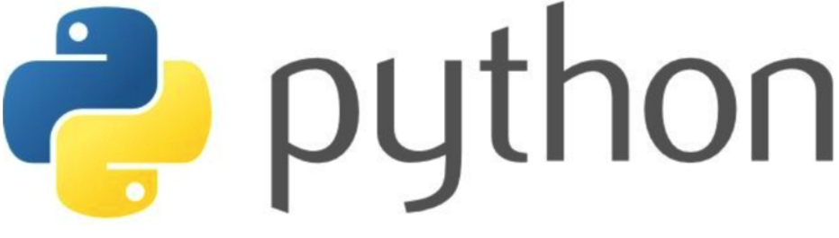

- Python语言是由荷兰程序员Guido van Rossum，江湖人称“龟叔”，独立开发完成初版的。“龟叔”曾供职于google。1989年圣诞节期间，在阿姆斯特丹，为了打发圣诞节的无趣，决心开发一个新的计算机编程语言，然后他就这么做了，并实现了（大神的能力）。之所以选中Python作为该编程语言的名字，是因为他是一个叫Monty Python喜剧团体的爱好者，其本意并不是想选条蟒蛇。

- Python第一个公开发行版发行于1991年，所以这年被当作Python的诞生年。
- Python 源代码遵循 GPL(GNU General Public License)协议，这是一个开源的协议，也就是说你可以免费使用和传播它，而不用担心版权的问题。
- 前面我们说了Python诞生自1991年，掰掰指头算算都30年了，比1995年的JAVA语言都早了4年，为何大器晚成，现在才发力？
  - 其一，在1990那个年代，计算机性能相比现在差很多，程序执行速度和效率很重要，快速开发不是第一要务，压榨机器性能才是。Python作为一门解释型动态语言，在解释方式上它天生就存在运行速度较慢的问题，因此不被当时编程界看好，其追求开发速度、强调简洁优雅、降低编程门槛的核心理念有点超越当时主流。而时至今日，计算机的硬件性能已经得到数量级的提高，计算能力不再是限制编程语言的最重要的因素，敏捷开发成为生产环境下对语言选择的重要因素，Python很好的满足了这一点，从而得到快速发展。
  - 其二，Python出生不好。作为对比的JAVA出身名门，其东家为SUN，当时互联网的头号公司，类似现在Google的地位，因而得到大力推广，并且有一群能力强、专职、有组织的团队进行开发和维护，所以很快获得成功，普及开来，至今仍然霸占着编程语言的榜首位置。而Python是个人编写的，寒门出身，龟叔没有三头六臂，个人时间精力都是有限的，虽然有一些志愿者帮忙做一些事情，但无疑和JAVA的正规军相比，能量还是要差了很多，这些都导致Python在初期发展得较为缓慢，甚至到如今都还未解决其被诟病的GIL问题。

### Python语言特点

#### 简单易学、明确优雅、开发速度快
- 简单易学：与C和Java比，Python的学习成本和难度曲线不是低一点，更适合新手入门，自底向上的技术攀爬路线。先订个小目标爬个小山，然后再往更高的山峰前进。而不像C和JAVA光语言学习本身，对于很多人来说就像珠穆朗玛峰一样高不可攀。
- 明确优雅：Python的语法非常简洁，代码量少，非常容易编写，代码的测试、重构、维护等都非常容易。一个小小的脚本，用C可能需要1000行，用JAVA可能几百行，但是用Python往往只需要几十行！
- 开发速度快：当前互联网企业的生命线是什么？产品开发速度！如果你的开发速度不够快，在你的产品推出之前别人家的产品已经上线了，你也就没有生存空间了，这里的真实例子数不胜数。那么，Python的开发速度说第二没人敢称第一!

#### 跨平台、可移植、可扩展、交互式、解释型、面向对象的动态语言
- 跨平台：Python支持Windows、Linux和MAC os等主流操作系统。
- 可移植：代码通常不需要多少改动就能移植到别的平台上使用。
- 可扩展：Python语言本身由C语言编写而成的，你完全可以在Python中嵌入C，从而提高代码的运行速度和效率。你也可以使用C语言重写Python的任何模块，从根本上改写Python，PyPy就是这么干的。
- 交互式：Python提供很好的人机交互界面，比如IDLE和IPython。可以从终端输入执行代码并获得结果，互动的测试和调试代码片断。
- 解释型：Python语言在执行过程中由解释器逐行分析，逐行运行并输出结果。
- 面向对象：Python语言具备所有的面向对象特性和功能，支持基于类的程序开发。
- 动态语言：在运行时可以改变其结构。例如新的函数、对象、甚至代码可以被引进，已有的函数可以被删除或是其他结构上的变化。动态语言非常具有活力。

#### “内置电池”，大量的标准库和第三方库
- Python为我们提供了非常完善的基础库，覆盖了系统、网络、文件、GUI、数据库、文本处理等方方面面，这些是随同解释器被默认安装的，各平台通用，你无需安装第三方支持就可以完成大多数工作，这一特点被形象地称作“内置电池（batteries included）”。
- 在程序员界，有一句话叫做“不要重复造轮子”。什么意思呢？就是说不要做重复的开发工作，如果对某个问题已经有开源的解决方案或者说第三方库，就不要自己去开发，直接用别人的就好。不要过分迷信自己的代码能力，要知道，能作为标准库被Python内置，必然在可靠性和算法效率上达到了目前最高水平，能被广泛使用的第三方库，必然也是经受了大量的应用考验。除非公司要求，不要自己去开发，请使用现成的库。那些造轮子的事情，就交给世界最顶尖的那一波程序员去干吧，没有极致的思维和数学能力，想创造好用的轮子是很难的。

#### 社区活跃，贡献者多，互帮互助
- 技术社区的存在就相当于程序员手中的指南针，没有指南针，很多时候，碰到了问题，就像无头的苍蝇只能到处乱飞，最终在茫茫的海洋中转晕致死。技术社区可以给我们对语言的学习和使用提供巨大的帮助，无论是前期的学习，还是日后的工作，只要有问题，技术社区的大牛都可以帮我们解决，有这些助力，可以帮我们更好地了解、学习和使用一门语言。技术社区同时还推动Python语言的发展方向，功能需求，促使公司企业更多的使用Python语言，招聘Python程序员。

#### 开源语言，发展动力巨大
- Python是基于C语言编写的，并且使用GPL开源协议，你可以免费获取它的源代码，进行学习、研究甚至改进。众人拾柴火焰高，有更多的人参与Python的开发，促使它更好的发展，被更多的应用，形成良性循环。Python为什么会越来越火就是因为它的开放性，自由性，聚起了人气，形成了社区，有很多人在其中做贡献，用的人越来越多，自然就提高了市场占有率，企业、公司、厂家就不得不使用Python，提供的Python程序员岗位就越来越多，这就是开源的力量。

### Python的应用方向

- 常规软件开发
  - Python支持函数式编程和OOP面向对象编程，能够承担任何种类软件的开发工作，因此常规的软件开发、脚本编写、网络编程等都属于标配能力。

- 科学计算
  - 随着NumPy, SciPy, Matplotlib等众多程序库的开发，Python越来越适合于做科学计算、绘制高质量的2D和3D图像。和科学计算领域最流行的商业软件Matlab相比，Python是一门通用的程序设计语言，比Matlab所采用的脚本语言的应用范围更广泛，有更多的程序库的支持。

- 自动化运维
  - 这几乎是Python应用的自留地，作为运维工程师首选的编程语言，Python在自动化运维方面已经深入人心，比如Saltstack和Ansible都是大名鼎鼎的自动化平台。

- 云计算
  - 开源云计算解决方案OpenStack就是基于Python开发的，搞云计算的同学都懂的。

- WEB开发
  - 基于Python的Web开发框架不要太多，比如耳熟能详的Django，还有Tornado，Flask。其中的Python+Django架构，应用范围非常广，开发速度非常快，学习门槛也很低，能够帮助你快速的搭建起可用的WEB服务。

- 网络爬虫
  - 也称网络蜘蛛，是大数据行业获取数据的核心工具。没有网络爬虫自动地、不分昼夜地、高智能地在互联网上爬取免费的数据，那些大数据相关的公司恐怕要少四分之三。能够编写网络爬虫的编程语言有不少，但Python绝对是其中的主流之一，其Scripy爬虫框架应用非常广泛。

- 数据分析
  - 在大量数据的基础上，结合科学计算、机器学习等技术，对数据进行清洗、去重、规格化和针对性的分析是大数据行业的基石。Python是数据分析的主流语言之一。

- 人工智能
  - Python在人工智能大范畴领域内的机器学习、神经网络、深度学习等方面都是主流的编程语言，得到广泛的支持和应用。

### Python的使用者

- 前面讲了这么多先进的当下最前沿的Python技术方向，那么有哪些公司在使用Python呢？
- 在国内最有名的就是知乎和豆瓣了，它们就是基于Python开发的Web服务。其它的例如百度、阿里、淘宝 、搜狐、金山、腾讯、盛大、网易、土豆、新浪、果壳等公司都在使用Python完成各种各样的任务，几乎所有的互联网企业都在招聘Python程序员。
- 在国外，更是数不胜数。谷歌的Google App Engine 、code.google.com 、Google earth 、谷歌爬虫、广告等项目都在大量使用Python进行开发。还有Facebook、Twitter等等等等。几乎所有的Linux发行版都内置Python解释器。

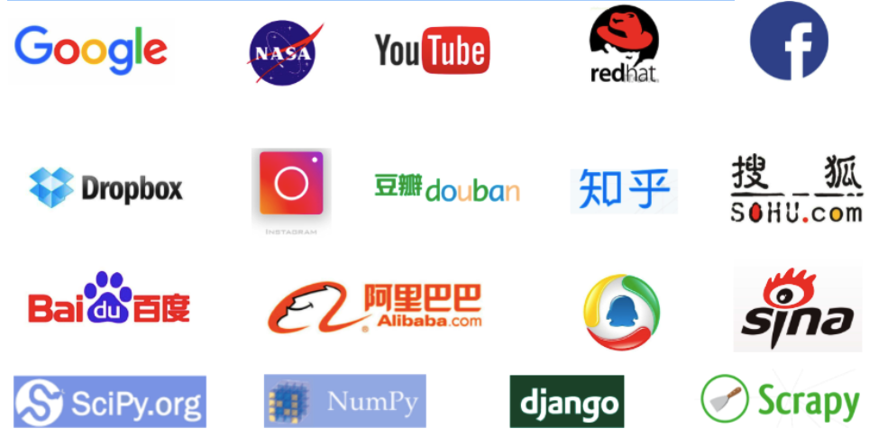

### Python的缺点

- 我们光说了Python的优点，也得说说它的缺点。任何编程语言都有缺点，Python也不例外。
  - 第一个缺点就是运行速度相对慢点，和C程序相比慢不少，这是解释型语言的通病，你的Python代码在执行时会一行一行地翻译成CPU能理解的机器码，这个翻译过程非常耗时，所以会变慢。而C程序作为编译型语言是运行前直接编译成CPU能执行的机器码，所以非常快。（但同时你可以这么理解，C语言把费时间的活在生产上线之前先花时间干了，所以运行时就快了。）
    - 程序速度不再那么重要，不一定非要追求极致
      - 早些时期CPU比较昂贵，计算资源很吃紧，内存也很贵，程序运行的速度和耗费的时间就很重要。这就是导致计算机科学致力于研究不同算法的效率的原因之一。然而，这已经不再是最重要的因素，因为现在芯片很便宜，而且运行速度有了质的提升。运行时间不再是你最贵的资源。公司最贵的资源现在是员工时间。或者换句话说，就是你。在规定时间内把事情做完比把程序变快更加重要。Python语法简洁，包含大量的标准库和第三方库，用较少的语句就可以完成其它语言上百条语句才能完成的任务，这无疑大大提高了开发的速度和效率，帮助你在尽可能短的时间内完成工作。
  - 第二个缺点就是Python2和Python3的不兼容性

### 环境搭建

- Python是一个跨平台、可移植的编程语言，因此可在windows、linux/unix和Mac os x系统中安装使用。安装完成后，你会得到Python解释器环境，一个命令行交互环境，一个简单的集成开发环境和相关的帮助文档。
- 首先，介绍Python相关的网站地址
  - Python官网：[http://www.python.org/](http://www.python.org/)
  - Python文档地址：[http://www.python.org/doc/](http://www.python.org/doc/)
  - Python模块仓库 https://pypi.python.org/pypi
  - 这三个网址和我们往后的Python学习与使用密切相关，一切以其内容为标准参考。
- 在正式安装和学习Python之前，我们还有一个问题要考虑清楚，那就是选择Python2还是Python3？
  - Python有一个独有的版本问题，也就是它同时存在2.x和3.x版本两条发行线，并且两者在语法上有一些不同之处，很多时候3.x并不向2.x兼容。但是历史总是要往前走的，不可能永远持续这种情况，为了让3.x成为唯一版本线，又让2.x版本的用户能够有时间过渡到3.x版本上来，Python官方推出了2.7版本，它是2.x的最后一个发行版，在很多特性上向3.x看齐，属于临时过渡的版本。Python官方同时给出了2.7版本的结束时间，届时2.x版本将不再发行。但是现有的基于2.x版本的应用和模块太多了，很多公司和企业还在使用2.x版本，有一些重要的第三方库也没有完全支持Python3.x，生产环境的“大船”可不是那么好调头的。
  - 官方在https://wiki.python.org/moin/Python2orPython3 中进行了版本选择的解释，大概意思为Python3是语言的现在和未来，Python2必将成为过去式。作为新学者，在没有公司强制性要求的情况下，尽量选择最新版本的Python3。

#### windows下安装Python

- 首先前往官网下载安装文件
  - 注意：3.5+以上的Python版本不支持windows xp及更低版本的操作系统，并且windows 7系统必须安装sp1补丁包才可以，这一点请同学们务必注意。
  - 建议大家安装：Python 3.6.1 - 2017-03-21这种文件名的是稳定发布的版本，属于我们选择的对象

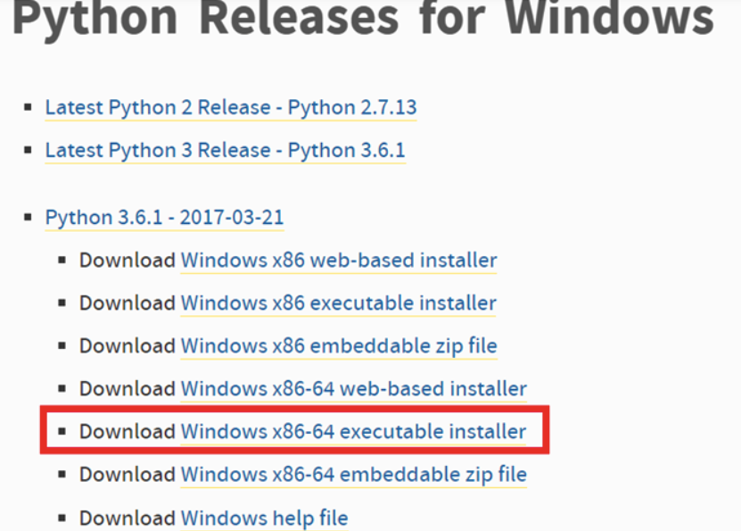

- 点击链接，耐心等待下载。网速慢的同学可以考虑国内的镜像站点或软件站点，请自行百度下载。
- 下载完成后，我们会得到一个名字为python-3.6.1-amd64的安装文件，运行文件

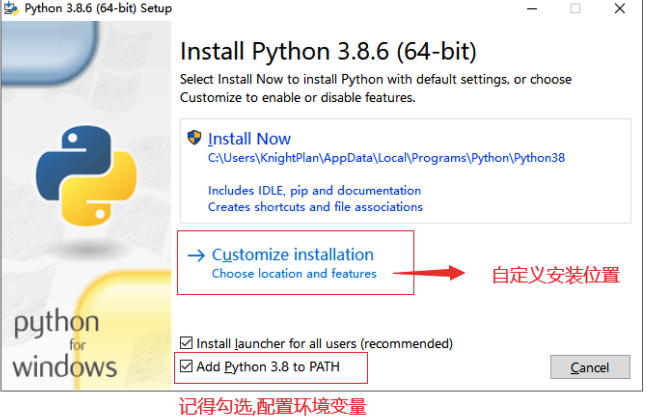

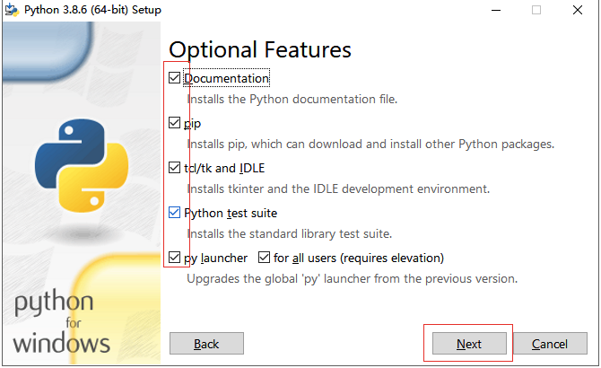

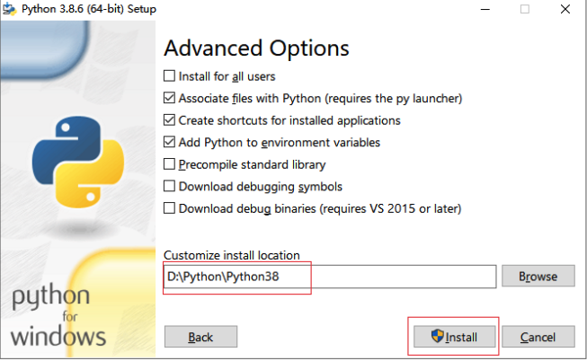

- 安装验证：
  - 如果中途没有出现什么错误，那么使用WIN+r键，进入CMD界面，运行python -V（大写的V），如果执行结果显示python 3.6.1，则表明安装成功。
  - 或者直接输入python，进入下图所示的交互式界面，也表示安装成功了。

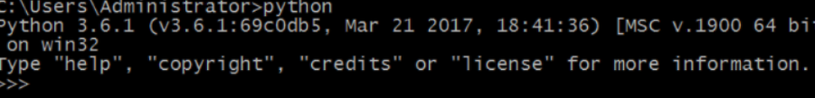

如果弹出错误：python不是内部或外部命令，也不是可运行的程序或批处理文件。 要么是没正常安装，要么就是环境变量没有设置正确。

#### Linux下安装Python

- 基本上，绝大多数的Linux发行版都默认安装有Python。但这有可能安装的是python2.7。

- 在Ubuntu中，推荐使用16.04 LTS版，使用sudo apt-get install python3.5 pythont3.5-dev就可以直接安装了。但是这种方式往往不能安装最新版本的python，为此我们可能还需要使用python源码进行安装。

- 源码安装：
  - 在官网主页选择source code，进入页面，下载源码：
  - 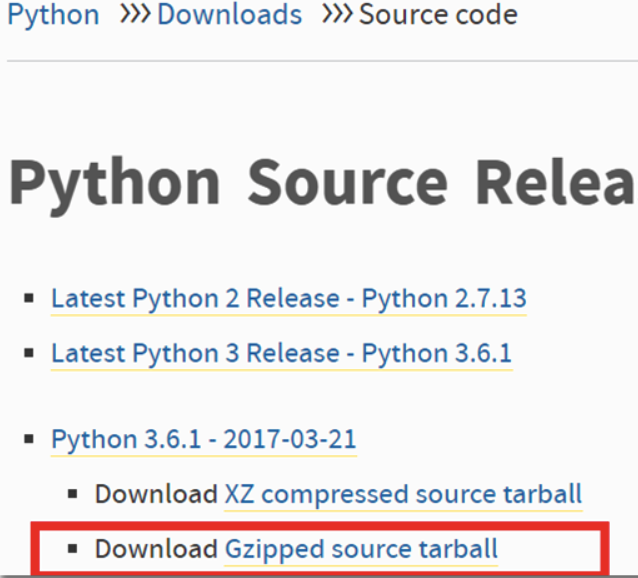
  - 不管是何种方式，将源码包拷贝到ubuntu系统的家目录中。
  - 执行tar -zxvf Python-3.6.1.tar解压文件
  - 进入Python-3.6.1目录，运行./configure –prefix=/usr/local。这里通过指定prefix参数为/usr/local将python3.6.1的安装文件全集中在这个目录下，方便我们以后的删除和修改。 configure成功后运行sudo make && sudo make install，如果一切顺利，将看见下图，表示安装完成。

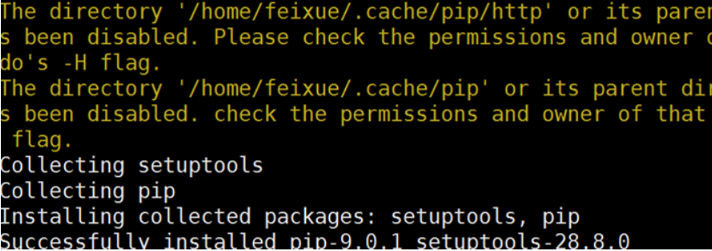

#### MAC下安装Python

- 通常Mac系统自带的Python版本是2.7。要安装最新的Python3.6，可以从Python官网下载Python3.6的安装程序运行并安装。

### pip安装与使用

- 我们都知道python的模块仓库中有海量的第三方库或者说模块，这些模块针对不同的应用，发挥不同的作用。我们在实际的项目中，或多或少的都要使用到第三方模块，那么如何将这些模块加入到自己的项目中内呢？

- Python官方为我们提供了一个统一的代码托管仓库，所有的第三方模块，甚至你自己写的开源模块，都可以发布到这里，让全世界的人分享下载。

- 有了统一的管理仓库，那么我们是不是就可以从上面下载源码进行安装了？原则上是的，只不过由于使用源码安装比较繁琐，容易出错，也不够简便，因此出现了wheel文件格式，类似zip或rar文件，并提供专用的安装工具，帮助我们更快更简便的安装。pip就是这个工具！它能帮助我们自动从仓库上下载并安装第三方模块。

- pip安装
  - Python3.4以后默认都安装有pip。

- pip的基本使用
  - 在命令行下，输入pip，回车可以看到帮助说明
  - 使用pip前请务必确认其所对应的Python解释器必须是你想要的那个，一般情况下，如果你的机器只安装了一个python环境则忽略此处。
  - 指定版本安装
    - 安装特定版本的package，通过使用==, >=, <=, >, <来指定一个版本号。 pip install pillow<2.0'
  - 卸载已安装的库
    - pip uninstall pillow
  - 列出已经安装的库
    - pip list
  - 将已经安装的库列表保存到文本文件中
    - pip freeze > requirements.txt
  - 根据依赖文件批量安装库
    - pip install -r requirements.txt
      - 使用上面的txt文件，批量安装第三方库
  - 使用wheel文件安装
    - 除了使用上面的方式联网进行安装外，还可以将安装包也就是wheel格式的文件，下载到本地，然后使用pip进行安装。

- pip源的选择
  - 很多时候，比如网络不给力，连接超时、防火墙阻挡等等各种原因，我们可能无法从Python官方的PyPi仓库进行pip安装，这时候可以选择国内的第三方源，推荐使用豆瓣源，速度不错。
  - 使用方法：
    - pip install -i https://pypi.doubanio.com/simple/ --trusted-host pypi.doubanio.com 模块名称
    - 需要注意的是，除了最后的pillow用你所期望的库名替代外，前面的参数都是固定写法，包括参数顺序。

### Pycharm集成开发环境

- PyCharm是由JetBrains公司打造的一款 Python IDE，支持Windows、Linux、macOS系统。JetBrains是一个专业设计编程语言IDE的公司，研发了很多针对不同语言的集成开发环境。

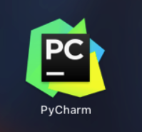

- PyCharm的功能 : 调试、语法高亮、Project管理、代码跳转、智能提示、自动完成、单元测试、版本控制……针对Django等开发框架有专门的优化设计，非常方便好用。

- 需要注意的是Pycharm分专业版和社区版。专业版是全功能的Python开发IDE包括Web开发，免费试用，逾期需购买许可，价格略贵。而社区版则是轻量级的Python开发IDE，但是免费并且开源。如果负担得起，建议大家使用专业版。
  - 下载链接：https://www.jetbrains.com/pycharm/download/

### Anaconda集成开发环境

- Anaconda是基于Python做数据分析+机器学习快速开发的集成环境。但是，如果在非框架模型下的开发任务，如果使用该集成环境是非常灵活高效的。

- jupyter可视化工具
  - 在Anaconda中提供了一个基于浏览器的可视化编码工具叫做jupyter，那也就是说，只要你机器中有浏览器就可以进行Python开发了。

- 安装流程
  - 在官网：https://www.jetbrains.com/pycharm/download/#section=mac 下载安装包。
- 具体安装请见Anaconda安装文档，

### 编译器与解释器

Python的环境我们已经搭建好了，可以开始学习基础知识了。但是，在此之前，还要先说说编译器与解释器相关的内容。

- 计算机的数据表现方式
  - 计算机本质作用：存储和运算二进制的数据

- 为什么计算机要使用二进制作为自己的机器语言也就是数据的表示方式呢？
  - 因为计算机最小的计算单元是根据开关状态高低电平来确定的，它只有开和关，高和低的概念，换成数学就是0和1的两种。同样的，在物理存储方面，硬盘的磁道只能区分打孔和未打孔的状态，也是0和1两种。同时二进制便于进行加、减运算和计数编码。二进制与十进制数易于互相转换。二进制便于逻辑判断（是或非），逻辑判断通常也是两种状态，这和二进制很搭配。二进制表示数据还具有抗干扰能力强，可靠性高的特点，因为当受到一定程度的电磁干扰时，只要可以分辨出它是高电平还是低电平，至于高多少或低多少并不重要，就能区分0和1，这在网络信号中，就是天生自带抗干扰能力。

- 但是，在人机交流上，二进位制有致命的弱点：
  - 数字的书写特别冗长，并且没有人类可读性！例如，十进位制的100000写成二进制就是11000011010100000，长了好几倍，而且你能从一个这么长的二进制数里读出它的十进制数是多少吗？
  - 计算机不能独立存在，不管是输入还是输出，它的一切都必须和人交流。那么问题来了，人类只能读10进制和英语、汉语等，可计算机只会010101，至于英语、汉语对它而言更是天书。那么我们是怎么和计算机交流的呢？怎么将我们的英语或者汉语编码成计算机能够识别的1010101呢？
    - 打孔纸条
    - 汇编语言

- 打孔纸条
  - 为了让计算机按我们的想法工作，程序员不得不编写计算机可以读懂看明白直接执行的机器码，也就是01010101的样子，打孔字条就是这么干的。用打没打孔来代表0和1。OK，计算机没问题，它能无障碍阅读，可程序员就难受了。这种方式容易出错，效率低，编写困难，维护困难。

- 汇编语言
  - 汇编语言也被叫做符号语言。在汇编语言中，用助记符代替机器指令也就是有一点抽象符号概念化了，这大大提高了编程效率。但是，这依然是一种低级语言，还有改善和提高的空间。

- 问题：
  - Python是一种高级语言。它的语法简单明了，更贴近人类的使用习惯，更像是人话。那如果想要让计算机能够理解python的意图则就需要有一个“翻译官”，将python的话翻译成计算机能理解的二进制。这个翻译官被称为解释器/编译器。

- 解释器/编译器
  - 高级语言与机器之间的翻译官。就是将代码翻译成机器可以执行的二进制机器码。两者只不过在运行原理和翻译过程有不同而已。

- 那么两者有什么区别呢？

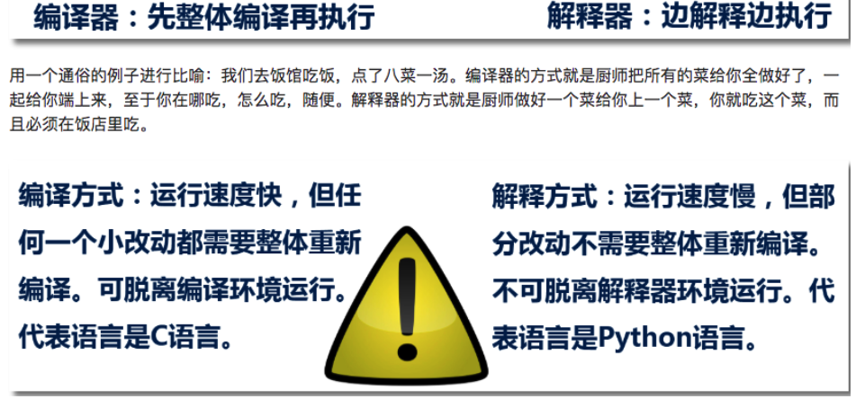

