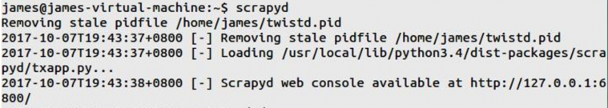
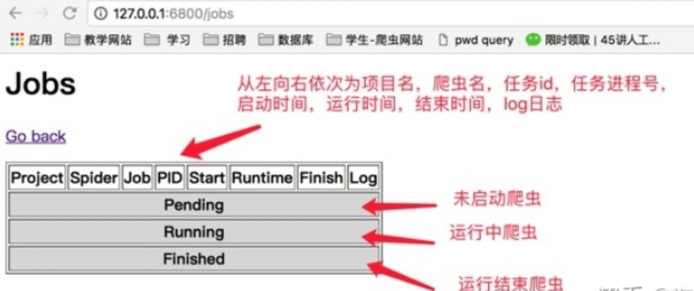
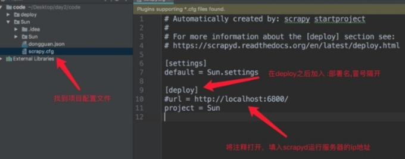
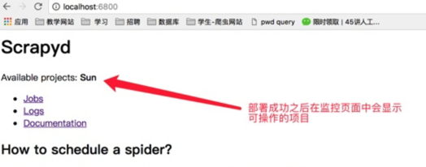
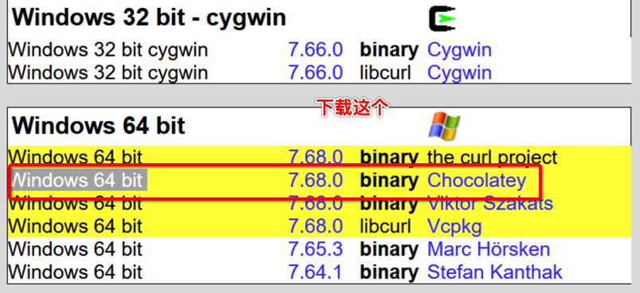

### 增量式

- 爬虫应用场景分类

  - 通用爬虫
  - 聚焦爬虫
  - 功能爬虫
  - 分布式爬虫
  - 增量式：
    - 用来监测网站数据更新的情况（爬取网站最新更新出来的数据）。
    - 只是一种程序设计的思路，使用什么技术都是可以实现的。
    - 核心：
      - 去重。
        - 使用一个记录表来实现数据的去重：
          - 记录表：存储爬取过的数据的记录
          - 如何构建和设计一个记录表：
            - 记录表需要具备的特性：
              - 去重
              - 需要持久保存的
            - 方案1：使用Python的set集合充当记录表？
              - 不可以的！因为set集合无法实现持久化存储
            - 方案2：使用redis的set集合充当记录表？
              - 可以的，因为redis的set既可以实现去重又可以进行数据的持久化存储。

- 基于两个场景实现增量式爬虫：

  - 场景1：如果爬取的数据都是存储在当前网页中，没有深度的数据爬取的必要。
  - 场景2：爬取的数据存在于当前页和详情页中，具备深度爬取的必要。

- 场景1的实现：

  - 数据指纹：

    - 数据的唯一标识。记录表中可以不直接存储数据本身，直接存储数据指纹更好一些。

    - ```
      #爬虫文件
      import scrapy
      import redis
      from ..items import Zlsdemo1ProItem
      class DuanziSpider(scrapy.Spider):
          name = 'duanzi'
          # allowed_domains = ['www.xxxx.com']
          start_urls = ['https://ishuo.cn/']
          #Redis的链接对象
          conn = redis.Redis(host='127.0.0.1',port=6379)
      
          def parse(self, response):
              li_list = response.xpath('//*[@id="list"]/ul/li')
              for li in li_list:
                  content = li.xpath('./div[1]/text()').extract_first()
                  title = li.xpath('./div[2]/a/text()').extract_first()
                  all_data = title+content
                  #生成该数据的数据指纹
                  import hashlib  # 导入一个生成数据指纹的模块
                  m = hashlib.md5()
                  m.update(all_data.encode('utf-8'))
                  data_id = m.hexdigest()
      
                  ex = self.conn.sadd('data_id',data_id)
                  if ex == 1:#sadd执行成功（数据指纹在set集合中不存在）
                      print('有最新数据的更新，正在爬取中......')
                      item = Zlsdemo1ProItem()
                      item['title'] = title
                      item['content'] = content
                      yield item
                  else:#sadd没有执行成功（数据指纹在set集合中存储）
                      print('暂无最新数据更新，请等待......')
      ```

- 场景2的实现：

  - 使用详情页的url充当数据指纹即可。

  - ```python
    import scrapy
    import redis
    from ..items import Zlsdemo2ProItem
    class JianliSpider(scrapy.Spider):
        name = 'jianli'
        # allowed_domains = ['www.xxx.com']
        start_urls = ['https://sc.chinaz.com/jianli/free.html']
        conn = redis.Redis(host='127.0.0.1',port=6379)
        def parse(self, response):
            div_list = response.xpath('//*[@id="container"]/div')
            for div in div_list:
                title = div.xpath('./p/a/text()').extract_first()
                #充当数据指纹
                detail_url = 'https:'+div.xpath('./p/a/@href').extract_first()
                ex = self.conn.sadd('data_id',detail_url)
                item = Zlsdemo2ProItem()
                item['title'] = title
                if ex == 1:
                    print('有最新数据的更新，正在采集......')
                    yield scrapy.Request(url=detail_url,callback=self.parse_detail,meta={'item':item})
                else:
                    print('暂无数据更新！')
    
        def parse_detail(self,response):
            item = response.meta['item']
            download_url = response.xpath('//*[@id="down"]/div[2]/ul/li[1]/a/@href').extract_first()
            item['download_url'] = download_url
    
            yield item
    ```

### scrapy项目部署

#### scrapyd部署工具介绍

- scrapyd是一个用于部署和运行scrapy爬虫的程序，它由 scrapy 官方提供的。它允许你通过JSON API来**部署爬虫项目和控制爬虫运行**。

> 所谓json api本质就是post请求的webapi

- 选择一台主机当做服务器，安装并启动 scrapyd 服务。再这之后，scrapyd 会以守护进程的方式存在系统中，监听爬虫地运行与请求，然后启动进程来执行爬虫程序。

#### 环境安装

- scrapyd服务: 

​	`pip install scrapyd`

- scrapyd客户端:

​	 `pip install scrapyd-client`

​	 一定要安装较新的版本10以上的版本，如果是现在安装的一般都是新版本

#### 启动scrapyd服务

- 打开终端**在scrapy项目路径下** 启动scrapyd的命令： `scrapyd`



- scrapyd 也提供了 web 的接口。方便我们查看和管理爬虫程序。默认情况下 scrapyd 监听 6800 端口，运行 scrapyd 后。在本机上使用浏览器访问 `http://localhost:6800/`地址即可查看到当前可以运行的项目。


- 点击job可以查看任务监控界面



#### scrapy项目部署

##### 配置需要部署的项目

- 编辑需要部署的项目的scrapy.cfg文件(需要将哪一个爬虫部署到scrapyd中，就配置该项目的该文件)



```
[deploy:部署名(部署名可以自行定义)] 
url = http://localhost:6800/ 
project = 项目名(创建爬虫项目时使用的名称)

username = bobo # 如果不需要用户名可以不写
password = 123456 # 如果不需要密码可以不写
```

##### 部署项目到scrapyd

- 同样在**scrapy项目路径下**执行如下指令：

  ```
  scrapyd-deploy 部署名(配置文件中设置的名称) -p 项目名称
  ```

- 部署成功之后就可以看到部署的项目



- 使用以下命令检查部署爬虫结果：

  - ```text
    scrapyd-deploy -L 部署名
    ```

#### 管理scrapy项目

##### 指令管理

- 安装curl命令行工具

  - window需要安装
  - linux和mac无需单独安装

- window安装步骤：

  - 下载curl文件：https://curl.se/download.html，打开网页后向下拖动，找到window系统对应版本下载

  

  -  下载后，放置到一个无中文的文件夹下直接解压缩，解压后将bin文件夹配置环境变量！
  - 参考网页：https://www.cnblogs.com/lisa2016/p/12193494.html

- 启动项目：

  ```
  curl http://localhost:6800/schedule.json -d project=项目名 -d spider=爬虫名
  ```

  - 返回结果：注意期中的jobid，在关闭项目时候会用到

    - ```
      {"status": "ok", "jobid": "94bd8ce041fd11e6af1a000c2969bafd", "node_name": "james-virtual-machine"}
      ```

- 关闭项目：

  - ```
    curl http://localhost:6800/cancel.json -d project=项目名 -d job=项目的jobid
    ```

- 删除爬虫项目：

  - ```
    curl http://localhost:6800/delproject.json -d project=爬虫项目名称
    ```

##### requests模块控制scrapy项目

```python
import requests

# 启动爬虫
url = 'http://localhost:6800/schedule.json'
data = {
	'project': 项目名,
	'spider': 爬虫名,
}
resp = requests.post(url, data=data)

# 停止爬虫
url = 'http://localhost:6800/cancel.json'
data = {
	'project': 项目名,
	'job': 启动爬虫时返回的jobid,
}
resp = requests.post(url, data=data)

```


### 生产者消费者模式

#### 认识生产者和消费者模式

生产者和消费者是异步爬虫中很常见的一个问题。产生数据的模块，我们称之为生产者，而处理数据的模块，就称为消费者。

例如：

​	图片数据爬取中，解析出图片链接的操作就是在生产数据

​	对图片链接发起请求下载图片的操作就是在消费数据

#### 为什么要使用生产者和消费者模式

> ​    在异步世界里，生产者就是生产数据的线程，消费者就是消费数据的线程。在多线程开发当中，如果生产者处理速度很快，而消费者处理速度很慢，那么生产者就必须等待消费者处理完，才能继续生产数据。同样的道理，如果消费者的处理能力大于生产者，那么消费者就必须等待生产者。为了解决这个问题于是引入了生产者和消费者模式。

```python
import requests
import threading
from lxml import etree
from queue import Queue
from urllib.request import urlretrieve
from time import sleep
headers = {
        "User-Agent": "Mozilla/5.0 (Macintosh; Intel Mac OS X 10_12_6) AppleWebKit/537.36 (KHTML, like Gecko) Chrome/81.0.4044.138 Safari/537.36",
    }

#生产数据：解析提取图片地址
class Producer(threading.Thread):#生产者线程
    def __init__(self,page_queue,img_queue):
        super().__init__()
        self.page_queue = page_queue
        self.img_queue = img_queue
    def run(self):
        while True:
            if self.page_queue.empty():
                print('Producer任务结束')
                break
            #从page_queue中取出一个页码链接
            url = self.page_queue.get()
            #从当前的页码对应的页面中解析出更多的图片地址
            self.parse_detail(url)
    def parse_detail(self,url):
        response = requests.get(url,headers=headers)
        response.encoding = 'gbk'
        page_text = response.text
        tree = etree.HTML(page_text)
        li_list = tree.xpath('//*[@id="main"]/div[3]/ul/li')
        for li in li_list:
            img_src = 'https://pic.netbian.com'+li.xpath('./a/img/@src')[0]
            img_title = li.xpath('./a/b/text()')[0]+'.jpg'
            dic = {
                'title':img_title,
                'src':img_src
            }
            self.img_queue.put(dic)

#消费数据：对图片地址进行数据请求
class Consumer(threading.Thread):#消费者线程
    def __init__(self,page_queue,img_queue):
        super().__init__()
        self.page_queue = page_queue
        self.img_queue = img_queue
    def run(self):
        while True:
            if self.img_queue.empty() and self.page_queue.empty():
                print('Consumer任务结束')
                break
            dic = self.img_queue.get()
            title = dic['title']
            src = dic['src']
            print(src)
            urlretrieve(src,'imgs/'+title)
            print(title,'下载完毕！')

def main():
    #该队列中存储即将要要去的页面页码链接
    page_queue = Queue(20)
    #该队列存储生产者生产出来的图片地址
    img_queue = Queue(60)

    #该循环可以将2，3，4这三个页码链接放入page_queue中
    for x in range(2,10):
        url = 'https://pic.netbian.com/4kmeinv/index_%d.html'%x
        page_queue.put(url)

    #生产者
    for x in range(3):
        t = Producer(page_queue,img_queue)
        t.start()
    #消费者
    for x in range(3):
        t = Consumer(page_queue,img_queue)
        t.start()

main()
```

