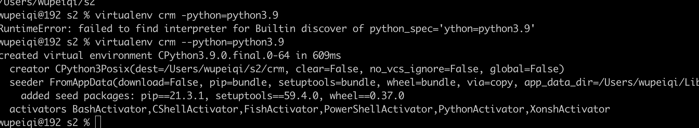
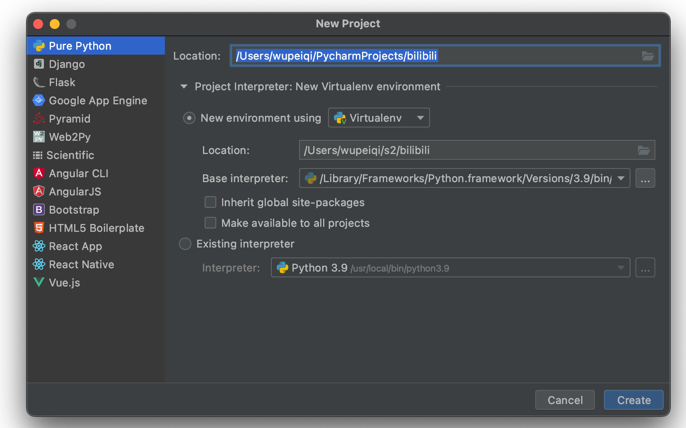
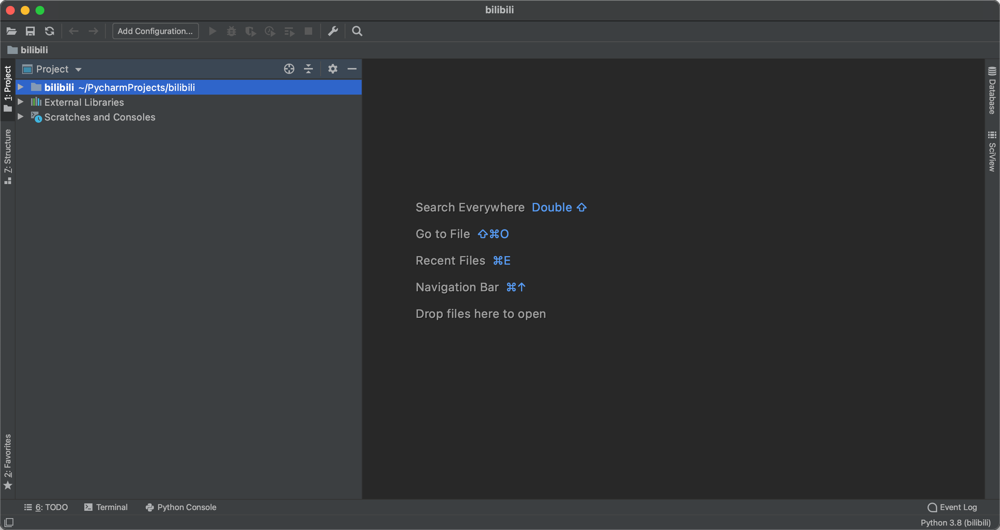
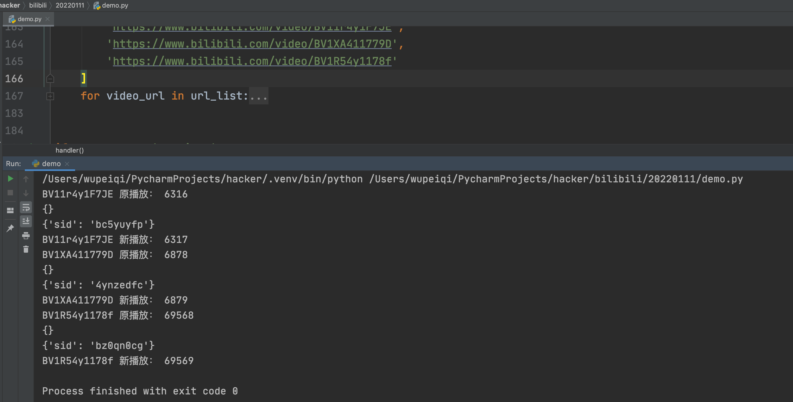
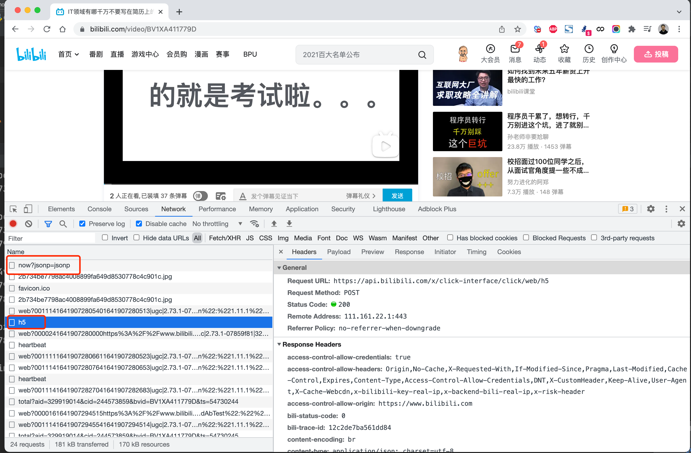

# day01 

今日概要：

- 虚拟环境
- x站逆向，实现刷播放量（JS逆向 1/2 +app逆向部分）。


## 1. 虚拟环境

为什么要存在虚拟环境？

- 帮我写一个项目 枯叶，要求你用：requests==1.8

  ```
  pip install requests==1.8
  ```

  ```python
  import requests
  
  ...
  ```

  

- 需求又来了

  ```
  pip install request==2.1
  ```

  ```python
  import requests
  
  ...
  ```


关于系统解释器（系统环境）：

- 安装Python（安装Python解释器） `C:\python39`

  ```
  C:\python39
  	- python.exe
  	- Scripts
  		- pip.exe
  		- pip3.exe
  	- Lib
  		- xxx.py
  		- re.py
  		- random.py
  		- site-packages（pip安装第三方模块）
  			- requests==1.8
  ```

  ```
  C:\python39\python.exe  code.py
  
  pip install requests
  C:\python39\Scripts\pip.exe install requests
  ```

  ```python
  import requests    # sys.path
  ```

  

所以，在Python中就出现了虚拟环境。

```
根据你电脑上的系统解释器虚拟出来N个python解释器。
```

```
# 系统解释器
C:\python39
	- python.exe
	- Lib
		...
		- requests1==1.8
	- Scripts
```

```
# 虚拟环境（虚拟解释器）
F:\xx\oo\crm
	- python.exe
	- Lib
		...
		- requests==1.9
	- Scripts
```

```
# 虚拟环境（虚拟解释器）
F:\xx\oo\luffy
	- python.exe
	- Lib
		...
		- requests==2.0
	- Scripts
```


潜规则：一般情况下，我们每次创建项目，都会为项目创建一个虚拟环境。

- 先创建虚拟环境：crm
- 再创建项目
- 项目 + 环境 关联起来，以后就可以利用这个环境专门去运行项目。


### 1.1 创建虚拟环境

- venv
- virtualenv（讲）


#### 1.1.1 安装virtualenv

安装在系统解释器。

```
pip install virtualenv
```

```
# 系统解释器
C:\python39
	- python.exe
	- Lib
		...
		- requests1==1.8
	- Scripts
		- virtualenv.exe
```


#### 1.1.2 利用virtualenv创建

在自己的终端（命令行）。

```
>>> F:
>>> cd /envs
>>> virtualenv crm --python=python3.9
```




#### 1.1.3 写一段代码

```
/Users/wupeiqi/code.py
```

```python
print("alex是个傻狗")
```


如果想要运行代码：

- 直接根据环境的地址，找到python解释器去运行

  ```
  /Users/wupeiqi/s2/crm/bin/python3.9  /Users/wupeiqi/code.py
  ```

- 激活虚拟环境，再运行

  - mac

    ```
    wupeiqi@192 ~ % source /Users/wupeiqi/s2/crm/bin/activate
    (crm) wupeiqi@192 ~ %
    (crm) wupeiqi@192 ~ % python code.py
    ```

  - win

    ```
    >>>F:
    >>>cd envs/crm/Scripts
    >>>activate
    ```

  


#### 1.1.4 Pycharm+虚拟环境


- 虚拟环境的目录：`/Users/wupeiqi/envs/day01_spider`
- 项目目录：`/Users/wupeiqi/PycharmProjects/day01_spider`


## 2.x站逆向（自动刷播放）


### 2.1 项目+环境







### 2.2 运行效果




### 2.3 请求分析




请求分析：

- now

  ```
  GET
  https://api.bilibili.com/x/click-interface/click/now?jsonp=jsonp
  ```

  ```
  COOKIE太多了
  buvid3=F03568DA-9977-3F85-8883-3CD06B46C93993362infoc; 
  CURRENT_FNVAL=2000; 
  b_lsid=924F110FE_17E49532A37; 
  _uuid=1A9E610A5-E58F-B37F-7B72-A75510F54749694142infoc; 
  buvid_fp=B0CA2F69-83A1-F9A8-D56C-71957156191003447infoc; 
  blackside_state=1; 
  sid=iyj6zepe
  ```

- h5

  ```
  POST
  https://api.bilibili.com/x/click-interface/click/web/h5
  ```

  ```
  aid: 329919014
  cid: 244573859
  bvid: BV1XA411779D
  part: 1
  mid: 0
  lv: 0
  ftime: 1641907696
  stime: 1641907696
  jsonp: jsonp
  type: 3
  sub_type: 0
  from_spmid: 
  auto_continued_play: 0
  refer_url: 
  bsource: 
  spmid: 
  ```

  ```
  buvid3=F03568DA-9977-3F85-8883-3CD06B46C93993362infoc; 
  CURRENT_FNVAL=2000; 
  b_lsid=924F110FE_17E49532A37; 
  _uuid=1A9E610A5-E58F-B37F-7B72-A75510F54749694142infoc; 
  buvid_fp=B0CA2F69-83A1-F9A8-D56C-71957156191003447infoc; 
  blackside_state=1; 
  sid=iyj6zepe
  ```

  

### 2.4 now

```
GET
https://api.bilibili.com/x/click-interface/click/now?jsonp=jsonp
```

```
COOKIE太多了

buvid3=F03568DA-9977-3F85-8883-3CD06B46C93993362infoc;   【首页返回】
CURRENT_FNVAL=2000;                                      【固定】
blackside_state=1;                                       【固定】
_uuid=1A9E610A5-E58F-B37F-7B72-A75510F54749694142infoc;  【代码】
sid=iyj6zepe											 【其他请求返回】

# 下一节
b_lsid=924F110FE_17E49532A37; 【代码】
buvid_fp=B0CA2F69-83A1-F9A8-D56C-71957156191003447infoc; 
```

一般情况下，请求中写的cookie都是从哪里来？

- 其他的请求返回：cookie（找到那个请求，发送并获取cookie值）
- 其他的请求返回：响应。（找到那个请求，发送并获取相应值）
- 其他的请求返回：响应体。（找到那个请求，发送并获取响应体）
- JS算法生成。


#### 2.4.1 buvid3

```
import requests

res = requests.get(
    url="https://www.bilibili.com/video/BV1XA411779D",
    headers={
        "User-Agent": "Mozilla/5.0 (Macintosh; Intel Mac OS X 10_15_7) AppleWebKit/537.36 (KHTML, like Gecko) Chrome/97.0.4692.71 Safari/537.36"
    }
)

print(res.cookies.get_dict())
```


#### 2.4.2 _uuid

```
1A9E610A5-E58F-B37F-7B72-A75510F547496 94142  infoc
```

```javascript
var r = function() {
        var e = a(8)
          , t = a(4)
          , n = a(4)
          , r = a(4)
          , o = a(12)
          , i = (new Date).getTime();
        return e + "-" + t + "-" + n + "-" + r + "-" + o + s((i % 1e5).toString(), 5) + "infoc"
    }
      , a = function(e) {
        for (var t = "", n = 0; n < e; n++)
            t += o(16 * Math.random());
        return s(t, e)
    }
      , s = function(e, t) {
        var n = "";
        if (e.length < t)
            for (var r = 0; r < t - e.length; r++)
                n += "0";
        return n + e
    }
      , o = function(e) {
        return Math.ceil(e).toString(16).toUpperCase()
    }
```

```python
               UUID                      时间
# 1A9E610A5-E58F-B37F-7B72-A75510F547496 94142  infoc
# 113AD917-4067-4957-975B-2BE281930C80
```


最终算法是：

```python
import time
import uuid


def gen_uuid():
    uuid_sec = str(uuid.uuid4())
    time_sec = str(int(time.time() * 1000 % 1e5))
    time_sec = time_sec.rjust(5, "0")

    return "{}{}infoc".format(uuid_sec, time_sec)


_uuid = gen_uuid()
print(_uuid)
```


> uuid是什么？系统内部根据当前时间、主板、mac地址等生成随机值。
>
> ljust是什么？让字符串满足指定长度，不满足是补充某个字符。


#### 2.4.3 小作业

自行找到 b_lsid 并通过python代码实现他的算法。

```
https://www.bilibili.com/video/BV1XA411779D
```


#### 2.4.4 sid

````
Request Method: GET
Request URL: https://api.bilibili.com/x/player/v2?cid=244573859&aid=329919014&bvid=BV1XA411779D
````

上述的cid、aid是哪里来的？

```
https://www.bilibili.com/video/BV1XA411779D
```

```python
import requests


def get_video_info(bvid):
    session = requests.Session()
    res = session.get(
        url="https://api.bilibili.com/x/player/pagelist?bvid={}&jsonp=jsonp".format(bvid),
    )
    cid = res.json()['data'][0]['cid']

    res = session.get(
        url="https://api.bilibili.com/x/web-interface/view?cid={}&bvid={}".format(cid, bvid),
    )
    res_json = res.json()
    aid = res_json['data']['aid']
    view_count = res_json['data']['stat']['view']
    # total_duration = res_json['data']['duration'] # 总时长
    duration = res_json['data']['pages'][0]['duration']  # 当前视频长度

    return aid, bvid, cid, view_count, duration


bvid = "BV1XA411779D"
aid, bvid, cid, view_count, duration = get_video_info(bvid)
print(aid, bvid, cid, view_count, duration)
```


拼凑请求并获取sid：

```python
import time
import uuid
import requests


def gen_uuid():
    uuid_sec = str(uuid.uuid4())
    time_sec = str(int(time.time() * 1000 % 1e5))
    time_sec = time_sec.rjust(5, "0")

    return "{}{}infoc".format(uuid_sec, time_sec)


def get_video_info(bvid):
    session = requests.Session()
    res = session.get(
        url="https://api.bilibili.com/x/player/pagelist?bvid={}&jsonp=jsonp".format(bvid),
    )
    cid = res.json()['data'][0]['cid']

    res = session.get(
        url="https://api.bilibili.com/x/web-interface/view?cid={}&bvid={}".format(cid, bvid),
    )
    res_json = res.json()
    aid = res_json['data']['aid']
    view_count = res_json['data']['stat']['view']
    # total_duration = res_json['data']['duration'] # 总时长
    duration = res_json['data']['pages'][0]['duration']  # 当前视频长度
    session.close()

    return aid, bvid, cid, view_count, duration


video_url = "https://www.bilibili.com/video/BV1XA411779D"

session = requests.Session()

# 1.获取buvid3
res = session.get(
    url=video_url,
    headers={
        "User-Agent": "Mozilla/5.0 (Macintosh; Intel Mac OS X 10_15_7) AppleWebKit/537.36 (KHTML, like Gecko) Chrome/97.0.4692.71 Safari/537.36"
    }
)

# 2.生成uuid
_uuid = gen_uuid()
session.cookies.set('_uuid', _uuid)

# 3.固定的那几个cookie
session.cookies.set("CURRENT_FNVAL", "2000")
session.cookies.set("blackside_state", "1")

# 4.获取各种ID
buvid = video_url.rsplit("/")[-1]
aid, bvid, cid, view_count, duration = get_video_info(buvid)

# 5.发送请求获取sid cid=244573859&aid=329919014&bvid=BV1XA411779D
session.get(
    url="https://api.bilibili.com/x/player/v2",
    params={
        "cid": cid,
        "aid": aid,
        "bvid": bvid,
    }
)
print(session.cookies.get_dict())

```


#### 2.4.5 now请求的实现

```python
import time
import uuid
import requests


def gen_uuid():
    uuid_sec = str(uuid.uuid4())
    time_sec = str(int(time.time() * 1000 % 1e5))
    time_sec = time_sec.rjust(5, "0")

    return "{}{}infoc".format(uuid_sec, time_sec)


def get_video_info(bvid):
    session = requests.Session()
    res = session.get(
        url="https://api.bilibili.com/x/player/pagelist?bvid={}&jsonp=jsonp".format(bvid),
    )
    cid = res.json()['data'][0]['cid']

    res = session.get(
        url="https://api.bilibili.com/x/web-interface/view?cid={}&bvid={}".format(cid, bvid),
    )
    res_json = res.json()
    aid = res_json['data']['aid']
    view_count = res_json['data']['stat']['view']
    # total_duration = res_json['data']['duration'] # 总时长
    duration = res_json['data']['pages'][0]['duration']  # 当前视频长度
    session.close()

    return aid, bvid, cid, view_count, duration


video_url = "https://www.bilibili.com/video/BV1XA411779D"

session = requests.Session()

# 1.获取buvid3
res = session.get(
    url=video_url,
    headers={
        "User-Agent": "Mozilla/5.0 (Macintosh; Intel Mac OS X 10_15_7) AppleWebKit/537.36 (KHTML, like Gecko) Chrome/97.0.4692.71 Safari/537.36"
    }
)

# 2.生成uuid
_uuid = gen_uuid()
session.cookies.set('_uuid', _uuid)

# 3.固定的那几个cookie
session.cookies.set("CURRENT_FNVAL", "2000")
session.cookies.set("blackside_state", "1")

# 4.获取各种ID
buvid = video_url.rsplit("/")[-1]
aid, bvid, cid, view_count, duration = get_video_info(buvid)

# 5.发送请求获取sid cid=244573859&aid=329919014&bvid=BV1XA411779D
session.get(
    url="https://api.bilibili.com/x/player/v2",
    params={
        "cid": cid,
        "aid": aid,
        "bvid": bvid,
    }
)

# 6.发送now请求
res = session.get(
    url="https://api.bilibili.com/x/click-interface/click/now?jsonp=jsonp"
)

print(res.text)
# {"code":0,"message":"0","ttl":1,"data":{"now":1641911150}}
# {"code":0,"message":"0","ttl":1,"data":{"now":1641911108}}
```


### 2.5 h5

```
POST
https://api.bilibili.com/x/click-interface/click/web/h5
```

```
aid: 329919014
cid: 244573859
bvid: BV1XA411779D
part: 1
mid: 0
lv: 0
ftime: 1641907696      # 第一次的请求时间 + app逆向
stime: 1641907696      # 当前的时间戳
jsonp: jsonp
type: 3
sub_type: 0
from_spmid: 
auto_continued_play: 0
refer_url: 
bsource: 
spmid: 
```

```
buvid3=F03568DA-9977-3F85-8883-3CD06B46C93993362infoc; 
CURRENT_FNVAL=2000; 
b_lsid=924F110FE_17E49532A37; 
_uuid=1A9E610A5-E58F-B37F-7B72-A75510F54749694142infoc; 
buvid_fp=B0CA2F69-83A1-F9A8-D56C-71957156191003447infoc; 
blackside_state=1; 
sid=iyj6zepe
```


代码如下：

```python
import time
import uuid
import random
import requests


def gen_uuid():
    uuid_sec = str(uuid.uuid4())
    time_sec = str(int(time.time() * 1000 % 1e5))
    time_sec = time_sec.rjust(5, "0")

    return "{}{}infoc".format(uuid_sec, time_sec)


def get_video_info(bvid):
    session = requests.Session()
    res = session.get(
        url="https://api.bilibili.com/x/player/pagelist?bvid={}&jsonp=jsonp".format(bvid),
    )
    cid = res.json()['data'][0]['cid']

    res = session.get(
        url="https://api.bilibili.com/x/web-interface/view?cid={}&bvid={}".format(cid, bvid),
    )
    res_json = res.json()
    aid = res_json['data']['aid']
    view_count = res_json['data']['stat']['view']
    # total_duration = res_json['data']['duration'] # 总时长
    duration = res_json['data']['pages'][0]['duration']  # 当前视频长度
    session.close()

    return aid, bvid, cid, view_count, duration


video_url = "https://www.bilibili.com/video/BV1XA411779D"

session = requests.Session()

# 1.获取buvid3
res = session.get(
    url=video_url,
    headers={
        "User-Agent": "Mozilla/5.0 (Macintosh; Intel Mac OS X 10_15_7) AppleWebKit/537.36 (KHTML, like Gecko) Chrome/97.0.4692.71 Safari/537.36"
    }
)

# 2.生成uuid
_uuid = gen_uuid()
session.cookies.set('_uuid', _uuid)

# 3.固定的那几个cookie
session.cookies.set("CURRENT_FNVAL", "2000")
session.cookies.set("blackside_state", "1")

# 4.获取各种ID
buvid = video_url.rsplit("/")[-1]
aid, bvid, cid, view_count, duration = get_video_info(buvid)

# 5.发送请求获取sid cid=244573859&aid=329919014&bvid=BV1XA411779D
session.get(
    url="https://api.bilibili.com/x/player/v2",
    params={
        "cid": cid,
        "aid": aid,
        "bvid": bvid,
    }
)

# 6.发送now请求
res = session.get(
    url="https://api.bilibili.com/x/click-interface/click/now?jsonp=jsonp"
)
# ctime = res.json()['data']['now']  # 不建议

# print(res.text)
# {"code":0,"message":"0","ttl":1,"data":{"now":1641911150}}
# {"code":0,"message":"0","ttl":1,"data":{"now":1641911108}}

# 7.h5请求 1641907696
ctime = int(time.time())
res = session.post(
    url="https://api.bilibili.com/x/click-interface/click/web/h5",
    data={
        "aid": aid,
        "cid": cid,
        "bvid": bvid,
        "part": "1",
        "mid": "0",
        "lv": "0",
        "ftime": ctime - random.randint(100, 500),  # 浏览器首次打开时间
        "stime": ctime,
        "jsonp": "jsonp",
        "type": "3",
        "sub_type": "0",
        "from_spmid": "",
        "auto_continued_play": "0",
        "refer_url": "",
        "bsource": "",
        "spmid": ""
    }
)

print(res.text)
```


## 3.小看效果

- 效果1：每个视频的播放量只能约 60~75s 涨一次。【IP可能被封】

- 效果2：单个IP&单个视频限制（60~75s 涨一次）。

  ```
  单个IP+多个视频=》多看几个视频。
  ```

- 效果3：隧道代理（实现刷播放）

  - 自己制作IP代理池，自己玩。
  - 买什么样的IP？
    - 固定IP
    - 隧道IP

```python
def load_proxy():
    proxy_username = "t14182026218199"      # 账户或ID
    proxy_pwd = "8uzwubn8"                  # 密码
    proxy_host = 'tps329.kdlapi.com:15818'  # IP和端口
    return {
        "http": "http://{}:{}@{}".format(proxy_username, proxy_pwd, proxy_host),
        "https": "http://{}:{}@{}".format(proxy_username, proxy_pwd, proxy_host),
    }

proxy_dict = load_proxy()


res = requests.get(
    url='https://www.baidu.com',
    proxies=proxy_dict
)
print(res.text)
```


## 写在最后

- 10月份，刷几万。
- 300 ~ 1.8w （匿名 + 账号 1.5~2块钱）


