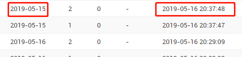

### Django启用时区支持时，在数据库中以UTC为单位存储时间信息。

```PYTHON
USE_TZ = True
TIME_ZONE = 'Asia/Shanghai'
```

在代码和数据库中统一使用UTC时间，仅在最终用户进行交互时使用本地时间。


# Python - string转datetime并设置时区


\#先把字符串转成不带时区的datetime

dt = datetime.datetime.strptime('2018-02-03 15:37:12' , '%Y-%m-%d %H:%M:%S')

\#把不带时区的datetime转成timestamp再转成秒

ts = int(dt.timestamp())

\#把秒转成带时区的datetime

t = datetime.datetime.fromtimestamp(ts, pytz.timezone('Asia/Shanghai'))


**Naive 和 Aware 类型的 datetime 对象**

> Python 的 datatime.datetime对象有一个 tzinfo 属性，该属性是 datetime.tzinfo 子类的一个实例，他被用来存储时区信息。当某个 datetime 对象的 tzinfo 属性被设置并给出一个时间偏移量时，我们称该 datetime 对象是 aware (已知) 的。否则称其为 naive (原生) 的。 可以使用 is_aware() 和 is_naive() 函数来判断某个 datetime 对象是 aware 类型或 naive 类型

当关闭时区时，django 使用原生的 datetime 对象保存本地时间：

```python
import datetime
now = datetime.datetime.now()
```

当开启时区时，django 使用已知 (aware) 的 datetime 对象存储本地时间：

```python
from django.utils import timezone
now = timezone.now()
```

**Django 和 Python 中的 Timezone 处理**
Django 中的 timezone

[](javascript:void(0);)

```
from django.utils import timezone
>>> now = timezone.now()
>>> now
datetime.datetime(2018, 2, 22, 3, 13, 2, 383795, tzinfo=<UTC>)
>>>new = timezone.localtime(now)
>>>new
datetime.datetime(2018, 2, 22, 11, 13, 2, 383795, tzinfo=<DstTzInfo 'Asia/Shanghai' CST+8:00:00 STD>)
```

[](javascript:void(0);)

Python 中的 datetime

[](javascript:void(0);)

```
>>>import datetime,pytz
>>>t = datetime.datetime.now()
>>>t
datetime.datetime(2018, 2, 22, 11, 18, 15, 623160)
>>>new_t = t.replace(tzinfo=(pytz.timezone('Asia/Shanghai')))
>>>new_t
datetime.datetime(2018, 2, 22, 11, 18, 15, 623160, tzinfo=<DstTzInfo 'Asia/Shanghai' LMT+8:06:00 STD>)
```

[](javascript:void(0);)

**Python 中的 time/datetime**
**time 模块**

> time 模块提供各种操作时间的函数

一般有两种表示时间的方式：
第一种是时间戳的方式 (相对于1970.1.1 00:00:00以秒计算的偏移量)，时间戳是唯一的

```
>>> import time
>>> time.time()
1519270378.989196
```

第二种以数组的形式表示即 (struct_time) ,共有九个元素，分别表示，同一个时间戳的 struct_time 会因为时区不同而不同

```
>>> time.localtime()
time.struct_time(tm_year=2018, tm_mon=2, tm_mday=22, tm_hour=11, tm_min=38, tm_sec=45, tm_wday=3, tm_yday=53, tm_isdst=0)
```

gmtime() 和 mktime() 可以将两种时间表示方法自由转换

```
>>> time.gmtime(time.time())
time.struct_time(tm_year=2018, tm_mon=2, tm_mday=22, tm_hour=11, tm_min=38, tm_sec=45, tm_wday=3, tm_yday=53, tm_isdst=0)
>>> time.mktime(time.localtime())
1519270378.989196
```

将 struct_time 类型与字符型自由转换 *

```
>>> time1 = time.strftime("%Y-%m-%d",time.localtime())
>>> time1
'2018-02-22'
>>> time2 = time.strptime(time1,"%Y-%m-%d")
time.struct_time(tm_year=2018, tm_mon=2, tm_mday=22, tm_hour=0, tm_min=0, tm_sec=0, tm_wday=3, tm_yday=53, tm_isdst=0)
```

**datetime 模块** 

> datetime 模块提供多个由于操作日期时间函数

datetime 模块中定义的类：

- datetime.date: 表示日期的类。常用的属性有 year，month，day；
- datetime.time: 表示时间的类。常用的属性有 hour，minute，second，microsecond；
- datetime.datetime: 表示日期时间。
- datetime.timedelta: 表示时间间隔，即两个时间点之间的长度。
- datetime.tzinfo：与时区有关的相关信息。

```
>>> import datetime
>>> datetime.datetime.now()
datetime.datetime(2018, 2, 22, 11, 18, 15, 623160)
1
```

datetime类型与字符串类型相互转换

[](javascript:void(0);)

```
>>> today = datetime.datetime.now().strftime("%Y-%m-%d")
>>> today
2018-02-22
>>> today2 = datetime.datetime.strptime(today,"%Y-%m-%d")
>>> today2
datetime.datetime(2018, 2, 22, 0, 0)
```

[](javascript:void(0);)

对时间间隔操作

- datetime2 = datetime1 + timedelta #日期加上一个间隔，返回一个新的日期对象
- datetime2 = datetime1 - timedelta #日期隔去间隔，返回一个新的日期对象
- timedelta = date1 - date2 #两个日期相减，返回一个时间间隔对象

time 与 datetime 之间的相互转换
–date.fromtimestamp(timestamp):根据给定的时间戳，返回一个date对象

```
>>> datetime.datetime.fromtimestamp(time.time())
datetime.datetime(2018, 2, 22, 14, 44, 847842)
```

**格式化代码参考表**

| 代码    | 作用                                          |      | 代码 | 作用                                                 |
| ------- | --------------------------------------------- | ---- | ---- | ---------------------------------------------------- |
| %a      | 星期几的简写                                  |      | %A   | 星期几的全称                                         |
| %b      | 月分的简写                                    |      | %B   | 月份的全称                                           |
| %c      | 标准的日期的时间串                            |      | %C   | 年份的后两位数字                                     |
| %d      | 十进制表示的每月的第几天                      |      | %D   | 月/天/年                                             |
| %e      | 在两字符域中，十进制表示的每月的第几天        |      | %F   | 年-月-日                                             |
| %g      | 年份的后两位数字，使用基于周的年              |      | %G   | 年分，使用基于周的年                                 |
| %h      | 简写的月份名                                  |      | %H   | 24小时制的小时                                       |
| %I      | 12小时制的小时                                |      | %j   | 十进制表示的每年的第几天                             |
| %m      | 十进制表示的月份                              |      | %M   | 十时制表示的分钟数                                   |
| %n      | 新行符                                        |      | %p   | 本地的AM或PM的等价显示                               |
| %r      | 12小时的时间                                  |      | %R   | 显示小时和分钟：hh:mm                                |
| %S      | 十进制的秒数                                  |      | %t   | 水平制表符                                           |
| %T      | 显示时分秒：hh:mm:ss                          |      | %u   | 每周的第几天，星期一为第一天 （值从0到6，星期一为0） |
| %U      | 第年的第几周，把星期日做为第一天（值从0到53） |      | %V   | 每年的第几周，使用基于周的年                         |
| %w      | 十进制表示的星期几（值从0到6，星期天为0）     |      | %W   | 每年的第几周，把星期一做为第一天（值从0到53）        |
| %x      | 标准的日期串                                  |      | %X   | 标准的时间串                                         |
| %y      | 不带世纪的十进制年份（值从0到99）             |      | %Y   | 带世纪部分的十制年份                                 |
| %z ，%Z | 时区名称，如果不能得到时区名称则返回空字符    |      | %%   | 百分号                                               |

#### Django Admin面板日期时间格式

在Django Admin 面板中，对于一些model里面的时间类型的字段，不希望显示默认的时间格式，例如下图：默认是 年-月-日 时:分:秒，有些字段我只希望显示日期，不需要具体的时间，该怎么办？



分两种情况

如果只是希望某几个时间字段有新的格式，那么就可以为它单独写一个函数

```python
list_display =  (..., 'simple_published_at', ...)

 def simple_published_at(self, obj):
        return obj.published_at.strftime("%Y-%m-%d")

simple_published_at.short_description="发文时间"
```

如果希望整个系统所有的时间字段都使用同一种日期格式，那么可以在配置文件 setting.py 文件设置 DATETIME_FORMAT

```python
DATETIME_FORMAT = "Y-m-d h:m:s"
DATE_FORMAT = 'Y-m-d'

```