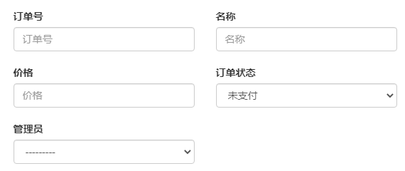
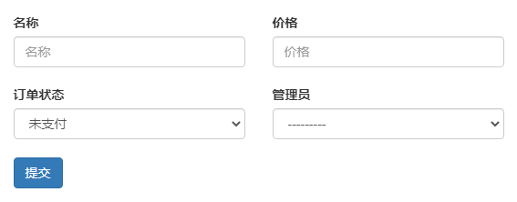
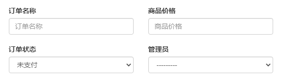
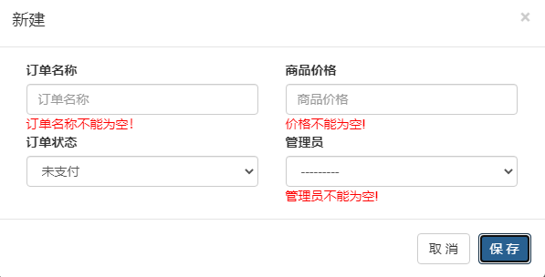
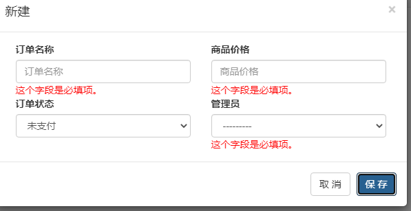

# ModelForm使用

## 1、定义模型：

```python
class Order(models.Model):
    """
    订单
    """
    oid = models.CharField(verbose_name='订单号',max_length=64)
    title = models.CharField(verbose_name='名称',max_length=32)
    price = models.IntegerField(verbose_name='价格')

    status_choices = (
        (1,'未支付'),
        (2,'已支付'),
    )
    status = models.SmallIntegerField(verbose_name='订单状态',choices=status_choices,default=1)
    admin = models.ForeignKey(verbose_name='管理员',to=Admin,on_delete=models.CASCADE)
```


## 2、定义模型表单

```python
class BootStrap:
    def __init__(self, *args, **kwargs):
        super().__init__(*args, **kwargs)
        # 循环ModelForm中所有的字段，给每一个字段的插件设置
        for name, field in self.fields.items():
            # 字段中有属性，保留原来的属性。没有属性，才设置
            if field.widget.attrs:
                field.widget.attrs['class'] = "form-control"
                field.widget.attrs['placeholder'] = field.label
            else:
                field.widget.attrs = {
                    "class": "form-control",
                    "placeholder": field.label
                }


class BootStrapModelForm(BootStrap, forms.ModelForm):
    pass


class BootStrapForm(BootStrap, forms.Form):
    pass
```


最简单的类：

```python
class OrderModelForm(BootStrapModelForm):
    class Meta:
        model = models.Order
        fields = "__all__"
        
        
```


## 3、视图函数：

```python
def order_list(request):
    form = OrderModelForm()
    context = {
        'form': form
    }
    return render(request, 'order_list.html', context)
```

## 4、模板：

```html
<form id="formAdd">
     <div class="clearfix">
          
          <div class="col-xs-6">
     <div class="form-group" style="position:relative;margin-bottom: 20px;">
             <label>{{ field.label }}</label>
               {{ field }}
   <span class="error-msg"  style="color: red;position: absolute">{{ field.errors.0 }}</span>
     </div>
         </div>
            
    <button id="btnAdd" type="button" class="btn btn-primary">提交</button>
 </div>
                   </div>
  </form>
```



## 更多用法：

### 排除某个字段。禁止将模型字段转换为表单字段，用法同fields

```python
class OrderModelForm(BootStrapModelForm):
    class Meta:
        model = models.Order
        # fields = "__all__"
        exclude = ['oid',]
        
```



labels 设置表单字段的label项，以字典方式表示，字典的键为模型的字段

```python
class OrderModelForm(BootStrapModelForm):
    class Meta:
        model = models.Order
        # fields = "__all__"
        exclude = ['oid']
        labels = {
            "title": "订单名称",
            "price": '商品价格'
        }
```



#### 错误信息

```python
class OrderModelForm(BootStrapModelForm):
    class Meta:
        model = models.Order
        # fields = "__all__"
        exclude = ['oid']
        labels = {
            "title": "订单名称",
            "price": '商品价格'
        }
        error_messages = {
            'title': {'required':"订单名称不能为空！"},
            'price':{'required':'价格不能为空!'},
            'admin':{'required':'管理员不能为空!'}
        }
```

##### 修改后的错误信息



##### 默认的错误信息



