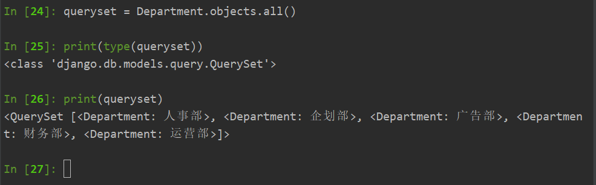
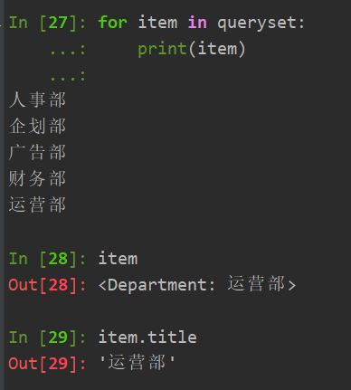

# QuerySet 查询集

```python

queryset = UserBaseInfo.objects.all()
for user in queryset:
    print(user.username)
```

```python
class Department(models.Model):
    """部门表"""
    title = models.CharField(unique=True, verbose_name='标题', max_length=32)

    def __str__(self):
        return self.title
```



### 视图函数

```python

def depart_list(request):
    """部门列表"""
    # 数据库总所有的部门信息
    queryset = models.Department.objects.all()
    page_object = Pagination(request, queryset, page_size=10)
    context = {
        "queryset": page_object.page_queryset,
        "page_string": page_object.html()
    }
    return render(request, "depart_list.html", context)

```

### 模板

```html

    <tr>
        <th>{{ obj.id }}</th>
        <td>{{ obj.title }}</td>
  

```

## Admin表

```python
class Admin(models.Model):
    """管理员"""
    username = models.CharField(verbose_name="用户名", max_length=32)
    password = models.CharField(verbose_name="密码", max_length=64)

    def __str__(self):
        return self.username
```

```python
In [35]: queryset = Admin.objects.all()

In [36]: queryset
Out[36]: <QuerySet [<Admin: sunliguo>, <Admin: root>]>

In [37]: type(queryset)
Out[37]: django.db.models.query.QuerySet

In [38]: type(queryset[0])
Out[38]: app01.models.Admin

In [42]: queryset[0].password
Out[42]: 'c8d5b0ecc728cd108a6319a40f51c8ec'

In [43]: queryset[0].username
Out[43]: 'sunliguo'


```

#### QuerySet所有的方法和属性

```
In [44]: dir(queryset)
Out[44]: 
['__aiter__',
 '__and__',
 '__bool__',
 '__class__',
 '__class_getitem__',
 '__deepcopy__',
 '__delattr__',
 '__dict__',
 '__dir__',
 '__doc__',
 '__eq__',
 '__format__',
 '__ge__',
 '__getattribute__',
 '__getitem__',
 '__getstate__',
 '__gt__',
 '__hash__',
 '__init__',
 '__init_subclass__',
 '__iter__',
 '__le__',
 '__len__',
 '__lt__',
 '__module__',
 '__ne__',
 '__new__',
 '__or__',
 '__reduce__',
 '__reduce_ex__',
 '__repr__',
 '__setattr__',
 '__setstate__',
 '__sizeof__',
 '__str__',
 '__subclasshook__',
 '__weakref__',
 '__xor__',
 '_add_hints',
 '_annotate',
 '_batched_insert',
 '_chain',
 '_check_bulk_create_options',
 '_check_operator_queryset',
 '_clone',
 '_combinator_query',
 '_db',
 '_defer_next_filter',
 '_deferred_filter',
 '_earliest',
 '_extract_model_params',
 '_fetch_all',
 '_fields',
 '_filter_or_exclude',
 '_filter_or_exclude_inplace',
 '_for_write',
 '_has_filters',
 '_hints',
 '_insert',
 '_iterable_class',
 '_iterator',
 '_known_related_objects',
 '_merge_known_related_objects',
 '_merge_sanity_check',
 '_next_is_sticky',
 '_not_support_combined_queries',
 '_prefetch_done',
 '_prefetch_related_lookups',
 '_prefetch_related_objects',
 '_prepare_for_bulk_create',
 '_query',
 '_raw_delete',
 '_result_cache',
 '_sticky_filter',
 '_update',
 '_validate_values_are_expressions',
 '_values',
 'aaggregate',
 'abulk_create',
 'abulk_update',
 'acontains',
 'acount',
 'acreate',
 'adelete',
 'aearliest',
 'aexists',
 'aexplain',
 'afirst',
 'aget',
 'aget_or_create',
 'aggregate',
 'ain_bulk',
 'aiterator',
 'alast',
 'alatest',
 'alias',
 'all',
 'annotate',
 'as_manager',
 'aupdate',
 'aupdate_or_create',
 'bulk_create',
 'bulk_update',
 'complex_filter',
 'contains',
 'count',
 'create',
 'dates',
 'datetimes',
 'db',
 'defer',
 'delete',
 'difference',
 'distinct',
 'earliest',
 'exclude',
 'exists',
 'explain',
 'extra',
 'filter',
 'first',
 'get',
 'get_or_create',
 'in_bulk',
 'intersection',
 'iterator',
 'last',
 'latest',
 'model',
 'none',
 'only',
 'order_by',
 'ordered',
 'prefetch_related',
 'query',
 'raw',
 'resolve_expression',
 'reverse',
 'select_for_update',
 'select_related',
 'union',
 'update',
 'update_or_create',
 'using',
 'values',
 'values_list']

In [45]: 

```

#### 模型的属性和方法

```

In [45]: dir(queryset[0])
Out[45]: 
['DoesNotExist',
 'MultipleObjectsReturned',
 '__class__',
 '__delattr__',
 '__dict__',
 '__dir__',
 '__doc__',
 '__eq__',
 '__format__',
 '__ge__',
 '__getattribute__',
 '__getstate__',
 '__gt__',
 '__hash__',
 '__init__',
 '__init_subclass__',
 '__le__',
 '__lt__',
 '__module__',
 '__ne__',
 '__new__',
 '__reduce__',
 '__reduce_ex__',
 '__repr__',
 '__setattr__',
 '__setstate__',
 '__sizeof__',
 '__str__',
 '__subclasshook__',
 '__weakref__',
 '_check_column_name_clashes',
 '_check_constraints',
 '_check_default_pk',
 '_check_field_name_clashes',
 '_check_fields',
 '_check_id_field',
 '_check_index_together',
 '_check_indexes',
 '_check_local_fields',
 '_check_long_column_names',
 '_check_m2m_through_same_relationship',
 '_check_managers',
 '_check_model',
 '_check_model_name_db_lookup_clashes',
 '_check_ordering',
 '_check_property_name_related_field_accessor_clashes',
 '_check_single_primary_key',
 '_check_swappable',
 '_check_unique_together',
 '_do_insert',
 '_do_update',
 '_get_FIELD_display',
 '_get_expr_references',
 '_get_field_value_map',
 '_get_next_or_previous_by_FIELD',
 '_get_next_or_previous_in_order',
 '_get_pk_val',
 '_get_unique_checks',
 '_meta',
 '_perform_date_checks',
 '_perform_unique_checks',
 '_prepare_related_fields_for_save',
 '_save_parents',
 '_save_table',
 '_set_pk_val',
 '_state',
 'check',
 'clean',
 'clean_fields',
 'date_error_message',
 'delete',
 'from_db',
 'full_clean',
 'get_constraints',
 'get_deferred_fields',
 'id',
 'objects',
 'order_set',
 'password',
 'pk',
 'prepare_database_save',
 'refresh_from_db',
 'save',
 'save_base',
 'serializable_value',
 'task_set',
 'unique_error_message',
 'username',
 'validate_constraints',
 'validate_unique']

In [46]: 
```

#### values()方法

返回QuerySet对象，包含有指定的字段和值组成的字典。

```
In [46]: value_queryset = Admin.objects.values()

In [47]: type(value_queryset)
Out[47]: django.db.models.query.QuerySet

In [48]: value_queryset
Out[48]: <QuerySet [{'id': 1, 'username': 'sunliguo', 'password': 'c8d5b0ecc728cd108a6319a40f51c8ec'}, {'id': 3, 'usern
ame': 'root', 'password': 'c8d5b0ecc728cd108a6319a40f51c8ec'}]>

In [49]: for user in value_queryset:
    ...:     print(user)
    ...: 
{'id': 1, 'username': 'sunliguo', 'password': 'c8d5b0ecc728cd108a6319a40f51c8ec'}
{'id': 3, 'username': 'root', 'password': 'c8d5b0ecc728cd108a6319a40f51c8ec'}

In [51]: users = Admin.objects.values('username')

In [52]: users
Out[52]: <QuerySet [{'username': 'sunliguo'}, {'username': 'root'}]>

In [53]: 

```

