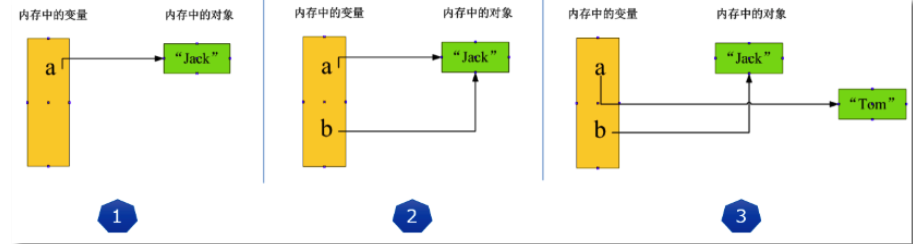

### Jupiter基本使用

- cell有两种模式：

- 快捷键
- API查看

### 变量&常量

- 思考：计算机的本质作用是什么？

- 内存空间
  
  - 计算机内存，我们可以将其想象成是一个容器，容器中装载的是即将被计算机运算或者处理的数据。
  - 那如果想要将数据成功的加载到内存空间中，则需要确保计算机内存是有足够的空间，则表示数据的存储是需要占用一定大小的内存空间。
  - 且不同的数据或者不同量级的数据占用计算机的内存空间的大小是不一样的。
  
- 内存空间大小的度量单位

  - bit：位。只可以存储一位二进制的数据。
  - byte字节：1字节=8bit。
  - kb：1024字节
  - mb：1024kb
  
- 思考：如果想要计算1+2的结果，Python如何处理呢？

  - 1.计算机的本质作用是用来存储和运算二进制的数据，因此，先将1and2转换成二进制的值为0001，0010
  - 2.在计算机内存空间中先找出两块内存空间用来存储0001和0010这两个数值数据（在内存中开辟指定的内存空间）
  - 3.Python的解释器会调用计算机的加法寄存器将0001和0010进行加法运算返回结果即可

- 计算机内存空间默认的两个属性

  - 内存空间大小
    - 决定了该内存可以存储数据的范围
  - 内存空间地址
    - 让cpu进行寻址。
  
- 变量/引用：

  - 在程序运行过程中，值会发生变化的量（变量）

  - 变量是一段有名字的连续存储空间。我们通过定义变量来申请并命名这样的存储空间，并通过变量的名字来使用这段存储空间。

  - 在编程语言中，将数据放入变量的过程叫做赋值（Assignment）。Python 使用等号`=`作为赋值运算符，具体格式为：

  - ```
    变量名 = 任意类型的值
    ```
    
  - 例如：
  
  - ```
    num = 100
    数学 = 200
    ```
  
- 常量：

  - 在程序运行过程中，值不会发生变化的量（常量）

- 具体的使用：

  - 1.无论是变量还是常量，在创建时都会在内存中开辟一块空间，用于保存它的值
  - 2.因此所谓的变量其实表示的就是值（加载到内存中的数据）对应的内存空间的一个引用，因此变量也叫做引用
  - 3.Python中的变量不需要声明类型
  - 4.用“=”号来给变量赋值
    - 这里的等号要理解并读作“赋值”，而不是“等于”，“赋值”是对变量的操作，而“等于”是对两个变量进行比较
  - 5.每个变量在使用前都必须赋值，变量赋值以后才会被创建

- 在python中变量就是引用，引用就是变量。

- 指向
  
  - 如果一个变量或者一个引用可以表示某一块具体的内存空间，则我们可以称为该变量指向该块内存。
  
- 标识符的命名规则

  - 简单地理解，标识符就是一个名字，就好像我们每个人都有属于自己的名字，它的主要作用就是作为变量、函数、类、模块以及其他对象的名称。Python中标识符的命名不是随意的，而是要遵守一定的命令规则
    - 标识符是由字符（A~Z 和 a~z）、下划线和数字组成，但第一个字符不能是数字。
    - 标识符不能和 Python 中的保留字相同。有关保留字，后续章节会详细介绍。
    - Python中的标识符中，不能包含空格、@、% 以及 $ 等特殊字符。
    - 在 Python 中，标识符中的字母是严格区分大小写
    - Python 语言中，以下划线开头的标识符有特殊含义
    - Python 允许使用汉字作为标识符（不推荐）

  - Python关键字

  - | and   | as   | assert | break    | class  | continue |
    | ----- | ---- | ------ | -------- | ------ | -------- |
    | def   | del  | elif   | else     | except | finally  |
    | for   | from | False  | global   | if     | import   |
    | in    | is   | lambda | nonlocal | not    | None     |
    | or    | pass | raise  | return   | try    | True     |
    | while | with | yield  |          |        |          |

- 缩进

  - 和其它程序设计语言（如 [Java](http://c.biancheng.net/java/)、C 语言）采用大括号“{}”分隔代码块不同，[Python](http://c.biancheng.net/python/) 采用冒号（ : ）和代码缩进和来区分代码块之间的层次。在 Python 中，对于类定义、函数定义、流程控制语句、异常处理语句等，行尾的冒号和下一行的缩进，表示下一个代码块的开始，而缩进的结束则表示此代码块的结束。

    注意，Python 中实现对代码的缩进，可以使用空格或者 Tab 键实现。但无论是手动敲空格，还是使用 Tab 键，通常情况下都是采用 4 个空格长度作为一个缩进量（默认情况下，一个 Tab 键就表示 4 个空格）。

- 注释：

  - 注释就是对代码的解释和[说明](https://baike.baidu.com/item/说明/39260)，其目的是让人们能够更加轻松地了解代码。注释是编写程序时，写程序的人给一个语句、程序段、函数等的解释或提示，能提高程序代码的可读性。一般情况下，合理的代码注释应该占源代码的 1/3 左右。

    > 注释只是为了提高公认阅读，不会被解释器执行。

    Python 支持两种类型的注释，分别是单行注释和多行注释。

    ```python 
    #  单行注释
    """
    这是一个多行注释
    三引号里面的任何内容不会被解释器执行
    """
    ```

  

- 赋值符号的运算法则

  - “=”号这个赋值运算符是从右往左的计算顺序

  - Python允许同时为多个变量赋值

  - 也可以同时为多个变量赋值，用逗号分隔，逐一对应

  - 不要把赋值语句的等号等同于数学的等号

  - ```
    name = 'bobo'
    a = b = c = 1
    a,b,c = 1,2,3
    ```

- 把一个变量a赋值给另一个变量b，这个操作实际上是将变量b指向变量a所指向的数据，例如下面的代码，思考结果输出的是什么？

  ```
  a = 'Jack'
  b = a
  a = 'Tom'
  print(b)
  ```

  - 最后变量b的内容到底是'Jack'还是'Tom'呢？如果从数学意义上理解，就会错误地得出b和a相同是‘Tom’，但实际上b的值还是'Jack ‘!why？如何理解呢？
    - 请牢记：Python中的一切都是对象，变量是对象的引用！所谓的对象我们在后面的面向对象环节中会详细讲解，现在我们就简单认为Python会把所有的数据都视为是不同的对象即可，数据就是对象，对象就是数据。
    - 执行a = ‘Jack’，解释器创建字符串‘Jack’对象和变量a，并把a指向‘Jack’对象；
    - 执行b = a,解释器创建变量b，并且将其指向变量a指向的字符串‘Jack’对象；
    - 执行a = ‘Tom’,解释器创建字符串‘Tom’对象，并把a改为指向‘Tom’对象，与b无关。
    - 

- 常量
  - 常量就是不变的变量，比如常用的数学常数圆周率就是一个常量。在Python中，通常用全部大写的变量名表示常量：PI = 3.14159265359
  - 但事实上，从Python语法角度看，PI仍然是一个变量，因为Python根本没有任何机制保证PI不会被改变。你完全可以给PI赋值为10，不会弹出任何错误。所以，用全部大写的变量名表示常量只是一个习惯上的用法。