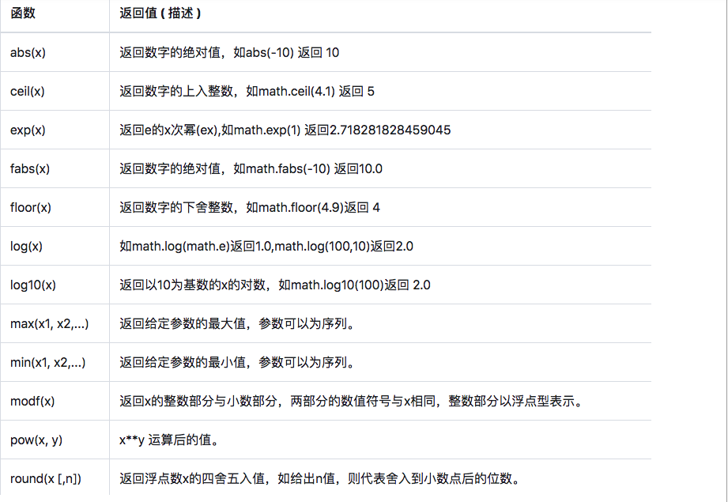
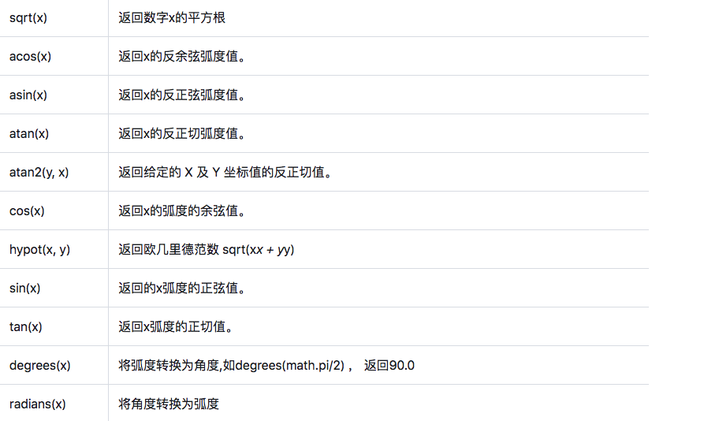
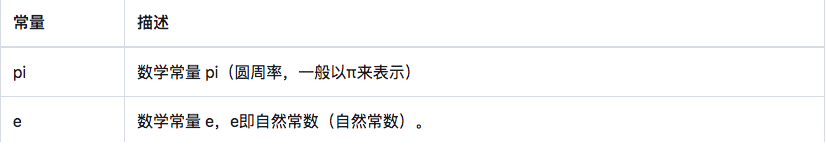
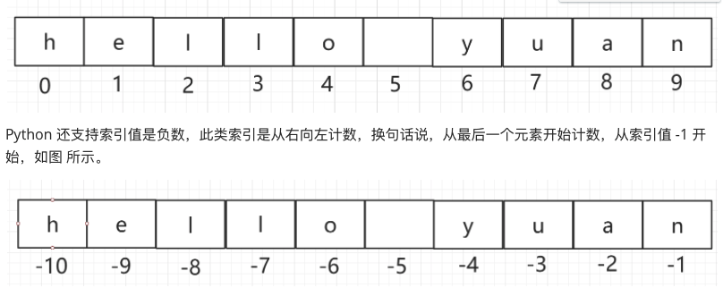
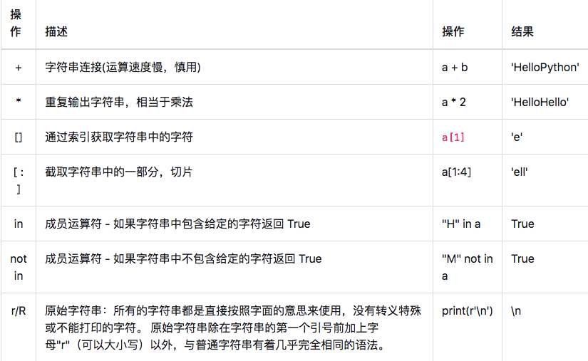
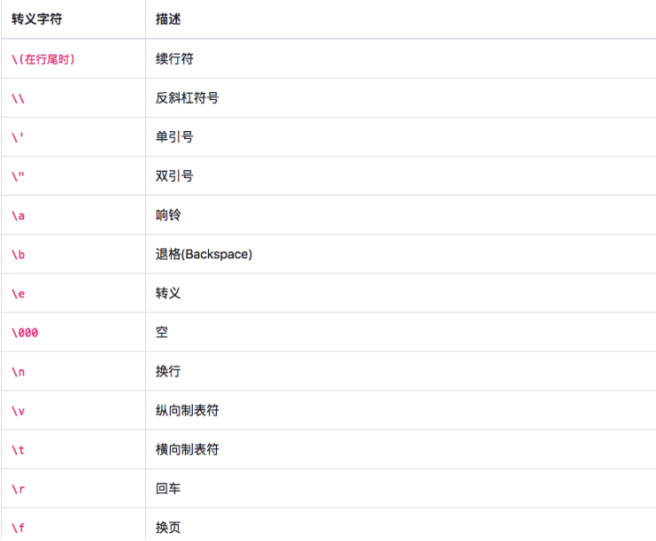
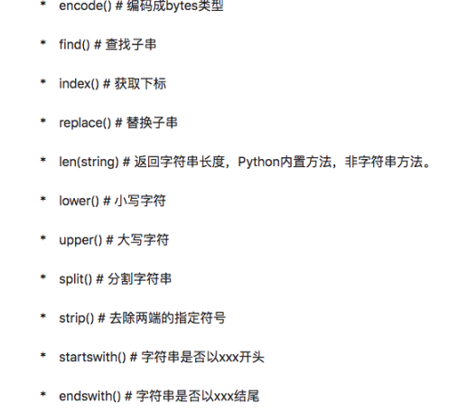

### 基本数据类型

#### 引言

- 提问
  - 前面我们说过，计算机的本质作用就是用来存储和运算二进制的数据。但是在实际应用中，我们看到计算机存储或者运算的数据并非只有二进制的数据，例如使用Excel可以对一些数值数据、文本数据或者图像数据进行不同形式的处理。也就是说计算机可以处理运算的数据有很多不同的种类或者类型。那这不就违背计算机的本质作用了吗？
  - 在后面讲解了计算机编码后，我们自然就会理解了，后面在聊。
  - 至少，现在我们应该可以感受到，计算机在实际应用中看起来是可以存储和处理不同类型的数据，要是想要使用Python指挥计算机处理不同的数据，则Python需要定义或者规范下不同数据的类型，那么Python中给我们规范了哪些类型的数据呢？

- Python数据类型
  - 在Python的世界，数据类型分两种，内置的和自定义的

- 内置数据类型
  - 内置的包括数字、字符串、布尔、列表、元组、字典、Bytes、集合这些常用的。

- 自定义数据类型
  - 自定义的，一般以类的形式，根据需要组合以上内置类型成为独特的数据类型。
- 疑问：大家有没有想过为什么编程语言要设置不同的数据类型吗？
  - 原因1：
    - 更好的分配管理内存,节省不必要的开支，提高读取速度和运行效率。
  - 原因2：
    - 方便统一管理。这样，我们可以为同一数据类型，提供同样的操作，限制其它不允许的行为。也易于查找错误，定位问题。
  - 原因3：
    - 区分数据类型，更贴切人类对自然事物的分类管理习惯。我们人类对事物都进行了各种分类，植物是植物、动物是动物，书是书，笔是笔。分类了之后，我们很自然的知道书可以读，笔可以写。数据类型也一样，让我们对抽象的数据有了可分辨的行为和自然的记忆。

#### 数字类型

- 数字类型用于存储和表示数学意义上的数值。
  
- Python 支持三种不同的数字类型，整数、浮点数和复数
  
- 不可变类型

  - 数字类型是不可变类型。所谓的不可变类型，指的是类型的值一旦有不同了，那么它就是一个全新的对象。数字1和2分别代表两个不同的对象，对变量重新赋值一个数字类型，会新建一个数字对象。

  - 例如：

    - a = 1 #创建数字对象1
    - a = 2 #创建数字对象2，并将2赋值给变量a，a不再指向数字对象1
    - 这里，发生了变化的是变量a的指向，而不是数字对象1变成了数字对象2。初学者可能会比较迷糊，但不要紧，可以先试着接受。

  - 实验：使用id工具显示1,2,3的内存空间地址

  - ```python
    a = 1
    print(id(a))
    a = 2
    print(id(a))
    ```
  
- 整数Int

  - 通常被称为整型，是正或负整数，不带小数点。例如：1，100，-8080，0，等等。
  - 不同进制的整数
    - 表示数字的时候，有时我们还会用八进制或十六进制来表示：
      - 十六进制用0x前缀和0-9，a-f表示，例如：0xff00，0xa5b4c3d2。
      - 八进制用0o前缀和0-7表示，例如0o12

- 浮点数

  - 浮点数也就是小数，如1.23，3.14，-9.01，等等。但是对于很大或很小的浮点数，一般用科学计数法表示，把10用e替代，1.23x10^9就是1.23e9，或者12.3e8，0.000012可以写成1.2e-5，等等。

  - ```
    salary = 1.2e5
    ```

  

- 数字类型转换

  - 有时候，我们需要对数字的类型进行转换。Python为我们提供了方便的内置的数据类型转换函数。
  - int(x)：
    - 将x转换为一个整数。如果x是个浮点数，则截取小数部分。
    
    - ```
      a = 10.5
      b = int(a)
      print(b)
      ```
  - float(x) ：
    - 将x转换到一个浮点数。
    
    - ```
      a = 10
      b = float(a)
      print(b)
      ```
  
- 数学计算

  - 对于数学计算，除了前面提到过的简单的加减乘除等等，更多的科学计算需要导入math这个库，它包含了绝大多数我们可能需要的科学计算函数，如下表
    - 
    - 

  - 以及两个数学常量：
    - 

#### 布尔类型

- 真于假、0和1，都是传统意义上的布尔类型。

- 但在Python语言中，布尔类型只有两个值，True与False。请注意，是英文单词的对与错，并且首字母要大写，不能其它花式变型。

- 所有计算结果返回的结果是True或者False的过程都可以称为布尔运算，例如比较运算。

- ```
  a = 1 < 2
  print(a)
  ```
  
- False等同于0，True等同于1

- ```
  a = True + True + False + True
  print(a)
  ```

#### 字符串类型

- 字符串是由零个或多个字符组成的有限序列。字符串的内容可以包含字母、标点、特殊符号、中文、日文等全世界的所有字符。

- 在python中字符串是通过单引号`''`或者双引号`""`标识的。

- ```
  name = "bobo"
  addr = 'BeiJing'
  ```
  
- 字符串特性

  - 字符串是不可变的序列数据类型，不能直接修改字符串本身，和数字类型一样！Python3全面支持Unicode编码，所有的字符串都是Unicode字符串，所以传统Python2存在的编码问题不再困扰我们，可以放心大胆的使用中文。

  - 字符串属于序列类型，所谓序列，指的是一块可存放多个值的连续内存空间，这些值按一定顺序排列，可通过每个值所在位置的编号（称为索引）访问它们。

  - ```python
    s = "hello yuan" 
    ```

  - 

- 序列类型支持的操作：

- ```python
  #1.索引取值
  s = 'hello yuan'
  print(s[3])
  
  #2.切片取值：批量取出多个字符数据。s[start:end],只能取到start到end的前一位区间的字符数据
  s = 'hello yuan'
  print(s[0:5]) 
  print(s[0:-1]) 
  print(s[:-1]) 
  print(s[0:]) 
  #3.in运算符检查某一个元素是否存在于一个序列
  s = 'hello yuan'
  print('h' in s)
  #4.支持加法运算:将两个字符串拼接到了一起
  s1 = 'hello '
  s2 = 'bobo'
  s3 = s1 + s2 #字符串的拼接
  print(s3)
  #5.*运算:将字符串叠放多次
  s1 = 'hello '
  s2 = s1 * 5  #字符串重叠拼接
  print(s2)
  ```
  
- 字符串运算

  - 下表实例变量a值为字符串 "Hello"，b变量值为 "Python"：
  - 

- python转义字符



- 多行字符串
  
  - 在字符串中，可以使用三引号（三单或三双引号都可以）编写跨行字符串，在其中可以包含换行符、制表符以及其他特殊字符。
  
  - ```
    s = '''
        djsfjds
        fhdjskhfjkds
        fdhjskdfh
    '''
    print(s)
    ```
  
- 字符串内置方法
  - 内置方法有很多，但是我们主要记住如下几个即可：
  - 

- ```python
  s1 = 'hello bobo'
  s2 = 'bobo'
  s1.find(s2) #返回子串在当前字符串中的位置
  #使用Jay替换bobo
  s1_new = s1.replace('bobo','Jay')
  ```

- ```python
  s = 'hello-bobo-and-tom'
  result = s.split('-')
  result
  ```

- ```python
  s = '   hello bobo \t\t\n  '
  print(s.strip())
  ```

- ```python
  s = 'www.123@qq.com'
  s.startswith('www'),s.endswith('com')
  ```

  

- 字符编码

  - 计算机只能处理数字01，如果要处理文本，就必须先把文本转换为数字01二进制的形式，这种转换方式就称为字符编码。

  - 对于我们而言，你只需要简单记住下面几种编码就好：
    - ASCII编码：早期专门为英语语系编码，只有255个字符，每个字符需要8位也就是1个字节。不兼容汉字。
    - Unicode编码：又称万国码，国际组织制定的可以容纳世界上所有文字和符号的字符编码方案。用2个字节来表示汉字。
    - UTF-8编码：为了节省字节数，在Unicode的基础上进行优化的编码。天生兼容ASCII编码，所以最为流行。
    - GB2312：我国早期自己制定的中文编码，世界范围内不通用。
    - GBK： 全称《汉字内码扩展规范》，向下与GB2312兼容，向上支持ISO10646.1国际标准，是前者向后者过渡过程中的一个承上启下的产物。windows中文版的汉字编码用的就是GBK。也非世界范围通用的编码
    - 其它编码：非以上类型者的统称。属于能不用就不要碰的编码。