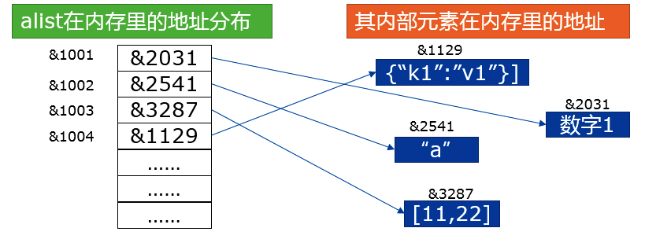
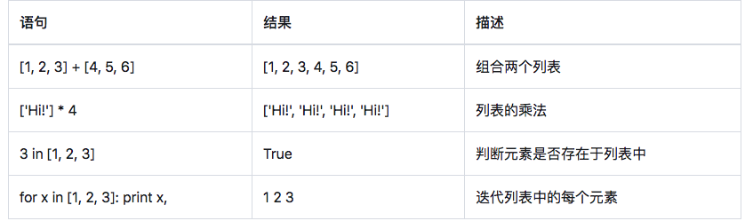
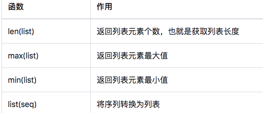
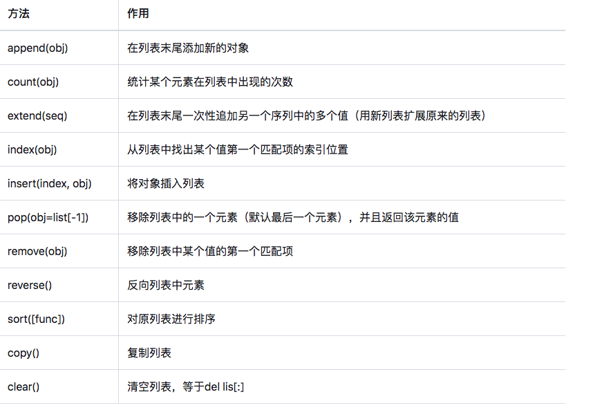
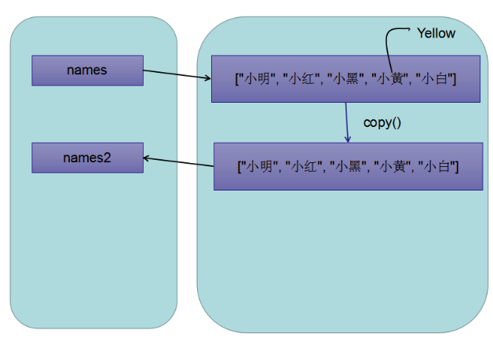
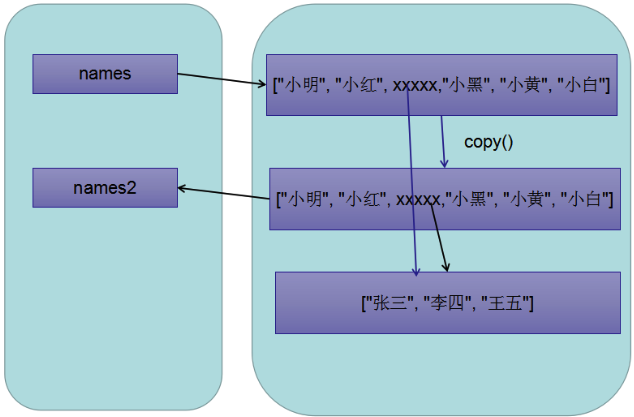
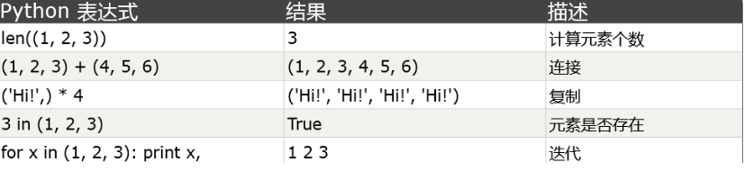
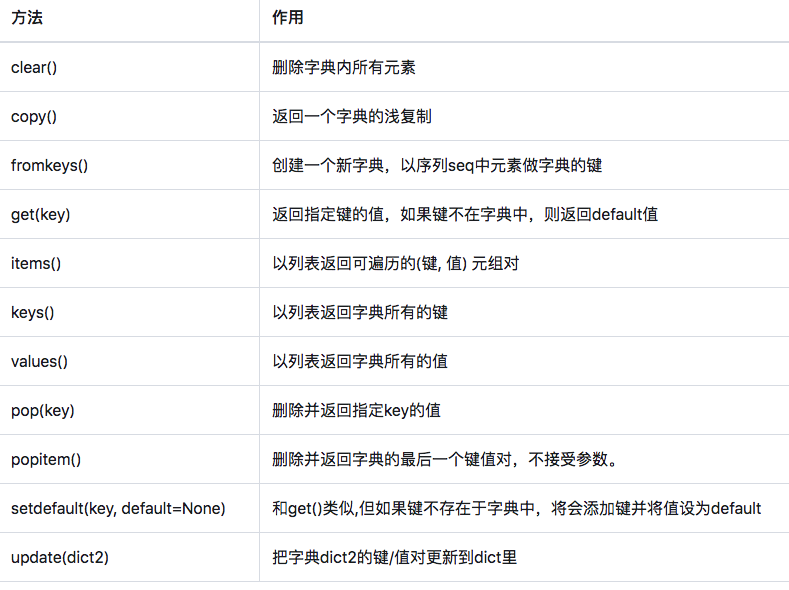
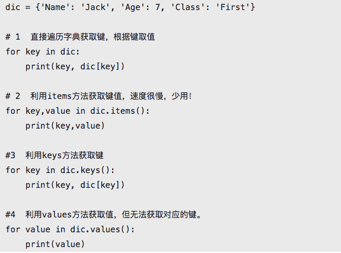
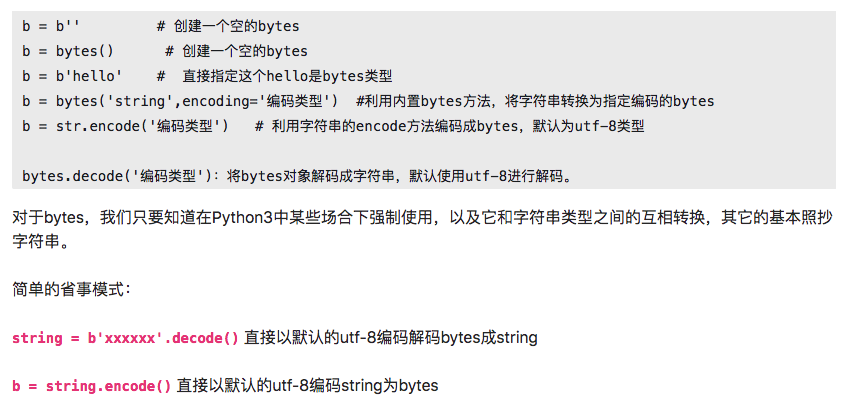

### 重要数据类型

#### 列表数据类型

- 在实际开发中，经常需要将一组（不只一个）数据存储起来，以便后边的代码使用。列表就是这样的一个数据结构。且列表是Python中最基本也是最常用的数据结构之一。

- 什么是数据结构呢？

  - 通俗来讲，可以将数据结构当做是某种容器，该容器是用来装载或者存储数据的。不同的数据结构决定了对数据不同的组织方式。
  - 那么当数据被装载或者存储到了某个数据结构中后，那么就可以基于该数据结构的特性对数据进行不同形式的处理和运算。

- 列表的创建方式

  - 创建一个列表，只要把逗号分隔的不同的数据元素使用方括号括起来即可。列表内的元素，可以是其它任意类型的数据，可多层嵌套列表，元素个数无限制。

  ```
  a = [1,2,3,'four',5.5,False]
  ```
  
- 列表元素：

  - 存储在列表数据结构中的每一个数据被称为列表元素，简称元素。

- 列表索引：

  - 列表中的每个元素都被分配一个数字作为索引，用来表示该元素在列表内所排在的位置。第一个元素的索引是0，第二个索引是1，依此类推。

- 列表的内存结构
  - 从数据结构角度看，Python的列表是一个可变长度的顺序存储结构，每一个位置存放的都是对象的指针/引用。
  - 比如，对于这个列表 alist = [1, “a”, [11,22], {“k1”:”v1”}]，其在内存内的存储方式是这样的：
  - 

- 列表特性：
  
  - Python的列表是一个有序可重复的元素集合，可嵌套、迭代、修改、分片、追加、删除，成员判断。
  
- 访问列表内的元素
  - 列表从0开始为它的每一个元素顺序创建下标索引，直到总长度减一。要访问它的某个元素，以方括号加下标值的方式即可。注意要确保索引不越界，一旦访问的 索引超过范围，会抛出异常。所以，一定要记得最后一个元素的索引是len(list)-1。

  - ```
    alist = [1,2,3]
    print(alist[0])
    print(alist[len(alist)-1])
    ```
  
- 修改元素的值

  - 直接对元素进行重新赋值

  - ```
    alist = [1,2,3,4,5,6,7,8,9]
    alist[3] = 'four'
    print(alist)
    ```
  
- 删除元素

  - 使用del语句或者remove(),pop()方法删除指定的元素。

  - ```
    alist = [1,2,3,4,5]
    #方式1
    del alist[0]
    print(alist)
    ```
    
  - ```
    alist = [1,2,3,4,5]
    #方式2：pop(下标)可以将列表中指定元素取出
    item = alist.pop(1)
    print('pop取出的元素为：',item)
    print(alist)
    ```
  
  - ```
    alist = [1,2,3,4,5]
    #方式3：remove(删除的元素)
    alist.remove(5) #将5这个元素从alist中删除
    print(alist)
    ```
  
- 添加元素

  - 使用append和insert添加元素

- ```
  alist = [1,2,3,4,5]
  alist.append(666) #可以将一个元素添加到列表的末尾
  alist.append([7,8,9])
  print(alist)
  ```
  
- ```
  alist = [1,2,3,4,5]
  alist.insert(2,666) #将元素添加到列表指定的位置
  print(alist)
- 列表的特殊操作

  - 上述讲解的操作都是列表的常规操作，当然除了这些常规的操作列表还有很多有用的其它特殊形式的操作。
  - 

- 针对列表的常用函数
  - Python有很多内置函数，可以操作列表。
  - 

- 排序：

- ```
  a = [3,8,5,7,6]
  a.sort() #在原先列表中进行排序
  
  a = [3,8,5,7,6]
  sorted(a)#返回新的列表

- 列表和字符串的相互转换

- ```
  s = 'hello-bobo-123'
  result = s.split('-') #将字符串转换为列表
  
  #将列表转换为字符串
  s1 = '~'.join(result)
  s1
  ```
  
- 切片

  - 切片指的是对序列进行截取，选取序列中的某一段。

    - 切片的语法是： list[start:end]

    - ```
      alist = [1,2,3,4,5]
      print(alist[0:3])

  - 以冒号分割索引，start代表起点索引，end代表结束点索引。省略start表示以0开始，省略end表示到列表的结尾。注意，区间是左闭右开的！也就是说[1:4]会截取列表的索引为1/2/3的3个元素，不会截取索引为4的元素。分片不会修改原有的列表，可以将结果保存到新的变量，因此切片也是一种安全操作，常被用来复制一个列表，例如newlist = lis[:]。
  
  - 如果提供的是负整数下标，则从列表的最后开始往头部查找。例如-1表示最后一个元素，-3表示倒数第三个元素。
  
  - ```
    alist = [1,2,3,4,5]
    print(alist[0:-1])
    ```
    
  - 切片过程中还可以设置步长，以第二个冒号分割，例如list[3:9:2]，表示每隔多少距离取一个元素。
  
  - ```
    alist = [1,2,3,4,5,6,7,8,9,10]
    print(alist[0:9:2])
    ```
  
- 列表的内置方法

  - 上文中我们说过，数据存储到不同的数据结构中，可以基于该数据结构的特性对数据进行指定形式的操作和处理。下图中的方法是列表专有的内置方法，请熟记于心。
  - 

- 深浅拷贝是python中经常涉及到一个面试，也是同学们经常出错的地方，那么什么是深浅拷贝呢？

  - 浅拷贝

    - copy方法: 意思是复制一个相同的列表(赋值出的别表是一块全新的内存空间)

    - ```python
      names = ['小明','小红','小黑','小黄','小白']
      names2 = names.copy()
      print(names,names2)
      print(id(names),id(names2))
      ```
      
    - 把 names 列表中的 小黄改成英文 Yellow，那么 names2 的小黄会发生变化吗？
    
      ```python
      names = ['小明','小红','小黑','小黄','小白']
      names2 = names.copy()
      print(names,names2)
      print(id(names),id(names2))
      names[1] = 'red'
      print(names2) 
      ```
      
      
    
    - 其实它的原理很简单，如下图:

    - 

    - 首先，names 指向一个列表，然后把 names 复制了一份，赋值给 names2 ，由于 修改的是 第一个 列表的 小黄，所以第二个列表不受影响。

    - 那么现在我改一下这个列表，从names列表中再添加一个列表，如下代码

    - ```python
      names = ['小明','小红',['张三','李四','王五'],'小黑','小黄','小白']
      names2 = names.copy() 
      names2[2][1] = 'lisi'
      print(names)
      print(names2)
      ```
      
    - 这段代码的运行结果是，两个列表的李四都变成了英文，来分析一下原理
    
    - 
    
    - 其实这个图也挺简单的，就是中间那个列表是单独分配了一块空间，然后从第一层列表中去引用地址，复制的names2 也是引用的地址，所以真实的值一变，两个列表的内部列表的值也就变了。
    
    - 也就是说 list.copy() 方法只能 copy 一层，这就是所谓的浅复制。
    
  - 深拷贝
  
  - ```python
    import copy #将copy这个工具箱搬过来
    names = ['小明','小红',['张三','李四','王五'],'小黑','小黄','小白']
    names2 = copy.deepcopy(names) #将names复制一份给names2
    names2[2][1] = 'lisi'
    print(names)
    ```
  
  - 列表的维度：浅拷贝只可以完全拷贝一维列表，如果是多维列表务必使用深拷贝！
  
  - ```python
    a1 = [1,2,3] #一维列表
    a2 = [[1,2,3],[4,5,6]] #二维列表
    a3 = [[[1,2],[3,4]],[[5,6],[7,8]]] #三维列表
    ```
    
    


#### 元组数据类型

- 用方括号括起来的是列表，那么用圆括号括起来的就是元组。

- ```python
  t = (1,2,3,4,5)
  t1 = (1,) #只有一个元素的元组
  t2 = (1,2,3,(4,5))
  ```
  
- 元组也是序列结构，但是是一种不可变序列，你可以简单的理解为内容不可变的列表。除了在内部元素不可修改的区别外，元组和列表的用法差不多。

- 元组与列表相同的操作：

  - 使用方括号加下标访问元素

  - 切片（形成新元组对象）

    - ```
      t = (1,2,3,4,5)
      n_t = t[0:3]
      print(n_t)
      ```
    
  - count()/index()

    - ```
      t = (1,2,3,4,5,3)
      print(t.count(3)) #返回指定元素的个数
      print(t.index(5)) #返回指定元素的下标
      ```
    
  - len()/max()/min()

    - ```
      t = (1,2,3,4,5,3)
      max = t.max()
      min = t.min()
      len = len(t)
      ```

- 元组中不允许的操作，确切的说是元组没有的功能：

  - 修改、新增元素
  - 删除某个元素（但可以删除整个元组）
  - 所有会对元组内部元素发生修改动作的方法。例如，元组没有remove，append，pop等方法。

- 元组与列表类似的特殊操作：

- 

- 提问：

  - 在学完列表后，在使用元素我们会发现元组由于是一个不可变序列，则很多操作会受到限制，这不能，那不能，要你何用，我直接用列表不行吗？

  - 还是有用的，有些数据一旦创建之后就不允许修改了，这些数据就适合用元组来创建，比如主机地址和端口（ip，port），（"192.168.1.1"， 80），两者捆绑在一起，不允许修改。

  - ```python
    ip_port = ("192.168.1.1", 8080)
    ```

- 元组看来是很安全的。但真的吗？

- ```python
  a = (1,2,[3,4])
  a[2][0] = 'Three'
  a
  ```

- 实则不然，注意：元组只保证它的一级子元素不可变，对于嵌套的元素内部，不保证不可变！

  - 所以，在使用元组的时候，请尽量使用数字、字符串和元组这种不可变的数据类型作为元组的元素，这样就能确保元组不发生变化。


#### 字典数据类型

- 字典的实现机制：
  
- Python的字典数据类型是基于hash散列算法实现的，采用键值对(key:value)的形式，根据key的值计算value的地址，具有非常快的查取和插入速度。
  
- 字典特性：
  - 字典包含的元素个数不限，值的类型可以是任何数据类型！但是字典的key必须是不可变的对象，例如整数、字符串、bytes和元组，最常见的还是将字符串作为key。列表、字典、集合等就不可以作为key。同时，同一个字典内的key必须是唯一的，但值则不必。
  - 注意：从Python3.6开始，字典是有序的！它将保持元素插入时的先后顺序！请务必清楚！

- 创建字典

  - 字典的每个键值对用冒号(:)分割，每个对之间用逗号(,)分割，整个字典包括在花括号({})中 ，例如：

    - d = {key1 : value1, key2 : value2 }

  - ```
    dic = {
        'name':'bobo',
        'age':20,
        'score':[99.88]
    }
    print(dic)
    ```
  
- 访问字典

  - 虽然现在的字典在访问时有序了，但字典依然是集合类型，不是序列类型，因此没有索引下标的概念，更没有切片的说法。但与list类似的地方是，字典采用把相应的键放入方括号内获取对应值的方式取值。

  - ```python
    dic = {
        'name':'bobo',
        'age':20,
        'score':[100,99,80],
        'address':{'zhangsan':'beijing','lisi':'shanghai'},
    }
    print(dic['address']) #通过中括号的机制取value值
    print(dic.get('age')) #通过调用get取value值
    ```
  
- 通过中括号访问value值和通过get访问value值得区别是什么？

  - ```python
    get可以访问不存在的key，中括号不可以
    ```
  
- 添加和修改

  - 增加就是往字典插入新的键值对，修改就是给原有的键赋予新的值。由于一个key只能对应一个值，所以，多次对一个key赋值，后面的值会把前面的值冲掉。

  ```python
  dic = {
      'name':'bobo',
      'age':20,
      'score':[100,99,80],
      'address':{'zhangsan':'beijing','lisi':'shanghai'},
  }
  dic['salary'] = 10000 #直接给一个不存在的key赋值，就表示向字典中增加了一个键值对
  print(dic)
  ```
  
- ```python
  dic = {
      'name':'bobo',
      'age':20,
      'score':[100,99,80],
      'address':{'zhangsan':'beijing','lisi':'shanghai'},
  }
  dic['age'] = 100 #直接给一个存在的key赋值，就表示修改了字典中的一个键值对
  print(dic)
  ```

- 删除字典元素、清空字典和删除字典
- 使用del关键字删除字典元素或者字典本身，使用字典的clear()方法清空字典。

```python
dic = {
    'name':'bobo',
    'age':20,
    'score':[100,99,80],
    'address':{'zhangsan':'beijing','lisi':'shanghai'},
}
del dic['age'] #删除了age表示的键值对
print(dic)
```

```python
dic = {
    'name':'bobo',
    'age':20,
    'score':[100,99,80],
    'address':{'zhangsan':'beijing','lisi':'shanghai'},
}
dic.clear() #清空字典中所有的键值对
print(dic) 
```

- 字典的重要方法
  - 下表中列出了字典的重要内置方法。其中的get、items、keys和values是核心中的核心，必须熟练掌握！
  - 

```python

```

- 遍历字典
  - 从Python3.6开始遍历字典获得的键值对是有序的！以下的遍历方法必须全部熟练掌握
  - 

  
  

#### bytes字节类型/二进制类型

- 在Python3以后，字符串和bytes类型彻底分开了。字符串是以字符为单位进行处理的，bytes类型是以字节为单位处理的。
- bytes数据类型在所有的操作和使用甚至内置方法上和字符串数据类型基本一样，也是不可变的序列对象。
- 作用
  - bytes对象只负责以二进制字节序列的形式记录所需记录的对象。Python3中，bytes通常用于网络数据传输、二进制图片和文件的保存等等
- 创建方式
  - 

```python
bs = b'hello world'
print(type(bs))
```

- 字符串和bytes类型的数据相互转换

- ```python
  bs = b'hello world'
  #将bytes类型的数据转换成字符串类型的数据
  ss = bs.decode()
  print(type(ss))
  #将字符串类型的数据转换成bytes类型
  bss = ss.encode()
  print(type(bss))
  ```

#### set集合

- 特性
  - set集合是一个无序不重复元素的容器，集合数据类型的核心在于自动去重。

- 创建方式
  - 集合使用大括号{}框定元素，并以逗号进行分隔。但是注意：如果要创建一个空集合，必须用 set() 而不是 {} ，因为后者创建的是一个空字典。集合除了在形式上最外层用的也是花括号外，其它的和字典没有一毛钱关系。

```python
s = {1,2,3,3,3,4,4,5,5,6,7,7,7}
print(s)
print(s[0]) #会报错，因为set集合没有下标的机制
```

- 应用
  - 对于字符串，集合会把它一个一个拆开，然后去重
  - 通过add(key)方法可以添加元素到set中，可以重复添加，但不会有效果
  - 可以通过update()方法，将另一个对象更新到已有的集合中，这一过程同样会进行去重。
  - 通过remove(key)方法删除指定元素，或者使用pop()方法。注意，集合的pop方法无法设置参数，删除指定的元素

- ```python
  alist = [1,2,3,4,4,4,4,5,6,7]
  s = {9,0}
  s.update(alist)
  print(s)
  ```
  
- 注意：
  - 集合既不支持下标索引也不支持字典那样的通过键获取值。
  
  
