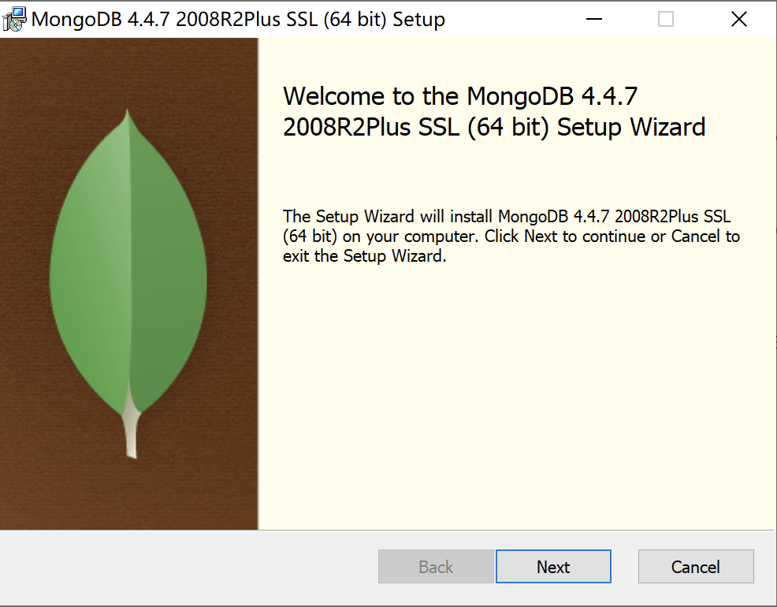
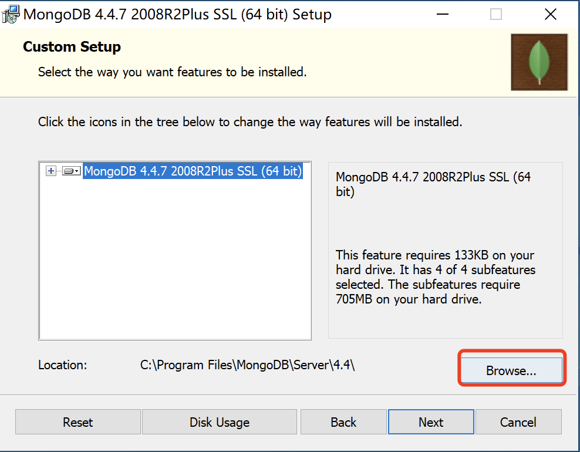

# MongoDB数据存储

MongoDB是一个非关系型数据库(NoSQL). 非常适合超大数据集的存储, 由 C++ 语言编写,旨在为 WEB 应用提供可扩展的高性能数据存储解决方案。MongoDB 是一个介于关系数据库和非关系数据库之间的产品，是非关系数据库当中功能最丰富，最像关系数据库的。

下面是Sql与mongodb的术语对比

|       **SQL**       |    **Mongodb**     |
| :-----------------: | :----------------: |
|     表（Talbe）     | 集合（Collection） |
|      行（Row）      |  文档（Document）  |
|      列（Col）      |   字段（Field）    |
| 主键（Primary Key） | 对象ID（ObjectId） |

## 一, MongoDB与安装(windows)

首先去官网下载MongoDB的安装包, https://www.mongodb.com/try/download/community








将mongodb目录下的bin文件夹添加到环境变量


对于mac的安装:https://blog.csdn.net/qq991658923/article/details/121436106

- Mac启动：
  - mongod --dbpath /opt/mongodb/data --logpath /opt/mongodb/log/mongo.log --fork 
  - mongo


## 二, MongoDB的简单使用

简单介绍一下mongoDB中一些操作(了解)

```
show dbs: 显示所有数据库
show databases: 显示所有数据库
use xxxx: 使用指定数据库/创建数据库（新库中插入数据才可以显示新库）
db: 当前正在使用的数据库
db.dropDatabase(): 删除数据库
show collections: 显示当前数据库中所有的集合(表)
```


## 三, MongoDB的增删改查

### 1. mongodb中常见的数据类型(了解):

```
Object ID: 主键ID【"_id" : ObjectId("56063f17ade2f21f36b03133")】
String: 字符串
Boolean: 布尔值  
Integer: 数字
Doube: 小数
Arrays: 数组,[1,2,3]
Object: 文档(关联其他对象)  {sname: 李嘉诚, sage: 18, class:{cccc}}
Null : 空值 
Timestamp: 时间戳
Date: 时间日期
```


### 2. mongodb插入数据/文档

```mongo
#collection_name集合/表不存在则会新建
db.collection_name.insert({字段:值,字段:值})
```

示例:

```mongo
db.c1.insert({name:"bobo", age:18, hobby:['eat', 'sleep']})
```

插入多条数据：

```
#c1是表名/集合名
db.getCollection('c1').insertMany([
        {
            "name":"bobo",
        },
        {
            "address":"河北"
        },
    ]
);
```

- 注意, 如果集合不存在. 则会自动创建集合

- 插入数据后可以查询所有数据查看是否插入成功：

```
db.stu.find()
```

### 3. mongodb修改数据

#### 3.1 update更新


```mongo
#d1是表名
db.d1.update({查询条件}, {待修改内容}, {multi: 是否多条数据修改})
multi:true表示修改满足条件所有的内容，否则只修改满足条件的第一条内容,multi不写默认为false
```

示例:

```
db.d1.update({name:"bobo"}, {$set:{title:"alex", hobby:['抽烟', '喝酒', '烫头']}}, {multi:true});
```

### 4.mongodb删除数据

#### 4.1 remove()

```
db.collection_name.remove({条件}, {justOne:true|false})
db.collection_name.remove() 删除所有记录
db.collection_name.drop()  删除collection/表
```

示例:

```
db.nor_col.remove({name:"jay"}, {justOne:true})
```

#### 4.2 deleteOne()

```
db.collection_name.deleteOne({条件})
```

示例:

```
db.nor_col.deleteOne({name:"jay"})
```

#### 4.3 deleteMany()

```
db.collection_name.deleteMany({条件})
```

示例:

```
db.nor_col.deleteMany({name:"jay"})
```


### 5. mongodb查询数据

准备数据: 

```
db.stu.insert([
	{name: "朱元璋", age:800, address:'安徽省凤阳', score: 160},
	{name: "朱棣", age:750, address:'江苏省南京市', score: 120},
	{name: "朱高炽", age:700, address:'北京紫禁城', score: 90},
	{name: "李嘉诚", age:38, address:'香港xxx街道', score: 70},
	{name: "麻花藤", age:28, address:'广东省xxx市', score: 80},
	{name: "大老王", age:33, address:'火星第一卫星', score: -60},
	{name: "咩咩", age:33, address:'开普勒225旁边的黑洞', score: -160}
])
```


#### 5.1 普通查询

```
db.c1.find() 查询所有
db.c1.find({"字段":"固定值"})  查询满足条件的所有数据
db.c1.findOne({条件})  查询满足条件的第一条数据
db.getCollection('c1').find({"字段1":"固定值1","字段2":"固定值2"})

```

#### 5.2 比较运算

```
等于： 默认是等于判断， $eq
小于：$lt （less than）
小于等于：$lte （less than equal）
大于：$gt （greater than）
大于等于：$gte
不等于：$ne
```

```
db.stu.find({age:28})  查询年龄是28岁的学生信息
db.stu.find({age: {$eq: 28}})  查询年龄是28岁的学生信息
db.stu.find({age: {$gt: 30}})   查询年龄大于30岁的学生
db.stu.find({age: {$lt: 30}})   查询年龄小于30岁的学生
db.stu.find({age: {$gte: 38}})  查询年龄大于等于30岁的学生
db.stu.find({age: {$lte: 38}})  查询年龄小于等于30岁的学生
db.stu.find({age: {$ne: 38}})   查询年龄不等于38的学生
```

#### 5.3 逻辑运算符

1. and
    \$and: [条件1, 条件2, 条件3....]

```
查询年龄等于33, 并且, 名字是"大老王"的学生信息
db.stu.find({$and:[{age: {$eq:33}}, {name:'大老王'}]})
```

2. or
    \$or: [条件1, 条件2, 条件3]

```
查询名字叫"李嘉诚"的, 或者, 年龄超过100岁的人
db.stu.find({$or: [{name: '李嘉诚'}, {age: {$gt: 100}}]})
```

3. nor

    \$nor: [条件1, 条件2, 条件3]

```
查询年龄不小于38岁的人, 名字还不能是朱元璋. 
db.stu.find({$nor: [{age: {$lt: 38}}, {name: "朱元璋"}]})
```


#### 5.4 范围运算符

​	使用\$in， \$nin判断数据是否在某个数组内

```
db.stu.find({age: {$in:[28, 38]}})   年龄是28或者38的人
```


#### 5.5 正则表达式

​	使用$regex进行正则表达式匹配

```
db.stu.find({address: {$regex:'^北京'}})  查询地址是北京的人的信息
db.stu.find({address: /^北京/})  效果一样
```


#### 5.6 skip和limit

```
db.stu.find().skip(3).limit(3)	
```

跳过3个. 提取3个. 类似limit 3, 3 可以用来做分页

#### 5.7 排序

sort({字段:1, 字段:-1})

1表示升序
-1表示降序

```
对查询结果排序, 先按照age升序排列, 相同项再按照score降序排列
db.stu.find().sort({age:1, score: -1})  
```

#### 5.8 统计数量

count(条件) 查询数量

```
db.stu.count({age:33})
```


## 四，pymongo的使用

python处理mongodb首选就是pymongo. 首先, 安装一下这个模块

````
pip install pymongo
````

建立连接

```python
import pymongo

conn = pymongo.MongoClient(host='localhost', port=27017)
# 切换数据库
py = conn['python']
# 登录该数据库(需要的话)
#py.authenticate("python_admin", '123456')
# 简单来个查询
result = py["stu"].find()
for r in result:
    print(r)
```

完成增删改查

```python
import pymongo
from pymongo import MongoClient

#创建返回链接对象
def get_db(database):
    client = MongoClient(host="localhost", port=27017)
    db = client[database]
    return db


# 增删改查
# 增加数据
def add_one(table, data):
    db = get_db("python")
    result = db[table].insert_one(data)
    return result


def add_many(table, data_list):
    db = get_db("python")
    result = db[table].insert_many(data_list)
    return result.inserted_ids


def upd(table, condition, data):#condition条件
    db = get_db("python")
    result = db[table].update_many(condition, {'$set':data})
    return result


def delete(table, condition):#condition条件
    db = get_db("python")
    result = db[table].delete_many(condition)
    return result


if __name__ == '__main__':
    # r = add_one("stu", {"name": "西瓜", "age":18})
    # print(r.inserted_id)
    # r = add_many("stu", [{"name": "嘎嘎"},{"name": "咔咔"}])
    # print(r)

    # result = upd("stu", {"name": '西瓜'}, {"age": 100})
    # print(result)

    result = delete("stu", {"name": "嘎嘎"})
    print(result)
```


