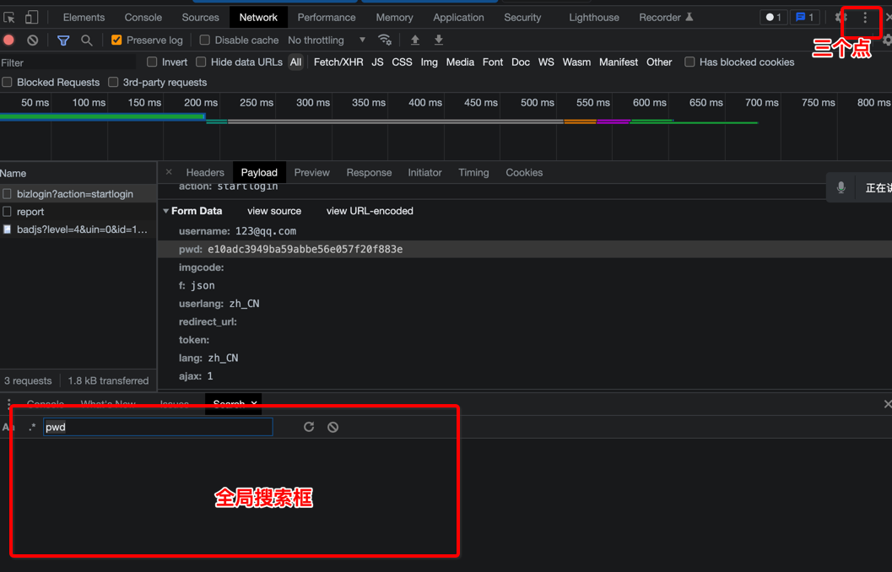
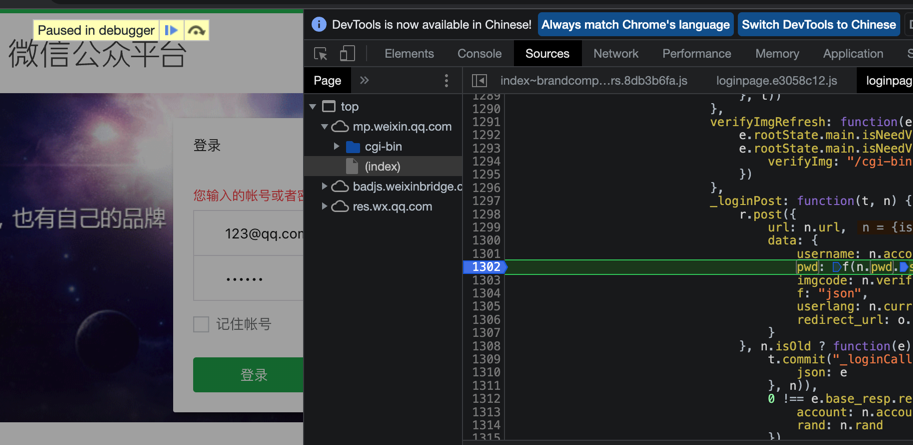

### 环境安装

- pip install PyExecJS（自己pip安装，安装成功后，最好重启下cmd终端和pycharm，或者重启电脑）
- 安装node.js开发环境：安装好了之后，记得重启电脑！
- js改写工具

### PyExecJS介绍

- PyExecJS 是一个可以使用 Python 来模拟运行 JavaScript 的库。
  - 使用该模块可以通过python程序调用执行js代码，获取js代码返回的结果！
  - 注意事项：电脑必须安装好了nodejs开发环境上述模块才可以生效！
- 使用步骤：
  - 导包：
    - import execjs
  - 创建node对象：
    - node = execjs.get()
  - 编译即将被执行的js代码对应的文件，返回上下文对象ctx
    - fp = open(filePath,encoding='utf-8')
    - ctx = node.compile(fp.read())
  - 生成要执行的js函数调用的字符串形式
    - funName = 'getPwd("xxx")'
  - 基于ctx调用eval函数，模拟执行funName表示的js函数
    - result = ctx.eval(funName)

```python
#1.导包
import execjs
#2.创建node对象
node = execjs.get()
#3.编译js文件返回上下文ctx对象(将js文件中的代码读取出来，被compile进行编译)
fp = open('test.js','r',encoding='utf-8')
ctx = node.compile(fp.read())
#4.使用上下文对象ctx调用eval函数执行js文件中的指定函数即可
result = ctx.eval('getPwd("123456")')
print(result)
```

- 注意：接下来将的内容，请忽视具体网站，重点专注逆向的分析思路！
  - 接下来就是爬什么网站，什么数据，什么形式都统统不重要！重点是分析思路！

### 微信公众平台案例

- url：[https://mp.weixin.qq.com](https://mp.weixin.qq.com/)

- 分析思路：

  - 先通过抓包工具发现，密码是经过加密，并且发现密码的加密后的数据是32位，大概率是md5加密的！
  - 发现加密后的数据是被pwd这个请求参数使用的。
  - 需要全局搜索pwd，定位加密的环节在哪里
    - 开发者工具中，点击右上角的三个点，选择search进行全局搜索
    - 
    - 搜索后，逐一点击搜索到的数据包，在数据包的内容中定位搜索的关键字（重点关注js后缀的搜索结果文件）
    - 显示了数据包的文件内容后，需要点击文件内容左下角的大括号，进行文件内容的格式化输出。
    - 在该文件中点击一下，按下contrl+f进行该文件的局部搜索，查找对应的pwd关键字
    - 在可疑的位置打上断点
      - 什么地方可疑：
        - 如果某些位置出现了加密和解密算法中的关键字或者是给搜索关键字赋值的操作，则该处是可疑的！
      - 什么是断点：
        - 在一个位置打了断点后，当刷新请求后，则程序执行会停留在打断点的位置。
    - 刷新请求：
      - 重新点击登录按钮，查看是否会停留在某一个断点的位置.
      - 
      - 在断点的位置，可以将鼠标放在某些变量上面，就可以显示变量的值是什么。
        - pwd: f(n.pwd.substr(0, 16))：表示的含义就是将pwd这个明文密码，f函数就是对密码进行加密，返回密文数据吧。因此，得知f函数就是加密函数！
          - 注意：f函数是一个js函数，我们只需要将f函数的函数定义找到，通过python模拟调用该函数就可以得到密码加密后的密文数据吧！
          - 鼠标可以放在f函数名上，出现的提示框中点击f就可以进入到f函数的实现中，就可以查看f函数的实现代码。
    - 使用js改写工具对函数的实现进行改写
      - 改写工具的功能介绍：
        - 格式化按钮：使用来将js代码进行可视化对齐显示
        - 加载代码按钮：用来检测js代码是否存在语法错误
        - 计算表达式按钮：可以直接调用计算按钮左侧框中对应的函数调用
          - 计算表达式报错（函数调用报错），一般都是没有满足函数调用的上下文机制导致（可能在该函数的调用中还使用了其他的函数调用，需要将每一个函数调用的关系都全部包含才不会出错）
            - 如何解决？
              - 找到定位函数离其最近的一个封号或者大括号.将代码放在js改写工具中，如果计算表达式成功，则该写成功！
      - 将该写的js代码，存储到一个js文件中，然后使用pyExclJS进行模拟执行，返回加密结果即可！

- 代码：

  - 改写后的js：weixin.js

  - ```
    function p(e, t) {
    var n = (65535 & e) + (65535 & t);
    return (e >> 16) + (t >> 16) + (n >> 16) << 16 | 65535 & n
    }
    function a(e, t, n, o, r, i) {
    return p((t = p(p(t, e), p(o, i))) << r | t >>> 32 - r, n)
    }
    function l(e, t, n, o, r, i, s) {
    return a(t & n | ~t & o, e, t, r, i, s)
    }
    function m(e, t, n, o, r, i, s) {
    return a(t & o | n & ~o, e, t, r, i, s)
    }
    function f(e, t, n, o, r, i, s) {
    return a(t ^ n ^ o, e, t, r, i, s)
    }
    function g(e, t, n, o, r, i, s) {
    return a(n ^ (t | ~o), e, t, r, i, s)
    }
    function s(e, t) {
    e[t >> 5] |= 128 << t % 32,
    e[14 + (t + 64 >>> 9 << 4)] = t;
    for (var n, o, r, d, i = 1732584193,
    s = -271733879,
    a = -1732584194,
    c = 271733878,
    u = 0; u < e.length; u += 16) i = l(n = i, o = s, r = a, d = c, e[u], 7, -680876936),
    c = l(c, i, s, a, e[u + 1], 12, -389564586),
    a = l(a, c, i, s, e[u + 2], 17, 606105819),
    s = l(s, a, c, i, e[u + 3], 22, -1044525330),
    i = l(i, s, a, c, e[u + 4], 7, -176418897),
    c = l(c, i, s, a, e[u + 5], 12, 1200080426),
    a = l(a, c, i, s, e[u + 6], 17, -1473231341),
    s = l(s, a, c, i, e[u + 7], 22, -45705983),
    i = l(i, s, a, c, e[u + 8], 7, 1770035416),
    c = l(c, i, s, a, e[u + 9], 12, -1958414417),
    a = l(a, c, i, s, e[u + 10], 17, -42063),
    s = l(s, a, c, i, e[u + 11], 22, -1990404162),
    i = l(i, s, a, c, e[u + 12], 7, 1804603682),
    c = l(c, i, s, a, e[u + 13], 12, -40341101),
    a = l(a, c, i, s, e[u + 14], 17, -1502002290),
    i = m(i, s = l(s, a, c, i, e[u + 15], 22, 1236535329), a, c, e[u + 1], 5, -165796510),
    c = m(c, i, s, a, e[u + 6], 9, -1069501632),
    a = m(a, c, i, s, e[u + 11], 14, 643717713),
    s = m(s, a, c, i, e[u], 20, -373897302),
    i = m(i, s, a, c, e[u + 5], 5, -701558691),
    c = m(c, i, s, a, e[u + 10], 9, 38016083),
    a = m(a, c, i, s, e[u + 15], 14, -660478335),
    s = m(s, a, c, i, e[u + 4], 20, -405537848),
    i = m(i, s, a, c, e[u + 9], 5, 568446438),
    c = m(c, i, s, a, e[u + 14], 9, -1019803690),
    a = m(a, c, i, s, e[u + 3], 14, -187363961),
    s = m(s, a, c, i, e[u + 8], 20, 1163531501),
    i = m(i, s, a, c, e[u + 13], 5, -1444681467),
    c = m(c, i, s, a, e[u + 2], 9, -51403784),
    a = m(a, c, i, s, e[u + 7], 14, 1735328473),
    i = f(i, s = m(s, a, c, i, e[u + 12], 20, -1926607734), a, c, e[u + 5], 4, -378558),
    c = f(c, i, s, a, e[u + 8], 11, -2022574463),
    a = f(a, c, i, s, e[u + 11], 16, 1839030562),
    s = f(s, a, c, i, e[u + 14], 23, -35309556),
    i = f(i, s, a, c, e[u + 1], 4, -1530992060),
    c = f(c, i, s, a, e[u + 4], 11, 1272893353),
    a = f(a, c, i, s, e[u + 7], 16, -155497632),
    s = f(s, a, c, i, e[u + 10], 23, -1094730640),
    i = f(i, s, a, c, e[u + 13], 4, 681279174),
    c = f(c, i, s, a, e[u], 11, -358537222),
    a = f(a, c, i, s, e[u + 3], 16, -722521979),
    s = f(s, a, c, i, e[u + 6], 23, 76029189),
    i = f(i, s, a, c, e[u + 9], 4, -640364487),
    c = f(c, i, s, a, e[u + 12], 11, -421815835),
    a = f(a, c, i, s, e[u + 15], 16, 530742520),
    i = g(i, s = f(s, a, c, i, e[u + 2], 23, -995338651), a, c, e[u], 6, -198630844),
    c = g(c, i, s, a, e[u + 7], 10, 1126891415),
    a = g(a, c, i, s, e[u + 14], 15, -1416354905),
    s = g(s, a, c, i, e[u + 5], 21, -57434055),
    i = g(i, s, a, c, e[u + 12], 6, 1700485571),
    c = g(c, i, s, a, e[u + 3], 10, -1894986606),
    a = g(a, c, i, s, e[u + 10], 15, -1051523),
    s = g(s, a, c, i, e[u + 1], 21, -2054922799),
    i = g(i, s, a, c, e[u + 8], 6, 1873313359),
    c = g(c, i, s, a, e[u + 15], 10, -30611744),
    a = g(a, c, i, s, e[u + 6], 15, -1560198380),
    s = g(s, a, c, i, e[u + 13], 21, 1309151649),
    i = g(i, s, a, c, e[u + 4], 6, -145523070),
    c = g(c, i, s, a, e[u + 11], 10, -1120210379),
    a = g(a, c, i, s, e[u + 2], 15, 718787259),
    s = g(s, a, c, i, e[u + 9], 21, -343485551),
    i = p(i, n),
    s = p(s, o),
    a = p(a, r),
    c = p(c, d);
    return [i, s, a, c]
    }
    function c(e) {
    for (var t = "",
    n = 0; n < 32 * e.length; n += 8) t += String.fromCharCode(e[n >> 5] >>> n % 32 & 255);
    return t
    }
    function u(e) {
    var t, n = [];
    for (n[(e.length >> 2) - 1] = void 0, t = 0; t < n.length; t += 1) n[t] = 0;
    for (t = 0; t < 8 * e.length; t += 8) n[t >> 5] |= (255 & e.charCodeAt(t / 8)) << t % 32;
    return n
    }
    function o(e) {
    for (var t, n = "0123456789abcdef",
    o = "",
    r = 0; r < e.length; r += 1) t = e.charCodeAt(r),
    o += n.charAt(t >>> 4 & 15) + n.charAt(15 & t);
    return o
    }
    function d(e) {
    return unescape(encodeURIComponent(e))
    }
    function r(e) {
    return c(s(u(e = d(e)), 8 * e.length))
    }
    function i(e, t) {
    var n, e = d(e),
    t = d(t),
    o = u(e),
    r = [],
    i = [];
    for (r[15] = i[15] = void 0, 16 < o.length && (o = s(o, 8 * e.length)), n = 0; n < 16; n += 1) r[n] = 909522486 ^ o[n],
    i[n] = 1549556828 ^ o[n];
    return e = s(r.concat(u(t)), 512 + 8 * t.length),
    c(s(i.concat(e), 640))
    }
    
    function getPwd(e, t, n) {
    return t ? n ? i(t, e) : o(i(t, e)) : n ? r(e) : o(r(e))
    }
    ```

  - python代码：

  - ```python
    import execjs
    node = execjs.get()
    fp = open('weixin.js','r',encoding='utf-8')
    ctx = node.compile(fp.read())
    pwd = input('请输入原始密码：')
    funcName = 'getPwd("%s")'%pwd
    result = ctx.eval(funcName)
    print('密码加密后的密文数据：',result)
    ```
