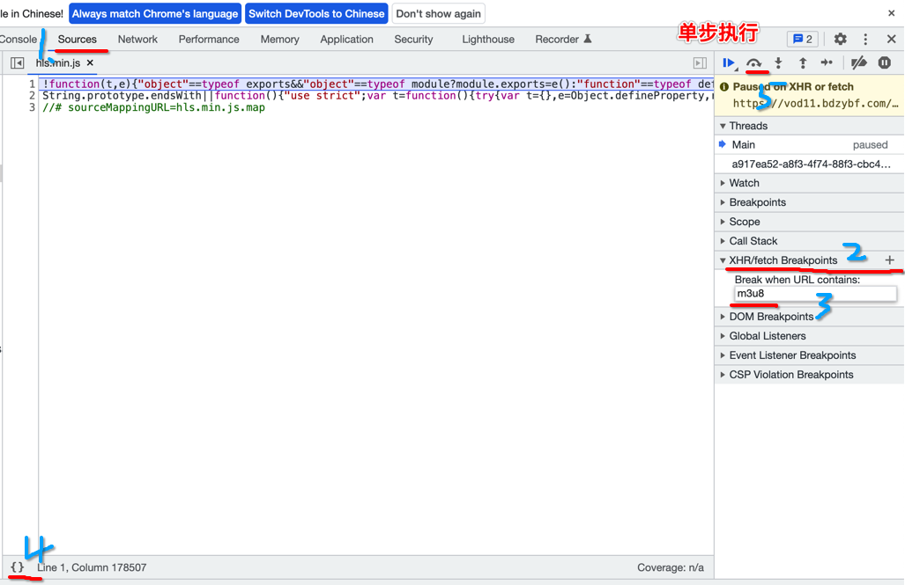
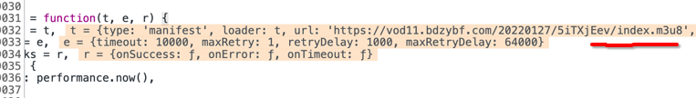

### M3U8流视频数据爬虫

#### HLS技术介绍

现在大部分视频客户端都采用HTTP Live Streaming，而不是直接播放MP4等视频文件（HLS，Apple为了提高流播效率开发的技术）。HLS技术的特点是将流媒体切分为若干【TS片段】（比如几秒一段），然后通过一个【M3U8列表文件】将这些TS片段批量下载供客户端播放器实现实时流式播放。因此，在爬取HLS的流媒体文件的思路一般是先【下载M3U8文件】并分析其中内容，然后在批量下载文件中定义的【TS片段】，最后将其【组合】成mp4文件或者直接保存TS片段。

说说简单，其实在实际操作中，会遇到很多复杂的问题，例如m3u8文件下载不下来，ts片段文件被加密了，甚至加密ts片段的密钥也被加密了。

#### HLS的作用

HLS技术目前在主流的应用产品中被应用的比较广。主要的原因在于，HLS技术比传统的流媒体技术的好处在于，视频一旦切分完成，之后的分发过程完全不需要额外使用任何专门软件，仅仅普通的Web服务器即可，这样就降低了对服务器的技术要求。

另外，用TS做流媒体封装还有一个好处，就是不需要加载完整视频后播放，大大减少了首次载人的延迟，提升了用户体验。

此外，HTTP Live Streaming的最大优势为自适应码率流播。客户端会根据网络状况自动选择不同码率的视频流，条件允许的情况下使用高码率，网络繁忙时使用低码率，并且自动在二者间随意切换。这对移动设备网络状况不稳定的情况下保障流畅播放非常有帮助。

#### M3U8文件详解

如果想要爬取HLS技术下的资源数据，首先要对M3U8的数据结构和字段定义非常了解。M3U8是一个扩展文件格式，由M3U扩展而来。那么什么事M3U呢？

##### M3U文件

M3U这种文件格式，本质上说不是音频视频文件，它是音频视频文件的列表文件，是纯文本文件。

M3U这种文件被获取后，播放软件并不是播放它，而是根据它的记录找到媒体的网络地址进行在线播放。也就是说，M3U格式的文件只是存储多媒体播放列表，并提供了一个指向其他位置的音频视频文件的索引，播放的是那些被指向的文件。

为了能够更好的理解M3U的概念，我们先简单做一个M3U文件（myTest.m3u）。在电脑中随便找几个MP3，MP4文件依次输入这些文件的路径，myTest.m3u文件内容如下

```
E:\Users\m3u8\刘德华 - 无间道.mp4
E:\Users\m3u8\那英 - 默.mp3
E:\Users\m3u8\周杰伦 - 不能说的秘密.mp4
E:\Users\m3u8\花粥 - 二十岁的某一天.mp3
E:\Users\m3u8\周深 - 大鱼.mp4
```

##### M3U8文件

M3U8也是一种M3U的扩展格式（高级的M3U，所以也属于M3U）。下面我们将了解一下M3U8中定义的几个非常重要的关键字：

```
#EXTM3U:每个M3U文件第一行必须是这个tag标识。(简单了解)

#EXT-X-VERSION:版本，此属性可用可不用。(简单了解)

#EXT-X-TARGETDURATION:目标持续时间，是用来定义每个TS的【最大】duration（持续时间）。(简单了解)

#EXT-X-ALLOW-CACHE是否允许允许高速缓存。(简单了解)

#EXT-X-MEDIA-SEQUENCE定义当前M3U8文件中第一个文件的序列号，每个ts文件在M3U8文件中都有固定唯一的序列号。(简单了解)

#EXT-X-DISCONTINUITY:播放器重新初始化(简单了解)

#EXT-X-KEY定义加密方式，用来加密的密钥文件key的URL，加密方法（例如AES-128），以及IV加密向量。（记住）

#EXTINF:指定每个媒体段(ts文件)的持续时间，这个仅对其后面的TS链接有效，每两个媒体段(ts文件)间被这个tag分隔开。(简单了解)

#EXT-X-ENDLIST表明M3U8文件的结束。(简单了解)
```

**M3U8示例：**大家会看到在该文件中有大量的ts文件的链接地址，这个就是我们之前描述的真正的视频文件。其中任何一个ts文件都是一小段视频，可以单独播放。我们做视频爬虫的目标就是把这些ts文件都爬取下来。

```
#EXTM3U
#EXT-X-VERSION:3
#EXT-X-TARGETDURATION:19
#EXT-X-ALLOW-CACHE:YES
#EXT-X-MEDIA-SEQUENCE:0

#EXT-X-KEY:METHOD=AES-128,URI="https://edu.aliyun.com/hls/1109/clef/YnBGq7zAJf1Is7xIB5v8vI7AIORwwG9W",IV=0x0fe82567a6be41afda68d82d3724976a
#EXTINF:8.583,
https://xuecdn2.aliyunedu.net/headLeader-0/20170519032524-ggauw1x00qo0okgk-conv/e_20170519032524-ggauw1x00qo0okgk-conv_hd_seg_0.ts
#EXT-X-DISCONTINUITY
#EXT-X-KEY:METHOD=AES-128,URI="https://edu.aliyun.com/hls/2452/clef/0VqtrHq9IkTfOsLqy0iC1FP9342VZm1s",IV=0xdebe4353e61b56e4ecfe0240ca3f89f5
#EXTINF:10.080,
https://xuecdn2.aliyunedu.net/courselesson-50224/20170630095028-3xsfwyxw20cgwws8-conv/e_20170630095028-3xsfwyxw20cgwws8-conv_hd_seg_0.ts
#EXT-X-KEY:METHOD=AES-128,URI="https://edu.aliyun.com/hls/2452/clef/0VqtrHq9IkTfOsLqy0iC1FP9342VZm1s",IV=0x8a3ce90cf18587963953b948487c1729
#EXT-X-KEY:METHOD=AES-128,URI="https://edu.aliyun.com/hls/2452/clef/0VqtrHq9IkTfOsLqy0iC1FP9342VZm1s",IV=0x3f1c20b9dd4459d0adf972eaba85e0a2
#EXTINF:10.000,
https://xuecdn2.aliyunedu.net/courselesson-50224/20170630095028-3xsfwyxw20cgwws8-conv/e_20170630095028-3xsfwyxw20cgwws8-conv_hd_seg_104.ts
#EXT-X-ENDLIST
```

##### EXT-X-KEY中的密钥文件

对于大多数的M3U8视频，一般是不加密的。对于一些重要的视频服务商，他们会对其视频做加密处理。M3U8视频目前的标准加密方式是使用AES-128进行加密处理。如果视频是加密的，就会在M3U8文件中出现以下信息：

```
#EXT-X-KEY:METHOD=AES-128,URI="https://edu.aliyun.com/hls/2452/clef/0VqtrHq9IkTfOsLqy0iC1FP9342VZm1s",IV=0x3f1c20b9dd4459d0adf972eaba85e0a2
```

其中METHOD为加密方法，标准是AES-128。

Key是密钥文件的下载地址（密钥为16字节大小的文件，需要下载）。

IV是加密向量（16个字节大小的16进制数），如果没有IV值则使用b"0000000000000000"填充即可。

注意：Key和IV是AES加密解密的必要信息，这里我们就不用深入讲解。大家只需要知道Key和IV的值会作为解密函数的参数直接调用就可以了。如果文件中没有包含#EXT-X-KEY，则媒体文件将不会被加密。

### 实战

#### 需求

爬取美剧网视频：https://www.meijuw.com/vodplay/3985-1-1/

#### 具体操作

打开开发者工具，定位到Sources选项卡。在“Sources”选项卡（顶端）中，点击“XHR/fetch Breakpoints”的加号，在编辑框中输入“m3u8”，本操作的意思是：当网页中有任何URL中包含m3u8字段的网络访问就暂停执行。

完成以上操作后重新刷新页面，此时Chrome开发者工具就会暂停在访问M3U8的代码位置。暂停后，我们可以点击左下方的{}图标提高暂停部分代码的可读性。

然后点击”单步“执行按钮，单步执行js代码，执行几部后，会看到一级m3u8的文件地址使用requests进行请求发送，获取一级m3u8文件内容。






**完整代码**

```python
import requests
from urllib.parse import urljoin
import re
import os
# 需要安装. pip install pycryptodome
from Crypto.Cipher import AES
dirName = 'tsLib'
if not os.path.exists(dirName):
    os.mkdir(dirName)

headers  = {
    'User-Agent':'Mozilla/5.0 (Macintosh; Intel Mac OS X 10_15_7) AppleWebKit/537.36 (KHTML, like Gecko) Chrome/98.0.4758.102 Safari/537.36'
}
#一级m3u8地址
m1_url = "https://vod11.bdzybf.com/20220127/5iTXjEev/index.m3u8"
m1_page_text = requests.get(url=m1_url,headers=headers).text
# print(m1_page_text)
#从一级m3u8文件中解析出二级m3u8地址
m1_page_text = m1_page_text.strip()#取出收尾的回车
#二级m3u8地址
m2_url = ''
for line in m1_page_text.split('\n'):
    if not line.startswith('#'):
        m2_url = line
        #将m1_url和m2_url不同之处补充到m2_url中
        m2_url = urljoin(m1_url,m2_url)
        #至此就获取到了完整的二级文件地址
#请求二级文件地址内容
m2_page_text = requests.get(url=m2_url,headers=headers).text
m2_page_text = m2_page_text.strip()
# print(m2_page_text)

#解析出解密秘钥key的地址
key_url = re.findall('URI="(.*?)"',m2_page_text,re.S)[0]
key_url = urljoin(m1_url,key_url)
# print(key_url)
#请求key的地址，获取秘钥
    #注意：key和iv需要为bytes类型
key = requests.get(url=key_url,headers=headers).content
iv = b"0000000000000000"
#解析出每一个ts切片的地址
ts_url_list = []
for line in m2_page_text.split('\n'):
    if not line.startswith('#'):
        ts_url = line
        ts_url = urljoin(m1_url,ts_url)
        ts_url_list.append(ts_url)
# print(ts_url_list)
#请求到每一个ts切片的数据
for url in ts_url_list:
    #获取ts片段的数据
    ts_data = requests.get(url=url,headers=headers).content
    #需要对ts片段数据进行解密（需要用到key和iv）
    aes = AES.new(key=key,mode=AES.MODE_CBC,iv=iv)
    desc_data = aes.decrypt(ts_data)#获取了解密后的数据
    ts_name = url.split('/')[-1]
    ts_path = dirName+'/'+ts_name
    with open(ts_path,'wb') as fp:
        #需要将解密后的数据写入文件进行保存
        fp.write(desc_data)
    print(ts_name,'下载保存成功！')

#ts文件的合并，最好网上找专业的工具进行合并，自己手动合并会经常出问题

```


- 协程异步下载

- ```python
  import requests
  from urllib.parse import urljoin
  import re
  import os
  # 需要安装. pip install pycryptodome
  from Crypto.Cipher import AES
  import asyncio
  import aiohttp
  
  dirName = 'tsLib'
  if not os.path.exists(dirName):
      os.mkdir(dirName)
  
  headers  = {
      'User-Agent':'Mozilla/5.0 (Macintosh; Intel Mac OS X 10_15_7) AppleWebKit/537.36 (KHTML, like Gecko) Chrome/98.0.4758.102 Safari/537.36'
  }
  #一级m3u8地址
  m1_url = "https://vod11.bdzybf.com/20220127/5iTXjEev/index.m3u8"
  m1_page_text = requests.get(url=m1_url,headers=headers).text
  # print(m1_page_text)
  #从一级m3u8文件中解析出二级m3u8地址
  m1_page_text = m1_page_text.strip()#取出收尾的回车
  #二级m3u8地址
  m2_url = ''
  for line in m1_page_text.split('\n'):
      if not line.startswith('#'):
          m2_url = line
          #将m1_url和m2_url不同之处补充到m2_url中
          m2_url = urljoin(m1_url,m2_url)
          #至此就获取到了完整的二级文件地址
  #请求二级文件地址内容
  m2_page_text = requests.get(url=m2_url,headers=headers).text
  m2_page_text = m2_page_text.strip()
  # print(m2_page_text)
  
  #解析出解密秘钥key的地址
  key_url = re.findall('URI="(.*?)"',m2_page_text,re.S)[0]
  key_url = urljoin(m1_url,key_url)
  # print(key_url)
  #请求key的地址，获取秘钥
      #注意：key和iv需要为bytes类型
  key = requests.get(url=key_url,headers=headers).content
  iv = b"0000000000000000"
  #解析出每一个ts切片的地址
  ts_url_list = []
  for line in m2_page_text.split('\n'):
      if not line.startswith('#'):
          ts_url = line
          ts_url = urljoin(m1_url,ts_url)
          ts_url_list.append(ts_url)
  # print(ts_url_list)
  #异步请求到每一个ts切片的数据
  async def get_ts(url):
      async with aiohttp.ClientSession() as sess:
         async with await sess.get(url=url,headers=headers) as response:
              ts_data = await response.read() #获取byte形式的响应数据
              # 需要对ts片段数据进行解密（需要用到key和iv）
              aes = AES.new(key=key, mode=AES.MODE_CBC, iv=iv)
              desc_data = aes.decrypt(ts_data)  # 获取了解密后的数据
  
              return [desc_data,url]
  def download(t):
      r_list  = t.result()
      data = r_list[0]
      url = r_list[1] #ts文件的地址
      ts_name = url.split('/')[-1]
      ts_path = dirName + '/' + ts_name
      with open(ts_path, 'wb') as fp:
          # 需要将解密后的数据写入文件进行保存
          fp.write(data)
      print(ts_name, '下载保存成功！')
  
  tasks = []
  for url in ts_url_list:
      c = get_ts(url)
      task = asyncio.ensure_future(c)
      task.add_done_callback(download)
      tasks.append(task)
  loop = asyncio.get_event_loop()
  loop.run_until_complete(asyncio.wait(tasks))
  
  
  
  ```


