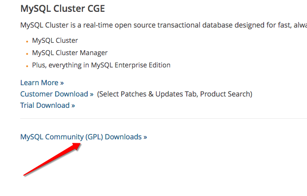
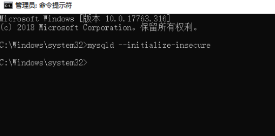
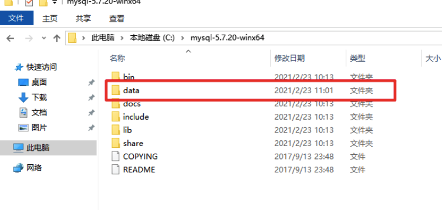
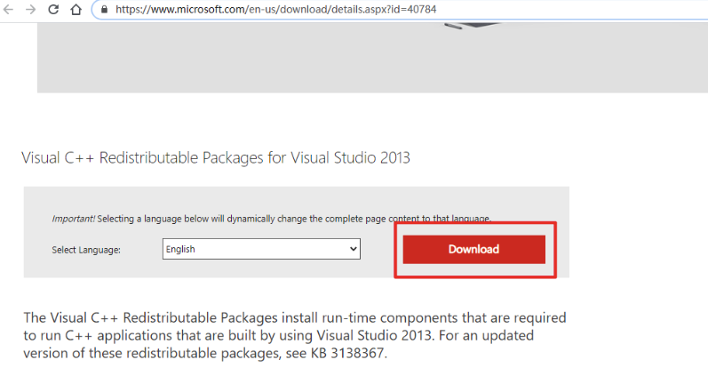
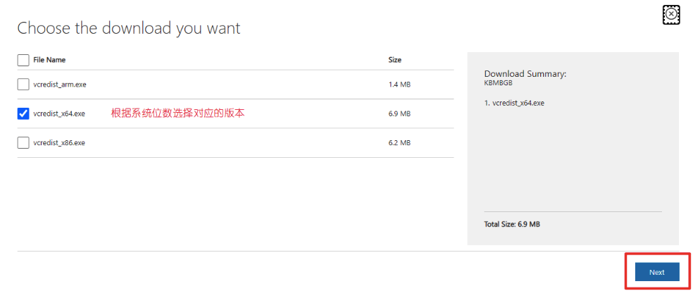
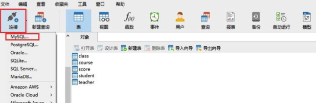

### 数据库概述

- 为什么要使用数据库？

  - 那我们在没有学习数据库的时候，数据存放在json或者磁盘文件中不也挺好的嘛，为啥还要学习数据库？

    - 文件中存储数据，无法基于文件直接对数据进行操作或者运算，必须借助python将数据读取到计算机内存中然后基于Python程序操作数据，麻烦而且性能不高。

    - 使用文件存储数据，无法实现数据的共享。

- 什么是数据库呢？先介绍几个概念：

  - 数据：Data

    - > 描述事物的符号记录称为数据，描述事物的符号既可以是数字，也可以是文字、图片，图像、声音、语言等，数据由多种表现形式，它们都可以经过数字化后存入计算机。

    - 例如：描述一个人的基本信息就是一组数据，在数据库中叫一行记录。

    - ```
      name age sex
      
      Ailsa 23 女
      ```

  - 数据库：DataBase(DB)

    - > 即存放数据的仓库，我们可以把它想象成文件夹，里面存放了很多张表，每个表就是一个文件，不过数据库中的数据是按照一定的规则进行组织、描述和储存，且具有较小的冗余度、较高的数据独立性和易扩展性，并可为各种用户共享

  - 数据库管理软件

    - > 在了解了Data与DB的概念后，如何科学地组织和存储数据，如何高效获取和维护数据成了关键，这就用到了一个系统软件---数据库管理系统

    - 如MySQL、Oracle、SQLite、Access、MS SQL Server

    - 但是我们日常工作中经常会把数据库管理软件称为数据库，注意理解对象的意思：例如

      - 小王啊，你们公司用的什么数据库啊，这个指的是数据库管理软件
      - 小王啊，这个学生管理系统的数据库是哪个？这个指的就是数据库文件夹，一般情况下一个项目的所有涉及到的数据会存放在一个数据库中，方便统一管理。

  - 总结：

    - 数据库服务器：运行数据库管理软件
    - 数据库管理软件：管理数据库
    - 数据库：即文件夹，用来组织文件/表
    - 表：即文件，用来存放多行内容/多条记录

  - 

### Mysql介绍

- 数据库管理软件按照分类分为 **关系型数据库**和**非关系型数据库**
- 关系型数据库
  - 在数据库中各个表之间存在关联关系，需要设计表结构，一张表中每个字段之间也存在关系，通过SQL语句对数据库进行增删改查的操作。
  - 例如：MySQL、oracle 、sql server、sqllite，access，db2
  - 注意：sql语句通用
- 非关系型数据库
  - 非关系型数据库是key-value存储的，没有表结构，存取速度快
  - 例如：redis、mongodb
- Mysql：
  - MySQL是一个关系型数据库管理系统，由瑞典MySQL AB 公司开发，目前属于 Oracle 旗下公司。MySQL 最流行的关系型数据库管理系统，在 WEB 应用方面MySQL是最好的 RDBMS (Relational Database Management System，关系数据库管理系统) 应用软件之一。
  - MySQL被广泛的应用在Internet上的大中小型网站中。由于体积小、速度快、总体拥有成本低，开放源代码
  - 特点:开源,免费,应用广泛

### Mysql下载和安装

#### 下载

我们下载安装的是mysql管理软件，它相当于是一个服务端，每个建立好的连接的用户都可以访问，但是这里为了让自己自主学习，所以我们会把这个软件下载安装到每个人的自己电脑上，相当于在自己电脑上安装了mysql的服务端，这个软件他也自带一个客户端，我们可以通过cmd终端的形式进行访问，当然也可以通过可视化工具navicate来访问，接下来我们会一一讲解。

- mysql管理下载

  - 第一步：打开网址，https://www.mysql.com，点击downloads之后跳转到https://www.mysql.com/downloads
  - 
  - 第二步：选择Community选项
  - 
  - 第三步：选择对应的操作系统版本
  - 

  - 第四步：选择具体版本的mysql，建议选择5.6或者5.7版本
  - 
  - 第五步：直接下载
  - 

#### 解压

- 下载的zip文件解压，将解压之后的文件夹放到任意目录下，这个目录就是mysql的安装目录。
- 注意:安装目录尽量在某盘的根目录下,如果不在根目录,则安装路径中**不能有中文,不能有特殊转义符**的出现。

#### 配置环境变量

- 在系统变量PATH后面添加: 你的mysql的bin文件夹的路径（如C:\Program Files\mysql-5.6.41-winx64\bin）

#### 执行初始化

在任意路径下，以管理员的身份打开终端执行：

```bash
mysqld --initialize-insecure
```

初始化时将root用户的登录密码设置为空。

注意，如果报错：提示缺少MSVCP120.dll文件的话，后面有解决办法。

初始化成功如下图：



初始化成功的另一个标志是，在MySQL的安装目录中，会多个data目录，这个data目录是是MySQL在初始化过程中创建的数据目录。



#### 安装Mysql服务

- 1.以**管理员身份打开**cmd窗口，记住,一定要是管理员身份
- 2.输入如下指令：
  - mysqld install 
    - 回车运行


#### 启动Mysql服务

- 现在系统的服务中就可以找到MySQL了。
  


- 但此时MySQL服务还没有启动，你可以在服务中点击启动，也可以在终端中使用net命令来启动/关闭MySQL服务。


- ok，现在MySQL服务正常启动了，并且，由于系统服务中的MySQL服务设置的是自动，下次系统启动时，MySQL服务也默认启动了。
- 服务启动成功之后，就可以登录了
  - 输入mysql -u root -p（第一次登录没有密码，直接按回车过）
  - 但登录成功之后需要设置密码:
    - 语法: set password = password('密码') 为了方便记忆，密码尽量简单一点，但是实际工作中为了保证数据安全，密码尽量设置的复杂一些。


#### 可能发生问题处理

- 缺少MSVCP120.dll文件


- 报错原因是，系统缺少Visual C ++可再发行组件包。

- 解决：

  - 打开microsoft官网：https://www.microsoft.com/en-us/download/details.aspx?id=40784，点击下载:
  - 
  - 根据系统位数选择下载：
  - 
  - 以管理员的身份运行，然后默认安装即可。
  - 
  - **重新以管理员身份打开终端**，重新执行初始化步骤吧！

  ```bash
  mysqld --initialize-insecure
  ```

  

  

### Navicate下载安装

- Navicate是一种操作数据库的可视化工具。
- 下载地址：https://www.navicat.com.cn/products
- 使用Navicate链接数据库：连接成功之后，你就可以通过该软件查看所有的数据库文件了
  - 


