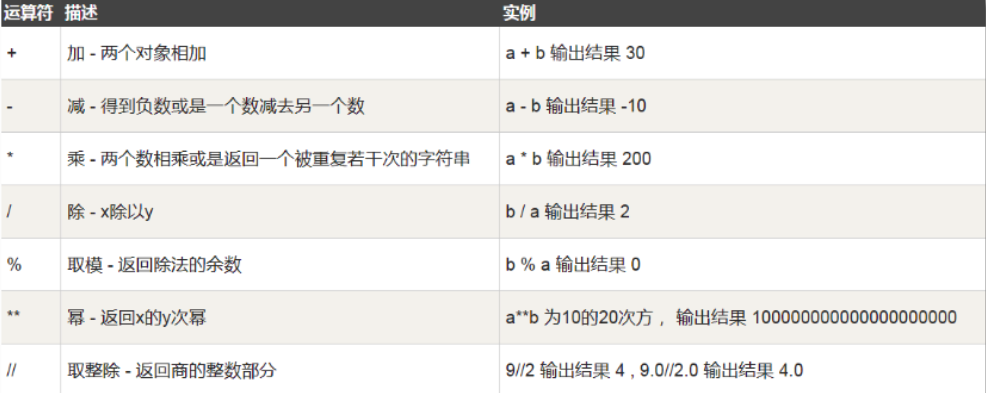
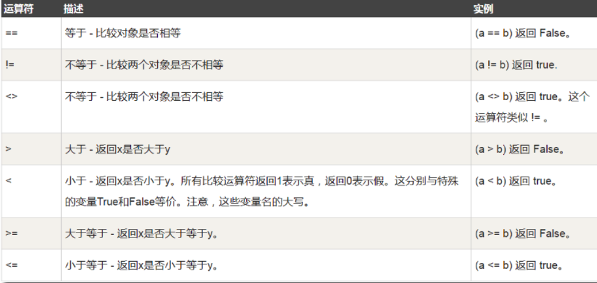
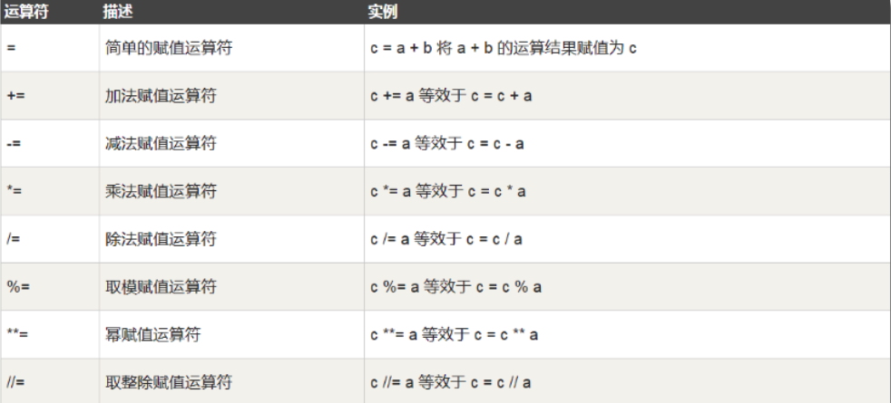
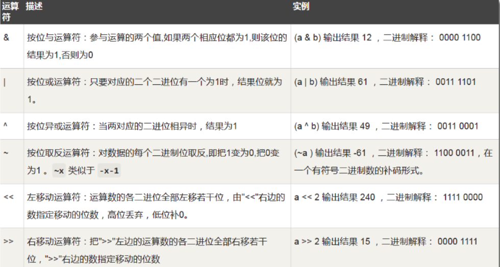
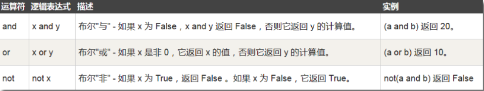
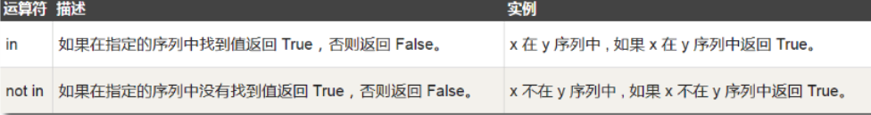
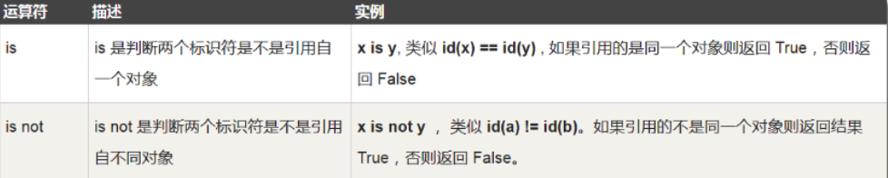
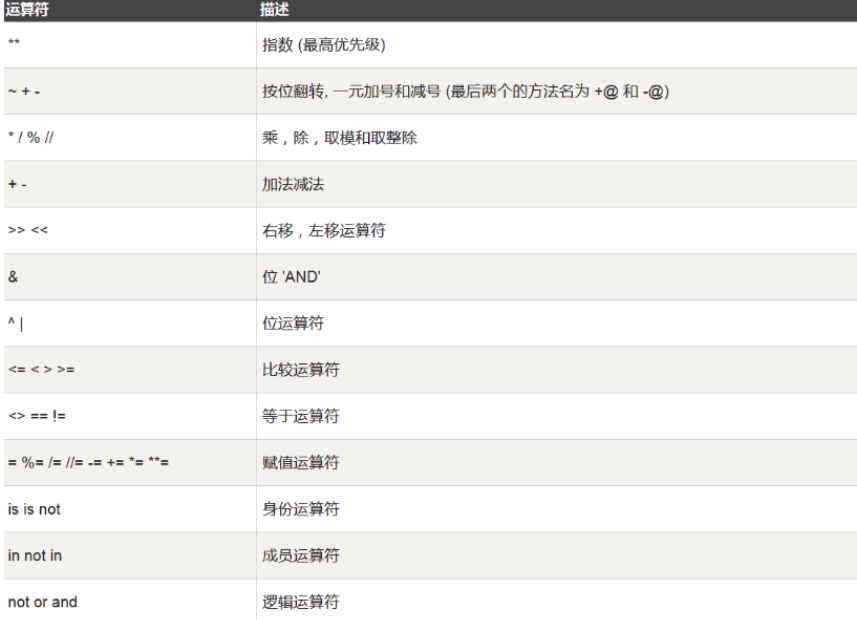
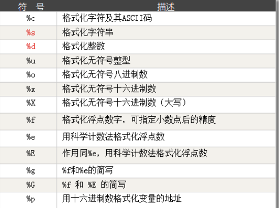

### 运算符

- 运算符：以1 + 2为例，1和2被称为操作数，“+” 称为运算符。
- Python语言支持以下类型的运算符:
  - 算术运算符
  - 比较（关系）运算符
  - 赋值运算符
  - 逻辑运算符
  - 位运算符
  - 成员运算符
  - 身份运算符

#### 算术运算符



```python
a = 10 % 3
b = 2 ** 3
c = 10 // 3
print(c)
```

#### 比较运算符



- 对于连续比较，Python是按这种机制解释的：
  - 3>2>1 等于 (3>2) and (2>1)

#### 赋值运算符



#### 位运算符（忽略）



#### 逻辑运算符



#### 成员运算符



#### 身份运算符（后面理解）




#### 运算符优先级

- 下表列出了从最高到最低优先级的所有运算符。优先级高的运算符优先计算或处理，同级别的按从左往右的顺序计算（赋值运算符除外，它是按从右往左的顺序



### 输入输出

#### print输出

- print用于将内容格式化显示在标准输出上，主要指的是屏幕显示器

- ```
  a = 10
  print(a)

- print可以接受多个字符串，字符串类型的变量。每个字符串用逗号“,”隔开，连成一串输出。print会依次打印每个字符串，同时，每遇到一个逗号“,”就输出一个空格。

- ```python
  a = 10
  b = 20
  name = 'bobo'
  salary = 1000
  print(a,b,name,salary)

- sep和end设置:

  - sep表示分隔的符号，默认是一个空格
  - end表示打印后的结束方式，默认为换行符\n

- ```
  a = 'bobo'
  b = 20
  c = 1.123
  print(a,b,c,sep='+++')
  ```


- %百分号格式化输出方式

- ```
  name = 'jay'
  print('该名同学的姓名是：%s'%name)
  
  age = 20
  print('该名同学的年龄是：%d'%age)
  ```
  
- 格式化符号:



#### input输入

- input可以获取用户输入，保存成一个字符串。一定要注意，input的返回值是一个字符串类型。哪怕你输入的是个数字1，返回给你的只会是字符串“1”，而不是 整数1。

- ```python
  name = input('enter your name:')
  print('该名同学的名字：%s'%name)
  age = input('enter your age:')
  print('年龄：%s'%age)
  ```
  
  
  
  