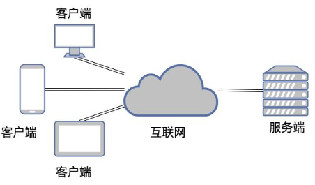
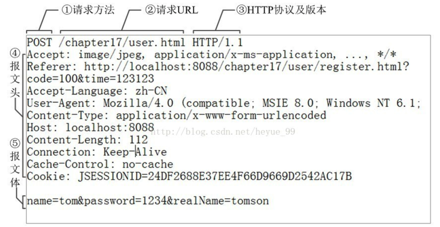
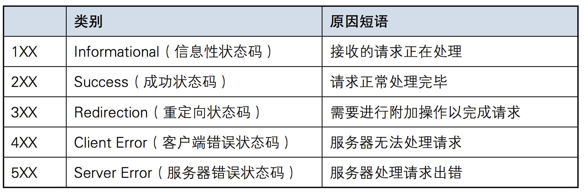

强调：前端所有的内容是作为了解，不需要自己能够写出来！

目的：大致看懂网页的页面源码

# 第1章 、Web的基本概念

### 软件开发的架构

- 目前我们了解常见应用程序/软件大致可以分为两种：
  - 第一种是应用类：qq、微信、网盘、优酷这一类是属于需要安装的桌面应用
  - 第二种是web类：比如百度、知乎、博客园等使用浏览器访问就可以直接使用的应用
- 这些应用的本质其实都是两个程序之间的通讯。而这两个分类又对应了两个软件开发的架构：
  - C/S架构
  - B/S架构

#### C/S架构

- C/S即：Client与Server ，中文意思：客户端与服务器端架构。
  - 我们把提供数据的一方称之为服务器(Server),把访问数据的一方称为客户端(Client)
  - 比如：电脑上要看视频就需要装看视频的程序.例如腾讯视频,它就是客户端程序,腾讯公司的机房里运行着腾讯视频的服务器程序,所以它也是C/S构架的程序



#### B/S架构

- B/S即：Browser与Server,中文意思：浏览器端与服务器端架构。

- Browser浏览器，其实也是一种Client客户端，只是这个客户端不需要大家去安装什么应用程序，只需在浏览器上通过HTTP请求服务器端相关的资源（网页资源）即可。


## 1.1、HTTP协议(大致了解)

### 1.1.1 、http协议简介

HTTP协议是Hyper Text Transfer Protocol（超文本传输协议）的缩写,是用于万维网（WWW:World Wide Web ）服务器与本地浏览器之间传输**超文本**的传送**协议**。

超文本：超文本就是指“含有指向其他资源链接”内容的文本。大概就是，不仅仅是文字，还有多媒体：视频、图片、动画等。

协议：HTTP协议就是服务器（Server）和客户端（Client）之间进行数据交互（相互传输数据）的一种协议。我们可以将Server和Client进行拟人化，那么该协议就是Server和Client这两兄弟间指定的一种交互沟通方式。大家都看过智取威虎山中杨子荣和土匪们之间说的黑话吧：

```
- 土匪：蘑菇，你哪路？什么价？（什么人？到哪里去？）

- 杨子荣：哈！想啥来啥，想吃奶来了妈妈，想娘家的人，孩子他舅舅来了。（找同行）

- 杨子荣：拜见三爷！

- 土匪：天王盖地虎！（你好大的胆！敢来气你的祖宗？）

- 杨子荣：宝塔镇河妖！（要是那样，叫我从山上摔死，掉河里淹死。）

- 土匪：野鸡闷头钻，哪能上天王山！（你不是正牌的。）
- 杨子荣：地上有的是米，喂呀，有根底！（老子是正牌的，老牌的。）
- 土匪：拜见过阿妈啦？（你从小拜谁为师？）
- 杨子荣：他房上没瓦，非否非，否非否！（不到正堂不能说。）
- 土匪：嘛哈嘛哈？（以前独干吗？）
- 杨子荣：正晌午说话，谁还没有家？（许大马棒山上。）
- 土匪：好叭哒！（内行，是把老手）
- 杨子荣：天下大耷拉！（不吹牛，闯过大队头。）
- 座山雕：脸红什么？
- 杨子荣：精神焕发！
- 座山雕：怎么又黄了？
- 杨子荣：防冷，涂的蜡！
- 座山雕：晒哒晒哒。（谁指点你来的？）
- 杨子荣：一座玲珑塔，面向青寨背靠沙！（是个道人。）

是不是看到这里，有得童鞋终于知道了传说中的‘天王盖地虎’是真正含义了吧。此黑话其实就是杨子荣和土匪之间进行交互沟通的方式（协议）。
```


HTTP于1990年提出，经过几年的使用与发展，得到不断地完善和扩展。HTTP协议工作于客户端-服务端（B/S）架构为上。浏览器作为HTTP客户端通过URL向HTTP服务端即WEB服务器发送所有请求。Web服务器根据接收到的请求后，向客户端发送响应信息。

### 1.1.2、 http协议特性

#### 基于请求－响应模式

HTTP协议规定,请求从客户端发出,最后服务器端响应该请求并返回。换句话说,肯定是先从客户端开始建立通信的,服务器端在没有接收到请求之前不会发送响应


#### 无连接

无连接的含义是限制每次连接只处理一个请求。服务器处理完客户的请求，并收到客户的应答后，即断开连接。采用这种方式可以节省传输时间。请思考：双11淘宝平台，一个小时的网站访问量就达到了2亿次，如果一个客户的请求连接耗时1s，那么淘宝是如何实现在一个小时内可以有2亿次的连接访问呢？

#### 无状态

HTTP协议 自身不对请求和响应之间的通信状态进行保存。也就是说在HTTP这个级别,协议对于发送过的请求或响应都不做持久化处理。每当有新的请求发送时,就会有对应的新响应产生。协议本身并不保留之前一切的请求或响应的相关信息。这是为了更快地处理大量事务,确保协议的可伸缩性,而特意把HTTP协议设计成如此简单的。

状态可以理解为客户端和服务器在某次会话中产生的数据，那无状态的就以为这些数据不会被保留。如果会话中产生的数据是我们需要保存的，也就是说要“保持状态”。

可是,随着Web的不断发展,因无状态而导致业务处理变得棘手的情况增多了。比如,用户登录到一家购物网站,即使他跳转到该站的其他页面后,也需要能继续保持登录状态。网站为了能够掌握是谁送出的请求,需要保存用户的状态。


HTTP/1.1虽然是无状态协议,但为了实现期望的保持状态功能, 于是引入了Cookie技术。有了Cookie再用HTTP协议通信,就可以管理状态了。有关Cookie的详细内容稍后讲解。

### 1.1.3、http请求协议与响应协议

http协议包含由浏览器发送数据到服务器需要遵循的请求协议与服务器发送数据到浏览器需要遵循的响应协议。

用于HTTP协议交互的信息被称为HTTP报文。请求端(客户端)的HTTP报文叫做请求报文,响应端(服务器端)的叫做响应报文。HTTP报文本身是由多行数据构成的字文本。

#### (1) 请求协议



- 请求头：

  - 请求头中存储的是该请求的一些主要说明（自我介绍）。服务器据此获取客户端的信息。

  - ```
    accept:浏览器通过这个头告诉服务器，它所支持的数据类型
    Accept-Charset: 浏览器通过这个头告诉服务器，它支持哪种字符集
    Accept-Encoding：浏览器通过这个头告诉服务器，支持的压缩格式
    Accept-Language：浏览器通过这个头告诉服务器，它的语言环境
    Host：浏览器通过这个头告诉服务器，想访问哪台主机
    If-Modified-Since: 浏览器通过这个头告诉服务器，缓存数据的时间
    Referer：浏览器通过这个头告诉服务器，客户机是哪个页面来的 防盗链
    X-Requested-With: XMLHttpRequest 代表通过ajax方式进行访问
    User-Agent：请求载体的身份标识
    ```
  
- 报文体：

  - 常被叫做请求体，请求体中存储的是将要传输/发送给服务器的数据信息。

> 请求方式: get与post请求
>
> - GET提交的数据会放在URL之后，以?分割URL和传输数据，参数之间以&相连，如EditBook?name=test1&id=123456. 
> - POST方法是把提交的数据放在HTTP包的请求体中.
> - GET提交的数据大小有限制（因为浏览器对URL的长度有限制），而POST方法提交的数据没有大小限制，且携带的请求数据不可以明文方式连接在url中。

#### (2) 响应协议


- 响应头：

  - 响应头中存储的是该响应的一些主要说明（自我介绍）。客户端据此获取服务器的相关信息。

- ```
  Location: 服务器通过这个头，来告诉浏览器跳到哪里
  Server：服务器通过这个头，告诉浏览器服务器的型号
  Content-Encoding：服务器通过这个头，告诉浏览器，数据的压缩格式
  Content-Length: 服务器通过这个头，告诉浏览器回送数据的长度
  Content-Language: 服务器通过这个头，告诉浏览器语言环境
  Content-Type：服务器通过这个头，告诉浏览器回送数据的类型
  Refresh：服务器通过这个头，告诉浏览器定时刷新
  Content-Disposition: 服务器通过这个头，告诉浏览器以下载方式打数据
  Transfer-Encoding：服务器通过这个头，告诉浏览器数据是以分块方式回送的
  Expires: -1 控制浏览器不要缓存
  Cache-Control: no-cache
  Pragma: no-cache
  ```

- 响应体：

  - 根据客户端指定的请求信息，发送给客户端的指定数据

- 响应状态码：

  - 状态码指的是是当客户端向服务器端发送请求时, 返回的请求结果。借助状态码,用户可以知道服务器端是正常受理了请求,还是出现了什么问题错误 。



## 1.2、Cookie概述（基本了解）

### 1.2.1 COOKIE的由来

- 大家都知道HTTP协议是无状态的。
  - 状态可以理解为客户端和服务器在某次会话中产生的数据，那无状态的就以为这些数据不会被保留。每当有新的请求发送时,就会有对应的新响应产生。协议本身并不保留之前一切的请求或响应的相关信息。
  - 一句有意思的话来描述就是人生只如初见，对服务器来说，每次的请求都是全新的，及时同一个客户端发起的多个请求间。随着Web的不断发展,因无状态而导致业务处理变得棘手的情况增多，因此我们需要解决这个问题，也就是说要让http可以“保持状态”，那么Cookie就是在这样一个场景下诞生。

### 1.2.2 什么是cookie

- 首先来讲，cookie是浏览器的技术，Cookie具体指的是一段小信息，它是服务器发送出来存储在浏览器上的一组组键值对，可以理解为服务端给客户端的一个小甜点，下次访问服务器时浏览器会自动携带这些键值对，以便服务器提取有用信息。

记住：cookie表示的键值对数据是由服务器创建，且存储在客户端浏览器中。


### 1.2.3 cookie的原理

- cookie的工作原理是：
  - 浏览器访问服务端，带着一个空的cookie，然后由服务器产生内容，浏览器收到相应后保存在本地；
  - 当浏览器再次访问时，浏览器会自动带上Cookie，这样服务器就能通过Cookie的内容来判断这个是“谁”了。
  - cookie的内容是有服务器自主设计的，客户端无法干涉！
  - 

### 1.2.4 cookie的规范

-  Cookie大小上限为4KB； 
-  一个服务器最多在客户端浏览器上保存20个Cookie； 
-  一个浏览器最多保存300个Cookie，因为一个浏览器可以访问多个服务器。

-  上面的数据只是HTTP的Cookie规范，但在浏览器大战的今天，一些浏览器为了打败对手，为了展现自己的能力起见，可能对Cookie规范“扩展”了一些，例如每个Cookie的大小为8KB，最多可保存500个Cookie等！但也不会出现把你硬盘占满的可能！ 
-  注意，不同浏览器之间是不共享Cookie的。也就是说在你使用IE访问服务器时，服务器会把Cookie发给IE，然后由IE保存起来，当你在使用FireFox访问服务器时，不可能把IE保存的Cookie发送给服务器。

# 第2章 、HTML（大致对标签进行了解即可）

了解了web相关基本概念以后，我们开始正式接触网页开发，网页开发的基础是HTML，所以，本章内容主要是学会如何新建一个 HTML 页面和熟记HTML文档的基本结构和主要标签。

## 2.1、 HTML概述

* HTML，即超文本标记语言（HyperText Markup Language ]），也可叫做web页面。扩展名是 .html 或是 .htm 。

* HTML，是一种用来制作网页的标准标记语言。超文本，指的就是超出普通文本范畴的文档，可以包含文本、图片、视频、音频、链接等元素。

* HTML 不是一种编程语言，而是一种写给网页浏览器、具有描述性的标记语言。

也就是说：使用HTML语言描述的文件，需要通过网页浏览器显示出效果。用户在访问网页时，是把服务器的HTML文档**下载** 到本地客户设备中，然后通过本地客户设备的浏览器将文档按顺序解释渲染成对应的网页效果。

网页本身是一种文本文件，通过在文本文件中添加各种各样的标记标签，可以告诉[浏览器](http://baike.baidu.com/view/7718.htm)如何显示标记中的代表的内容，如：HTML中有的标签可以告诉浏览器要把字体放大，就像word一样，也有的标签可以告诉浏览器显示指定的图片，还有的标签可以告诉浏览器把内容居中或者倾斜等等。

每一个HTML标签代表的意义都不一样。同样，他们在浏览器中表现出来的外观也是不一样的。

## 2.2、 HTML结构和标签格式

```html
<!DOCTYPE html>
<html lang="en">
<head>
    <meta charset="UTF-8">
    <title>123</title>
</head>
<body>
	
</body>
</html>

```

> 1、`<!DOCTYPE html>` 告诉浏览器使用什么样的解析器来解析`html`文档
>
> 2、`<html></html>`是文档的开始标记和结束标记。此元素告诉浏览器其自身是一个 `HTML `文档，在它们之间是文档的头部`<head>`和主体`<body>`。	
>
> 3、<head></head>元素出现在文档的开头部分。<head>与</head>之间的内容不会在浏览器的文档窗口显示，但是其间的元素有特殊重要的意义。
>
> 4、`<title></title>`定义网页标题，在浏览器标题栏显示。
>
> 5、`<body></body>`之间的文本是可见的网页主体内容
>
> 6、`<meta charset="UTF-8"> `  声明编码方式用utf8

## 2.3、标签的语法

```html
<标签名 属性1=“属性值1” 属性2=“属性值2”……>内容部分</标签名>
<标签名 属性1=“属性值1” 属性2=“属性值2”…… />
```

> 1、HTML标签是由尖括号包围的特定关键词
>
> 2、标签分为闭合和自闭合两种标签
>
> 3、HTML不区分大小写
>
> 4、标签可以有若干个属性,也可以不带属性,比如<head>就不带任何属性

- 注意：网页中显示的我们可以看到的数据/内容都只可以存储或者写在标签之间或者属性中！

## 2.4、基本标签

* 标题标签

```html
<h1>标题1</h1>
<h2>标题2</h2>
<h3>标题3</h3>
<h4>标题4</h4>
<h5>标题5</h5>
<h6>标题6</h6>
```

* 段落标签

```html
<p>大家好，我是段落1。</p>
<p>大家好，我是段落2。</p>
<p>大家好，我是段落3。</p>
```

* 换行标签

```html
<p>大家好，我是段落标签p。我按了enter一下
换行了</p>

<p>大家好，我是段落标签p。我按了enter一下<br/> 换行了</p>
```

* 文本格式化标签

HTML提供了一系列的用于格式化文本的标签，可以让我们输出不同外观的元素，比如粗体和斜体字。如果需要在网页中，需要让某些文本内容展示的效果丰富点，可以使用以下的标签来进行格式化。

```html
<b>定义粗体文本</b><br />
<strong>定义粗体文本方式2</strong><br />
<em>定义斜体字</em><br />
<i>定义斜体字方式2</i><br />
<del>定义删除文本</del><br />
```

* 特殊符号

```html
&nbsp; 
```

> 标签大致可分为两类
>
> *  块级标签(block)  -- 独占一行 
> *  内联标签(inline)  -- 按文本内容占位

* div和span标签

````html
<div>只是一个块级元素，并无实际的意义。主要通过CSS样式为其赋予不同的表现.
<span>表示了内联行(行内元素),并无实际的意义,主要通过CSS样式为其赋予不同的表现
````


块级元素与行内元素的区别：所谓块元素，是以另起一行开始渲染的元素，行内元素则不需另起一行。如果单独在网页中插入这两个元素，不会对页面产生任何的影响。这两个元素是专门为定义CSS样式而生的。

## 2.5、超链接标签

### 2.5.1、超链接基本使用

超链接是浏览者和服务器的交互的主要手段，也叫超级链接或a链接，是网页中指向一个目标的连接关系，这个目标可以是网页、网页中的具体位置、图片、邮件地址、文件、应用程序等。

超链接是网页中最重要的元素之一。一个网站的各个网页就是通过超链接关联起来的，用户通过点击超链接可以从一个网页跳转到另一个网页。

几乎可以在所有的网页中找到链接。点击链接可以从一张页面跳转到另一张页面。例如,在阅读某个网站时，遇到一个不认识的英文，你只要在这个单词上单击一下，即可跳转到它的翻译页面中，看完单词的解释后点一下返回按钮，又可继续阅读，这就是超链接的常见用途。还有经常到购物网站中去，我们都是在百度搜索，然后点击对应的搜索项进入到对应的购物网站的，这也是超链接的作用。超链接的属性：

| 属性   | 值                                                           | 描述                                                         |
| ------ | ------------------------------------------------------------ | ------------------------------------------------------------ |
| href   | 网络链接 [ 例如: http://www.baidu.com ]     本地链接 [ 例如：F:\html\index.html ] | 规定链接的跳转目标                                           |
| title  | <a href="http://www.baidu.com" title="国内最著名的搜索引擎网站">百度</a> | 链接的提示信息                                               |
| target | _blank [ 在新建窗口中打开网页 ]                                                                                       _self  [ 默认值，覆盖自身窗口打开网页 ] | 与前面四项固定值不同，framename是泛指，并不是这个值，这点将在后面框架部分内容中详细介绍，这里可以暂时先略过 |

> 1、href是超链接最重要的属性，规定了用户点击链接以后的跳转目标，这个目标可以是 网络连接，也可以是本地连接。
>
> 2、网络链接指的是依靠网络来进行关联的地址，一般在地址前面是以 http://或者https://这样开头的，如果没有网络，则用户点击了超链接也无法访问对应的目标。
>
> 3、本地链接指的是本地计算机的地址，一般在地址前面是以 file:///开头或直接以 C:/、D:/、E:/开头的，不需要经过网络。
>
> 4、如果href的值留空，则默认是跳转到当前页面，也就是刷新当前页面。


## 2.6、img标签

在HTML中，图像由标签定义的，它可以用来加载图片到html网页中显示。网页开发过程中，有三种图片格式被广泛应用到web里，分别是 jpg、png、gif。

img标签的属性：

```go
/*
src属性：
    指定图像的URL地址，是英文source的简写，表示引入资源。
    src的值可以是本地计算机存储的图片的地址，也可以是网络上外部网站的图片的地址。
    如果src的值不正确，那么浏览器就无法正确的图片，而是显示一张裂图。

alt属性：指定图像无法显示时的替换文本。当图像显示错误时，在图像位置上显示alt的值。如上所示，就是谷歌浏览器中，引入图像失败后，显示了替换文本。

width属性： 指定引入图片的显示宽度。
height属性：指定引入图片的显示高度。
border属性：指定引入图片的边框宽度，默认为0。
title属性：悬浮图片上的提示文字
*/
```

点击图片跳转可以配合a标签使用

```html
<a></a>
```

## 2.7、列表标签

```html
  <ul type="square">
      <li>item1</li>
      <li>item2</li>
      <li>item3</li>
  </ul>

  <ol start="100">
      <li>item1</li>
      <li>item2</li>
      <li>item3</li>
  </ol>
```

## 2.8、表格标签

在HTML中使用table来定义表格。网页的表格和办公软件里面的xls一样，都是有行有列的。HTML使用tr标签定义行，使用td标签定义列。

语法：

```html
<table border="1">
  <tr>
    <td>单元格的内容</td>
    ……
  </tr>
  ……
</table>


```

> 1、`<table>`和`</table>`表示一个表格的开始和结束。一组`<table>...</table>`表示一个表格。
>
> 2、border用于设置整个表格的边框宽度，默认为0，表示不显示边框。
>
> 3、`<tr>`和`</tr>`表示表格中的一行的开始和结束。一组`<tr>...</tr>`，一个表格可以有多行。通过计算table标签中包含多少对tr子标签即可知道一个表格有多少行。
>
> 4、`<td>`和`</td>`表示表格中的一个单元格的开始和结束。通过计算一个tr里面包含了多少对td自标签即可知道一个表格有多少列，多少的单元格了。

**table属性**

| 属性                                                         | 值                             | 描述                               |
| ------------------------------------------------------------ | ------------------------------ | ---------------------------------- |
| [width](http://www.w3school.com.cn/tags/att_table_width.asp) | px、%                          | 规定表格的宽度。                   |
| height                                                       | px、%                          | 规定表格的高度。                   |
| [align](http://www.w3school.com.cn/tags/att_table_align.asp) | left、center、right            | 规定表格相对周围元素的对齐方式。   |
| [bgcolor](http://www.w3school.com.cn/tags/att_table_bgcolor.asp) | rgb(x,x,x)、#xxxxxx、colorname | 规定表格的背景颜色。               |
| background                                                   | url                            | 规定表格的背景图片。               |
| [border](http://www.w3school.com.cn/tags/att_table_border.asp) | px                             | 规定表格边框的宽度。               |
| [cellpadding](http://www.w3school.com.cn/tags/att_table_cellpadding.asp) | px、%                          | 规定单元格边框与其内容之间的空白。 |
| [cellspacing](http://www.w3school.com.cn/tags/att_table_cellspacing.asp) | px、%                          | 规定单元格之间的空隙。             |

**td属性**

表格中除了行元素以外，还有单元格，单元格的属性和行的属性类似。td和th都是单元格。

| 属性                                                         | 值                             | 描述                           |
| ------------------------------------------------------------ | ------------------------------ | ------------------------------ |
| height                                                       | px、%                          | 规定单元格的高度。             |
| width                                                        | px、%                          | 规定单元格的宽度。             |
| [align](http://www.w3school.com.cn/tags/att_table_align.asp) | left、center、right            | 规定单元格内容的对齐方式。     |
| valign                                                       | top、middle、bottom            | 规定单元格内容的垂直对齐方式。 |
| [bgcolor](http://www.w3school.com.cn/tags/att_table_bgcolor.asp) | rgb(x,x,x)、#xxxxxx、colorname | 规定单元格的背景颜色。         |
| background                                                   | url                            | 规定单元格的背景图片。         |
| rowspan                                                      | number                         | 规定单元格合并的行数           |
| colspan                                                      | number                         | 规定单元格合并的列数           |

```
<html>
<head>
    <title>i am title</title>
    <meta charset="utf-8">
</head>
<body>
    <table border=1px width="700" height="500">
        <tr>
            <td>1</td>
            <td>2</td>
        </tr>
        <tr>
            <td>3</td>
            <td>4</td>
        </tr>
        <tr>
            <td>5</td>
            <td>6</td>
        </tr>
    </table>
</body>
</html>
```


## 2.9、表单标签

表单主要是用来收集客户端提供的相关信息，提供了用户数据录入的方式，有多选、单选、单行文本、下拉列表等输入框，便于网站管理员收集用户的数据，是Web浏览器和Web服务器之间实现信息交流和数据传递的桥梁.

表单被form标签包含，内部使用不同的表单元素来呈现不同的方式来供用户输入或选择。当用户输入好数据后，就可以把表单数据提交到服务器端。

一个表单元素有三个基本组成部分：

* 表单标签，包含了表单处理程序所在的URL以及数据提交到服务器的方法等表单信息。 

* 表单域，包含了文本框、密码框、隐藏域、多行文本框、复选框、单选框、下拉选择框和文件上传框等表单控件。

* 表单按钮，包括提交按钮、复位按钮和一般按钮，用于将数据传送到服务器上。

在HTML中创建表单用form标签。每个表单都可以包含一到多个表单域或按钮。form标签属性：

| 属性    | 值                                                           | 描述                          |
| ------- | ------------------------------------------------------------ | ----------------------------- |
| action  | 访问服务器地址                                               | 服务器端表单处理程序的URL地址 |
| method  | post、get[默认值]                                            | 表单数据的提交方法            |
| target  | 参考超链接的target属性                                       | 表单数据提交时URL的打开方式   |
| enctype | application/x-www-form-urlencoded[默认值]    multipart/form-data [用于文件上传]                                                        text/plain [用于纯文本数据发送] | 表单提交数据时的编码方式      |

```html
<!DOCTYPE html>
<html lang="en">
<head>
    <meta charset="UTF-8">
    <title>Title</title>
</head>
<body>
    <form action="#" method="post">
        <label>用户名：</label>
        <input type="text" name="username"/><br/>
        <label>密码：</label>
        <input type="password" name="password"/><br/>
        <label>爱好：</label>
<!--        value属性就是提交给服务器的内容，服务器根据该内容就是到用户选择的是哪一项-->
        <input type="checkbox" name="hobby" value="lanqiu">篮球
        <input type="checkbox" name="hobby" value="zuqiu">足球
        <input type="checkbox" name="hobby" value="qumao">羽毛球
        <input type="checkbox" name="hobby" value="gaoer">高尔夫
        <br/>
        <label>性别：</label>
<!--        单选框的name属性值必须一样，否则无法实现单选-->
        <input type="radio" name="sex" value="male">男
        <input type="radio" name="sex" value="female">女
        <br/>
        <label>生日：</label>
        <input type="date" name="birthday"><br>
        <label>籍贯：</label>
        <select name="jiguan">
            <option>请选择籍贯</option>
            <option value="hebei">河北</option>
            <option value="anhui">安徽</option>
            <option value="liaoning">辽宁</option>
        </select>
        <br>
        <label>自我介绍：</label>
        <textarea cols="30" rows="10" placeholder="请描述" name="self"></textarea>
        <br>
        <input type="submit" value="提交">
        <input type="reset" value="重置">
    </form>
</body>
</html>
```

- 文件上传:必须将文件的二进制形式的数据提交给服务器

- ```html
  <form action="#" method="post" enctype="multipart/form-data">
      <input type="file">
      <input type="submit" value="上传文件">
  </form>
  ```


## 2.10、多媒体标签

视频标签：

```
<video src="路径" controls  autoplay width="300px"></video>

标签属性：
  autoplay属性控制是否网页加载自动播放　　

  controls 是否显示播放控件，默认不显示

  loop 属性用于控制循环次数，如果值为正整数，则播放指定的次数，如果是 loop 或者是 loop = -1，则无线循环播放。

  width 属性设置播放窗口宽度

  height 属性设置播放窗口高度

  由于版权等原因，不同的浏览器可支持播放的格式是不一样的
```

```html
<!DOCTYPE html>
<html lang="en">
<head>
    <meta charset="UTF-8">
    <title>Title</title>
</head>
<body>
    <video src="https://video.pearvideo.com/mp4/adshort/20211029/cont-1744852-15789500_adpkg-ad_hd.mp4" controls  autoplay width="600px"></video>

</body>
</html>
```

音频标签：

```
<audio src="路径"  autoplay="autoplay" controls="true" loop=2></audio>
标签属性：
	autoplay属性控制是否网页加载自动播放
  controls 是否显示播放控件，默认不显示
  loop 属性用于控制循环次数，如果值为正整数，则播放指定的次数，如果是 loop 或者是 loop = -1，则无线循环播放。
  由于版权等原因，不同的浏览器可支持播放的格式是不一样的

```

```html
<!DOCTYPE html>
<html lang="en">
<head>
    <meta charset="UTF-8">
    <title>Title</title>
</head>
<body>
    <audio src="https://video.pearvideo.com/mp4/adshort/20211029/cont-1744852-15789500_adpkg-ad_hd.mp4" controls  autoplay width="600px"></audio>

</body>
</html>
```


# 第3章 、CSS(大致了解)

CSS中文译作“层叠样式表”或者是“级联样式表”，是用于控制网页外观处理并允许将网页的表现与内容分离的一种标记性语言，CSS不需要编译,可以直接由浏览器执行(属于浏览器解释型语言)，是Web网页开发技术的重要组成部分。

那么接下来，继续看下，使用CSS有什么好处吧。

*  使用CSS样式可以有效地对页面进行布局，更加灵活多样。

*  使用CSS样式可以对页面字体、颜色、背景和其他效果实现精确控制，同时对它们的修改和控制变得更加快捷，更加强大。

*  站点中所有的网页风格都使用一个CSS文件进行统一控制，达到一改全改。还可以快速切换主题，我们可以把HTML比作是骨架，CSS是衣服。同一个HTML骨架结构，不同CSS样式，所得到的美化布局效果不同。

* CSS可以支持多种设备,比如手机,PDA,打印机,电视机,游戏机等。

* CSS可以将网页的表现与结构分离，使页面载入得更快,更利于维护，这也是我们的最终目的。

CSS基本语法:


> CSS的基本语法由选择器、属性、属性的值组成，如果选择器有多个属性，由分号隔开。
>
> 注意，这里的代码都是英文格式，例如花括号、冒号和分号。

## 3.1、CSS的引入方式

* 嵌入式

嵌入式，是把CSS样式写在HTML文档内部head标签中的style标签里。浏览器加载HTML的同时就已经加载了CSS样式了。当单个文档需要特殊，单独的样式时，可以使用该模式。

```html
<!DOCTYPE HTML>
<html lang="en-US">
  <head>
     <title>锚点的使用</title>
      <meta charset="utf8">

      <style>
          div{
              color: white;
              background-color: #369;
              text-align: center
          }
      </style>
  </head>
  <body>
  
  <div> 嵌入式</div>

  </body>
</html>
```

* 链接式

链接式，就是把CSS样式写在HTML文档的外部，一个后缀为 .css 的外部样式表中，然后使用时在head标签中，使用link标签的href属性引入文件即可。当CSS样式需要应用在很多页面时，外部样式表是最理想的选择。在使用外部样式表的情况下，我们可以通过改变一个文件来改变这所有页面的外观。

common.css

````css
div{
      color: white;
      background-color: #369;
      text-align: center
}
````

html文件

```html
<!DOCTYPE HTML>
<html lang="en-US">
  <head>
     <title>锚点的使用</title>
      <meta charset="utf8">

      <link rel="stylesheet" href="common.css">
  </head>
  <body>

  <div>链接式</div>
  
  </body>
</html>
```

## 3.2、CSS的选择器

### 3.2.1、基本选择器


```html
<!DOCTYPE html>
<html lang="en">
<head>
    <meta charset="UTF-8">
    <title>Title</title>

    <style>
           #i1{
               color: red;
           }

           .c1{
               color: red;
           }
           .c2{
               font-size: 32px;
           }

    </style>

</head>
<body>

<div id="i1">item1</div>
<div id="i2">item2</div>
<div id="i3">item3</div>

<div class="c1 c2">item4</div>
<div class="c1">item5</div>
<div class="c1">item6</div>

</body>
</html>
```


## 3.3、CSS的属性操作

### 3.3.1、文本属性

* font-style（字体样式风格）

```go
/*
属性值：
normal：设置字体样式为正体。默认值。 
italic：设置字体样式为斜体。这是选择字体库中的斜体字。
oblique：设置字体样式为斜体。人为的使文字倾斜，而不是去使用字体库的斜体字。
*/
```

* font-weight（字体粗细）

```go
/*
属性值：
normal：设置字体为正常字体。相当于数字值400
bold：设置字体为粗体。相当于数字值700。
bolder：设置字体为比父级元素字体更粗的字体。
lighter：设置字体为比父级元素字体更细的字体。
number：用数字表示字体粗细。从小到大，越来约粗，取值范围：100、200、300、400、500、600、700、800、900。
注意：
font-weight的常用值有两个normal和bold，其他的值在浏览器中的支持并不好。
*/
```

* font-size（字体大小）

```go
/*
font-size的值有很多，有xx-small、x-small、small、medium、large、x-large、xx-large、smaller和larger，也可以设置值为具体的数值加上对应的计算单位来表示字体的大小。字体单位有像素（ px ）、字符（ em，默认1em等于16px，2em等于32px，根据不同浏览器的默认字体大小而决定 ）。
字体不指定大小时，主流浏览器默认是15像素到16像素。旧版本的谷歌浏览器，字体最小只能设置成12像素，新版已经修复。*/
```

* color（字体颜色）

```go
// 可以使用color来表示字体的颜色，颜色值最常用的有三种形式，英文单词，十六进制，RGB十进制。
```

````
 <style>
        .c1{
            color: red;
        }
        .c1{
            color: #369;
        }
        .c1{
            color: RGB(0,0,255);
        }
</style>

````

* text-align（文本对齐方式）

```go
/*
text-align属性可以设置文本内容的水平对齐方式。属性值常用的有
左对齐left、居中对齐center、右对齐right。justify 实现两端对齐文本效果。
*/
```

* vertical-align

  vertical-align 属性设置元素的垂直对齐方式。


### 3.3.2、背景属性

* background-color（背景颜色）

页面的背景颜色有四种属性值表示，分别是transparent（透明），RGB十进制颜色表示，十六进制颜色表示和颜色单词表示。

属性使用：

```go
/*
background-color: transparent;   // 透明 
background-color: rgb(255,0,0); //  红色背景 
background-color: #ff0000;  //  红色背景
background-color: red;    // 红色背景 
*/
```

* background-image（背景图片）

background-image可以引入一张图片作为元素的背景图像。默认情况下，background-image放置在元素的左上角，并在垂直和水平方向重复平铺。

语法：

```go
// background-image: url('图片地址')
```

> 当同时定义了背景颜色和背景图像时，背景图像覆盖在背景颜色之上。 所以当背景图片没有被加载到，或者不能完全铺满元素时，就会显示背景颜色。

* background-repeat（背景平铺方式）

CSS中，当使用图像作为背景了以后，都是默认把整个页面平铺满的，但是有时候在很多场合下面，页面并不需要这种默认的效果，而可能需要背景图像只显示一次，或者只按照指定方式进行平铺的时候，可以使用background-repeat来进行设置。

background-repeat专门用于设置背景图像的平铺方式，一般有四个值，默认是repeat（平铺），no-repeat（不平铺），repeat-x（X轴平铺），repeat-y（Y轴平铺）。

* background（背景样式缩写）

多个不同背景样式属性也是可以同时缩写的，背景样式的缩写属性的顺序是不固定的，可以任意编排。

语法：

```go
// background: 背景颜色  背景图片  背景平铺方式  背景定位;
```

### 3.3.3、边框属性

* border-style（边框风格）

定义边框的风格，值可以有

```go
/*
none：没有边框，当border的值为none的时候，系统将会忽略[border-color]
hidden：隐藏边框，低版本浏览器不支持。
dotted：点状边框。
dashed：虚线边框。
solid：实线边框。
double：双实线边框，两条单线与其间隔的和等于border-width值。
*/
```

border-style的值可以缩写的：

```go
/*
只有一个值的时候表示同时控制上下左右的边框风格。
只有两个值的时候表示分别控制上下、左右的边框风格。
有三个值的时候表示分别控制上、左右、下的边框风格。
有四个只的时候表示分别控制上、右、下、左的边框风格。
*/
```

border-style还可以单独指定不同方向：

```go
/*
border-top-style		设置上边的边框风格
border-bottom-style	     设置下边的边框风格
border-left-style		设置左边的边框风格
border-right-style		设置右边的边框风格
*/
```

* border-width（边框宽度）

使用border-width可以定义边框的厚度，值可以是medium中等，thin薄，thick厚和指定数值的宽度。 同时，border-width也可以进行缩写：

```go
/*
只有一个值的时候表示同时控制上下左右的边框宽度。
只有两个值的时候表示分别控制上下、左右的边框宽度。
有三个值的时候表示分别控制上、左右、下的边框宽度。
有四个只的时候表示分别控制上、右、下、左的边框宽度。
*/
```

border-width也可以单独指定不同方向：

```go
/*
border-top-width		设置上边的边框宽度
border-bottom-width	    设置下边的边框宽度
border-left-width		设置左边的边框宽度
border-right-width		设置右边的边框宽度
*/
```

* border-color（边框颜色）

定义边框的颜色，值表示的方式可以是十六进制，RGB十进制和单词表示法。

 同上，border-color的缩写：

```go
/*
只有一个值的时候表示同时控制上下左右的边框颜色。
只有两个值的时候表示分别控制上下、左右的边框颜色。
有三个值的时候表示分别控制上、左右、下的边框颜色。
有四个只的时候表示分别控制上、右、下、左的边框颜色。
*/
```

border-color也可以单独指定不同方向：

```css
/*
border-top-color		设置上边的边框颜色
border-bottom-color	设置下边的边框颜色
border-left-color		设置左边的边框颜色
border-right-color		设置右边的边框颜色
*/
```

* 边框样式缩写

还可以把边框风格，边框宽度，边框颜色进行组合在一起，进行缩写：语法：

```go
// border: 边框宽度 边框样式 边框颜色;
```

> 注意，border的缩写值可以不按照顺序来进行书写。这样的缩写可以同时控制4个方向的边框样式。	

# 第4章 、JavaScript

## 4.1、JavaScript 的历史

### 4.1.1、JavaScript 的历史

1992年底，美国国家超级电脑应用中心（NCSA）开始开发一个独立的浏览器，叫做Mosaic。这是人类历史上第一个浏览器，从此网页可以在图形界面的窗口浏览。但是该浏览器还没有面向大众的普通用户。

1994年10月，NCSA的一个主要程序员Jim Clark，成立了一家Netscape通信公司。这家公司的方向，就是在Mosaic的基础上，开发面向普通用户的新一代的浏览器Netscape Navigator。

1994年12月，Navigator发布了1.0版，市场份额一举超过90%。

Netscape 公司很快发现，Navigator浏览器需要一种可以嵌入网页的脚本语言，用来控制浏览器行为，因为当时，网速很慢而且上网费很贵，有些操作不宜在服务器端完成。比如，如果用户忘记填写“用户名”，就点了“发送”按钮，到服务器再发现这一点就有点太晚了，最好能在用户发出数据之前，就告诉用户“请填写用户名”。这就需要在网页中嵌入小程序，让浏览器检查每一栏是否都填写了。

管理层对这种浏览器脚本语言的设想是：功能不需要太强，语法较为简单，容易学习。

1995年5月，Netscape 公司只用了10天，就设计完成了这种语言的第一版。

Netscape 公司的这种浏览器脚本语言，最初名字叫做 Mocha，1995年9月改为LiveScript。12月，Netscape公司与Sun公司（Java语言的发明者和所有者）达成协议，后者允许将这种语言叫做JavaScript。这样一来，Netscape公司可以借助Java语言的声势，而Sun公司则将自己的影响力扩展到了浏览器，索引并不是因为JavaScript本身与Java语言有多么深的关系才叫做javaScript。

1996年3月，Navigator 2.0 浏览器正式内置了 JavaScript 脚本语言，也就是可以直接在浏览器中运行JavaScript 脚本语言。

JS的作用：简单来说可以处理前端的一些简单的业务逻辑和用户行为、网页事件的触发和监听。

## 4.2、JS的引入方式

```html
1 直接编写
    <script>
        console.log('hello yuan')
    </script>
2 导入文件
    <script src="hello.js"></script>
```

## 4.3、JS基本语法

js是一门弱类型的编程语言,属于基于对象和基于原型的脚本语言.

* 变量

```js
格式:
	  // 方式1 先声明再赋值
	  var 变量名;   // 声明的变量如果没有进行赋值,或者没有被定义的变量,值默认是undefined
      变量名 = 变量值;

	  // 方式2 声明并赋值
      var 变量名 = 变量值;

    // 方式3 一行可以声明多个变量.并且可以是不同类型
    var name="yuan", age=20, job="lecturer";
     
```

> 1、声明变量时 可以不用var. 如果不用var 那么它是全局变量
>
> 2、变量命名,首字符只能是字母,下划线,$美元符 三选一，余下的字符可以是下划线、美元符号或任何字母或数字字符且区分大小写

*  注释

```js
// 单行注释

 /*
   多行注释
 */
```

* 语句分隔符

```js
var a = 1;   // 分号和换行符作为语句分隔符号
var b = 2;
console.log(a,b);
```

## 4.4、JS 基本数据类型


### 4.4.1、数字类型

JavaScript 没有整型和浮点型，只有一种数字类型，即number类型。

```js
var x = 10;
var y = 3.14;
console.log(x,typeof x);  // 10 "number"
console.log(y,typeof y);  // 3.14 "number"
```

### 4.4.2、字符串

字符串创建(两种方式)

* 变量 = “字符串”
* 字串对象名称 = new String (字符串)

```js
var str1="hello world"; //推荐
var str1= new String("hello word");
```

```js

// 字符串对象的操作
var str = "hello"; // 这就是字符串对象
console.log(str);

// 字符串对象内置属性
// length 计算字符串的长度
console.log( str.length );

// 字符串对象内置方法
// toUpperCase();  字母大写转换
// toLowerCase();  字母小写转换

console.log( str.toUpperCase() );
console.log( str.toLowerCase() );

// indexOf 获取指定字符在字符串中第一次出现的索引位置
// 字符串也有下标,也可以使用中括号来提取字符串的指定字符
console.log(str[1]); // e
console.log( str.indexOf("e") ); // 1

// match  正则匹配
// js中也存在正则,正则的使用符号和python里面是一样的
//语法：/正则表达式主体/修饰符(可选)
//修饰符：
	//i:执行对大小写不敏感的匹配。
	//g:执行全局匹配（查找所有匹配而非在找到第一个匹配后停止）。

var str = "我的电话是: 13312345678,你的电话: 13512345678";
var ret = str.match(/\d{11}/g); // 匹配,提取数据
console.log(ret);

// replace  正则替换
var str = "我的电话是: 13512345678";
var ret = str.replace(/(\d{3})\d{4}(\d{4})/,"$1****$2"); // 正则 的 捕获模式  $1$2表示的正则中第一个和第二个小括号捕获的内容
console.log(ret);
// search  正则查找,如果查找不到,则返回-1
var str = "hello";
var ret = str.search(/l/);
console.log(ret);

// 切片,当前方法支持使用负数代表倒数下标
// slice(开始下标)   从开始位置切到最后
// slice(开始下标,结束下标)  从开始下标切到指定位置之前
var str = "helloworld";
var ret = str.slice(3,6); // 开区间,不包含结束下标的内容
console.log(ret); // low
var ret = str.slice(5);
console.log(ret); // world
var ret = str.slice(2,-1);
console.log(ret); // lloworl


// split   正则分割,经常用于把字符串转换成数组
var str = "广东-深圳-南山";
var ret = str.split("-");
console.log( ret );

// substr  截取
var str = "hello world";
var ret = str.substr(0,3);
console.log(ret); // hel

// trim    移除字符串首尾空白
var password = "    ge llo   ";
var ret = password.trim();
console.log(password.length); // 13
console.log(ret.length);  // 6

```

### 4.4.3、布尔值

> 1、Boolean类型仅有两个值：true和false，也代表1和0，实际运算中true=1,false=0
> 2、Boolean值主要用于JavaScript的控制语句

```js
console.log(true);
console.log(false);
console.log(typeof true);
console.log(true == 1);
console.log(true + 1);
console.log(false + 1);
```

### 4.4.4、空值（Undefined和Null）

* undefined类型

undefined类型只有一个值，即 undefined。

 (1) 当声明的变量未初始化时，该变量的默认值是 undefined。

 (2)当函数无明确返回值时，返回的也是值 undefined;

* null类型

另一种只有一个值的类型是 null，它只有一个专用值 null，即它的字面量。值 undefined 实际上是从值 null 派生来的，因此 js 把它们定义为相等的。

尽管这两个值相等，但它们的含义不同。undefined 是声明了变量但未对其初始化时赋予该变量的值，null 则用于表示尚未存在的对象。如果函数或方法要返回的是对象，那么找不到该对象时，返回的通常是 null。

### 4.4.5、类型转换

js中,类型转换有2种.一种就是强制转换,一种就是自动转换.

> 因为js是一门弱类型的脚本语言,所以变量会在运算符的运行要求,有时候根据运算符的要求,进行自动转换的.

* 强制转换

```js
 // 1. 转换数据为数值类型
// parseInt     把数据转换成整数
// parseFloat   把数据转换成小数
var box1 = "100";     // 转换会成功
var ret = parseInt(box1);
console.log(box1);
console.log(ret);
//
var box2 = "3.14";
console.log( parseFloat(box2) ); // 3.14
// 对于转换数值,如果转换失败的话,则结果为 NaN ,是 Not a Number ,但是NaN的类型也是number类型

// 2. 转换数据为字符串
  // 变量.toString()
  // String(数据)
var box4 = 3.14;
var ret = box4.toString();
console.log(ret);
```

* 自动转换

```js
// 所谓的自动转换,其实弱类型中的变量会根据当前代码的需要,进行类型的自动隐式转化
var box1 = 1 + true;
// true 转换成数值,是1, false转换成数值,是0
console.log(box1); // 2

var box2 = 1 + "200";
console.log(box2); 
// ‘1200’ 原因是,程序中+的含义有2种,第一: 两边数值相加, 第二: 两边字符串拼接.但是在js中运算符的优先级中, 字符串拼接的优先级要高于正数    
// 值的加减乘除,所以解析器优先使用了+号作为了字符串的拼接符号了,因为程序就需要+号两边都是字符串才能完成运算操作,因此1变成字符串了。最终的结果就是 "1" +"200"

var box3 = 1 - "200";
console.log(box3); // -199;因为-号中表示的就是左边的数值减去右边的数值,因此程序就会要求"200"是数值,因此内部偷偷的转换了一下
```

### 4.4.6、原始值和引用值

```js
// 初始值类型
var a = "yuan";
var b = a;
a = "alvin";
console.log(a);//alvin
console.log(b);//yuan

// 对象类型
var arr1=[1,2];
arr2 = arr1;
arr1.push(3);
console.log(arr1)// [1,2,3]
console.log(arr2);//[1,2,3]

arr1=[4,5];
console.log(arr1);//[4,5]
console.log(arr2);//[1,2,3]
```

## 4.5、运算符

* 运算符

```js
/*
//算术运算符
   +   数值相加
   -   数值相减
   *   数值相乘
   /   数值相除
   %   数值求余
   **  数值求幂
   a++ 变量被使用后自增1 
     var a = 10
     print(a++) 输出结果为10
     print(a) 就是11
   ++a 变量被使用前自增1  
     var b = 10
     print(++b) 输出的就是11
   b-- 变量被使用后自减1   
   --b 变量被使用前自减1   
   
//赋值运算符
   =
   +=
   -=
   *=
   /=
   %=
   **=

//比较运算符,比较的结果要么是true, 要么是false
	>   大于
	<   小于
	>=  大于或者等于
	<=  小于或者等于
	!=  不等于[计算数值]
	==  等于[计算]

  !== 不全等[不仅判断数值,还会判断类型是否一致]
	=== 全等[不仅判断数值,还会判断类型是否一致]

//逻辑运算符
  &&   并且  and    两边的运算结果为true,最终结果才是true
  ||   或者  or     两边的运算结果为false,最终结果才是false
  !    非    not    运算符的结果如果是true,则最终结果是false ,反之亦然.
 

//条件运算符[三目运算符]
	 条件?true:false
	 例如:
	      var age = 12;
        var ret = age>=18?"成年":"未成年"; 
        console.log(ret);
 */
```

## 4.6、流程控制语句

编程语言的流程控制分为三种：

- 顺序结构(从上向下顺序执行)
- 分支结构
- 循环结构

之前我们学习的方式就是顺序执行，即代码的执行从上到下，一行行分别执行。

例如：

```js

console.log("星期一");
console.log("星期二");
console.log("星期三");

```

### 4.6.1、分支结构

* if 分支语句

```js
 if(条件){
     // 条件为true时,执行的代码
   }
   
   if(条件){
     // 条件为true时,执行的代码
   }else{
     // 条件为false时,执行的代码
   }
   
   if(条件1){
     // 条件1为true时,执行的代码
   }else if(条件2){
     // 条件2为true时,执行的代码
   
   }....
   
   }else{
     // 上述条件都不成立的时候,执行的代码
   }
```

* switch语句

```js
switch(条件){
      case 结果1:
           满足条件执行的结果是结果1时,执行这里的代码..
           break;
      case 结果2:
      	   满足条件执行的结果是结果2时,执行这里的代码..
      	   break;
      .....
      default:
           条件和上述所有结果都不相等时,则执行这里的代码
   }

switch('a'):
  case 1: //只会会执行case 1下面的xxx代码
  	xxx
  	break;
  case 2:
  	xxx
  	break;
  default:
  	xxx
  	break
```

> 1、switch比if else更为简洁
>
> 2、执行效率更高。switch…case会生成一个跳转表来指示实际的case分支的地址，而这个跳转表的索引号与switch变量的值是相等的。从而，switch…case不用像if…else那样遍历条件分支直到命中条件，而只需访问对应索引号的表项从而到达定位分支的目的。
>
> 3、到底使用哪一个选择语句，代码环境有关，如果是范围取值，则使用if else语句更为快捷；如果是确定取值，则使用switch是更优方案。

### 4.6.2、循环语句

* while循环

```js
   while(循环的条件){
      // 循环条件为true的时候,会执行这里的代码
   }
  
```

循环案例：

```js
 var count = 0
 while (count<10){
     console.log(count);
     count++;
 }
```

* for循环

```js
   
   // 循环三要素
   for(1.声明循环的开始; 2.条件; 4. 循环的计数){
      // 3. 循环条件为true的时候,会执行这里的代码
   }
   
   for(循环的成员下标 in 被循环的数据){
      // 当被循环的数据一直没有执行到最后下标,都会不断执行这里的代码
   }   
```

循环案例：

```js
// 方式1
for (var i = 0;i<10;i++){
	console.log(i)
}

// 方式2
var arr = [111,222,333]
for (var i in arr){
    console.log(i,arr[i])
}

```

* 退出循环（break和continue）

```js
 for (var i = 0;i<100;i++){
           if (i===88){
               continue  // 退出当次循环
               // break  // 退出当前整个循环
           }
           console.log(i)
       }
```

> 作业：
>
> （1）计算1+2+3+...+100=？
>
> （2）求20的阶乘值

## 4.7、数组对象

* 创建数组

```js
创建方式1:
var arrname = [元素0,元素1,….];          // var arr=[1,2,3];

创建方式2:
var arrname = new Array(元素0,元素1,….); // var test=new Array(100,"a",true);
```

* 数组方法

```js
var arr = ["A","B","C","D"];
// 内置属性
console.log( arr.length );
// 获取指定下标的成员
console.log( arr[3] ); // D
console.log( arr[arr.length-1] ); // 最后一个成员

// (1) pop()  出栈,删除最后一个成员作为返回值
var arr = [1,2,3,4,5];
var ret = arr.pop();
console.log(arr); // [1, 2, 3, 4]
console.log(ret); // 5


// (2) push() 入栈,给数组后面追加成员
var arr = [1,2,3,4,5];
arr.push("a");
console.log(arr); // [1, 2, 3, 4, 5, "a"]


// (3) shift是将数组的第一个元素删除
var arr = [1,2,3,4,5];
arr.shift()
console.log(arr); // [2, 3, 4, 5]

// (4) unshift是将value值插入到数组的开始
var arr = [1,2,3,4,5];
arr.unshift("yuan")
console.log(arr); // ["yuan",1,2, 3, 4, 5]


// (5) reverse() 反转排列
var arr = [1,2,3,4,5];
arr.reverse();
console.log(arr); // [5, 4, 3, 2, 1]

// (6) slice(开始下标,结束下标)  切片,开区间
var arr = [1,2,3,4,5];
console.log(arr.slice(1,3));


// (7) concat() 把2个或者多个数组合并
var arr1 = [1,2,3];
var arr2 = [4,5,7];
var ret = arr1.concat(arr2);
console.log( ret );


// (8) join()  把数组的每一个成员按照指定的符号进行拼接成字符串
var str = "广东-深圳-南山";
var arr = str.split("-");
console.log( arr ); // ["广东", "深圳", "南山"];

var arr1 = ["广东", "深圳", "南山"];
var str1 = arr1.join("-");
console.log( str1 ); // 广东-深圳-南山
       
```

* 遍历数组

```js
 var arr = [12,23,34]
 for (var i in arr){
       console.log(i,arr[i])
 }
```

## 4.8、Object对象

### 8.1、object对象的基本操作

 Object 的实例不具备多少功能，但对于在应用程序中存储和传输数据而言，它们确实是非常理想的选择。
`创建 Object 实例的方式有两种。`

```js
var person = new Object();
person.name = "alvin";
person.age = 18;
```

`另一种方式是使用对象字面量表示法。`对象字面量是对象定义的一种简写形式，目的在于简化创建包含大量属性的对象的过程。下面这个例子就使用了对象字面量语法定义了与前面那个例子中相同的person 对象：

```js
var person = {
                name : "alvin",
                age : 18,
  							say: function(){
                      alert(123);
                  }
             }; 
```

* object可以通过. 和 []来访问。

```js
console.log(person["age"]);
console.log(person.age)
```

* object可以通过for循环遍历

```js
 for (var attr in person){
           console.log(attr,person[attr]);
      }
```

- 或者：

- ```js
  function People(name, age){
      this.name = name;
      this.age = age;
      this.chi = function(){
          console.log(this.name, "在吃东西")
      }
  }
  p1 = new People("alex", 18);
  p2 = new People("wusir", 20);
  p1.chi();
  p2.chi();
  ```

- 

### 8.2、json序列化和反序列化

`JSON`：JavaScript 对象表示法，是一种轻量级的数据交换格式。易于人阅读和编写。

```js
// json是一种数据格式, 语法一般是{}或者[]包含起来
// 内部成员以英文逗号隔开,最后一个成员不能使用逗号!
// 可以是键值对,也可以是列表成员
// json中的成员如果是键值对,则键名必须是字符串.而json中的字符串必须使用双引号圈起来
// json数据也可以保存到文件中,一般以".json"结尾.


{
   "name": "xiaoming",
	 "age":12
}

[1,2,3,4]

{
   "name": "xiaoming",
	 "age":22,
   "sex": true,
   "son": {
      "name":"xiaohuihui",
      "age": 2
   },
   "lve": ["篮球","唱","跳"]
}
```

js中也支持序列化和反序列化的方法：

```html 
<!DOCTYPE html>
<html lang="en">
<head>
    <meta charset="UTF-8">
    <title>Title</title>
</head>
<body>
<script>
    // js对象,因为这种声明的对象格式很像json,所以也叫json对象
    var data = {
        name: "xiaoming",
        age: 22,
        say: function(){
            alert(123);
        }
    };

    // 把对象转换成json字符串
    var ret = JSON.stringify(data);
    console.log(ret ); // {"name":"xiaoming","age":22}

    // 把json字符串转换成json对象
    var str = `{"name":"xiaoming","age":22}`;
    var ret = JSON.parse(str);
    console.log(ret);
</script>
</body>
</html>
```

## 4.9、Date对象

* 创建Date对象

```js
//方法1：不指定参数
var nowd1=new Date(); //获取当前时间
console.log(nowd1);
console.log(nowd1.toLocaleString( ));
//方法2：参数为日期字符串
var d2=new Date("2004/3/20 11:12");
console.log(d2.toLocaleString( ));
var d3=new Date("04/03/20 11:12");
console.log(d3.toLocaleString( ));
```

* 获取时间信息

```java
获取日期和时间
getDate()                 获取日
getDay ()                 获取星期
getMonth ()               获取月（0-11）
getFullYear ()            获取完整年份
getHours ()               获取小时
getMinutes ()             获取分钟
getSeconds ()             获取秒
getMilliseconds ()        获取毫秒
```


## 4.10、Math对象

```js
// Math对象的内置方法
// abs(x)  返回数值的绝对值
var num = -10;
console.log( Math.abs(num) ); // 10

// ceil(x)  向上取整
var num = 10.3;
console.log( Math.ceil(num) ); // 11

// floor(x) 向下取整
var num = 10.3;
console.log( Math.floor(num) ); // 10

// max(x,y,z,...,n)
console.log( Math.max(3,56,3) ); // 56
// min(x,y,z,...,n)


// random()  生成0-1随机数
console.log( Math.random() );

// 生成0-10之间的数值
console.log( Math.random() * 10 );

// round(x) 四舍五入
// 生成0-10之间的整数
console.log( Math.round( Math.random() * 10 ) );
```

## 4.11、Function 对象

函数在程序中代表的就是一段具有功能性的代码，可以让我们的程序编程更加具有结构性和提升程序的复用性,也能让代码变得更加灵活强大

### 4.11.1、声明函数

```js
/*
// 函数的定义方式1
function 函数名 (参数){
    函数体;
    return 返回值;
}
功能说明：
    可以使用变量、常量或表达式作为函数调用的参数
    函数由关键字function定义
    函数名的定义规则与标识符一致，大小写是敏感的
    返回值必须使用return
    
//  函数的定义方式2
    
用 Function 类直接创建函数的语法如下：
var 函数名 = new Function("参数1","参数n","function_body");

虽然由于字符串的关系，第二种形式写起来有些困难，但有助于理解函数只不过是一种引用类型*/  
   
```

### 4.11.2、函数调用

```js
    //f(); --->OK
    function f(){
        console.log("hello")

    }
    f() //----->OK

```

>
> 不同于python，js代码在运行时，会分为两大部分———检查装载 和 执行阶段。
>
> - 检查装载阶段：会先检测代码的语法错误，进行变量、函数的声明
> - 执行阶段：变量的赋值、函数的调用等，都属于执行阶段。

### 4.11.3、函数参数

（1） 参数基本使用

```js
// 位置参数
function add(a,b){

    console.log(a);
    console.log(b);
}
add(1,2)
add(1,2,3)
add(1)


// 默认参数
function stu_info(name,gender="male"){
    console.log("姓名："+name+" 性别："+gender)
}

stu_info("yuan")
```

### 4.11.4、函数返回值

在函数体内，使用 return 语句可以设置函数的返回值。一旦执行 return 语句，将停止函数的运行，并运算和返回 return 后面的表达式的值。如果函数不包含 return 语句，则执行完函数体内每条语句后，返回 undefined 值。

```js
function add(x,y) {
          return x,y
      }

var ret = add(2,5);
console.log(ret)
```

> 1、在函数体内可以包含多条 return 语句，但是仅能执行一条 return 语句
>
> 2、函数的参数没有限制，但是返回值只能是一个；如果要输出多个值，可以通过数组或对象进行设计。

### 4.11.5、函数作用域

作用域是JavaScript最重要的概念之一。

JavaScript中，变量的作用域有全局作用域和局部作用域两种。

```js
// 局部变量,是在函数内部声明,它的生命周期在当前函数被调用的时候, 当函数调用完毕以后,则内存中自动销毁当前变量
// 全局变量,是在函数外部声明,它的生命周期在当前文件中被声明以后就保存在内存中,直到当前文件执行完毕以后,才会被内存销毁掉
```

首先熟悉下var

```js
    var name = "yuan"; // 声明一个全局变量 name并赋值”yuan“
    name = "张三";  // 对已经存在的变量name重新赋值 ”张三“
    console.log(name);

    var  gender = "male"
    var  gender = "female" // 原内存释放与新内存开辟，指针指向新开辟的内存
    console.log(gender)
```

  作用域案例：

```js
 var num = 10; // 在函数外部声明的变量, 全局变量
function func(){
  //千万不要再函数内部存在和全局变量同名的变量
  num = 20; // 函数内部直接使用变量,则默认调用了全局的变量,
}
func();
console.log("全局num：",num);
```

### 4.11.6、匿名函数

匿名函数，即没有变量名的函数。在实际开发中使用的频率非常高！也是学好JS的重点。

```js
      // 匿名函数赋值变量
       var foo = function () {
           console.log("这是一个匿名函数！")
       };
			foo() //调用匿名函数
			

      // 匿名函数的自执行
      (function (x,y) {
           console.log(x+y);
       })(2,3)


     // 匿名函数作为一个高阶函数使用
     function bar() {

        return function () {
            console.log("inner函数！")
        }
    }
    bar()()
        
```

 

## 4.12、BOM对象（了解）

BOM:Broswer object model,即浏览器提供我们开发者在javascript用于操作浏览器的对象。

### 4.12.1、window对象

* 窗口方法

```js
// BOM  Browser object model 浏览器对象模型

// window是js中最大的一个对象.整个浏览器窗口出现的所有东西都是window对象的内容.
console.log( window );

// alert()  弹出一个警告框
window.alert("hello");

//confirm  弹出一个确认框,点击确认,返回true, 点击取消,返回false
var ret = confirm("您确认要删除当前文件么?");
console.log( ret  );

// 弹出一个消息输入框,当点击确认以后,则返回可以接收到用户在输入框填写的内容.如果点击取消,则返回null
var ret = prompt("请输入一个内容","默认值");
console.log( ret );

// close() 关闭当前浏览器窗口
window.close();

//打开一个新的浏览器窗口
window.open("http://www.baidu.com","_blank","width=800px,height=500px,left=200px,top=200px");

```

## 4.13、DOM对象(了解)

DOM  document Object Model 文档对象模型

```js
// 整个html文档,会保存一个文档对象document
// console.log( document ); // 获取当前文档的对象
```

### 4.13.1、查找标签

* 直接查找标签

```js
document.getElementsByTagName("标签名")
document.getElementById("id值")
document.getElementsByClassName("类名")
//返回dom对象，就是标签对象或者数组
```

* CSS选择器查找

```JS
document.querySelector("css选择器")  //根据css选择符来获取查找到的第一个元素，返回标签对象（dom对象）
document.querySelectorAll("css选择器"); // 根据css选择符来获取查找到的所有元素,返回数组
```

```html
<!DOCTYPE html>
<html lang="en">
<head>
    <meta charset="UTF-8">
    <title>Title</title>
</head>
<body>


<div id="i1">DIV1</div>

<div class="c1">DIV</div>
<div class="c1">DIV</div>
<div class="c1">DIV</div>


<div class="outer">
    <div class="c1">item</div>
</div>


<div class="c2">
    <div class="c3">
        <ul class="c4">
            <li class="c5" id="i2">111</li>
            <li>222</li>
            <li>333</li>
        </ul>
    </div>
</div>

<script>

   // 直接查找
   var ele = document.getElementById("i1");  // ele就是一个dom对象
   console.log(ele);

   var eles = document.getElementsByClassName("c1"); // eles是一个数组 [dom1,dom2,...]
   console.log(eles);

   var eles2 = document.getElementsByTagName("div"); // eles2是一个数组 [dom1,dom2,...]
   console.log(eles2);

  //定位outer下的c1对应的标签
   var outer = document.getElementsByClassName("outer")[0];
   var te = outer.getElementsByClassName("c1");
   console.log(te);

    // css选择器
		//层级定位(空格可以表示一个或多个层级)
    var dom = document.querySelector(".c2 .c3 .c5");
    console.log(":::",dom);
		//层级定位
    var doms = document.querySelectorAll("ul li");
    console.log(":::",doms);
    
</script>

</body>
</html>
```

### 4.13.2、绑定事件

* 静态绑定 ：直接把事件写在标签元素中

```html

<div id="div" onclick="foo()">click</div>

<script>
    function foo(){           
        console.log("foo函数");   
    }
</script>

```

* 动态绑定：在js中通过代码获取元素对象,然后给这个对象进行后续绑定

```html
<p id="i1">试一试!</p>

<script>

    var ele=document.getElementById("i1");

    ele.onclick=function(){
        console.log("ok");
        
    };

</script>
```

> 一个元素本身可以绑定多个不同的事件, 但是如果多次绑定同一个事件,则后面的事件代码会覆盖前面的事件代码

- 在 JavaScript 中 this 不是固定不变的，它会随着执行环境的改变而改变。

  - 单独使用 this，则它指向全局(Global)对象。在浏览器中，window 就是该全局对象为 [**object Window**]:

  - ```
    var x = this;
    ```

  - 在函数中，函数的所属者/调用者默认绑定到 this 上。

  - ```
    function myFunction() {
      return this;
    }
    ```

  - 对象方法中的this就是对象本身

  - ```
    var person = {
      firstName  : "John",
      lastName   : "Doe",
      id         : 5566,
      myFunction : function() {
        return this;
      }
    };
    ```

  - 事件中的this就是接收事件的 HTML 标签

  - ```
    <button onclick="this.style.display='none'">
    点我后我就消失了
    </button>
    ```


## 4.14 进阶操作（重点）

- ES6新特性
  - ES6是JavaScript语言的下一代标准，已经在2015年6月正式发布了。Mozilla公司将在这个标准的基础上，推出JavaScript 2.0。

- 变量提升

  - 查看以下代码, 是否可以被运行

  - ```js
    function fn(){
        console.log(name);
        var name = '大马猴';
    }
    fn()
    ```

  - 发现问题了么. 这么写代码, 在其他语言里. 绝对是不允许的. 但是在js里. 不但允许, 还能执行. 为什么呢?  因为在js执行的时候. 它会首先检测你的代码.  发现在代码中会有name使用. OK. 运行时就会变成这样的逻辑:

  - ```js
    function fn(){
        var name;
        console.log(name);
        name = '大马猴';
    }
    fn();
    ```

  - 看到了么. 实际运行的时候和我们写代码的顺序可能会不一样....这种把变量提前到代码块第一部分运行的逻辑被称为**变量提升**. 这在其他语言里是绝对没有的. 并且也不是什么好事情. 正常的逻辑不应该是这样的. 那么怎么办?  在新的ES6中. 就明确了, 这样使用变量是不完善的. es6提出. 用let来声明变量. 就不会出现该问题了. 

  - ```js
    function fn(){
        console.log(name);  // 直接报错, let变量不可以变量提升.
        let name = '大马猴'; 
    }
    fn()
    ```

    - 用let声明变量是新版本javascript提倡的一种声明变量的方案

  - let还有哪些作用呢?

  - ```js
    function fn(){
        var name = "周杰伦";
        var name = "王力宏";
        console.log(name);
    }
    fn()
    ```

  - 显然一个变量被声明了两次. 这样也是不合理的. var本意是声明变量. 同一个东西. 被声明两次. 所以ES6规定. let声明的变量. 在同一个作用域内. 只能声明一次. 

  - ```js
    function fn(){
        let name = "周杰伦";
        console.log(name);
        let name = "王力宏";
        console.log(name);
    }
    fn()
    ```

  - 注意, 报错是发生在代码检查阶段. 所以. 上述代码根本就执行不了. 在同一个作用域内. let声明的变量只能声明一次. 其他使用上和var没有差别.

- eval函数

  - eval本身在js里面正常情况下使用的并不多. 但是很多网站会利用eval的特性来完成反爬操作. 我们来看看eval是个什么鬼?  

  - 从功能上讲, eval非常简单.  它可以动态的把字符串当成js代码进行运行. 

  - ```js
    s = "console.log('我爱你')";
    eval(s);
    ```

  - 也就是说. eval里面传递的应该是即将要执行的代码(字符串). 那么在页面中如果看到了eval加密该如何是好?  其实只要记住了一个事儿. 它里面不论多复杂. 一定是个字符串. 

  - 比如:

  - ```js
    eval(function(p,a,c,k,e,d){e=function(c){return(c<a?'':e(parseInt(c/a)))+((c=c%a)>35?String.fromCharCode(c+29):c.toString(36))};if(!''.replace(/^/,String)){while(c--)d[e(c)]=k[c]||e(c);k=[function(e){return d[e]}];e=function(){return'\\w+'};c=1};while(c--)if(k[c])p=p.replace(new RegExp('\\b'+e(c)+'\\b','g'),k[c]);return p}('0.1(\'我爱你\')',62,2,'console|log'.split('|'),0,{}))
    ```

    - 这一坨看起来, 肯定很不爽. 怎么变成我们看着很舒服的样子呢?  记住. eval()里面是字符串. 记住~!!
    - 那我想看看这个字符串长什么样?  就把eval()里面的东西拷贝出来. 执行一下. 最终一定会得到一个字符串. 要不然eval()执行不了的. 对不...于是就有了下面的操作.
    - 

    - http://tools.jb51.net/password/evalencode, 在赠送你一个在线JS处理eval的网站. 大多数的eval加密. 都可以搞定了. 
    - 

- prototype(忽略)

  - prototype是js里面给类增加功能扩展的一种模式.

  - 写个类看看

  - ```js
    function People(name, age){
        this.name = name;
        this.age = age;
        this.run = function(){
            console.log(this.name+"在跑")
        }
    }
    
    p1 = new People("张三", 18);
    p2 = new People("李四", 19);
    
    p1.run();
    p2.run();
    ```

  - 我现在代码写完了. 突然之间, 我感觉好像少了个功能. 人不应该就一个功能. 光会吃是不够的. 还得能够睡. 怎么办?  直接改代码?  可以. 但不够好. 如果这个类不是我写的呢? 随便改别人代码是很不礼貌的. 也很容易出错. 怎么办?  我们可以在我们自己代码中对某个类型动态增加功能. 此时就用到了prototype. 

  - ```js
    
    function People(name, age){
        this.name = name;
        this.age = age;
        this.run = function(){
            console.log(this.name+"在跑")
        }
    }
    
    // 通过prototype可以给People增加功能
    People.prototype.sleep = function(){
        console.log(this.name+"还可以sleep");
    }
    
    p1 = new People("张三", 18);
    p2 = new People("李四", 19);
    
    p1.run();
    p2.run();
    
    p1.sleep();
    p2.sleep();
    ```

- 内置对象：window

  - window对象是一个很神奇的东西. 你可以把这东西理解成javascript全局的内置对象. 如果我们默认不用任何东西访问一个标识符. 那么默认认为是在用window对象. 

  - ```js
    window.mm = "爱你" //定义了一个全局变量
    console.log(mm); 
    ```

  - 综上,  我们可以得出一个结论. 全局变量可以用window.xxx来表示. 

  - ok. 接下来. 注意看了. 我要搞事情了

    - 想要在函数外部调用该函数内部定义的一个内置函数，不可使用返回值的机制，如何实现？

  - ```js
    (function(){
        let chi = function(){
            console.log("我是吃")
        }
        window.w_chi = chi //全局变量chi
    })();
    //如何调用
    w_chi() //chi()
    
    //换一种写法. 你还认识么?
    (function(w){
        let chi = function(){
            console.log("我是吃")
        }
        w.chi = chi
    })(window);
    chi()
    ```

- call和apply(忽略)

  - 对于咱们逆向工程师而言. 并不需要深入的理解call和apply的本质作用. 只需要知道这玩意执行起来的逻辑顺序是什么即可。

  - 在运行时. 正常的js调用:

  - ```js
    function People(name, age){
        this.name = name;
        this.age = age;
        this.chi = function(what_1, what_2){
            console.log(this.name, "在吃", what_1, what_2)
        }
    }
    p1 = new People("alex", 18);
    p2 = new People("wusir", 20);
    p1.chi("馒头", "大饼");
    p2.chi("大米饭", "金坷垃");
    ```

  - 接下来, 我们可以使用call和apply也完成同样的函数调用

  - ```js
    function People(name, age){
        this.name = name;
        this.age = age;
        this.chi = function(what_1, what_2){
            console.log(this.name, "在吃", what_1, what_2);
        }
    }
    p1 = new People("alex", 18);
    p2 = new People("wusir", 20);
    
    function eat(what_1, what_2){
        console.log(this.name, "在吃", what_1, what_2);
    }
    eat.call(p1, "馒头", "大饼");
    eat.call(p2, "大米饭", "金坷垃");
    
    
    // call的语法是: 函数名.call(对象, 参数1, 参数2, 参数3....)
    // 执行逻辑是: 执行函数. 并把对象传递给函数中的this.  其他参数照常传递给函数
    
    ```

  - apply和他几乎一模一样. 区别是: apply传递参数要求是一个数组

  - ```js
    eat.apply(p1, ["苞米茬子", "大饼子"]);
    ```

- ES6中的箭头函数

  - 在ES6中简化了函数的声明语法. 

  - ```js
    var fn = function(){let num=10};
    var fn = () => {let num=10};
    
    var fn = function(name){}
    var fn = name => {}
    var fn = (name) => {}
    
    var fn = function(name, age){}
    var fn = (name, age) => {}
    ```

# 第5章 、jQuery

## 5.1、jQuery介绍

* jQuery是什么

jQuery是一个快速、简洁的JavaScript框架。jQuery设计的宗旨是“write Less，Do More”，即倡导写更少的代码，做更多的事情。它封装JavaScript常用的功能代码，提供一种简便的JavaScript设计模式，优化HTML文档操作、事件处理等功能。

jQuery兼容各种主流浏览器，如IE 6.0+、FF 1.5+、Safari 2.0+、Opera 9.0+等

* jQuery的版本

目前在市场上, 1.x , 2.x, 3.x 功能的完善在1.x, 2.x的时候是属于删除旧代码,去除对于旧的浏览器兼容代码。3.x的时候增加es的新特性以及调整核心代码的结构

* jQuery的引入

根本上jquery就是一个写好的js文件,所以想要使用jQuery的语法必须先引入到本地

```html
<script src="https://cdn.bootcdn.net/ajax/libs/jquery/3.5.1/jquery.js"></script>
```

## 5.2、jQuery的选择器

### 5.2.1、直接查找

* 基本选择器 

```go
/*
#id         # id选择符 
element     # 元素选择符
.class      # class选择符  
selector1, selector2, selectorN   # 同时获取多个元素的选择符 

jQ选择器：

$("#id")   == document.getElementById('id')
$(".class")  
$("element")  
$(".class,p,div")
*/
```

## 5.3、jQuery的事件绑定

```js
/*
用法:
	直接通过事件名来进行调用
  $().事件名(匿名函数)
  	 
*/
```

案例：

```html
<!DOCTYPE html>
<html lang="en">
<head>
    <meta charset="UTF-8">
    <title>Title</title>

</head>
<body>
    <div id="d1">i am div tag</div>
    <input type="text" id="t">
</body>
<script src="https://cdn.bootcdn.net/ajax/libs/jquery/3.6.0/jquery.js"></script>
<script>
    $('#d1').click(function () {
        window.alert('点击了div标签！')
    })

    $('#t').blur(function () {
        window.alert('写完了吗？')
    })
</script>
</html>
```

## 5.4 Ajax请求

- 什么是ajax？

  - AJAX = 异步的javascript和XML（Asynchronous Javascript and XML）

  - 它不是一门编程语言，而是利用JavaScript在保证页面不被刷新、页面链接不改变的情况下与服务器交换数据并更新部分网页的技术。

  - 对于传统的网页，如果想更新内容，那么必须要刷新整个页面，但有了Ajax，便可以在页面不被全部刷新的情况下更新其内容。在这个过程中，页面实际上是在后台与服务器进行了数据交互，获得数据之后，再利用JavaScript改变页面，这样页面内容就会更新了。（微博页面加载过程的例子，加载一会下方才会出现内容，这其实就是Ajax加载的过程。）

  - 简言之，在不重载整个网页的情况下，AJAX通过后台加载数据，并在网页上进行显示。

  - 通过 jQuery AJAX 方法，您能够使用 HTTP Get 和 HTTP Post 从远程服务器上请求文本、HTML、XML 或 JSON - 同时您能够把这些外部数据直接载入网页的被选元素中。

  - ```js
    //get()方式
      $.ajax({
         url:'./data/index.txt',
         type:'get',
         dataType:'text',
         success:function(data){
            $('p').html(data);
    
         },
         error:function(error){
            console.log(error)
         }
    ```

  - ```js
    //post()方式
    $.ajax({
       url:'/index',
       type:'post',
       data:{name:'张三',age:12},
       success:function(data){
          $('p').html(data);
       },
       error:function(error){
          console.log(error)
    }
    ```

  


