### 数据库概述

- 为什么要使用数据库？

  - 那我们在没有学习数据库的时候，数据存放在json或者磁盘文件中不也挺好的嘛，为啥还要学习数据库？

    - 文件中存储数据，无法基于文件直接对数据进行操作或者运算，必须借助python将数据读取到计算机内存中然后基于Python程序操作数据，麻烦而且性能不高。

    - 使用文件存储数据，无法实现数据的共享。

- 什么是数据库呢？先介绍几个概念：

  - 数据：Data

    - > 描述事物的符号记录称为数据，描述事物的符号既可以是数字，也可以是文字、图片，图像、声音、语言等，数据由多种表现形式，它们都可以经过数字化后存入计算机。

    - 例如：描述一个人的基本信息就是一组数据，在数据库中叫一行记录。

    - ```
      name age sex
      
      Ailsa 23 女
      ```

  - 数据库：DataBase(DB)

    - > 即存放数据的仓库，我们可以把它想象成文件夹，里面存放了很多张表，每个表就是一个文件，不过数据库中的数据是按照一定的规则进行组织、描述和储存，且具有较小的冗余度、较高的数据独立性和易扩展性，并可为各种用户共享

  - 数据库管理软件

    - > 在了解了Data与DB的概念后，如何科学地组织和存储数据，如何高效获取和维护数据成了关键，这就用到了一个系统软件---数据库管理系统

    - 如MySQL、Oracle、SQLite、Access、MS SQL Server

    - 但是我们日常工作中经常会把数据库管理软件称为数据库，注意理解对象的意思：例如

      - 小王啊，你们公司用的什么数据库啊，这个指的是数据库管理软件
      - 小王啊，这个学生管理系统的数据库是哪个？这个指的就是数据库文件夹，一般情况下一个项目的所有涉及到的数据会存放在一个数据库中，方便统一管理。

  - 总结：

    - 数据库服务器：运行数据库管理软件
    - 数据库管理软件：管理数据库
    - 数据库：即文件夹，用来组织文件/表
    - 表：即文件，用来存放多行内容/多条记录

  - 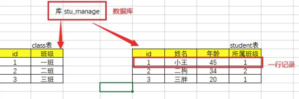

### Mysql介绍

- 数据库管理软件按照分类分为 **关系型数据库**和**非关系型数据库**
- 关系型数据库
  - 在数据库中各个表之间存在关联关系，需要设计表结构，一张表中每个字段之间也存在关系，通过SQL语句对数据库进行增删改查的操作。
  - 例如：MySQL、oracle 、sql server、sqllite，access，db2
  - 注意：sql语句通用
- 非关系型数据库
  - 非关系型数据库是key-value存储的，没有表结构，存取速度快
  - 例如：redis、mongodb
- Mysql：
  - MySQL是一个关系型数据库管理系统，由瑞典MySQL AB 公司开发，目前属于 Oracle 旗下公司。MySQL 最流行的关系型数据库管理系统，在 WEB 应用方面MySQL是最好的 RDBMS (Relational Database Management System，关系数据库管理系统) 应用软件之一。
  - MySQL被广泛的应用在Internet上的大中小型网站中。由于体积小、速度快、总体拥有成本低，开放源代码
  - 特点:开源,免费,应用广泛

### Mysql下载和安装

#### 下载

我们下载安装的是mysql管理软件，它相当于是一个服务端，每个建立好的连接的用户都可以访问，但是这里为了让自己自主学习，所以我们会把这个软件下载安装到每个人的自己电脑上，相当于在自己电脑上安装了mysql的服务端，这个软件他也自带一个客户端，我们可以通过cmd终端的形式进行访问，当然也可以通过可视化工具navicate来访问，接下来我们会一一讲解。

- mysql管理下载

  - 第一步：打开网址，https://www.mysql.com，点击downloads之后跳转到https://www.mysql.com/downloads
  - 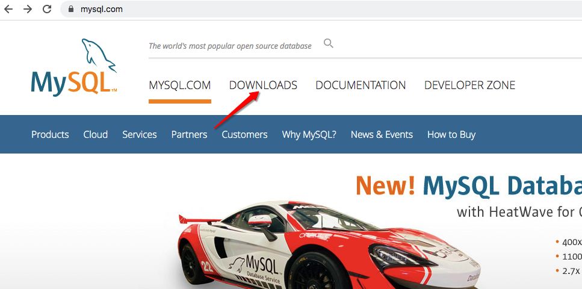
  - 第二步：选择Community选项
  - 
  - 第三步：选择对应的操作系统版本
  - 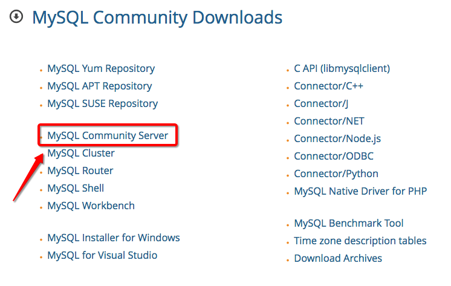

  - 第四步：选择具体版本的mysql，建议选择5.6或者5.7版本
  - 
  - 第五步：直接下载
  - 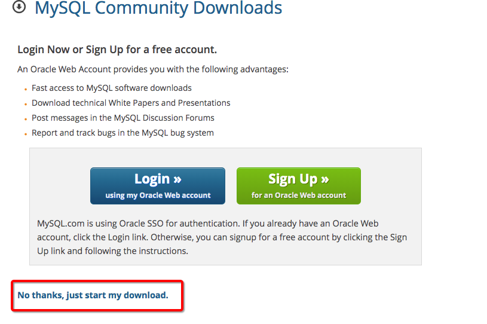

#### 解压

- 下载的zip文件解压，将解压之后的文件夹放到任意目录下，这个目录就是mysql的安装目录。
- 注意:安装目录尽量在某盘的根目录下,如果不在根目录,则安装路径中**不能有中文,不能有特殊转义符**的出现。

#### 配置环境变量

- 在系统变量PATH后面添加: 你的mysql的bin文件夹的路径（如C:\Program Files\mysql-5.6.41-winx64\bin）

#### 执行初始化

在任意路径下，以管理员的身份打开终端执行：

```bash
mysqld --initialize-insecure
```

初始化时将root用户的登录密码设置为空。

注意，如果报错：提示缺少MSVCP120.dll文件的话，后面有解决办法。

初始化成功如下图：


初始化成功的另一个标志是，在MySQL的安装目录中，会多个data目录，这个data目录是是MySQL在初始化过程中创建的数据目录。


#### 安装Mysql服务

- 1.以**管理员身份打开**cmd窗口，记住,一定要是管理员身份
- 2.输入如下指令：
  - mysqld install 
    - 回车运行

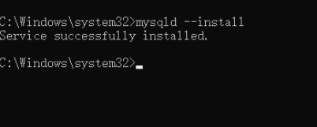

#### 启动Mysql服务

- 现在系统的服务中就可以找到MySQL了。
  


- 但此时MySQL服务还没有启动，你可以在服务中点击启动，也可以在终端中使用net命令来启动/关闭MySQL服务。

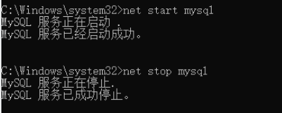

- ok，现在MySQL服务正常启动了，并且，由于系统服务中的MySQL服务设置的是自动，下次系统启动时，MySQL服务也默认启动了。
- 服务启动成功之后，就可以登录了
  - 输入mysql -u root -p（第一次登录没有密码，直接按回车过）
  - 但登录成功之后需要设置密码:
    - 语法: set password = password('密码') 为了方便记忆，密码尽量简单一点，但是实际工作中为了保证数据安全，密码尽量设置的复杂一些。


#### 可能发生问题处理

- 缺少MSVCP120.dll文件

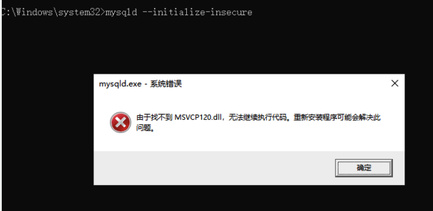

- 报错原因是，系统缺少Visual C ++可再发行组件包。

- 解决：

  - 打开microsoft官网：https://www.microsoft.com/en-us/download/details.aspx?id=40784，点击下载:
  - 
  - 根据系统位数选择下载：
  - 
  - 以管理员的身份运行，然后默认安装即可。
  - 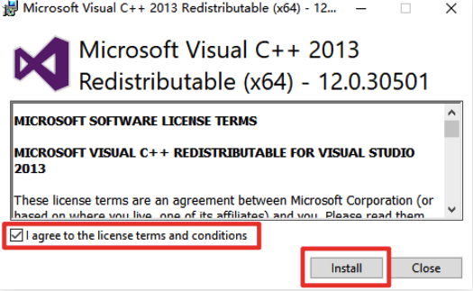
  - **重新以管理员身份打开终端**，重新执行初始化步骤吧！

  ```bash
  mysqld --initialize-insecure
  ```

  

  

### Navicate下载安装

- Navicate是一种操作数据库的可视化工具。
- 下载地址：https://www.navicat.com.cn/products
- 使用Navicate链接数据库：连接成功之后，你就可以通过该软件查看所有的数据库文件了
  - 


### Sql概述

- 先来看一个例子：小王第一次使用数据库，然后跟数据库来了个隔空对话

  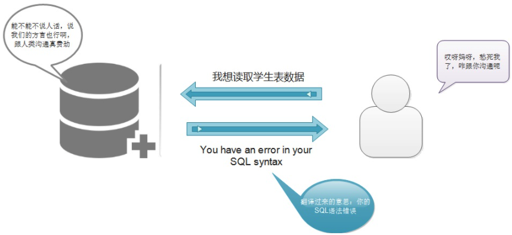

  - 其实，我们想一想，mysql是一个软件，它有它自己一套的管理规则，我们想要跟它打交道，就必须遵守它的规则，如果我想获取数据，它自己有一套规则，这个规则就是SQL。

- 什么是sql？

  - SQL : 结构化查询语言(Structured Query Language)简称SQL，是一种特殊目的的编程言，是一种数据库查询和程序设计语言，SQL语言主要用于存取数据、查询数据、更新数据和管理关系数据库系统,SQL语言由IBM开发。
  - 其实简单的说，就是你发送给他能识别的暗号，他懂了就会给你返回数据。
  - 注意：
    - 对于关系型数据库而言，SQL语句是通用的，学会了一种，其他只是一些细微的差别，毕竟人家数据库也是一个种族，语言是通用的，只不过有些存在方言的差别。

- sql的分类

  - SQL语言分为3种类型：

    1、DDL语句 数据库定义语言： 数据库、表、视图、索引、存储过程，例如CREATE DROP ALTER

    2、DML语句 数据库操纵语言： 插入数据INSERT、删除数据DELETE、更新数据UPDATE、查询数据SELECT

    3、DCL语句 数据库控制语言： 例如控制用户的访问权限GRANT、REVOKE


### 库表操作DDL

#### 库的增删改查

这里的库指的数据库，也就是我们所谓的那个文件夹，一般情况下，我们在开发项目前，会先设计数据库中相关表结构，一个项目中所有表都会放在同一个文件夹下，对于库的操作属于SQL分类中的DDL，也就是数据库定义语言。

- 创建数据库

- ```
   create database 仓库名;
  ```

- 创建数据库并制定编码:utf8设置好后，就表示数据库中可以存储中文数据

- ```
  create database 仓库名 charset utf8;
  ```
  
- 使用数据库

- ```
  use 仓库名;
  ```

- 查看所有数据库和单独常看当前数据库

- ```
  show databases;  #查看当前所有的数据仓库
  select database(); #查看当前使用的是哪一个数据仓库
  #注意：sql语句不区分大小写，但是sql中使用的标识符尽量控制大小写
  ```
  
- 修改数据库

  - 数据库的名称一旦创建好之后就无法修改
  - 修改数据库一般只修改编码

- ```
  alter database 仓库名 charset gbk #将数据的字符集编码修改成了gbk
  ```
  
- 删除数据库

- ```
  drop database 仓库名;
  ```

#### 表的增删改查

##### 创建表

- ```
  create table 表名(
    字段名1 类型(宽度) 约束条件,
    字段名2 类型(宽度) 约束条件,
    字段名3 类型(宽度) 约束条件,
  );
  注意:
  	1.字段名不能重复
  	2.宽度和约束条件可选
  	3.字段名和类型是必须的
  ```

##### 查看表结构

- ```
  desc 表名；
  ```

##### 数据类型

**字符串：**顾名思义，就是存储的一连串的字符，例如文字


​	

**数值型**：常用的有：int ，double， float


- 整数型：int 基本int能够处理日常工作中大部分整数存储问题

- 小数型：double float 

  - 强调一下float(5,2)其中5代表总长度，2代表小数长度,这个意思是整数是3位,小数是2位

- 日常工作中float足以解决小数问题了。

**日期类型**

- now()函数：返回当前系统时间

- date：年月日
- time：时分秒
- datetime：年月日时分秒

```
create table t(date1 date,date2 time,date3,datetime);
insert into t(now(),now(),now());
mysql> select * from t;
+------------+----------+---------------------+
| date1      | date2    | date3               |
+------------+----------+---------------------+
| 2020-04-15 | 16:02:43 | 2020-04-15 16:02:43 |
+------------+----------+---------------------+
1 row in set (0.00 sec)
```


**ENUM和SET类型**：

- 这里的类似于下拉字段，在进行数据插入的时候，必须选择事先设置的内容
- 对于set而言，可以多选，但是enum只能单选

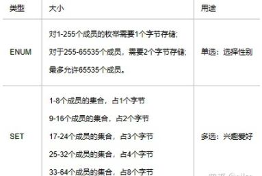

```
create table UserData (
	id int, #用户编号
	money float(9,2),#用户余额
	registTime datetime,#用户的注册时间
	usernmae varchar(50),
	sex enum('male','female'),#单选
	address set('BJ','SH','GZ')#多选
)
```

##### 约束条件

- 为了防止不符合规范的数据进入数据库，在用户对数据进行插入、修改、删除等操作时，DBMS自动按照一定的约束条件对数据进行监测，使不符合规范的数据不能进入数据库，以确保数据库中存储的数据正确、有效、相容。
- 约束条件与数据类型的宽度一样，都是可选参数，主要分为以下几种：
  - NOT NULL ：非空约束，指定某列不能为空； 
  - DEFAULT:默认值
  - UNIQUE : 唯一约束，指定某列或者几列组合不能重复
  - PRIMARY KEY ：主键，指定该列的值可以唯一地标识该列记录
  - FOREIGN KEY ：外键，指定该行记录从属于主表中的一条记录，主要用于参照完整性

- not null:不为空，当你设置一个字段时，不允许它为空，可以使用此约束条件

- ```
  create table t1 (
  	id int,
  	name varchar(20) not null#name字段的值不可以为空
  )
  ```
  
- default 默认值

  - 例如：对于性别一列，如果大部分都是男性，可以设置成默认值，不填则取默认值，填写了则覆盖默认值

- ```
  create table t2 (
  	id int,
  	name varchar(20),
  	sex char(10) DEFAULT('male')
  	
  )
  ```
  
- unique 唯一:当有一列字段你不想让它有重复值时，可以设置为唯一

```
create table t3 (
	id int unique, #唯一约束
	name varchar(20)
)
```

- 联合唯一：只有当你设置的这些字段同时重复时才会报错

```
create table t4 (
	id int, 
	name varchar(20),
	dep char(10),
	UNIQUE(name,dep) #联合唯一约束
)
```

- primary key

  - 主键为了保证表中的每一条数据的该字段都是表格中的唯一值。换言之，它是用来独一无二地确认一个表格中的每一行数据。

  - 主键可以包含一个字段或多个字段。当主键包含多个字段时，称为组合键 (Composite [Key](https://link.zhihu.com/?target=https%3A//www.baidu.com/s%3Fwd%3DKey%26tn%3DSE_PcZhidaonwhc_ngpagmjz%26rsv_dl%3Dgh_pc_zhidao)),也可以叫联合主键。

  - 单字段主键：

  - ```
    create table t5 (
    	id int PRIMARY KEY , #主键约束 
    	name varchar(20),
    	salary float(6,2)
    )
    ```
    
  - 联合主键:

  - ```
    create table t6 (
    	id int, #主键约束 
    	name varchar(20),
    	salary float(6,2),
    	PRIMARY KEY(id,name) #联合主键
    )
    ```

- auto_increment 自增字段:

  - 对于主键id而言，往往我们可以设置为自增字段，不用手动填写

  - ```
    create table t7 (
    	id int PRIMARY KEY auto_increment, #主键约束 
    	name varchar(20)
    )
    ```

- foreign key

  - 思考：

    - 假设我们要描述所有公司的员工，需要描述的属性有这些 ： 姓名,年龄，性别，部门，部门描述

    - 公司有3个部门，但是有1个亿的员工，那意味着部门和部门描述这两个字段需要重复存储，部门名字和部门描述内容越长，越浪费内存，如何处理呢？

      - 解决方法： 我们完全可以定义一个部门表然后让员工信息表关联该表，如何关联，即foreign key

      - 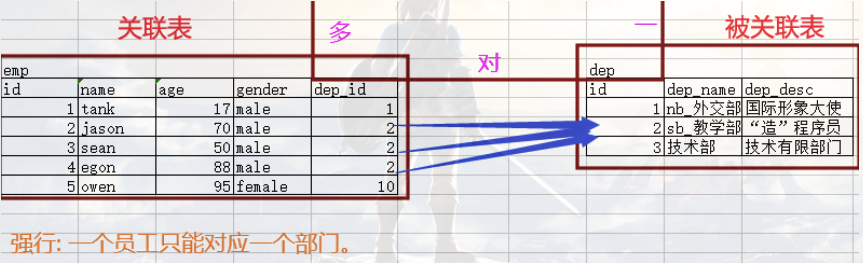

        - foreign key(当前表中建立关系的外键字段) references 被关联表名(id)

      - ```
        #创建两张表：
        #被关联表：dep：
        create table dep(
            id int primary key auto_increment,
            dep_name varchar(16),
            dep_desc varchar(255));
        
        #关联表：emp:	
        create table emp(
            id int primary key auto_increment,
            name varchar(6),
            age int,
            gender enum('male','female'),
            dep_id int not null,
            foreign key(dep_id) references dep(id));
        ```
    
  - 级联删除，级联更新
  
    - 两张表建立关联之后，如果部门表某个部门的砍掉了，那对应的人员表中的那些部门的人员相应的该怎么处理呢？可以保存，也可以随之一起删除.
  
      - 如果要保证两表一致，则需要在设置外键时添加on delete cascade
  
      - 如果部门id更新了，要一起更新的话，则添加on update cascade
  
      - ```
        #被关联表：dep：
        create table dep(
            id int primary key auto_increment,
            dep_name varchar(16),
            dep_desc varchar(255));
        
        #关联表：emp:	
        create table emp(
            id int primary key auto_increment,
            name varchar(6),
            age int,
            gender enum('male','female'),
            dep_id int not null,
            foreign key(dep_id) references dep(id) on delete cascade on update cascade
        )
        ```
  
  

##### 修改表

- 修改表名

- ```
  alter table 旧表名 rename 新表名
  ```

- 修改表字段的数据类型

- ```
  alter table 表名 modify 字段 新数据类型
  ```

- 修改表字段名

- ```
  alter table 表名 change 旧字段名 新字段名 新数据类型 
  ```

- 新增字段

- ```
  alter table 表名 add 新增字段名 数据类型 约束条件#约束条件可选
  ```
  
- 删除字段

- ```
  alter table 表名 drop 字段名
  ```

- 查看所有的表

- ```
  show tables
  ```

##### 删除表

```
drop table 表名
```


### 记录操作DML

#### 插入数据

- 插入完整的数据

- ```
  insert into 表名 (字段1，字段2) values ('字段1的值','字段2的值')
  
  create table new_dep(
  	id int PRIMARY KEY auto_increment,
  	dep_name varchar(10),
  	dep_desc varchar(100)
  );
  ```
  
  - ```sql
    #给指定字段插入数据
    insert into new_dep (dep_name,dep_desc) 
    values ('yanfabu','ssss');
    insert into new_dep (dep_name,dep_desc) 
    values ('销售部','ssss');
    
    ```
  
- 插入多条数据

- ```
  insert into 表名 values ('xx1','xx2'),(xx1,xx2) #插入几条数据就写几个括号
  ```
  
  

#### 更新数据

- 单独更新一个字段

- ```
  update 表名 set 字段名 = 字段值 where 条件
  ```

- 更新多个字段

- ```
  update 表名 set 字段1 = 字段值1,字段2 = 字段值2 where 条件
  ```

  

#### 删除数据

- 删除指定数据数据

- ```
  delete from 表名 where 条件
  ```

- 删除表中所有数据

- ```
  #不加where条件就是清空表,一定要慎重使用delete
  # 如果有自增id，新增的数据，仍然是以删除前的最后一样作为起始。
  delete from 表名
  
  # 数据量大，删除速度比上一条快，且直接从零开始
  truncate table t1;
  ```


#### 查询数据

##### 单表查询

- 准备数据

- ```sql
  #创建员工表，字段为：
  #id自增，员工名不能为空，性别只可以为male或者female且不能为空，默认值为male
  #age不能为空，默认值28，入职日期只显示年月日，职位名称，工资保留两位小数，办公室门牌号，部门id
  create table emp (
  	id int PRIMARY KEY auto_increment,
  	name char(20) not null,
  	gender enum('male','female') default 'male',
  	age int not null default 28,
  	hire_date date,
  	job_title varchar(30),
  	salary float(10,2),
  	office_num int,
  	dep_id int
  )
  	
  数据
  insert into emp (name,gender,age,hire_date,job_title,salary,office_num,dep_id)values
  ('weiwei','male',78,'20150302','teacher',1000000.31,401,1),
  ('lala','male',81,'20130305','teacher',8300,401,1),
  ('zhangsan','male',73,'20140701','teacher',3500,401,1),
  ('liulaogen','male',28,'20121101','teacher',2100,401,1),
  ('aal','female',18,'20110211','teacher',9000,401,1),
  ('zhugelang','male',18,'19000301','teacher',30000,401,1),
  ('成龙','male',48,'20101111','teacher',10000,401,1),
  ('歪歪','female',48,'20150311','sale',3000.13,402,2),#以下是销售部门
  ('丫丫','female',38,'20101101','sale',2000.35,402,2),
  ('丁丁','female',18,'20110312','sale',1000.37,402,2),
  ('星星','female',18,'20160513','sale',3000.29,402,2),
  ('格格','female',28,'20170127','sale',4000.33,402,2),
  ('张野','male',28,'20160311','operation',10000.13,403,3), #以下是运营部门
  ('程咬金','male',18,'19970312','operation',20000,403,3),
  ('程咬银','female',18,'20130311','operation',19000,403,3),
  ('程咬铜','male',18,'20150411','operation',18000,403,3),
  ('程咬铁','female',18,'20140512','operation',17000,403,3)
  ```
  
- 查询所有字段信息

- ```
  select * from 表名; #星华表示的是通配符，表示所有的字段
  ```

- 查询指定字段信息

- ```sql
  select 字段1，字段2 from 表名
  select name,salary from emp #查看所有员工的姓名和薪资的信息
  ```
  
- 通过四则运算查询

- ```sql
  #查看员工的姓名和其年薪
  select name,salary*12 from emp
  #as可以给列起一个别名，as关键字可以省略
  select name,salary*12 as year_salary from emp
  ```
  
- 为库表重命名

- ```sql
  select * from emp as e #e就是emp的别名
  ```
  
- 条件查询where语句

  - 单条件查询

  - ```sql
    #查询销售员工的姓名和薪资
    select name,salary from emp where job_title = 'sale'
  - 多条件查询1：结合and
  
  - ```sql
    #查询薪资大于1w的老师对应的名字和薪资
    select name,salary from emp where job_title = 'teacher' and salary > 10000 
  
  - 多条件查询2：结合or
  
  - ```sql
    #查询薪资为3，3.5，4，9k的员工名字和具体薪资
    select name,salary from emp where salary = 3000 or salary = 3500 or salary = 4000 or salary = 9000
  - 多条件查询3：结合between...and
  
  - ```sql
    #查询薪资范围在1000-5000之间的员工名字和具体信息
    select name,salary from emp where salary between 1000 and 5000
  
  - 多条件查询4:结合in
  
  - ```sql
    #查询薪资为3，3.5，4，9k的员工名字和具体薪资
    select name,salary from emp where salary in (3000,3500,4000,9000)
  - 多条件查询5:结合not in
  
  - ```sql
    select name,salary from emp where salary not in (3000,3500,4000,9000)
  
  - 模糊查询like
  
    - 通配符%:表示多个字符
  
      - ```sql
        select * from emp where name like 'a%'
        ```
  
    - 通配符_:表示一个字符
  
      - ```sql
        select * from emp where name like 'zhang___'
        ```
  
- 分组查询：group by

  - 简单的分组查询

    - 注意：使用group by的查询字段必须是分组字段(或者是其他字段的聚合形式)，否则会出错，想要获取其他字段信息,可以借助于聚合函数

  - ```sql
    select job_title from emp group by job_title
    ```

  - 分组聚合

  - ```sql
    #查看每一个岗位的人数
    #count()使用来做计数操作
    select job_title, count(id)from emp group by job_title
    
    #计算男女员工的平均年龄
    select gender,avg(age) from emp group by gender
    
    #计算不同岗位员工的平均薪资
    select job_title,avg(salary) from emp group by job_title
    
    #查看男女员工的最大,最小年级和整体年龄
    select gender,max(age),min(age),sum(age) from emp group by gender
    ```
    
  - having子句

    - where 与 having的区别：	

      - where 是针对分组之前的字段内容进行过滤,而having是针对分组后的

    - 注意：having后面的条件字段只可以是分组后结果中存在的字段名，否则会报错！

    - ```sql
      #查看销售岗位的平均薪资
      select job_title,avg(salary) from emp GROUP BY job_title having job_title = 'sale'
      ```

- 排序：order by

  - 升序： order by 字段 asc(默认升序,可以不写)

  - 降序： order by 字段 desc

  - 单列排序：

  - ```sql
    select * from emp order by salary
    ```

  - 多列排序：越前面的列优先级越高

  - ```sql
    select * from emp order by salary desc
    ```

- limit

  - 显示前三条数据

  - ```sql
    select * from emp limit 3
    ```

  - 从0开始,先查出第一条,然后包含这条再往后查5条

  - ```sql
    select * from emp limit 0,5
    ```

  - 从第3开始,即先查出第4条,然后包含这条再往后查7条

  - ```sql
    select * from emp limit 3,7
    ```

- 使用正则：regexp

- ```sql
  # ^ 以什么开头
  select id,name,job_title from emp where name regexp "^a";
  # $ 以什么结尾
  select id,name,job_title from emp where name regexp "san$";
  # 匹配指定字符内容
  select id,name,job_title from emp where name regexp "i{1}";
  ```


##### 多表查询

思考：没有主外键关联，是否可以使得两张表产生关联关系？

根据指定条件将两张表中的数据进行合并，然后在合并后的结果表中进行数据的查询

- 准备数据

- ```sql
  create table dep(
  	id int primary key,
  	name char(20)
  );
  create table emp(
  	id int primary key auto_increment,
  	name char(20),
  	sex enum("male","female") not null default "male",
  	age int,
  	dep_id int
  );
  
  # 插入数据
  insert into dep values
  (200,'技术'),
  (201,'人力资源'),
  (202,'销售'),
  (203,'运营');
  
  insert into emp(name,sex,age,dep_id) values
  ('ailsa','male',18,200),
  ('lala','female',48,201),
  ('huahua','male',38,201),
  ('zhangsan','female',28,202),
  ('zhaosi','male',18,200),
  ('shenteng','female',18,204)
  ;
  ```

- 内连接:

  - 两张表公共的部分,必须同时有,没有就不显示

- ```
  #语法；select * from 表1 inner join 表2 on 合并条件
  select * from emp inner join dep on emp.dep_id = dep.id
  ```
  
- 外连接之左连接

  - 外连接之左连接
    - 以左表为主表,根据左表数据匹配右表,左表数据是全的,而右表若匹配不上则为null

- ```
  select * from emp left join dep on emp.dep_id = dep.id
  ```
  
- 外连接之右连接

  - 以右表为主表,根据右表数据匹配左表,右表数据是全的,而左表若匹配不上则为null

- ```
  select * from emp right join dep on emp.dep_id = dep.id
  ```

- 符合条件的多表联查

- ```sql
  #示例1：找出年龄大于25岁的员工名字以及员工所在的部门名称
  select d.name,e.name from emp as e inner join dep as d on e.dep_id = d.id where age > 25
  
  #示例2：找出年龄大于25岁的员工名字以及员工所在的部门名称，并且以age字段的升序方式显示
  select * from emp as e inner join dep as d on d.id = e.dep_id where age > 25 order by age
  ```
  
- 子查询:子查询是将一个查询语句嵌套在另一个查询语句中

  - 带in关键字的子查询

    - 查询平均年龄在25岁以上的部门名

  - ```sql
    #下述sql返回的就是201和202
    select dep_id from emp group by dep_id having avg(age) > 25
    
    
    #整合后的子查询语句 select name from dep where id in (200,201)
    select name from dep where id in 
    (
    	select dep_id from emp group by dep_id having avg(age) > 25
    )
    ```
    
    - 查看技术部员工姓名
    
  - ```sql
    #获取部门编号200
    select id from dep where name = '技术'
    
    #子查询 select name from emp where dep_id in (200)
    select name from emp where dep_id in (
    	select id from dep where name = '技术'
    )
    ```
    
    
    
  - 带比较运算符的子查询(比较运算符: =、!=、>、>=、<、<=、<>)
  
    - 查询大于所有人平均年龄的员工名字与年龄
  
    - ```sql
      select id,name from emp where age > xx #xx就是所有员工的平均年龄
      #如何获取所有员工的平均年龄
      select avg(age) from emp
      
      #整合后的子查询
      select id,name from emp where age > (select avg(age) from emp)
      ```
  
  

#### 综合练习


- 准备数据

- ```sql
  create table class (
  	cid int PRIMARY KEY,
  	caption varchar(32) not null
  )
  INSERT INTO class VALUES
  (1, '三年二班'), 
  (2, '三年三班'), 
  (3, '一年二班'), 
  (4, '二年九班');
  
  CREATE TABLE teacher(
    tid int PRIMARY KEY,
    tname varchar(32) NOT NULL
  )
  INSERT INTO teacher VALUES
  (1, '张磊老师'), 
  (2, '李平老师'), 
  (3, '刘海燕老师'), 
  (4, '朱云海老师'), 
  (5, '李杰老师');
  
  CREATE TABLE course(
    cid int PRIMARY KEY AUTO_INCREMENT,
    cname varchar(32) NOT NULL,
    teacher_id int NOT NULL,
    FOREIGN KEY (teacher_id) REFERENCES teacher (tid)
  )
  INSERT INTO course VALUES
  (1, '生物', 1), 
  (2, '物理', 2), 
  (3, '体育', 3), 
  (4, '美术', 2);
  
  CREATE TABLE student(
    sid int(11) PRIMARY KEY AUTO_INCREMENT,
    gender char(1) NOT NULL,
    class_id int(11) NOT NULL,
    sname varchar(32) NOT NULL,
    FOREIGN KEY (class_id) REFERENCES class (cid)
  ) 
  INSERT INTO student VALUES
  (1, '男', 1, '理解'), 
  (2, '女', 1, '钢蛋'), 
  (3, '男', 1, '张三'), 
  (4, '男', 1, '张一'), 
  (5, '女', 1, '张二'), 
  (6, '男', 1, '张四'), 
  (7, '女', 2, '铁锤'), 
  (8, '男', 2, '李三'), 
  (9, '男', 2, '李一'), 
  (10, '女', 2, '李二'), 
  (11, '男', 2, '李四'), 
  (12, '女', 3, '如花'), 
  (13, '男', 3, '刘三'), 
  (14, '男', 3, '刘一'), 
  (15, '女', 3, '刘二'), 
  (16, '男', 3, '刘四');
  CREATE TABLE score (
    sid int PRIMARY KEY AUTO_INCREMENT,
    student_id int NOT NULL,
    course_id int NOT NULL,
    num int NOT NULL,
    FOREIGN KEY (course_id) REFERENCES course (cid),
    FOREIGN KEY (student_id) REFERENCES student(sid)
  ) 
  INSERT INTO score VALUES
  (1, 1, 1, 10),
  (2, 1, 2, 9),
  (5, 1, 4, 66),
  (6, 2, 1, 8),
  (8, 2, 3, 68),
  (9, 2, 4, 99),
  (10, 3, 1, 77),
  (11, 3, 2, 66),
  (12, 3, 3, 87),
  (13, 3, 4, 99),
  (14, 4, 1, 79),
  (15, 4, 2, 11),
  (16, 4, 3, 67),
  (17, 4, 4, 100),
  (18, 5, 1, 79),
  (19, 5, 2, 11),
  (20, 5, 3, 67),
  (21, 5, 4, 100),
  (22, 6, 1, 9),
  (23, 6, 2, 100),
  (24, 6, 3, 67),
  (25, 6, 4, 100),
  (26, 7, 1, 9),
  (27, 7, 2, 100),
  (28, 7, 3, 67),
  (29, 7, 4, 88),
  (30, 8, 1, 9),
  (31, 8, 2, 100),
  (32, 8, 3, 67),
  (33, 8, 4, 88),
  (34, 9, 1, 91),
  (35, 9, 2, 88),
  (36, 9, 3, 67),
  (37, 9, 4, 22),
  (38, 10, 1, 90),
  (39, 10, 2, 77),
  (40, 10, 3, 43),
  (41, 10, 4, 87),
  (42, 11, 1, 90),
  (43, 11, 2, 77),
  (44, 11, 3, 43),
  (45, 11, 4, 87),
  (46, 12, 1, 90),
  (47, 12, 2, 77),
  (48, 12, 3, 43),
  (49, 12, 4, 87),
  (52, 13, 3, 87);
  ```
  
- 题目

- ```
  1、查询所有的课程的名称以及对应的任课老师姓名
  select c.cname,t.tname from course as c inner join teacher as t ON
  	c.teacher_id = t.tid
  
  2、查询学生表中男女生各有多少人
  select gender,count(sid) from student GROUP BY gender 
  
  3、查询物理成绩等于100的学生的姓名
  select t.sname,c.cname,s.num from student as t inner join score as s ON t.sid = s.student_id inner join course as c ON c.cid = s.course_id where c.cname = '物理' and s.num = 100
  		
  4、查询平均成绩大于八十分的同学的姓名和平均成绩
  #查询平均成绩大于八十分的同学的姓名和平均成绩
  #涉及到的字段：成绩，学生名字
  #注意：分组条件为一张表的主键ID，则查询字段可以是该表中的任意字段
  select t.sid,avg(num),t.sname from student as t inner join score as s on s.student_id = t.sid
  GROUP BY t.sid having avg(s.num) > 80
  
  5、查询所有学生的姓名，选课数，总成绩
  select t.sname,count(course_id) as 科目数,sum(s.num) as 总成绩 from student as t inner join score as s on t.sid = s.student_id
  GROUP BY t.sid 
  
  6、 查询姓李老师的个数
  select count(tid) from teacher where tname like '李%'
  
  7、 查询没有报李平老师课的学生姓名
  #select sname from student where sname not in (报李平老师学生的名字)
  
  #报李平老师学生的名字
  #select t1.sname from student as t1 inner join score as s on t1.sid = s.student_id inner join course as c on c.cid = s.course_id inner join teacher as t ON t.tid = c.teacher_id  where t.tname = '李平老师'
  
  #整合的完成操作
  select sname from student where sname not in (select t1.sname from student as t1 inner join score as s on t1.sid = s.student_id
  inner join course as c on c.cid = s.course_id inner join teacher as t ON
  t.tid = c.teacher_id  where t.tname = '李平老师')
  
  8、 查询物理课程比生物课程高的学生的学号
  #1.求出每个学生的物理分数
  select s.student_id,s.num from score as s inner join course as c on s.course_id = c.cid
  where c.cname = '物理'
  #2.求出每个学生的生物分数
  select s.student_id,s.num from score as s inner join course as c on s.course_id = c.cid
  where c.cname = '生物'
  #假设t1就是上面物理对应的表，t2就是上面生物对应的表
  select * from t1 inner join t2 on t1.student_id = t2.student_id 
  where t1.num > t2.num
  #最终的整合
  select t2.student_id from (select s.student_id,s.num from score as s inner join course as c on s.course_id = c.cid
  where c.cname = '物理') as t1 inner join (select s.student_id,s.num from score as s inner join course as c on s.course_id = c.cid
  where c.cname = '生物') as t2 on t1.student_id = t2.student_id 
  where t1.num > t2.num
  
  9、 查询只选修了物理课程或体育课程的学生姓名
  #限制只能要求学生报物理或者报体育其中的一门，不能同时报这两门
  select t.sid,t.sname from student as t inner join score as s on t.sid = s.student_id
  inner join course as c on c.cid = s.course_id
  where c.cname = '物理' or c.cname = '体育'
  GROUP BY t.sid having count(c.cid) < 2
  
  10、查询挂科超过两门(包括两门)的学生姓名和班级id
  select s.sname,count(s1.sid) 个数 from student s
  join score s1 on s.sid = s1.student_id
  where num < 60 group by sname having count(s1.sid)>=2;
  
  11、查询选修了所有课程的学生姓名
  #查询选修了所有课程的学生姓名
  select t.sname from student as t inner join score as s on t.sid = s.student_id
  GROUP BY t.sid having count(s.course_id) = 所有科目的数量
  #查询所有科目的数量
  select count(cid) from course
  #整合
  select t.sname from student as t inner join score as s on t.sid = s.student_id
  GROUP BY t.sid having count(s.course_id) = (select count(cid) from course
  )
  12、查询李平老师教的课程的所有学生（id）的成绩记录
  select s.student_id,c.cname,s.num from score s
  left join course c on s.course_id = c.cid
  left join teacher t on t.tid = c.teacher_id
  where t.tname = "李平老师";
  
  
  13、查询全部学生都选修了的课程号和课程名
  select c.cid,c.cname from score as s inner join course as c ON
  s.course_id = c.cid GROUP BY c.cid 
  having count(course_id) = (select count(sid) from student)
  
  14、查询每门课程被选修的次数
  select c.cname,count(c.cid) from score as s inner join course as c ON
  s.course_id = c.cid GROUP BY c.cid 
  
  
  15、查询只选修了一门课程的学生姓名和学号
  select t.sname,t.sid from student as t inner join score as s on
  t.sid = s.student_id GROUP BY student_id HAVING
  count(s.course_id) = 1
  
  16、查询所有学生考出的成绩并按从高到低排序（成绩去重）
  #查询所有学生考出的成绩并按从高到低排序（成绩去重）
  #DISTINCT对某一个查询字段去重
  select DISTINCT num from score ORDER BY num desc
  
  17、查询平均成绩大于85的学生姓名和平均成绩
  select t.sname,avg(num) from student as t inner join score as s on 
  t.sid = s.student_id group by t.sid having avg(num) > 85
  
  18、查询生物成绩不及格的学生姓名和对应生物分数
  select t.sname,num from student as t inner join score as s on t.sid = s.student_id inner join course as c on c.cid = s.course_id where cname = '生物' and num < 60
  19、查询在所有选修了李平老师课程的学生中，这些课程(李平老师的课程，不是所有课程)平均成绩最高的学生姓名
  select t1.sname,avg(num) from student as t1 inner join score as s on t1.sid = s.student_id inner join course as c on c.cid = s.course_id inner join teacher as t on t.tid = c.teacher_id where t.tname = '李平老师' group by t1.sid order by avg(num) desc limit 1
  
  ```
  
  


