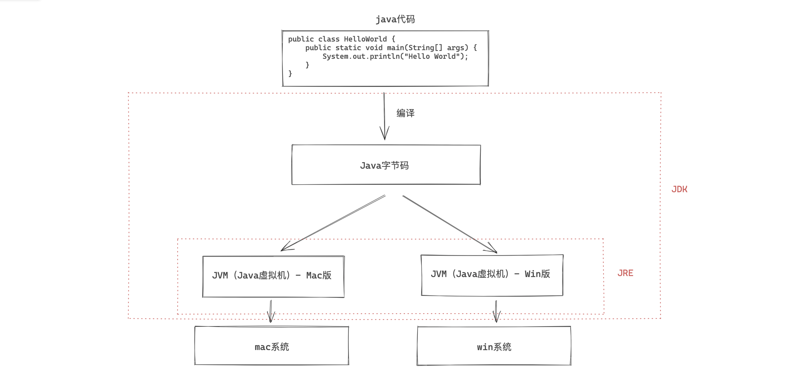
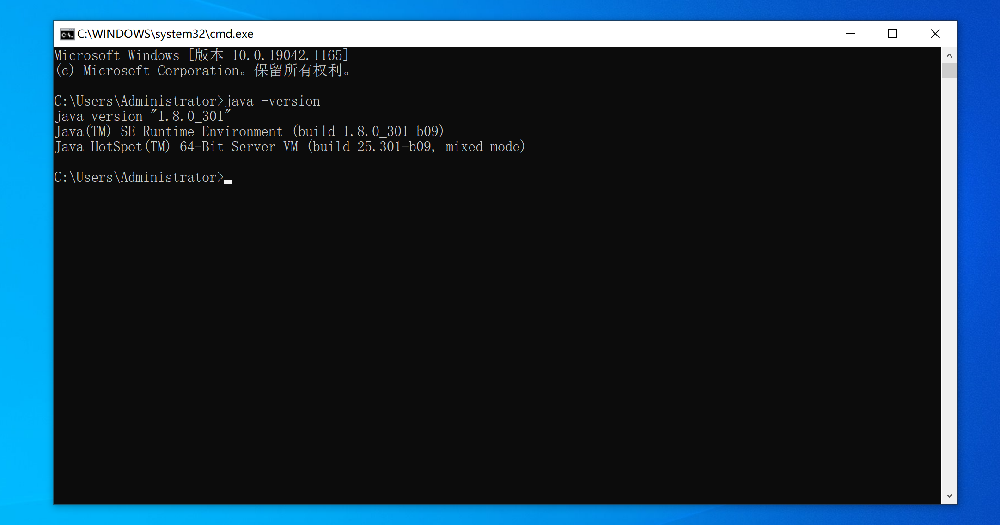
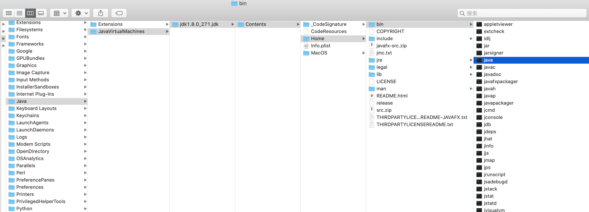
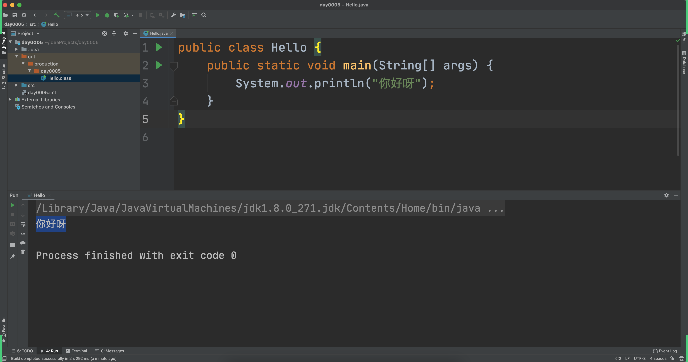
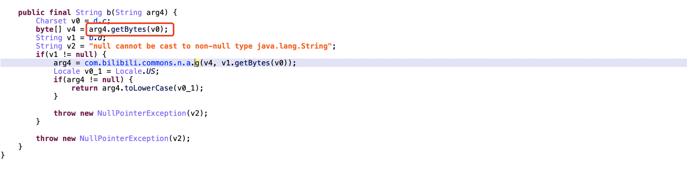
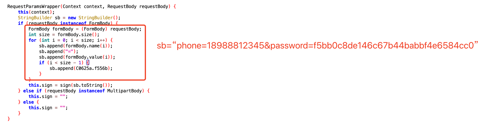
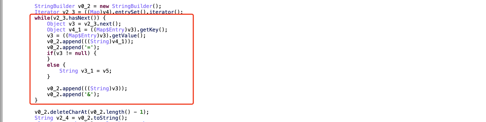
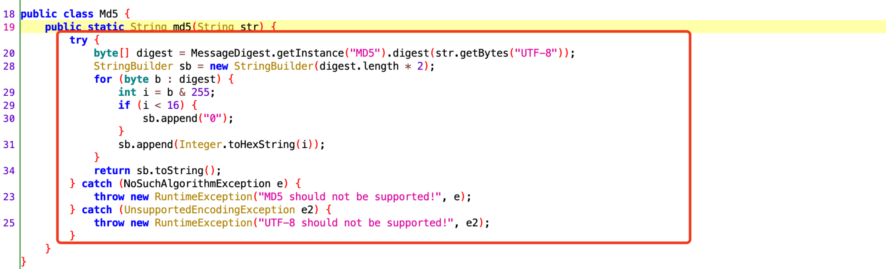

# day06 Java基础

今日概要：

- 环境搭建
- 基础语法
- 数据类型


## 1.环境搭建

- Python，解释型编程语言。

  ```python
  # xx.py
  
  print("2期")
  print("爬虫逆向开发")
  
  v1 = int("全栈开发")
  
  print("结束")
  ```

  ```
  >>>python xx.py
  ```

- Java，编译型&解释型语言。

  ```java
  // Hello.java
  
  String name = "武沛齐";
  System.out.println(name);
  ```

  在执行代码时，需要对代码先进行编译。

  ```
  >>>javac Hello.java
  ```

  编译完成之后，你会得到一个文件 `Hello.class`，去运行代码。

  ```
  >>>java Hello
  ```




- **JRE**，（ Java Runtime Envrionment ），Java 运行时环境。

  ```
  含JVM和运行必备的类库。
  
  电脑上想要运行java程序，就必须安装JRE。
  ```

- **JDK**，（ Java Development Kit ），Java开发工具。【包含JRE】【Java开发】

  ```
  含JRE 和 开发必备的工具。
  工具包含：编译工具javac.exe 和 运行工具java.exe
  想要开发Java应用程序，就必须安装JDK。
  ```

  


接下来，我们就来下载和安装吧。

```
JDK8（jdk 1.8）版本（目前最新已到17）

官方地址：https://www.oracle.com/java/technologies/downloads/#java8
百度云盘：...
```


安装好之后需要配置下环境变量。





关于mac系统，自带JDK：


```
/Library/Java/JavaVirtualMachines 
```




编写代码+编译+运行：

- 编写Java代码：Hello.java

  ```java
  public class Hello {
      public static void main(String[] args) {
          System.out.println("Hello World");
      }
  }
  ```

- 打开终端去运行命令

  ```
  >>>javac Hello.java
  >>>java Hello
  ```


## 2.Inteliji

编写Java代码时建议大家使用IDE（集成开发环境）来提供开发效率。

- 下载，建议【2020.1.1版本】

  ```
  https://www.jetbrains.com/idea/download/other.html
  ```

- 激活

  ```
  视频：https://www.zhihu.com/zvideo/1254435808801050624
  激活包：在网盘共享目录，其他共享资料包文件夹【jetbrains-agent-latest.zip】
  ```





## 3.Java基础语法

初步代码的分析：`Hello.java`

```java
public class Hello {
    public static void main(String[] args) {
        System.out.println("你好呀");
    }
}
```

- 主函数 & 程序的入口。

  ```python
  def func():
      pass
  
  if __name__ == "__main__":
  	func()
  ```

- 文件名

  ```
  一个文件中最多只能有一个public类 且 文件名必须和public类名一致。
  如果文件中有多个类，文件名与public类名一致。
  如果文件中有多个类 且 无public类，文件名可以是任意类名。
  ```

- 类名

  ```
  首字母大写且驼峰式命名，例如：Hello、UserInfo、PersonApplication
  ```

- 类修饰符：public、（不写）default

- 类中成员修饰符：public、private、protected、default

- 静态成员，无序实例化就可以指定调用。

  ```java
  class Person{
      public static void f1(){
          // 静态方法
          System.out.println("我是F1函数");
      }
  }
  
  public class Hello {
      public static void main(String[] args) {
          Person.f1();
      }
  }
  ```

  ```java
  class Person {
      public void f2() {
          // 实例方法
          System.out.println("我是F1函数");
      }
  }
  
  public class Hello {
      public static void main(String[] args) {
          // 实例化对象  obj = Person();
          Person obj = new Person();
  
          // 对象调用f2
          obj.f2();
      }
  }
  ```

- void表示方法没有返回值


### 3.1 注释

```java
/**
 * 对这个类进行注释
 */
public class Hello {

    /**
     * 这个方法是干嘛....
     * @param v1 大小
     * @param v2 尺寸
     * @return 返回一个xxx
     */
    public static String getSign(int v1, String v2) {
        return "哈哈哈";
    }

    public static void main(String[] args) {
        // 单行注释
        // int age = 18;

        /* 多行注释
        String name = "武沛齐";
        int size = 18;
         */
    }
}
```

注意：JavaScript


### 3.2 变量和常量

```java
public class Hello {

    public static void main(String[] args) {
        String name = "武沛齐";
        name = "alex";

        int age = 19;
        age = 20;

        final int size = 18;
    }
}
```

```python
v1 = [111,22]
v2 = 345
```


### 3.3 输入和输出

```java
import java.util.Scanner;

public class Hello {

    public static void main(String[] args) {
        // 输入
        Scanner input = new Scanner(System.in);
        String text = input.nextLine();

        // 输出
        System.out.println(text);
        // System.out.print(text);
    }
}
```


```java
import java.util.Scanner;

public class Hello {

    public static void main(String[] args) {
        // 输出
        System.out.print("请输入：");

        // 输入
        Scanner input = new Scanner(System.in);
        String text = input.nextLine();

        // 输出
        System.out.println(text);
    }
}
```


### 3.4 条件语句

```java
import java.util.Scanner;

public class Hello {

    public static void main(String[] args) {
        int age = 19;

        if (age < 18) {
            System.out.println("少年");
        } else if (age < 40) {
            System.out.println("大叔");
        } else {
            System.out.println("老汉");
        }

    }
}
```

```java
public class Hello {

    public static void main(String[] args) {
        int score = 19;

        switch (score) {
            case 10:
                System.out.println("xxx");
                System.out.println("xxx");
                System.out.println("xxx");
                break;
            case 20:
                System.out.println("xxx");
                System.out.println("xxx");
                System.out.println("xxx");
                break;
            default:
                System.out.println("xxx");
                break;
        }

    }
}
```


### 3.5 循环语句

while循环

```java
public class Hello {

    public static void main(String[] args) {
        int count = 0;
        while (count < 3) {
            System.out.println("执行中...");
            count += 1;
        }

    }
}
```


do while循环（至少执行1次）

```java
public class Hello {
    public static void main(String[] args) {
        int count = 0;
        do {
            System.out.println("执行中...");
            count += 1;
        } while (count < 3);
    }
}
```


for循环

```java
public class Hello {

    public static void main(String[] args) {
        for (int i = 0; i < 10; i++) {
            System.out.println("哈哈哈");
        }
    }
}
```

```java
public class Hello {

    public static void main(String[] args) {

        String[] nameList = {"修仙", "肖峰", "麻子", "十分"};
        // nameList.length   4
        // nameList[0]

        for (int idx = 0; idx < nameList.length; idx++) {
            String ele = nameList[idx];
            System.out.println(ele);
        }
    }
}
```

注意：也支持break/continue。


## 4.数据类型


### 4.1 整数类型

- byte，字节		  【1字节】表示范围：-128 ~ 127 即：`-2^7 ~ 2^7 -1  `  
- short，短整型    【2字节】表示范围：-32768 ~ 32767
- int，整型             【4字节】表示范围：-2147483648 ~ 2147483647
- long，长整型      【8字节】表示范围：-9223372036854775808 ~ 9223372036854775807

```java
public class Hello {

    public static void main(String[] args) {
        byte v1 = 32;
        short v2 = 10000;
        int v3 = 22221331;
        long v4 = 554534353424L;
    }
}
```


**提醒：**逆向时有一些字符串是通过字节数组来表示。

```
v1 = "武沛齐"
v2 = [230, 173, 166, 230, 178, 155, 233, 189, 144]
```

```java
import java.util.Arrays;

public class Hello {

    public static void main(String[] args) {
        // 1.字节数组（转换为字符串） [字节,字节,字节]
        byte[] dataList = {97, 105, 100, 61, 50, 52, 54, 51, 56, 55, 53, 55, 49, 38, 97, 117, 116, 111, 95, 112, 108, 97, 121, 61, 48, 38, 99, 105, 100, 61, 50, 56, 57, 48, 48, 56, 52, 52, 49, 38, 100, 105, 100, 61, 75, 82, 69, 104, 69, 83, 77, 85, 74, 104, 56, 116, 70, 67, 69, 86, 97, 82, 86, 112, 69, 50, 116, 97, 80, 81, 107, 55, 87, 67, 104, 67, 74, 103, 38, 101, 112, 105, 100, 61, 48, 38, 102, 116, 105, 109, 101, 61, 49, 54, 50, 55, 49, 48, 48, 57, 51, 55, 38, 108, 118, 61, 48, 38, 109, 105, 100, 61, 48, 38, 112, 97, 114, 116, 61, 49, 38, 115, 105, 100, 61, 48, 38, 115, 116, 105, 109, 101, 61, 49, 54, 50, 55, 49, 48, 52, 51, 55, 50, 38, 115, 117, 98, 95, 116, 121, 112, 101, 61, 48, 38, 116, 121, 112, 101, 61, 51};

        String dataString = new String(dataList);
        System.out.println("字符串是：" + dataString);

        // 2.字符串->字节数组
        try {
            String name = "武沛齐";
            byte[] v1 = name.getBytes("GBK");
            System.out.println(Arrays.toString(v1)); // [-50, -28, -59, -26, -58, -21]
            byte[] v2 = name.getBytes("UTF-8");
            System.out.println(Arrays.toString(v2)); // [-26, -83, -90, -26, -78, -101, -23, -67, -112]
        } catch (Exception e) {

        }
    }
}

```




需求来了：某个app逆向，在Java代码中得到一个字节数组 `[-50,-28,-59,-26,-58,-21]`，请通过Python代码将这个字节数组转换成字符串？

> - 在Java中的字节范围：-128~127；Python中字节的范围：0~255。
>
>   ```
>   byte_list = [-50,-28,-59,-26,-58,-21]
>   ```
>
> - 让数字转化弄成字节并拼接起来 bytearray

```python
# Python脚本，方便你们以后使用。
byte_list = [-50, -28, -59, -26, -58, -21]

bs = bytearray()  # python字节数组
for item in byte_list:
    if item < 0:
        item = item + 256
    bs.append(item)

str_data = bs.decode('gbk')  # data = bytes(bs)
print(str_data)
```


### 4.2 字符

```java
char v1 = 'x';
char v2 = '武';

String = "武沛齐";
```

注意：字符串是由多个字符串组成。


### 4.3 字符串

定义字符串

```java
import java.io.UnsupportedEncodingException;

public class Hello {

    public static void main(String[] args) throws UnsupportedEncodingException {
        String v1 = "武沛齐";
        String v2 = new String("武沛齐");


        String v4 = new String(new byte[]{-26, -83, -90, -26, -78, -101, -23, -67, -112});
        String v5 = new String(new byte[]{-50, -28, -59, -26, -58, -21}, "GBK");

        String v6 = new String(new char[]{'武', '沛', '齐'});
    }
}
```


字符串中的方法：

```java
public class Hello {

    public static void main(String[] args) {
        String origin = "alex是个大DB";

        char v1 = origin.charAt(5); // 指定字符
        int len = origin.length();  // 长度
        for (int i = 0; i < len; i++) {
            char item = origin.charAt(i);
        }

        String v2 = origin.trim(); // 去除空白
        String v3 = origin.toLowerCase(); // 小写
        String v4 = origin.toUpperCase(); // 大写
        String[] v5 = origin.split("是"); // 分割
        String v6 = origin.replace("D", "S"); // 替换
        String v7 = origin.substring(2, 6);  // 子字符串=切片

        boolean v8 = origin.equals("alex是个大SB");

        boolean v9 = origin.contains("el");

        boolean v10 = origin.startsWith("a");

        String v11 = origin.concat("哈哈哈");
    }
}
```


字符串拼接

```java
import java.io.UnsupportedEncodingException;

public class Hello {

    public static void main(String[] args) {
        // "name=alex&age=18"
        StringBuilder sb = new StringBuilder();  // StringBuffer线程安全
        sb.append("name");
        sb.append("=");
        sb.append("alex");
        sb.append("&");
        sb.append("age");
        sb.append("=");
        sb.append("18");
        String dataString = sb.toString();
        System.out.println(dataString);
    }
}
```

```python
data = []
data.append("name")
data.append("=")
data.append("18")
data_string = "".join(data)
```










### 4.4 数组

```java
import java.util.Arrays;

public class Hello {

    public static void main(String[] args) {
        // [123,1,999]
        int[] numArray = new int[3];
        numArray[0] = 123;
        numArray[1] = 1;
        numArray[2] = 99;
        System.out.println(Arrays.toString(numArray));

        String[] names = new String[]{"武沛齐", "alex", "eric"};
        System.out.println(Arrays.toString(names));

        String[] nameArray = {"武沛齐", "alex", "eric"};
        System.out.println(Arrays.toString(nameArray));

        // nameArray[0]
        // nameArray.length
        for (int idx = 0; idx < nameArray.length; idx++) {
            String item = nameArray[idx];
        }

    }
}
```

注意：数组一旦创建个数就不可调整。


### 4.5 关于Object

> - 在Python中每个类都默认继承Object类（所有的类都是Object的子类）。
>
> - 在Java所有的类都是默认继承Object类。
>
>   ```
>   int v1 = 123;
>   String name = "武沛齐";
>   ```
>
>   用基类可以泛指他的子类的类型。


```java
import sun.lwawt.macosx.CSystemTray;

import java.util.Arrays;

public class Hello {

    public static void main(String[] args) {
        // String v1 = "wupeiqi";
        Object v1 = new String("wupeiqi");
        System.out.println(v1);
        System.out.println(v1.getClass());

        Object v2 = 123;
        System.out.println(v2);
        System.out.println(v2.getClass());
    }
}
```


```java
import sun.lwawt.macosx.CSystemTray;

import java.util.Arrays;

public class Hello {

    public static void main(String[] args) {
        // 声明数组，数组中元素必须int类型;
        int[] v1 = new int[3];

        // 声明数组，数组中元素必须String类型;
        String[] v2 = new String[3];

        // 声明数组，数组中可以是必须int/String类型;
        Object[] v3 = new Object[3];
        v3[0] = 123;
        v3[1] = "wupeiqi";

    }
}
```

所以，如果以后想要声明的数组中想要是混合类型，就可以用Object来实现。


```java
import java.util.Arrays;

public class Hello {

    public static void main(String[] args) {
        // v1是指上字符串对象；String
        String v1 = new String("wupeiqi");
        String res = v1.toUpperCase();
        System.out.println(res);

        // v2本质是字符串对象；Object
        Object v2 = new String("wupeiqi");
        String data = (String)v2;
    }
}
```


```java
import java.util.Arrays;

public class Hello {

    public static void func(Object v1) {
        // System.out.println(v1);
        // System.out.println(v1.getClass());
        if (v1 instanceof Integer) {
            System.out.println("整型");
        } else if (v1 instanceof String) {
            System.out.println("字符串类型");
        } else {
            System.out.println("未知类型");
        }
    }

    public static void main(String[] args) {
        func(123);

        func("123");
    }
}
```


- Java中所有的类都继承Object，Object代指所有的类型。
- 自己创建关系
  


## 总结

剩下的知识点：

- List系列，相当于Python的列表。
- Map系列，相当于Python的字典。
- 面向对象 和 包
- 常见的算法


