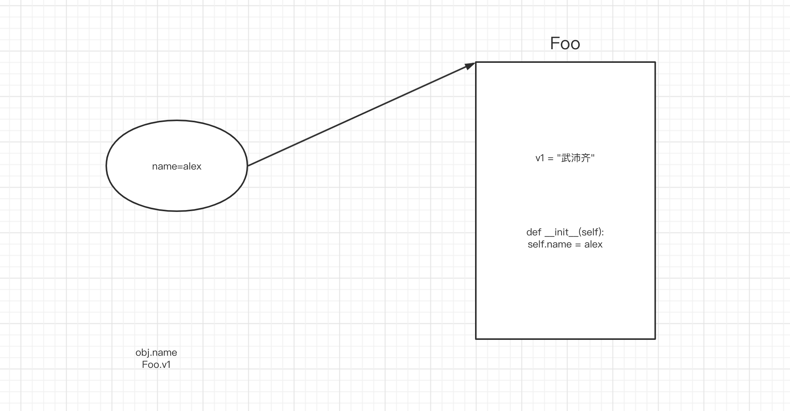

# day07 Java基础

今日概要：

- 内容回顾
- Java常见的数据类型：
  - 已讲过：整数、字符串、字符、数组
  - 未讲：List系列、Set系列、Map系列
- 面向对象相关：类、对象、继承、接口、抽象。
- 包
- 常见的逆向算法（逆向案例）


## 1.常见数据类型


### 1.1 List系列

List是一个接口，接口下面有两个常见的类型（目的是可以存放动态的多个数据）

- ArrayList，连续的内存地址的存储（内部自动扩容）。
- LinkedList，底层基于链表实现（自行车链条）。

```java
ArrayList v1 = new ArrayList();
v1.add("武沛齐");
v1.add("麻子");
```

```java
LinkedList v1 = new LinkedList();
v1.add("武沛齐");
v1.add("麻子");
```


Java中接口，是用来约束实现他的类，约束他里面的成员必须有xx。

```java
interface List{
    public void add(Object data);   // 接口中的方法，不写具体的实现，只用于约束。
}

// 类ArrayList实现了接口List，此时这个类就必须有一个add方法。
class ArrayList implements List{
    public void add(Object data){
     	// 将数据data按照连续存储的方法放在内存。
        // ..
    }
}

// 类LinkedList实现了接口List，此时这个类就必须有一个add方法。
class LinkedList implements List{
    public void add(Object data){
     	// 将数据data按照链表的形式存储
        // ..
    }
}
```

```java
List v1 = new ArrayList();
v1.add("武沛齐");
v1.add("麻子");
```

```java
List v1 = new LinkedList();
v1.add("武沛齐");
v1.add("麻子");
```


**ArrayList示例：**

```java
import java.util.ArrayList;
import java.util.Arrays;

public class Hello {

    public static void main(String[] args) {
		
        // ArrayList，默认内部存放的是混合数据类型。
        // ArrayList<String> data = new ArrayList<String>();
        
        // ArrayList<Object> data = new ArrayList<Object>();
        ArrayList data = new ArrayList();
        data.add("武沛齐");
        data.add("alex");
        data.add(666);
        data.add("tony");
		
        String value = data.get(1);
        
        // String value = (String) data.get(1);
        Object temp = data.get(1);
        String value = (String) temp; // 转化可转换的数据
        System.out.println(value);

        int xo = (int) data.get(2);
        System.out.println(xo);

        data.set(0, "哈哈哈哈");
        System.out.println(data);

        data.remove("eric");
        data.remove(0);
        System.out.println(data);

        int size = data.size();
        System.out.println(size);

        boolean exists = data.contains("武沛齐");
        System.out.println(exists);


        for (Object item : data) {
            System.out.println(item);
        }

        for (int i = 0; i < data.size(); i++) {
            Object item = data.get(i);
            System.out.println(item);
        }
    }
}
```


**LinkedList示例：**

```java
import java.util.LinkedList;

public class Hello {

    public static void main(String[] args) {
        LinkedList<Integer> v1 = new LinkedList<Integer>();
        v1.add(11);
        v1.add(22);

        LinkedList<Object> v2 = new LinkedList<Object>();
        v2.add("有阪深雪");
        v2.add("大桥未久");
        v2.add(666);
        v2.add(123);

        //v2.remove(1);
        //v2.remove("路飞");

        v2.set(2, "苍老师");
        v2.push("哈哈哈");
        // v2.addFirst(11);


        for (int i = 0; i < v2.size(); i++) {
            Object item = v2.get(i);
            System.out.println(item);
        }

        for (Object item : v2) {
            System.out.println(item);
        }
    }
}
```


**关于迭代器：**

```java
import java.util.*;

public class Hello {

    public static void main(String[] args) {

        ArrayList s1 = new ArrayList();
        s1.add("P站");
        s1.add("B站");
        s1.add("A站");


        Iterator it = s1.iterator(); // 迭代器
        while (it.hasNext()) {
            String item = (String) it.next();
            System.out.println(item);
        
    }
}
```


### 1.2 Set系列

Set是一个**接口**，常见实现这个接口的有两个类，用于实现不重复的多元素集合。

- HashSet，去重，无序。
- TreeSet，去重，内部默认排序（ascii、unicode）【不同的数据类型，无法进行比较】。


```java
import java.util.*;

public class Hello {

    public static void main(String[] args) {
        // HashSet s1 = new HashSet();
        // Set s1 = new HashSet();
        // HashSet<String> s1 = new HashSet<String>();
        HashSet s1 = new HashSet();
        s1.add("P站");
        s1.add("B站");
        s1.add("A站");
        s1.add("P站");
        s1.add(666);
        System.out.println(s1); // [B站, A站, P站,666]

        HashSet s2 = new HashSet(){
            {
                add("东京热");
                add("东北热");
                add("南京热");
            }
        };
        System.out.println(s2); // [B站, A站, P站]


        // Set s2 = new TreeSet();
        // TreeSet<String> s2 = new TreeSet<String>();
        TreeSet s3 = new TreeSet();
        s3.add("P站");
        s3.add("B站");
        s3.add("A站");
        s3.add("P站");
        // s3.add(666); //不可以

        System.out.println(s3); // [B站, A站, P站]

        TreeSet s4 = new TreeSet(){
            {
                add("P站");
                add("B站");
                add("A站");
                add("P站");
            }
        };
        System.out.println(s4); // [B站, A站, P站]

    }
}
```


关于交并差：

```java
import java.util.*;

public class Hello {

    public static void main(String[] args) {
        // Set s1 = new HashSet();
        HashSet s1 = new HashSet();
        s1.add("P站");
        s1.add("B站");
        s1.add("A站");
        s1.remove("P站");
        System.out.println(s1); // [B站, A站, P站]

        boolean exists = s1.contains("B站");
        System.out.println(exists);

        HashSet s2 = new HashSet();
        s2.add(123);
        s2.add(456);

        HashSet v1 = new HashSet(); // 空 
        v1.addAll(s1);
        v1.retainAll(s2); // 交集 & 
        System.out.println(v1);


        HashSet v2 = new HashSet();
        v2.addAll(s1);
        v2.addAll(s2); // 并集 |
        System.out.println(v2);

        HashSet v3 = new HashSet();
        v3.addAll(s1);
        v3.removeAll(s2); // 差集 s1 - s2
        System.out.println(v3);


        HashSet v4 = new HashSet();
        v4.addAll(s2);
        v4.removeAll(s1); // 差集 s2 - s1
        System.out.println(v4);
    }
}
```


关于循环获取：

```java
import java.util.*;

public class Hello {

    public static void main(String[] args) {

        TreeSet s1 = new TreeSet();
        s1.add("P站");
        s1.add("B站");
        s1.add("A站");

        for (Object item : s1) {
            System.out.println(item);
        }
    }
}
```


关于迭代器：

```java
import java.util.*;

public class Hello {

    public static void main(String[] args) {

        TreeSet s1 = new TreeSet();
        s1.add("P站");
        s1.add("B站");
        s1.add("A站");


        Iterator it = s1.iterator();
        while (it.hasNext()) {
            String item = (String) it.next();
            System.out.println(item);
        }
    }
}
```


### 1.3 Map系列

Map是一个接口，常见实现这个接口的有两个类，用于存储键值对。

- HashMap，无序。

- TreeMap，默认根据key排序。（常用）

  ```python
  在Python中需要自己处理key排序的问题。
  v4 = {
  	"aid":123,
  	"xx":999,
  	"wid":888
  }
  
  # 1.根据key进行排序
  # data = ["{}={}".format(key,v4[key])  for key in sorted(v4.keys())]
  
  # 2.再进行拼接
  # result = "&".join(data)
  
  result = "&".join(["{}={}".format(key,v4[key])  for key in sorted(v4.keys())])
  ```

  


```java
import java.util.*;

public class Hello {

    public static void main(String[] args) {
        HashMap h1 = new HashMap();
        h1.put("name","alex");
        h1.put("age",18);
        h1.put("hobby","男");
        System.out.println(h1); // {gender=男, name=alex, age=18}

        HashMap<String,String> h2 = new HashMap<String,String>();
        h2.put("name","alex");
        h2.put("age","18");
        h2.put("hobby","男");
        System.out.println(h2); // {gender=男, name=alex, age=18}


        HashMap<String,String> h3 = new HashMap<String,String>(){
            {
                put("name","alex");
                put("age","18");
                put("hobby","男");
            }
        };
        System.out.println(h3); // {gender=男, name=alex, age=18}
    }
}
```

```java
import java.util.*;

public class Hello {

    public static void main(String[] args) {
        TreeMap h1 = new TreeMap(); // 改为了TreeMap
        h1.put("name","alex");
        h1.put("age",18);
        h1.put("hobby","男");
        System.out.println(h1); // {age=18, hobby=男, name=alex}

        TreeMap<String,String> h2 = new TreeMap<String,String>();
        h2.put("name","alex");
        h2.put("age","18");
        h2.put("hobby","男");
        System.out.println(h2); // {age=18, hobby=男, name=alex}


        TreeMap<String,String> h3 = new TreeMap<String,String>(){
            {
                put("name","alex");
                put("age","18");
                put("hobby","男");
            }
        };
        System.out.println(h3); // {age=18, hobby=男, name=alex}


        Map h4 = new TreeMap();
        h4.put("name","alex");
        h4.put("age",18);
        h4.put("hobby","男");
        System.out.println(h4); // {age=18, hobby=男, name=alex}
    }
}
```


常见操作：

```java
import java.util.*;

public class Hello {

    public static void main(String[] args) {
        TreeMap h1 = new TreeMap(); // 改为了TreeMap
        h1.put("name", "alex");
        h1.put("age", "18");
        h1.put("hobby", "男");
        h1.put("hobby", "女人");

        h1.remove("age");
        int size = h1.size();

        Object value = h1.get("name"); // 不存在，返回null
        System.out.println(value);

        boolean existsKey = h1.containsKey("age");
        boolean existsValue = h1.containsValue("alex");

        h1.replace("name", "李杰");
        System.out.println(h1);


        // 循环: 示例1
        // {  ("name", "alex")，("age", "18"),  }
        Set<Map.Entry<String, String>> s1 = h1.entrySet();
        Iterator it1 = s1.iterator();
        while (it1.hasNext()) {
            // ("name", "alex")
            Map.Entry<String, String> entry = (Map.Entry<String, String>) it1.next();
            String k = (String) entry.getKey();
            String v = (String) entry.getValue();
        }

        // 循环: 示例2
        Set s2 = h1.entrySet();
        Iterator it2 = s2.iterator();
        while (it2.hasNext()) {
            Map.Entry entry = (Map.Entry) it2.next();
            String k = (String) entry.getKey();
            String v = (String) entry.getValue();
        }

        // 循环: 示例3
        TreeMap<String, String> h2 = new TreeMap<String, String>(); // 改为了TreeMap
        h2.put("name", "alex");
        h2.put("age", "18");
        for (Map.Entry<String, String> entry : h2.entrySet()) {
            String k = entry.getKey();
            String v = entry.getValue();
        }

        // 循环: 示例4
        TreeMap h3 = new TreeMap(); // 改为了TreeMap
        h3.put("name", "alex");
        h3.put("age", 18);
        
        for (Object entry : h3.entrySet()) {
            Map.Entry<String, Object> entryMap = (Map.Entry<String, Object>) entry;
            String k = entryMap.getKey();
            Object v = entryMap.getValue(); // 18   "alex"
            
            if (v instanceof Integer) {
                System.out.println("数字：" + Integer.toString((Integer) v));
            } else if (v instanceof String) {
                System.out.println("字符串：" + (String) v);
            } else {
                System.out.println("未知类型：" + v.toString());
            }
        }
    }
}
```


## 2.面向对象相关


### 2.1 类和对象

```java
class Person {
    // 实例变量
    public String name;
    public Integer age;

    // 构造方法1
    public Person() {
        this.name = "Eric";
        this.age = 99999;
    }
}

Person obj = new Person();
```

```python
class Person:
    def __init__(self):
        self.name = "eric"
        self.age = 999999
        
obj = Person()
```

```java
class Person {

    // 实例变量
    public String name;
    public Integer age;
    public String email;

    // 构造方法1
    public Person() {
        this.name = "Eric";
        this.age = 99999;
    }

    // 构造方法2
    public Person(String name, Integer age) {
        this.name = name;
        this.age = age;
        this.email = "xxx@live.com";
    }

    // 构造方法3
    public Person(String name, String email) {
        this.name = name;
        this.age = 83;
        this.email = email;
    }
}
Person obj = new Person("wupeiqi","123");
```


```java
class Person {

    // 实例变量
    public String name;
    public Integer age;
    public String email;

    // 构造方法1
    public Person() {
        this.name = "Eric";
        this.age = 99999;
    }

    // 构造方法2
    public Person(String name, Integer age) {
        this.name = name;
        this.age = age;
        this.email = "xxx@live.com";
    }

    // 构造方法3
    public Person(String name, String email) {
        this.name = name;
        this.age = 83;
        this.email = email;
    }
	
    // 定义方法（重载）
    public void doSomething() {
        System.out.println(this.name);
    }

	// 定义方法（重载）
    public void doSomething(String prev) {
        String text = String.format("%s-%s", prev, this.name);
        System.out.println(text);
    }
    
    public void changeName(String data) {
        this.name = data;
    }
}

public class Hello {

    public static void main(String[] args) {
		
        // 实例化对象时，体现的主要是封装。
        Person p1 = new Person();
        Person p2 = new Person("alex", 73);
        Person p3 = new Person("tony", "alex@sb.com");

        p1.doSomething();
        p1.doSomething("你好呀，");

        p2.doSomething();
        p2.doSomething("你好呀，");
        
        p3.doSomething();
        p3.doSomething("你好呀，");
    }
}
```


### 2.3 静态成员

```python
class Foo:
    v1 = "武沛齐"             # 静态变量（属于类，与对象无关）
    
    def __init__(self):
        self.name = "alex"   # 示例变量，属于对象
        
print(Foo.v1)

# 1.创建空的区域
# 2.自动执行构造方法 __init__
obj = Foo()

obj.v1
```




```java
class Person {
    // 静态变量
    public static String city = "北京";
    
    // 实例变量
    public String name;
    public Integer age;

    // 构造方法1
    public Person() {
        this.name = "Eric";
        this.age = 99999;
    }
    
    // 绑定方法
    public void showInfo(){
        System.out.println("哈哈哈哈");
    }
    
    // 静态方法
    public static void showData(){
        System.out.println("哈哈哈哈");
    }
}

Person.city;
Person.showData();


Person obj = new Person();
obj.name;
obj.age;
obj.showInfo();
```

本质：静态属于类；非静态属于对象。


### 2.3 继承

Java中的继承，只支持单继承。

```python
class Foo(Base,Bar):
    pass
```


```java
class Base {
    public String email;

    public Base(String email) {
        this.email = email;
    }

    public String getSubInfo() {
        return String.format("%s", this.email);
    }
}


// Base obj1 = new Base("xx");
// obj1.email;
// obj1.getSubInfo();

class Person extends Base {

    public String name;
    public Integer age;

    public Person(String name, Integer age, String email) {
        super(email);// 执行父类的构造方法
        this.name = name;
        this.age = age;
    }

    public String getInfo(String v1) {
        return String.format("%s-%d-%s", this.name, this.age, this.email);
    }

}

Person obj2 = new Person("wupeiqi",19,"xxx@live.com");
// obj2.name;
// obj2.age;
// obj2.email;
// obj2.getInfo("xxx");
// obj2.getSubInfo();
```


用父类泛指所有的子类。

```java
class Base {
    public String email;

    public Base(String email) {
        this.email = email;
    }

    public void getSubInfo() {
		System.out.println("111")
    }
}
class Person extends Base {

    public String name;

    public Person(String name, Integer age, String email) {
        super(email);// 执行父类的构造方法
        this.name = name;
    }
	
     public void getSubInfo() {
		System.out.println("222")
    }
}

Person obj1 = new Person("wupeiqi",19,"xxx@live.com");
obj1.getSubInfo(); // 222

Base obj2 = new Base("xxx@live.com");
obj2.getSubInfo(); // 111

Base obj3 = new Person("wupeiqi",19,"xxx@live.com");
obj3.getSubInfo(); // 222
```


```java
class Base {
    public String email;

    public Base(String email) {
        this.email = email;
    }

    public void getSubInfo() {
		System.out.println("111");
    }
}

// Person类继承Base类
class Person extends Base {

    public String name;

    public Person(String name, Integer age, String email) {
        super(email);// 执行父类的构造方法
        this.name = name;
    }
	
     public void getSubInfo() {
		System.out.println("222");
    }
}

public class Hello {
	
    public static void handler(Base v1){
        v1.getSubInfo();
    }
    
    // 主函数
    public static void main(String[] args) {
        Person obj1 = new Person("wupeiqi",19,"xxx@live.com");
		handler(obj1); // 222

        Base obj2 = new Base("xxx@live.com");
        handler(obj2); // 111

        Base obj3 = new Person("wupeiqi",19,"xxx@live.com");
        handler(obj3); // 222
    }
    
}
```


### 2.4 接口

接口：

- 约束，实现他的类。
- 泛指实现他了类。

```java
interface IMessage {
    public void send();
}

// Wechat类"实现"了Imessage接口
class Wechat implements IMessage {
    public void send() {
        System.out.println("发送微信");
    }
}

class DingDing implements IMessage {
    public void send() {
        System.out.println("发送钉钉");
    }
}

class Sms implements IMessage {
    public void send() {
        System.out.println("发送短信");
    }
}
```

```java
public class Hello {
	
    public static void handler(IMessage v1){
        v1.send();
    }
    
    // 主函数
    public static void main(String[] args) {
       Wechat v1 = new Wechat();
       handler(v1);
    }
}
```


在Java中：不支持同时继承多个类；支持实现多个接口。

```java
interface IPerson {
    public void f1();

    public void f1(int age);

    public void f2(String info);
}

interface IUser {
    public String f3(int num);
}

class Base {
    public String name;
    public Integer age;
    public String email;

    public Base(String name, Integer age, String email) {
        this.name = name;
        this.age = age;
        this.email = email;
    }

    public String getSubInfo() {
        return String.format("%s", this.email);
    }
}

class Person extends Base implements IUser, IPerson {

    public Person(String name, Integer age, String email) {
        super(name, age, email);
    }

    public String getInfo() {
        return String.format("%s-%d-%s", this.name, this.age, this.email);
    }


    public void f1() {
        System.out.println("F1,无参数");
    }

    public void f1(int age) {
        System.out.println("F1,age参数");
    }

    public void f2(String info) {
        System.out.println("F2");
    }

    public String f3(int num) {
        return "哈哈哈";
    }
}

public class Hello {

    public static void main(String[] args) {
        Person p = new Person("日天", 83, "ritian@live.com");
        p.f1();
    }
}
```


假设我现在在进行逆向，拿到apk，关于关键字去搜索：f2 ，定位到一个接口了。

```java
interface IPerson {
    public void f1();

    public void f1(int age);

    public void f2(String info);
}
```

接下来，你就应该去看都有哪些类 实现了 IPerson 接口。

- 只有1个类实现 IPerson。 
- 多类类实现 IPerson 接口，筛选到底是那个类？


### 2.5 抽象

```java
// 抽象类
abstract class Base {

    // 抽象方法（约束子类中必须有这个方法）
    public abstract void play(String name);

    // 普通方法
    public void stop() {
        System.out.println("Stop");
    }
}

class Son extends Base{
    public void play(String name){
        // ...
    }
}

Son obj = new Son();
obj.stop();
obj.play();

Base obj1 = new Son();
```

注意：也可以泛指他的子类。


## 总结

- 不会写
- 会读代码，知道意思。


