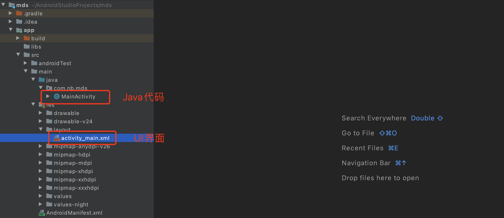

# day09 安卓开发

今日概要：认证过程。


## 1.UI和逻辑代码

- 设计页面（布局、大小、位置）
- Java逻辑代码




## 2.序列化和反序列化

Gson组件

```
implementation 'com.google.code.gson:gson:2.8.6'
```


- 序列化，对象 -> 字符串类型

  ```java
  class HttpContext{
      public int code;
      public String message;
      
      public HttpContext(int code,String msg){
          this.code = code;
          this.message = msg;
      }
  }
  
  HttpContext obj = new HttpContext(1000,"成功");
  
  String dataString = new Gson().toJson(obj);
  ```

- 反序列化，字符串 -> 对象

  ```java
  String dataString = "{\"status\": true, \"token\": \"fffk91234ksd\", \"name\": \"武沛齐\"}";
      
  class HttpResponse{
      public boolean status;
      public String token;
      public String name;
  }
  
  HttpResponse obj = new Gson().fromJson(dataString,HttpResponse.class);
  obj.status
  obj.name
  obj.token
  ```

  


## 3.保存到XML文件

保存到手机上：`/data/data/com.nb.mds`

保存

```java
SharedPreferences sp = getSharedPreferences("sp_city", MODE_PRIVATE);
SharedPreferences.Editor editor = sp.edit();
editor.putString("token","111111");
editor.commit();
```


删除

```java
SharedPreferences sp = getSharedPreferences("sp_city", MODE_PRIVATE);
SharedPreferences.Editor editor = sp.edit();
editor.remove("token");
editor.commit();
```


读取

```python
SharedPreferences sp = getSharedPreferences("sp_city", MODE_PRIVATE);
String token = sp.getString("token","");
```


注意：后期逆向时经常使用 fffk91234ksdujsdsd，而放在xml中的一般都是app刚启动时、刚登录时。


## 总结

- UI + 后端Java代码（指定的标签是有ID）
- Java代码回顾
- 发送网络请求 + 线程：
  - OKHttp （引入+配置）
  - Retrofit（在OKHttp基础上升级）

- Gson序列化
- XML文件的处理
- 跳转


