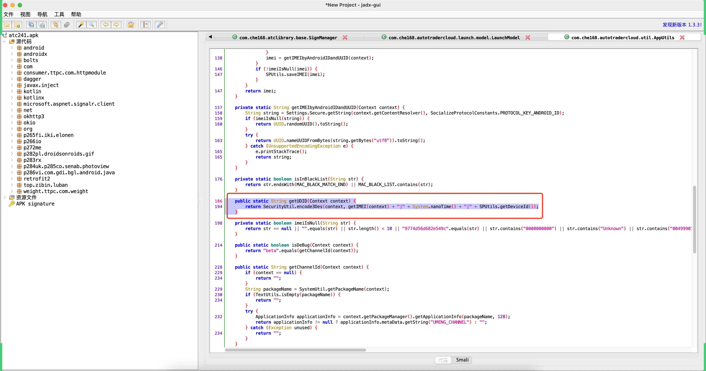

# day13 逆向案例：x智赢

目标：逆向x智赢自动登录，背后相关的逆向。


## 1.抓包

- 设备：模拟器

- app：车智赢（atc241.apk）

  ```
  http://appdownload.autohome.com.cn/usedcar/chezhiyingpc.html
  ```

- 抓包配置


- udid
- pwd
- _sign


下一步，怎么办？


## 2.反编译apk

打开jadx去反编译 `atc241.apk`


## 3.搜索

- URL

  ```
  不建议：
  	https://dealercloudapi.che168.com/tradercloud/sealed/login/login.ashx
  建议：
  	/tradercloud/sealed/login/login.ashx
  ```

- 请求参数key：udid、_sign、username、password


## 4.密码加密猜想

```
明文：123123
密文：4297f44b13955235245b2497399d7a93
```

```python
import hashlib

obj = hashlib.md5()
obj.update("123123".encode('utf-8'))
res = obj.hexdigest()
print(res)
# 4297f44b13955235245b2497399d7a93
```

扩展：如果我的到的密文与密文不一致？那么下一步你应该做什么？

- md5加密可能加盐。
- 密文可能不是123
  - 手动搜索，逐步向上找（麻烦 & 找的不准确）。
  - 查看调用栈，例如：在loginByPassword方法中故意抛出异常，就可以看到全部的调用栈。


## 5.其他参数

如果你在某个请求中发现：

- 只找到一部分的参数
- "拦截器"，统一添加其他的参数。


遇到了一个不太确定是否是那个请求时，怎么办呢？

```
可以对app进行Hook，直白：将原来的方法换成咱们自己的写的代码 + 输入调用栈。
```


## 6.Hook

- 电脑

  - adb，远程连接手机，对手机进行操作。

    ```
    - 安卓系统 Linux电脑
    - 连接，文件进行操作，例如：上传文件、下载文件、执行命令、点击屏幕、截屏。
    ```

  - frida，基于Python编写的专门用于Hook的框架。

- 设备

  - frida-server，放到手机上。


### 6.1 adb

- 单独下载
- 安卓SDK，内置abd。


接下来需要把 platform-tools 路径加入环境变量中（安卓开发时已做）。

```
>>>adb kill-server

>>>adb start-server

>>>adb devices
List of devices attached
emulator-5554	device

>>>adb -s emulator-5554 shell getprop ro.product.cpu.abi  
x86_64        表示模拟器CPU是x86 -> 64位

>>>adb -s 1a9f22350107 shell getprop ro.product.cpu.abi
armeabi-v7a   表示模拟器CPU是arm -> 32位

>>>adb -s 1a9f22350107 shell        # 登录设备
>>>adb -s emulator-5554 shell       # 登录设备
>>>adb shell
```

adb自动刷抖音：https://www.bilibili.com/video/BV19T4y1A7XU?spm_id_from=333.999.0.0


### 6.2 frida

- PC：frida

  ```
  pip install frida==14.2.18
  pip install frida-tools==9.2.5
  ```

- 设备：frida-server   14.2.18

  ```
  下载：https://github.com/frida/frida/releases
  
  安装：
  	- 【电脑】解压
  	- 【电脑】文件上传到设备
  		adb push C:\2345Downloads\... /sdcard
  	- 【手机】将frida-server..文件移动到手机的 /data/local/tmp 目录
  		>>>adb shell
  		>>>su -
  		>>>cd sdcard
  		>>>mv frida-server-14.2.18-android-x86_64  /data/local/tmp
  	- 【进入】
  		>>>cd /data/local/tmp
  	- 【授权】授予可执行的权限
  		>>>chmod 777 frida-server-14.2.18-android-x86_64
  ```


### 6.3 启动和Hook

- 手机

  ```
  >>>adb shell
  >>>su -
  >>>cd /data/local/tmp/
  >>>./frida-server-14.2.18-android-x86_64
  >>>
  ```

- 电脑端

  - 端口的转发

    ```
    >>>adb forward tcp:27042 tcp:27042
    >>>adb forward tcp:27043 tcp:27043
    ```

    

  - 编写Python和JS代码进行Hook

    ```python
    # 枚举手机上的所有进程 & 前台进程
    import frida
    
    # 获取设备信息
    rdev = frida.get_remote_device()
    print(rdev)
    
    # 枚举所有的进程
    processes = rdev.enumerate_processes()
    for process in processes:
        print(process)
    
    # 获取在前台运行的APP
    front_app = rdev.get_frontmost_application()
    print(front_app)
    ```

    ```python
    import frida
    import sys
    
    # 连接手机设备
    rdev = frida.get_remote_device()
    
    # Hook手机上的那个APP（app的包名字）
    # 注意事项：在运行这个代码之前，一定要先在手机上启动app
    session = rdev.attach("com.che168.autotradercloud")  # 车智赢+
    
    
    scr = """
    Java.perform(function () {
    
        // 包.类
        var AHAPIHelper = Java.use("com.autohome.ahkit.AHAPIHelper");
        var SecurityUtil = Java.use("com.autohome.ahkit.utils.SecurityUtil");
        
        // Hook，替换
        AHAPIHelper.appendPublicParam.implementation = function(context,map){
            console.log(123);
            // 执行原来的方法
            this.appendPublicParam(context,map);
            console.log(666);
        }
        
        // Hook
        SecurityUtil.encodeMD5.implementation = function(str){
            console.log("md5加密前，明文=",str);
            var res = this.encodeMD5(str);
            console.log("md5加密后，密文=",res);
            return res;
            
        }
    });
    """
    script = session.create_script(scr)
    
    
    def on_message(message, data):
        print(message, data)
    
    
    script.on("message", on_message)
    script.load()
    sys.stdin.read()
    ```

    


## 7.参数的正确位置

```python
import frida
import sys

# 连接手机设备
rdev = frida.get_remote_device()

# Hook手机上的那个APP（app的包名字）
# 注意事项：在运行这个代码之前，一定要先在手机上启动app
session = rdev.attach("com.che168.autotradercloud")  # 车智赢+


scr = """
Java.perform(function () {

    // 包.类
    var AHAPIHelper = Java.use("com.autohome.ahkit.AHAPIHelper");
    var SecurityUtil = Java.use("com.autohome.ahkit.utils.SecurityUtil");
    var LaunchModel = Java.use("com.che168.autotradercloud.launch.model.LaunchModel");
    
    // Hook，替换
    AHAPIHelper.appendPublicParam.implementation = function(context,map){
        console.log(123);
        // 执行原来的方法
        this.appendPublicParam(context,map);
        console.log(666);
    }
    
    // Hook
    SecurityUtil.encodeMD5.implementation = function(str){
        console.log("md5加密前，明文=",str);
        var res = this.encodeMD5(str);
        console.log("md5加密后，密文=",res);
        return res;
    }
    
    LaunchModel.lambda$initRequestCommonParams$0.implementation = function(i,treeMap){
        console.log(111111);
        var res = this.lambda$initRequestCommonParams$0(i,treeMap);
        return res;
    }
});
"""
script = session.create_script(scr)


def on_message(message, data):
    print(message, data)


script.on("message", on_message)
script.load()
sys.stdin.read()
```


### 7.1 udid




```java
public static String getUDID(Context context) {
    return SecurityUtil.encode3Des(context, getIMEI(context) + "|" + System.nanoTime() + "|" + SPUtils.getDeviceId());
}
```

-  getIMEI(context)
  

  ```python
  import uuid
  
  imei = str(uuid.uuid4())
  ```

- System.nanoTime() ，开机 ~ 当前时间差

  ```python
  import random
  nano_time = random.randint(5136066335773,7136066335773)
  ```

- SPUtils.getDeviceId()，去XML文件中去读【一定有人先写进去】

  - Hook旁边的 `saveDeviceId`

  - 发现 `SPUtils.getDeviceId()`居然是固定的。

    ```
    ------> 008796763151875|9142774133142|290001
    ======> CDAvu4hSDn8AXxJdsUm4KGBcCN6p3AJ6stnnXdtUK7/3bRCBCW+whQ==
    ```

    ```
    ------> 008796763151875|9166072625494|290001
    ======> CDAvu4hSDn8AXxJdsUm4KC8ohGhNRc5YuDBuVbkFQ1UqsYpRweaPkw==
    ```

    ```
    ------> 008796763151875|9225346879463|290001
    ======> CDAvu4hSDn8AXxJdsUm4KGz+Nee0WhnsHPJH+PaNiVXe+6BDVaoi+Q==
    ```

    模拟器中发现他是固定的，换成真机这个值变了。

    - 理论上：先处理regdevice.ashx请求，获取返回值，发现它里面的devicetoken个推ID。
    - 选择：
      - 290001
      - 随机6位数
      - 20（当未获取个推ID时，regdevice.ashx请求错误了，但是后期登录请求20，不耽误登录）。


逆向出来这三个参数之后，就是拼接：

```
getIMEI(context) + "|" + System.nanoTime() + "|" + SPUtils.getDeviceId()

008796763151875|9225346879463|290001
```


**接下来应该做的事：**

```
分析SecurityUtil.encode3Des方法内部到底做了什么？用Python实现。这样udid就可以获取到了。
```


