# day14 app逆向案例：x智赢（下）


## 1.上节完成

抓包

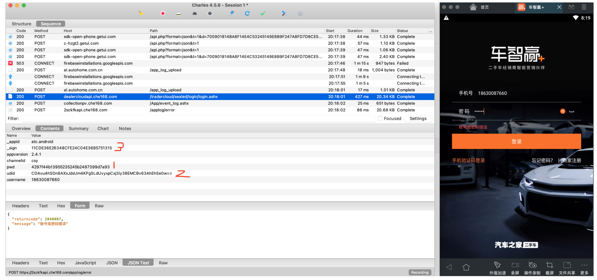


搜索URL

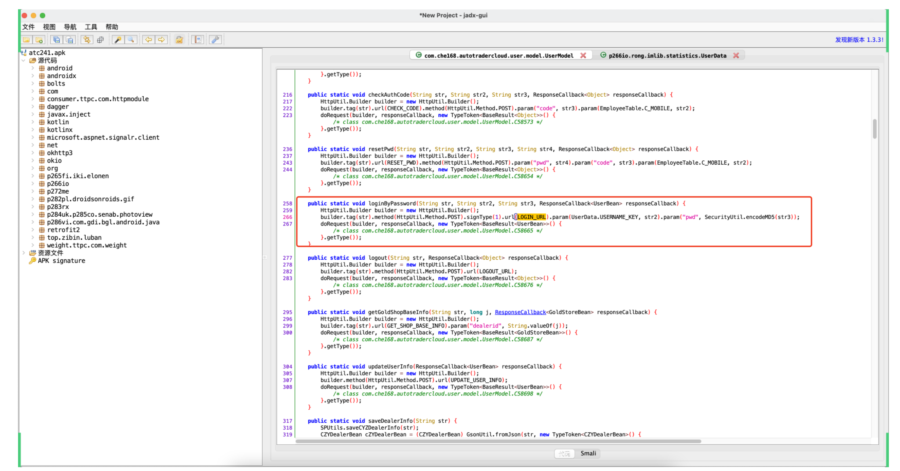


搜索：_appid

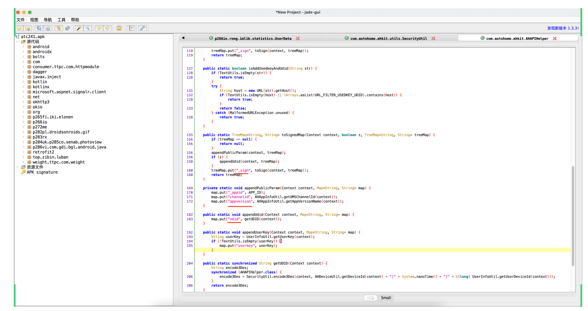


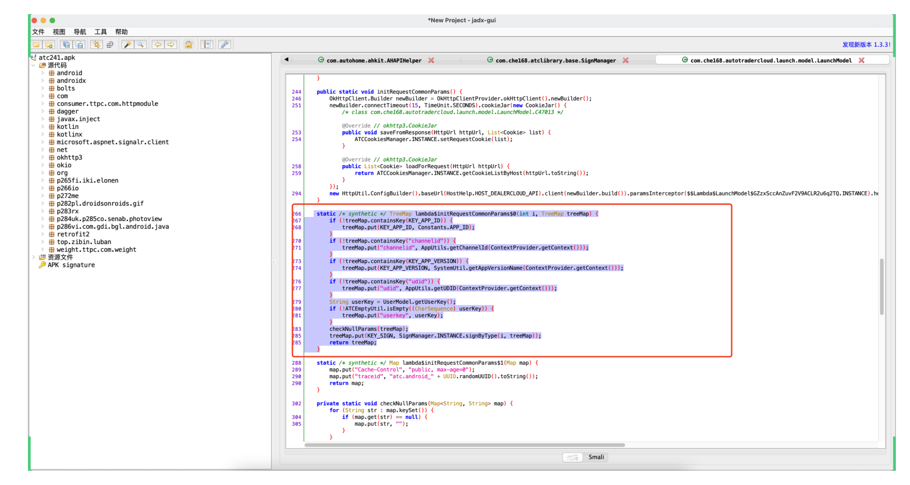


分析udid

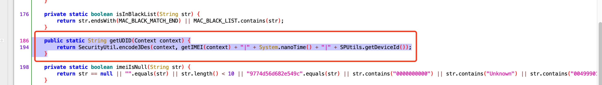

- 第一步：拼接字符串

  - getIMEI

    ```
    1.getIMEI
    2.MAC地址
    3.uuid
    ```

  - nanotime

    ```
    开机 ~ 当前时间
    ```

  - getDeviceId

    ```
    首先，安卓程序启动时，“个推”SDK，根据设备信息生成clientid（devicetoken）。
    
    然后，自动向 /xxx/xxx/xxx 携带devicetoken发送请求，返回 deviceid （写入到XML里）
    
    去XML文件中去读了。
    
    我的分析：
    	- 个推不是核心
    	- Hook请求，故意将devicetoken=""，返回失败。（deviceid=20）
    ```

- 第二步：encode3Des加密


## 2.udid

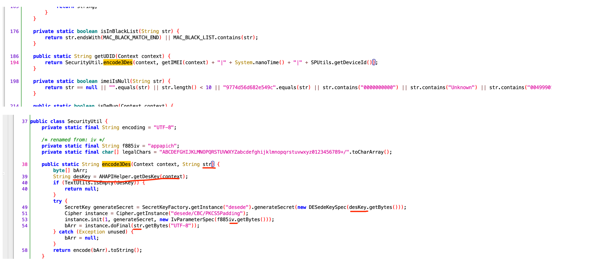

常见的：AES、DES、3DES（DESede）都是对称加密，能加密也能解密。 加密和解密依赖：key、iv 相同。

- 任务1：

  - key，

    ```
    - 去AHAPIHelper
    - key一定是一个固定的值
    
    既然他是固定的值，其实我就没必要去分析AHAPIHelper.getDesKey的具体实现，直接Hook方法获取返回值。
    ```

  - iv，`appapich`

  - str，上一步拼接的内容。【已知】

- 任务2：Python如何实现3DES


### 2.1 deskey

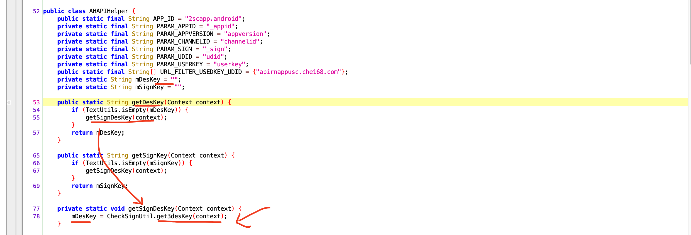

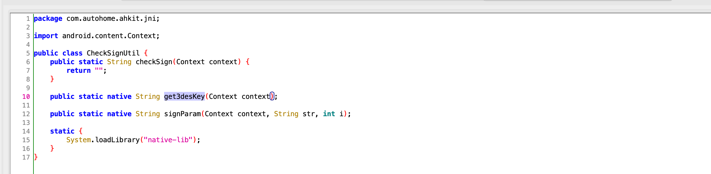

既然他是固定的值，其实我就没必要去分析AHAPIHelper.getDesKey的具体实现，直接Hook方法获取返回值。

```python
# com.che168.autotradercloud

import frida
import sys

rdev = frida.get_remote_device()
session = rdev.attach("com.che168.autotradercloud")

scr = """
Java.perform(function () {
    var AHAPIHelper = Java.use("com.autohome.ahkit.AHAPIHelper");

    AHAPIHelper.getDesKey.implementation = function(context){
        var res = this.getDesKey(context);
        console.log(res);
        return res;
    }

});
"""
script = session.create_script(scr)


def on_message(message, data):
    print(message, data)


script.on("message", on_message)
script.load()
sys.stdin.read()
```

```
deskey = "appapiche168comappapiche168comap"
```


### 2.2 3des算法

搜索 + 试试 => 结果 VS APP结果。

```python
import base64
from Crypto.Cipher import DES3

BS = 8
pad = lambda s: s + (BS - len(s) % BS) * chr(BS - len(s) % BS)

# 3DES的MODE_CBC模式下只有前24位有意义
key = b'appapiche168comappapiche168comap'[0:24]
iv = b'appapich'

plaintext = pad("xxxxxxxxx").encode("utf-8")

# 使用MODE_CBC创建cipher
cipher = DES3.new(key, DES3.MODE_CBC, iv)
result = cipher.encrypt(plaintext)
res = base64.b64encode(result)
print(res)
```


Hook脚本：

```
# com.che168.autotradercloud

import frida
import sys

rdev = frida.get_remote_device()
session = rdev.attach("com.che168.autotradercloud")

scr = """
Java.perform(function () {
    var AHAPIHelper = Java.use("com.autohome.ahkit.AHAPIHelper");
    var SecurityUtil = Java.use("com.autohome.ahkit.utils.SecurityUtil");
    
    SecurityUtil.encode3Des.implementation = function(ctx,str){
        console.log("udid加密明文=",str);
        var res = this.encode3Des(ctx,str);
        console.log("udid加密密文=",res);
        return res;
    
    }
    AHAPIHelper.getDesKey.implementation = function(context){
        var res = this.getDesKey(context);
        console.log(res);
        return res;
    }

});
"""
script = session.create_script(scr)


def on_message(message, data):
    print(message, data)


script.on("message", on_message)
script.load()
sys.stdin.read()

```

```
udid加密明文= 008796763151875|477777543393|290001
udid加密密文= CDAvu4hSDn8AXxJdsUm4KOHvHRzMRuPzL4zzi4Wakyr+9uIzgK6f2w==

key = "appapiche168comappapiche168comap"
iv = "appapich"
str = "008796763151875|477777543393|290001"
```

```python
import base64
from Crypto.Cipher import DES3

BS = 8
pad = lambda s: s + (BS - len(s) % BS) * chr(BS - len(s) % BS)

# 3DES的MODE_CBC模式下只有前24位有意义
key = b'appapiche168comappapiche168comap'[0:24]
iv = b'appapich'

plaintext = pad("008796763151875|477777543393|290001").encode("utf-8")

# 使用MODE_CBC创建cipher
cipher = DES3.new(key, DES3.MODE_CBC, iv)
result = cipher.encrypt(plaintext)
res = base64.b64encode(result)
print(res)

b'CDAvu4hSDn8AXxJdsUm4KOHvHRzMRuPzL4zzi4Wakyr+9uIzgK6f2w=='
```


代码实现：

```python
import uuid
import random
import base64
from Crypto.Cipher import DES3


def des3(data_string):
    BS = 8
    pad = lambda s: s + (BS - len(s) % BS) * chr(BS - len(s) % BS)

    # 3DES的MODE_CBC模式下只有前24位有意义
    key = b'appapiche168comappapiche168comap'[0:24]
    iv = b'appapich'

    plaintext = pad(data_string).encode("utf-8")

    # 使用MODE_CBC创建cipher
    cipher = DES3.new(key, DES3.MODE_CBC, iv)
    result = cipher.encrypt(plaintext)
    return base64.b64encode(result).decode('utf-8')


def run():
    imei = str(uuid.uuid4())
    nano_time = random.randint(5136066335773, 7136066335773)
    device_id = 20  # 290001

    udid = des3(f"{imei}|{nano_time}|{device_id}")
    print(udid)


if __name__ == '__main__':
    run()
```


### 2.3 so扩展

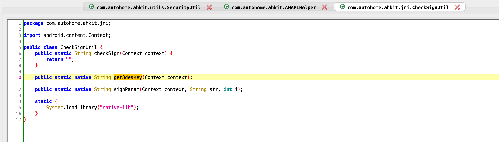

你应该想到的：

- so文件的名字：`libnative-lib.so`

- JNI的静态注册和动态注册

  - 静态注册

    ```
    Java_com_autohome_ahkit_jni_CheckSignUtil_get3deskey
    ```

  - 动态注册

    ```
    jni_onload，去看对应关系
    ```

    


#### 2.3.1 找so

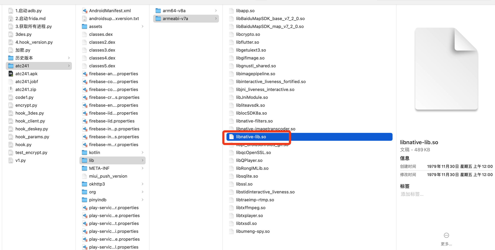


#### 2.3.2 IDA反编译

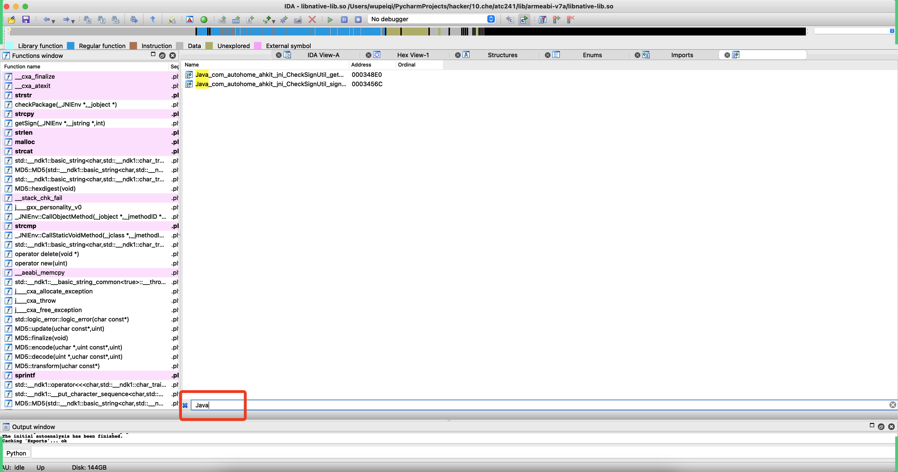


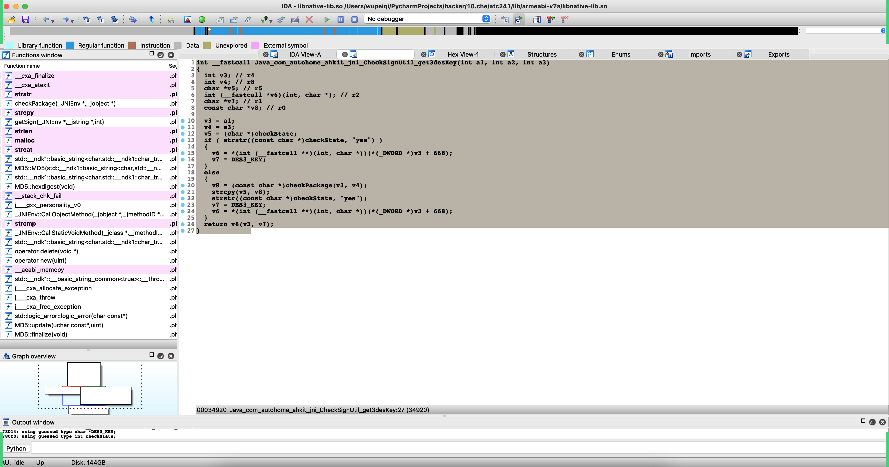

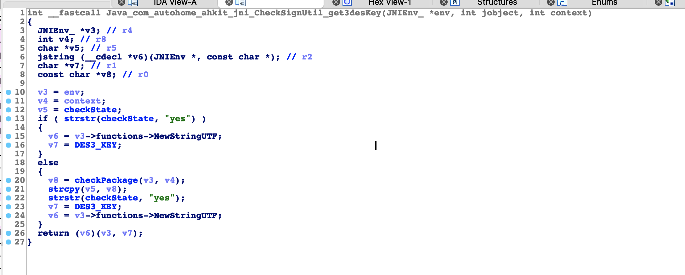


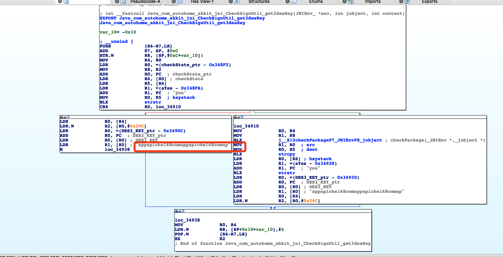


## 3._sign

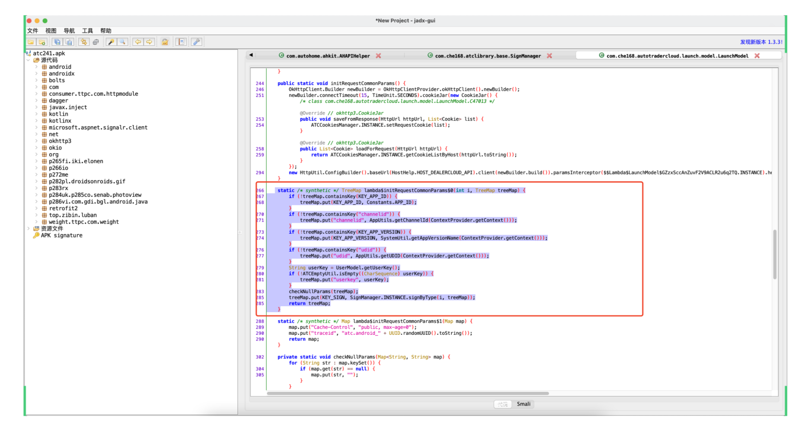

你应该想到：

- treeMap特点：根据键从小打到大的排序。

  ```python
  {
      k1:234,
      k2:456
  }
  ```

- sign加密

  ```
  {
      k1:234,
      k2:456,
      _sign:加密
  }
  ```

  

下一步应该做什么？

- treeMap到底有什么？i 是什么？
- signByType的算法是什么？


### 3.1 treeMap和i是什么？


```python
# com.che168.autotradercloud

import frida
import sys

rdev = frida.get_remote_device()
session = rdev.attach("com.che168.autotradercloud")

scr = """
Java.perform(function () {
    var SignManager = Java.use("com.che168.atclibrary.base.SignManager");
     
    SignManager.signByType.implementation = function(i,treeMap){
        console.log("i=",i);
        console.log("treeMap=",treeMap);
        var res = this.signByType(i,treeMap);
        console.log("sign=",res);
        return res;
    
    }
   
});
"""
script = session.create_script(scr)


def on_message(message, data):
    print(message, data)


script.on("message", on_message)
script.load()
sys.stdin.read()
```


```
i= 1

treeMap= {
	_appid=atc.android, 
	appversion=2.4.1, 
	channelid=csy, 
	pwd=202cb962ac59075b964b07152d234b70,
	udid=CDAvu4hSDn8AXxJdsUm4KOqWHLMYKDq8T4i/WqYBQ5jZ/fhe3QUqaQ==, 
	username=18812311221
}

sign= 49D8CF0B65D5CDED5478E34BEC0AF686
```


### 3.2 算法

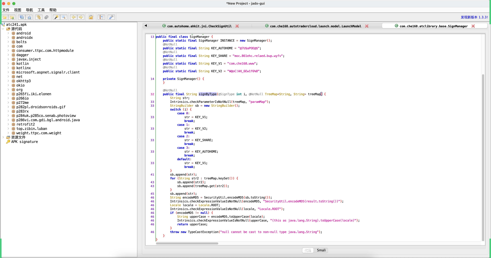

- 拼接

  ```
  "W@oC!AH_6Ew1f6%8"
  _appidatc.androidappversion2.4.1channelidcsy...
  "W@oC!AH_6Ew1f6%8"
  ```

- md5加密


注意：如果你信不过自己，也可以cookie一下来验证（建议）。


```python
import hashlib


def md5(data_string):
    obj = hashlib.md5()

    obj.update(data_string.encode('utf-8'))
    return obj.hexdigest()


data = "W@oC!AH_6Ew1f6%8"

data_dict = {
    "_appid": "atc.android",
    "appversion": "2.4.1",
    "channelid": "csy",
    "pwd": "101193d7181cc88340ae5b2b17bba8a1",
    "udid": "xxxxxxxx",
    "username": "16611122222"
}

result = "".join(["{}{}".format(key, data_dict[key]) for key in sorted(data_dict.keys())])

un_sign_string = f"{data}{result}{data}"
sign = md5(un_sign_string).upper()
print(sign)

```


## 4.完整代码

```python
import hashlib
import uuid
import random
import base64
from Crypto.Cipher import DES3
import requests


def des3(data_string):
    BS = 8
    pad = lambda s: s + (BS - len(s) % BS) * chr(BS - len(s) % BS)

    # 3DES的MODE_CBC模式下只有前24位有意义
    key = b'appapiche168comappapiche168comap'[0:24]
    iv = b'appapich'

    plaintext = pad(data_string).encode("utf-8")

    # 使用MODE_CBC创建cipher
    cipher = DES3.new(key, DES3.MODE_CBC, iv)
    result = cipher.encrypt(plaintext)
    return base64.b64encode(result).decode('utf-8')


def md5(data_string):
    obj = hashlib.md5()

    obj.update(data_string.encode('utf-8'))

    return obj.hexdigest()


def run():
    username = "18877765431"
    passwrod = "123123"

    imei = str(uuid.uuid4())
    nano_time = random.randint(5136066335773, 7136066335773)
    device_id = 20  # 290001
    udid = des3(f"{imei}|{nano_time}|{device_id}")
    data = "W@oC!AH_6Ew1f6%8"
    data_dict = {
        "_appid": "atc.android",
        "appversion": "2.4.1",
        "channelid": "csy",
        "pwd": md5(passwrod),
        "udid": udid,
        "username": username
    }

    result = "".join(["{}{}".format(key, data_dict[key]) for key in sorted(data_dict.keys())])
    un_sign_string = f"{data}{result}{data}"
    sign = md5(un_sign_string).upper()
    data_dict['_sign'] = sign

    res = requests.post(
        url="https://dealercloudapi.che168.com/tradercloud/sealed/login/login.ashx",
        data=data_dict
    )

    print(res.text)


if __name__ == '__main__':
    run()
```

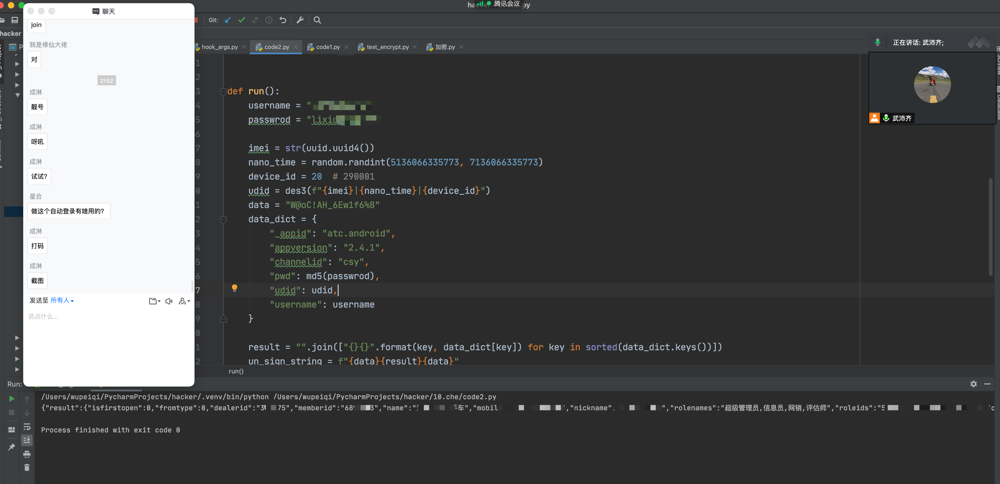


