# day15 x物App

目标：逆向得物app搜索时，关联的核心算法newSign。


## 1.运行和抓包

- app版本：4.74.5
- 安装设备
  - 模拟器，90%
  - 真机，10%


### 1.1 抓包失败

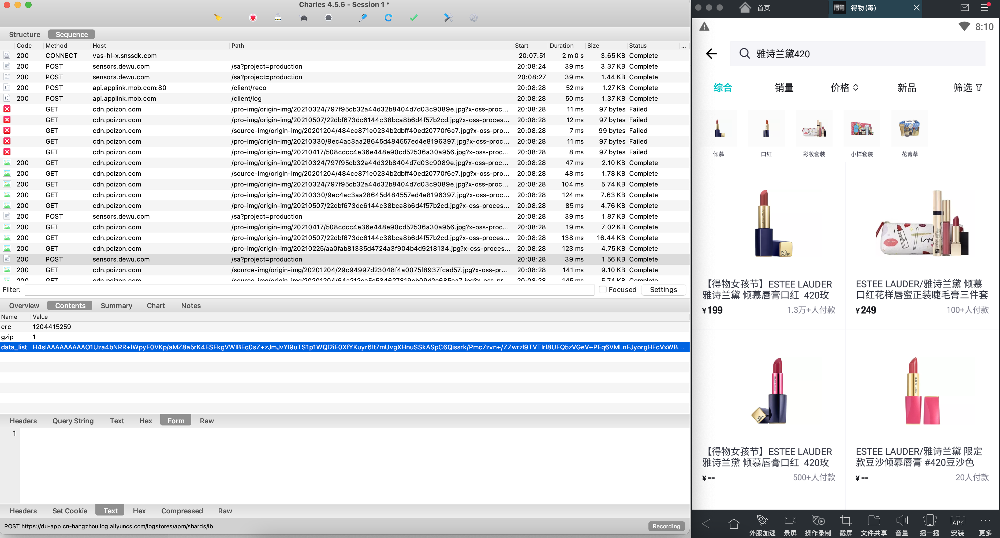


在安卓开发时，OkHttp发送请求，设置 `Proxy.NO_PROXY`，基于系统代理都是抓不到包。

```java
OkHttpClient client = new OkHttpClient();
FormBody form = new FormBody.Builder()
    .add("user", dataMap.get("username"))
    .add("pwd", dataMap.get("password"))
    .add("sign", dataMap.get("sign")).build();

Request req = new Request.Builder().url("http://192.168.0.6:9999/login").post(form).build();
Call call = client.newCall(req);
...
```

修改为:

```java
OkHttpClient client = new OkHttpClient.Builder().proxy(Proxy.NO_PROXY).build();
FormBody form = new FormBody.Builder()
    .add("user", dataMap.get("username"))
    .add("pwd", dataMap.get("password"))
    .add("sign", dataMap.get("sign")).build();

Request req = new Request.Builder().url("http://192.168.0.6:9999/login").post(form).build();
```


### 1.2 drony

安装在手机、模拟器上的一个软件，对你的手机中某些app中的请求进行转发。

```
用了他，可以不再配置系统代理。
```


#### 1.2.1 安装

- Drony-102.apk，【英文版】【安卓低版本】【模拟器】
- Drony-1-3.154.apk，【繁体中文】【手机】

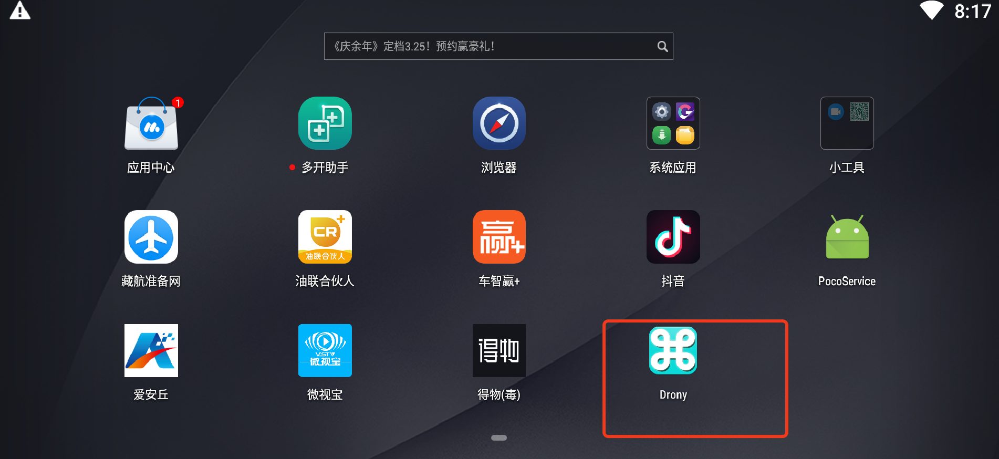


#### 1.2.2 配置

...


#### 1.2.3 抓包

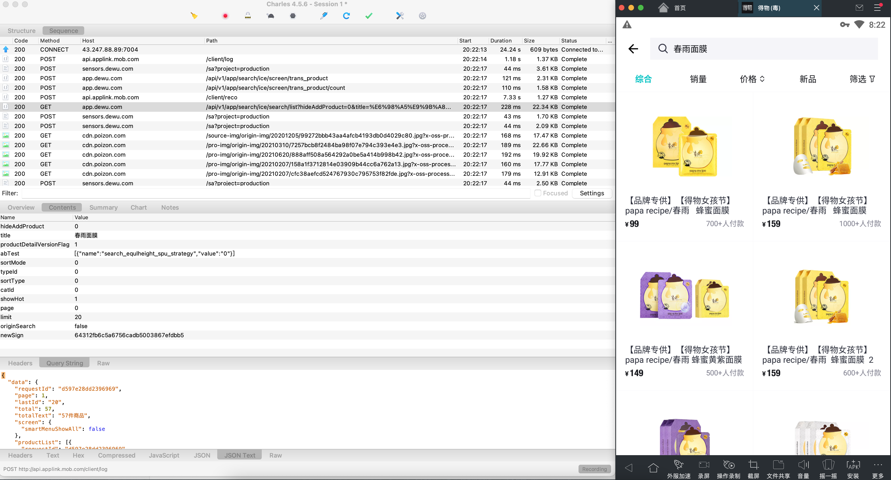


搞出newSign算法到底是什么？


## 2.反编译找newSign

- 反编译apk

- 搜关键字

  ```
  - newSign
  - url
  - 其他参数
  - 给大家讲了frida，可以对程序进行hook
  	- Hook HashMap或TreeMap的put(key,value)，key=newSign + 输入调用栈。
  	- Hook 常见的算法 md5、aes，算法那中的方法 update(明文) + 密文 + 调用栈。
  ```


### 2.1 算法的位置


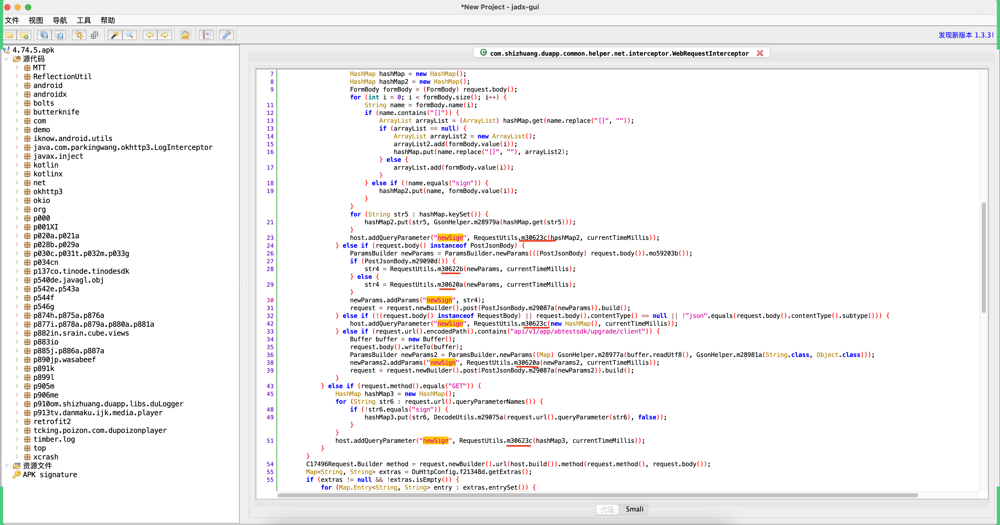


到底是谁呢？直接hook即可。


```python
# com.shizhuang.duapp
import frida
import sys

rdev = frida.get_remote_device()
session = rdev.attach("com.shizhuang.duapp")

scr = """
Java.perform(function () {
    var RequestUtils = Java.use("com.shizhuang.duapp.common.utils.RequestUtils");


    RequestUtils.c.implementation = function(map,j){
        console.log('------m30623c------');
        console.log(map,j);
        var res = this.c(map,j);
        console.log("res=", res);
        return res;
    }

});
"""
script = session.create_script(scr)


def on_message(message, data):
    print(message, data)


script.on("message", on_message)
script.load()
sys.stdin.read()
```


### 2.2 算法分析 m30623c

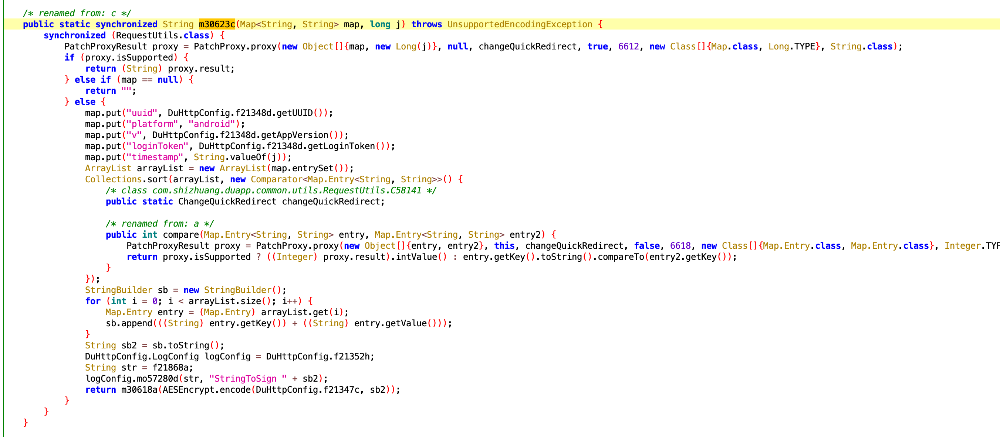

如何生成的newSign

- map有一些值

- map中添加值

- map中的值拼接起来=sb2

  ```
  {
  	"k1":123,
  	"k2":456
  }
  k1123k2456
  ```

- encode对sb2加密

- m30618再处理 ==> newSign


#### 1.map是什么？

- 方式1：

  - hook到map

    ```
    map = {hideAddProduct=0, title=修丽可, productDetailVersionFlag=1, sortMode=0, abTest=[{"name":"search_equlheight_spu_strategy","value":"0"}], typeId=0, sortType=0, showHot=1, catId=0, page=0, limit=20, originSearch=false} 
    
    j = 1646743199395
    ```

  - 分析函数的过程

- 方式2：

  - hook结束时候的sb2
    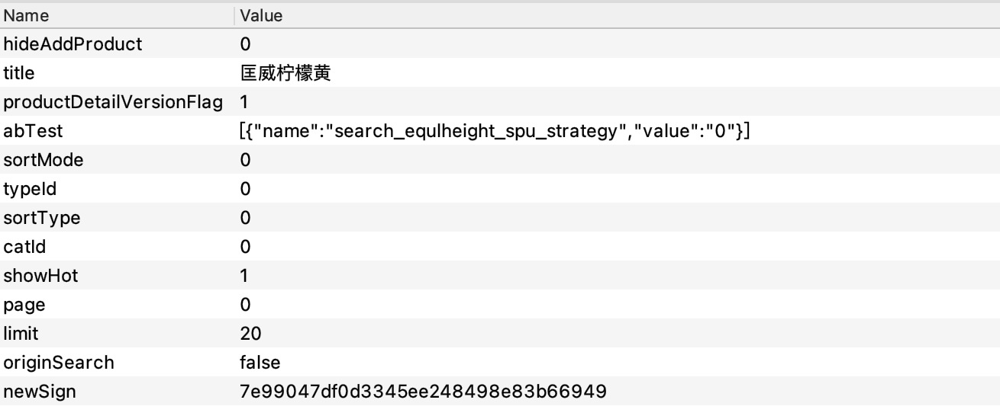

    ```
    abTest = [{"name":"search_equlheight_spu_strategy","value":"0"}]
    catId=0
    hideAddProduct=0
    limit=20
    loginToken=""
    originSearch=false
    page=0
    platform=android
    productDetailVersionFlag = 1
    showHot=1
    sortMode=0
    sortType=0
    timestamp=1646744116694
    title=匡威柠檬黄
    typeId=0
    uuid=23cbedaf5331524f
    v=4.74.5
    ```

  - 反推函数的过程


最终分析完会发现：

- map就是（除了newSign）
  

- map中添加了

  ```
  map.put("uuid", DuHttpConfig.f21348d.getUUID());
  map.put("platform", "android");   【固定】
  map.put("v", DuHttpConfig.f21348d.getAppVersion()); 【固定4.74.5】
  map.put("loginToken", DuHttpConfig.f21348d.getLoginToken()); 【固定】
  map.put("timestamp", String.valueOf(j)); 【时间戳】
  ```

  ```
  uuid = 23cbedaf5331524f   ，清楚数据，依然是 23cbedaf5331524f   【模拟器】
  uuid = 另外一个值    【另外一个值】
  
  猜想uuid应该是啥？
   - IMEI
   - Android_ID
  ```

- 【疑问】uuid是什么？

- 【疑问】encode加密算法

- 【疑问】m30618算法 ==> newSign


#### 2.uuid是什么？

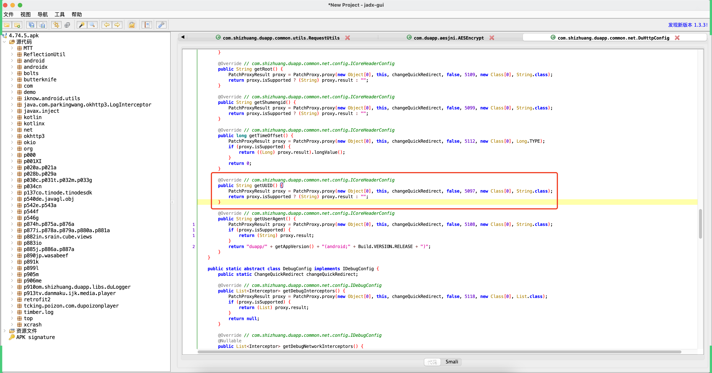


- 搞定他的java代码的逻辑，美团开源的组件 robust（看不懂）【安卓开发中使用】

  ```
  com.meituan.robust.PatchProxyResult
  ```

- 寻找其他地方有没有 uuid （IMEI、Android_ID）

  ```
  手动直接生成 IMEI、Android_ID【试试】
  ```


```python
# com.shizhuang.duapp
import frida
import sys

rdev = frida.get_remote_device()
session = rdev.attach("com.shizhuang.duapp")

scr = """
Java.perform(function () {
    var SafeLogClient = Java.use("com.shizhuang.duapp.libs.robustplus.core.track.SafeLogClient");

    SafeLogClient.getAndroidId.implementation = function(context){
        var res = this.getAndroidId(context);
        console.log("res=", res);
        return res;
    }
    
});
"""
script = session.create_script(scr)


def on_message(message, data):
    print(message, data)


script.on("message", on_message)
script.load()
sys.stdin.read()


```

```
uuid = 23cbedaf5331524f
```


那么这个安卓id的生成，就可以直接写代码去实现：

```python
def create_android_id(size=9):
    data_list = []
    for i in range(1, size):
        part = "".join(random.sample("0123456789ABCDEF", 2))
        data_list.append(part)
    return "".join(data_list).lower()
```


#### 3.encode加密算法

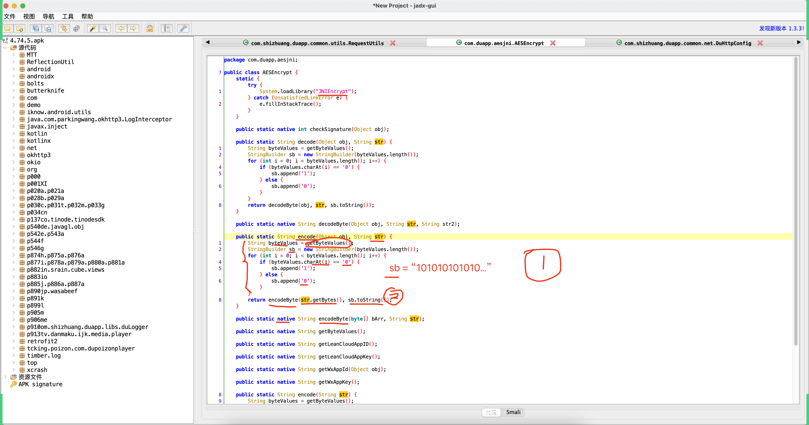


##### 3.1 getByteValues

- 返回是固定的，无需分析C代码。【Hook】

  ```
  101001011101110101101101111100111000110100010101010111010001000101100101010010010101110111010011101001011101110101100101001100110000110100011101010111011011001101001101011101010100001101000011
  ```

- 返回是非固定，不得不分析。动态注册
  
  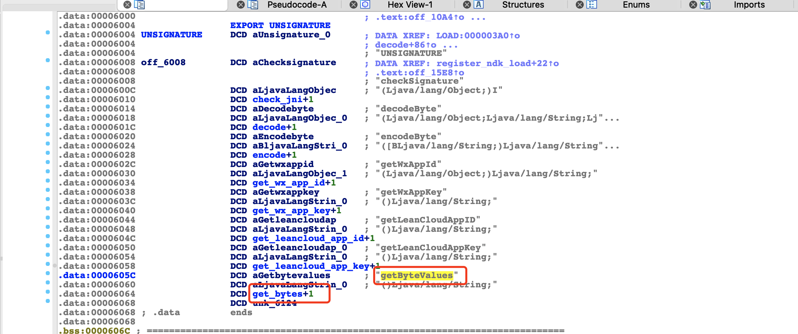

  

##### 3.2 encodeByte

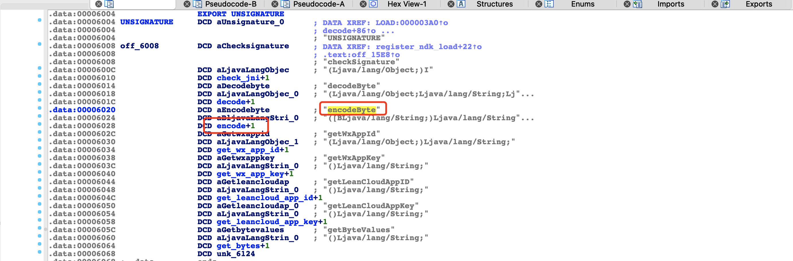

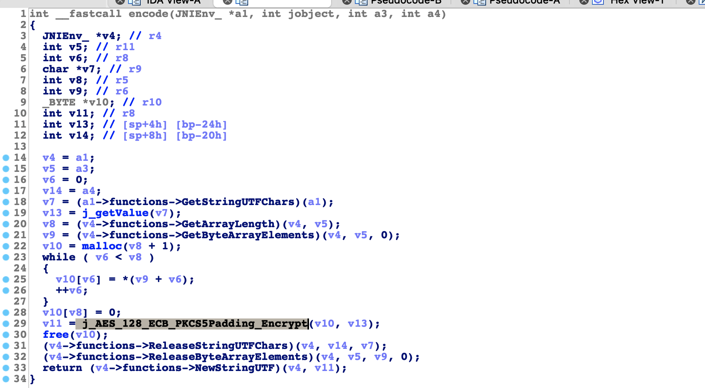


如果是一个AES加密：

- key = iv 要么就是内部写死 key或iv
- 要加密的明文


如果我知道v10和v13的值分别是什么？ + Python实现加密算法。

如果想要Hook C语言的代码应该怎么办？

```python
# com.shizhuang.duapp
import frida
import sys

rdev = frida.get_remote_device()
session = rdev.attach("com.shizhuang.duapp")

scr = """
Java.perform(function () {

    var addr_func = Module.findExportByName("libJNIEncrypt.so", "AES_128_ECB_PKCS5Padding_Encrypt");
    
    Interceptor.attach(addr_func, {
        
        onEnter: function(args){
            console.log("-------------执行函数-------------");
            
            console.log("-------------参数 1-------------");
            console.log(args[0].readUtf8String())
            
            console.log("-------------参数 2-------------");
            console.log(args[1].readUtf8String());
        },
        onLeave: function(retValue){
            console.log("-------------返回-------------");
            console.log(retValue.readUtf8String());
        }
        
    })
    
});
"""
script = session.create_script(scr)


def on_message(message, data):
    print(message, data)


script.on("message", on_message)
script.load()
sys.stdin.read()

```


Hook C语言的代码居然运行不起来，怎么回事？

```
-------------参数 1-------------
loginTokenplatformandroidtimestamp1646748997088uuid5134632ab5e3cbf0v4.78.0
-------------参数 2-------------
d245a0ba8d678a61
-------------返回-------------
knGGXR0bR7LQn4eRCvJsdZ4D96wrRcYi2zPWWxLMOs1kWKcdsqSOg/mzvvYSivj19loCjAcfehVFV24FeFfM0Bzs08hL8muVFKSMZwzbt68=


-------------参数 1-------------
loginTokenplatformandroidsourceType1timestamp1646748997093uuid5134632ab5e3cbf0v4.78.0
-------------参数 2-------------
d245a0ba8d678a61
-------------返回-------------
knGGXR0bR7LQn4eRCvJsdUvdRJUnmIe4bF8B3BQl83zpPcwlV3on08JmF4qIwpqYQ/qFlF9zfS3NU8LHBzY+H+pYGsncEuSn3eczKpPPLTUv5X5X7EFwixDH2PaQCJEG
```


```python
from Crypto.Cipher import AES
from Crypto.Util.Padding import pad
import base64


def aes_encrypt(data_string):
    key = "d245a0ba8d678a61"
    aes = AES.new(
        key=key.encode('utf-8'),
        mode=AES.MODE_ECB,
    )
    raw = pad(data_string.encode('utf-8'), 16)
    return aes.encrypt(raw)


data_string = "loginTokenplatformandroidtimestamp1646748997088uuid5134632ab5e3cbf0v4.78.0"
res = aes_encrypt(data_string)
value = base64.encodebytes(res)
result = value.replace(b"\n", b'')
print(result)
```

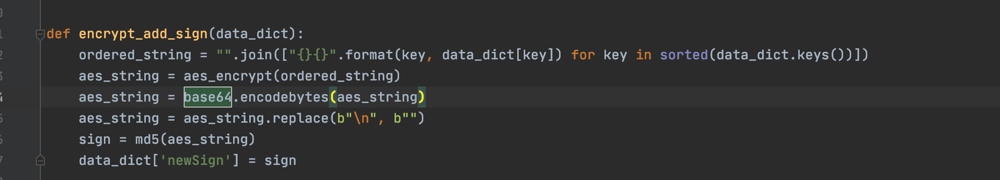


#### 4.m30618算法

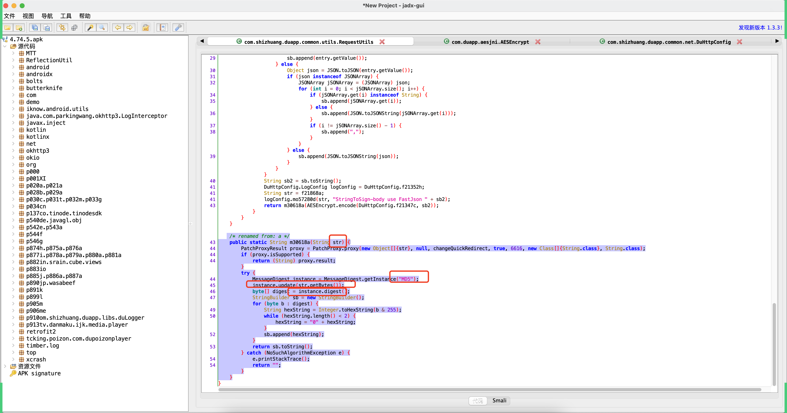

md5加密。


## 3.总结

```python
import hashlib
import random
from Crypto.Cipher import AES
from Crypto.Util.Padding import pad
import base64


def md5(data_bytes):
    hash_object = hashlib.md5()
    hash_object.update(data_bytes)
    return hash_object.hexdigest()


def aes_encrypt(data_string):
    key = "d245a0ba8d678a61"
    aes = AES.new(
        key=key.encode('utf-8'),
        mode=AES.MODE_ECB,
    )
    raw = pad(data_string.encode('utf-8'), 16)
    return aes.encrypt(raw)

def create_android_id(size=9):
    data_list = []
    for i in range(1, size):
        part = "".join(random.sample("0123456789ABCDEF", 2))
        data_list.append(part)
    return "".join(data_list).lower()

uuid = create_android_id()

# 1.处理参数
data_dict = {
    "limit":20,
    "page":0,
    "v":"4.74.5",
    "uuid":uuid
    ....
}

# 2.排序
ordered_string = "".join(["{}{}".format(key, data_dict[key]) for key in sorted(data_dict.keys())])


# 3.AES加密
res = aes_encrypt(ordered_string)
result = base64.encodebytes(res).replace(b"\n", b'')
print(result)

# 4.md5加密
newSign = md5(result)
print(newSign)
```


Hook验证：

- m30623c的返回值，就是newSign的值
- encode获取的str，明文（拼接）。


