# day16 x站

目标：搞B站的app刷播放。


## 1.抓包

- 版本：v6.24.0
- 安装到模拟器

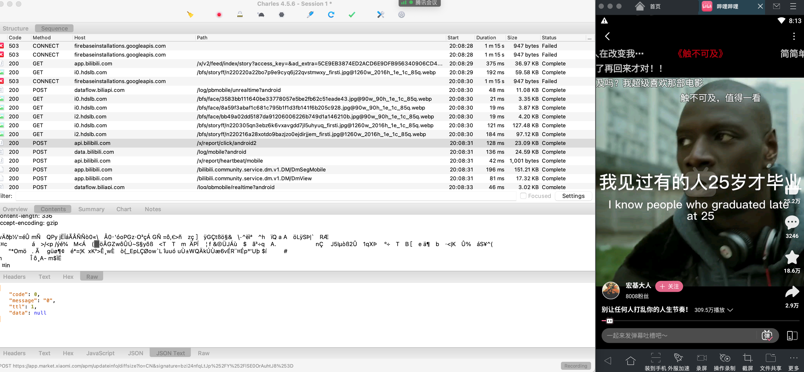

```
https://api.bilibili.com/x/report/click/android2
```


## 2.知识点的回顾

安卓开发时候如何想后台API发送请求？

- okhttp
- retrofit


## 3.反编译

搜索：

- URL
- 基于frida去Hook常见数据加密的算法，例如：AES、DES、3DES、RSA、gzip压缩。

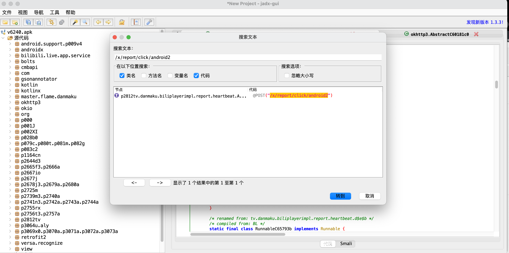

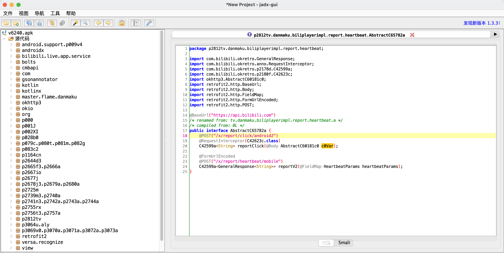

- 找谁调用的reportClick方法
- 请求体
- 拦截器


### 3.1 分析方法

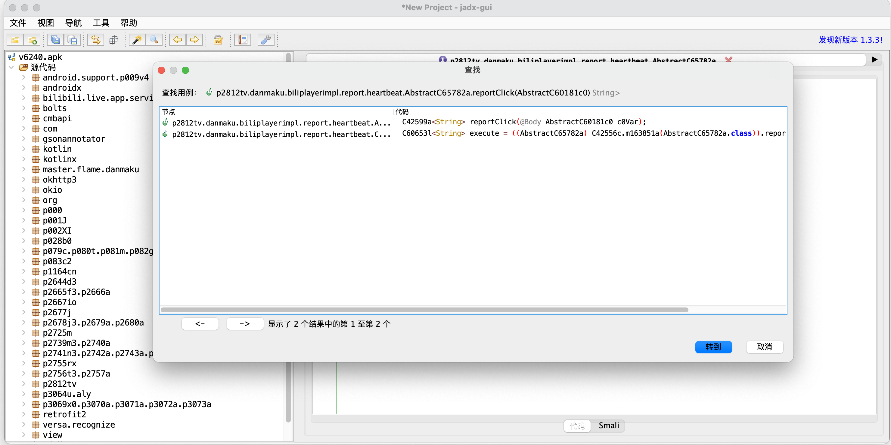


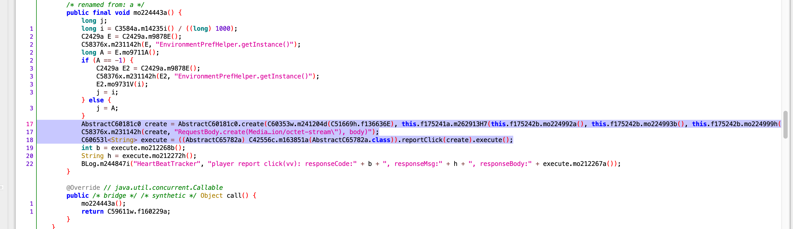


```
AbstractC60181c0 create = AbstractC60181c0.create(
	C60353w.m241204d(C51669h.f136636E), 
	
	// 核心生成请求体数据的地方
	this.f175241a.m262913H7(
		this.f175242b.mo224992a(), 
		this.f175242b.mo224993b(), 
		this.f175242b.mo224999h(), 
		i, 
		j, 
		this.f175242b.mo225005n(), 
		this.f175242b.mo225004m(), 
		this.f175242b.mo225002k(), 
		this.f175242b.mo224994c(), 
		this.f175242b.mo224996e(), 
		this.f175242b.mo225003l(), 
		this.f175242b.mo224997f()
	)
);

C58376x.m231142h(create, "RequestBody.create(Media…ion/octet-stream\"), body)");
C60653l<String> execute = ((AbstractC65782a) C42556c.m163851a(AbstractC65782a.class)).reportClick(create).execute();
```

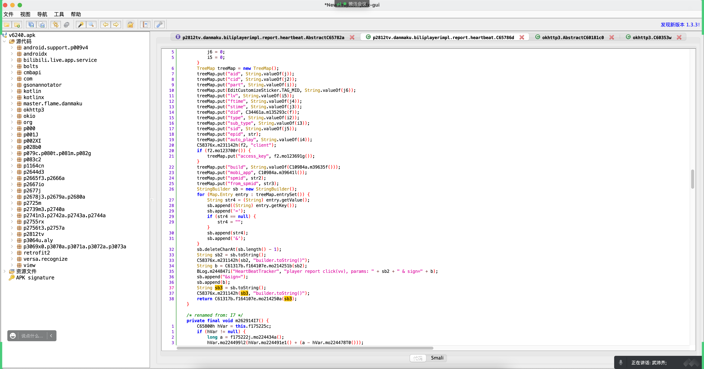

- 将参数的键值对通过 = 和 & 拼接。
- 签名算法 `String b = C61317b.f164107e.mo214251b(sb2);`
- sb3 = 在第一步的URL后面再去拼接 & sign=b
- 在调用 `C61317b.f164107e.mo214250a(sb3);`生成的值返回。


### 3.2 mo214251b算法

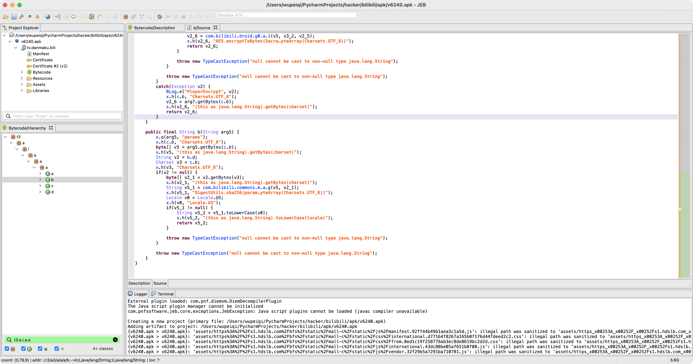


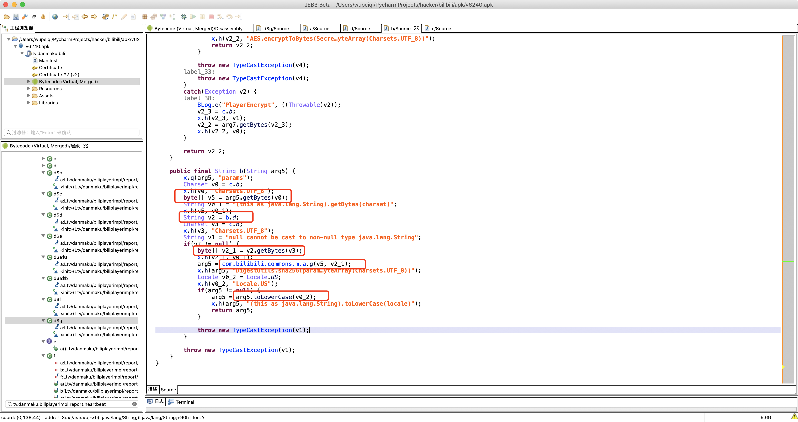

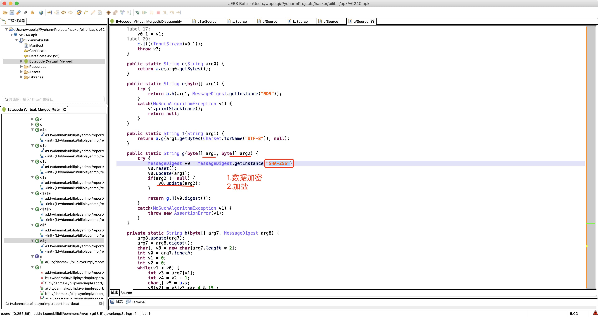


通过分析知道，这是一个sha256加密，盐是：**9cafa6466a028bfb**

hook:

```python
# t3.a.i.a.a.a.b 类
# b 方法名
```

```python
import frida
import sys

rdev = frida.get_remote_device()
session = rdev.attach("tv.danmaku.bili")

scr = """
Java.perform(function () {
    var b = Java.use("t3.a.i.a.a.a.b");


    b.b.implementation = function(str){
       console.log("传入的参数=",str);
       var res = this.b(str);
       console.log("sha256机密后=",res);
       return res;
    }

});
"""
script = session.create_script(scr)


def on_message(message, data):
    print(message, data)


script.on("message", on_message)
script.load()
sys.stdin.read()
```

```
传入的参数= aid=467109917&auto_play=0&build=6240300&cid=544349271&did=KREhESMUckN2EyMQbBBsFm5fOAw-XS1HIw&epid=&from_spmid=main.space-contribution.0.0&ftime=1646914092&lv=0&mid=0&mobi_app=android&part=1&sid=0&spmid=main.ugc-video-detail.0.0&stime=1646917308&sub_type=0&type=3
sha256机密后= e61583f49efa13187b053d2ab1cf2cc8cd99360367f42a6b7d013a49de72108e
```


```python
import hashlib

data = "aid=467109917&auto_play=0&build=6240300&cid=544349271&did=KREhESMUckN2EyMQbBBsFm5fOAw-XS1HIw&epid=&from_spmid=main.space-contribution.0.0&ftime=1646914092&lv=0&mid=0&mobi_app=android&part=1&sid=0&spmid=main.ugc-video-detail.0.0&stime=1646917308&sub_type=0&type=3"
salt = "9cafa6466a028bfb"
obj = hashlib.sha256()
obj.update(data.encode('utf-8'))
obj.update(salt.encode('utf-8'))

res = obj.hexdigest()
print(res)
# e61583f49efa13187b053d2ab1cf2cc8cd99360367f42a6b7d013a49de72108e
```


### 3.3 mo214250a算法

```
data = "aid=467109917&auto_play=0&build=6240300&cid=544349271&did=KREhESMUckN2EyMQbBBsFm5fOAw-XS1HIw&epid=&from_spmid=main.space-contribution.0.0&ftime=1646914092&lv=0&mid=0&mobi_app=android&part=1&sid=0&spmid=main.ugc-video-detail.0.0&stime=1646917308&sub_type=0&type=3&sign=e61583f49efa13187b053d2ab1cf2cc8cd99360367f42a6b7d013a49de72108e"
```


- 数据
- key="fd6b639dbcff0c2a1b03b389ec763c4b"
- iv="77b07a672d57d64c"


```
AES加密明文= aid=593851704&auto_play=0&build=6240300&cid=502986688&did=KREhESMUckN2EyMQbBBsFm5fOAw-XS1HIw&epid=&from_spmid=main.space-contribution.0.0&ftime=1646914092&lv=0&mid=0&mobi_app=android&part=1&sid=0&spmid=main.ugc-video-detail.0.0&stime=1646917961&sub_type=0&type=3&sign=b4f34c8a7d1c0cbbed8d7186850f9bfdbe21543f3b8c6b80e42c653f6e695172

AES加密密文= [object Object]
```


```python
from Crypto.Cipher import AES

def aes_encrypt(data_string):
    aes = AES.new(
        key=KEY.encode('utf-8'),
        mode=AES.MODE_CBC,
        iv=IV.encode('utf-8')
    )
    raw = pad(data_string.encode('utf-8'), 16)
    return aes.encrypt(raw)
```


```python
# 明文 aid=893408532&auto_play=0&build=6240300&cid=492151449&did=KREhESMUckN2EyMQbBBsFm5fOAw-XS1HIw&epid=&from_spmid=main.space-contribution.0.0&ftime=1646914092&lv=0&mid=0&mobi_app=android&part=1&sid=0&spmid=main.ugc-video-detail.0.0&stime=1646918060&sub_type=0&type=3&sign=3c56bea2c9740b391c48254442ec62794915b4a4b5e0a0664a5c941ab030b6db

# - key="fd6b639dbcff0c2a1b03b389ec763c4b"
# - iv="77b07a672d57d64c"

# 加密后的字节数组
# result = [68, 50, -54, 48, 17, 30, -123, -26, -117, 64, -101, -80, 89, -113, 16, 77, 16, -115, -120, -110, -47, -71, 79, 123, -106, 47, -118, -79, 86, 31, -1, -62, 12, 70, 112, -72, -21, -58, -5, -70, -64, -33, -110, 26, -37, -14, -126, -117, 99, 104, 88, 60, 103, -37, -47, 97, 43, -101, -106, -112, -90, 111, -85, 14, -91, 3, 119, 35, -31, 99, -109, 109, 22, 56, 47, 19, -43, -62, -31, -34, 101, -128, -59, -35, 92, 90, -25, 95, -108, -72, -34, 46, -36, -85, -60, 109, -27, 72, 75, 33, 24, 66, -53, -19, -74, 17, 10, 113, -95, -118, -21, -93, 64, -98, -106, -24, 35, 3, 9, 69, -30, 86, 104, -97, 117, -105, -52, -86, 100, -117, 77, -66, -3, -57, 41, -11, -89, 54, -109, 110, -17, 100, -69, 60, -21, -102, 10, -83, -75, -3, -73, 63, -79, 94, -87, -86, -99, -94, 50, 110, 64, -11, 93, -61, 122, 95, -32, -40, -88, 88, 54, -53, -102, -71, -60, 50, -62, -6, 21, -8, -18, -38, -51, 1, 65, -105, -31, 124, 123, -107, 112, 72, -9, -122, -19, -66, -52, 25, 124, -15, -49, 40, -10, 13, -78, 10, -125, -12, 65, 122, 61, 73, -67, -75, -75, -83, -50, -14, -9, 78, -115, 58, 8, 107, 47, 28, -120, -56, 95, -89, 127, 85, -6, -25, 53, -122, -110, 5, -93, 127, 67, -68, -115, 34, -35, -65, 86, 41, 98, -113, -19, 22, 57, -116, -124, 3, 29, -68, 21, -40, 91, -119, -106, 5, -114, 7, 69, -76, -4, -51, 17, 65, 14, -75, 100, -60, 123, 56, -3, 88, 97, 107, -20, 82, 5, 73, 94, 20, 42, 12, 73, -127, 99, -62, 106, -47, 84, 62, -34, -62, 75, 1, 127, -48, 60, 111, 109, 109, 35, -117, -67, -24, 43, 65, 122, 7, -115, -52, 113, -46, 122, 75, 98, -45, 124, 60, 11, 91, -54, -72, -114, -12, 43, -55, 38, -84]


from Crypto.Cipher import AES
from Crypto.Util.Padding import pad

KEY = "fd6b639dbcff0c2a1b03b389ec763c4b"
IV = "77b07a672d57d64c"


def aes_encrypt(data_string):
    aes = AES.new(
        key=KEY.encode('utf-8'),
        mode=AES.MODE_CBC,
        iv=IV.encode('utf-8')
    )
    raw = pad(data_string.encode('utf-8'), 16)
    return aes.encrypt(raw)


data = "aid=893408532&auto_play=0&build=6240300&cid=492151449&did=KREhESMUckN2EyMQbBBsFm5fOAw-XS1HIw&epid=&from_spmid=main.space-contribution.0.0&ftime=1646914092&lv=0&mid=0&mobi_app=android&part=1&sid=0&spmid=main.ugc-video-detail.0.0&stime=1646918060&sub_type=0&type=3&sign=3c56bea2c9740b391c48254442ec62794915b4a4b5e0a0664a5c941ab030b6db"
res = aes_encrypt(data)
print(res)
# b'D2\xca0\x11\x1e\x85\xe6\x8b@\x9b\xb0Y\x8f\x10M\x10\x8d\x88\x92\xd1\xb9O{\x96/\x8a\xb1V\x1f\xff\xc2\x0cFp\xb8\xeb\xc6\xfb\xba\xc0\xdf\x92\x1a\xdb\xf2\x82\x8bchX<g\xdb\xd1a+\x9b\x96\x90\xa6o\xab\x0e\xa5\x03w#\xe1c\x93m\x168/\x13\xd5\xc2\xe1\xdee\x80\xc5\xdd\\Z\xe7_\x94\xb8\xde.\xdc\xab\xc4m\xe5HK!\x18B\xcb\xed\xb6\x11\nq\xa1\x8a\xeb\xa3@\x9e\x96\xe8#\x03\tE\xe2Vh\x9fu\x97\xcc\xaad\x8bM\xbe\xfd\xc7)\xf5\xa76\x93n\xefd\xbb<\xeb\x9a\n\xad\xb5\xfd\xb7?\xb1^\xa9\xaa\x9d\xa22n@\xf5]\xc3z_\xe0\xd8\xa8X6\xcb\x9a\xb9\xc42\xc2\xfa\x15\xf8\xee\xda\xcd\x01A\x97\xe1|{\x95pH\xf7\x86\xed\xbe\xcc\x19|\xf1\xcf(\xf6\r\xb2\n\x83\xf4Az=I\xbd\xb5\xb5\xad\xce\xf2\xf7N\x8d:\x08k/\x1c\x88\xc8_\xa7\x7fU\xfa\xe75\x86\x92\x05\xa3\x7fC\xbc\x8d"\xdd\xbfV)b\x8f\xed\x169\x8c\x84\x03\x1d\xbc\x15\xd8[\x89\x96\x05\x8e\x07E\xb4\xfc\xcd\x11A\x0e\xb5d\xc4{8\xfdXak\xecR\x05I^\x14*\x0cI\x81c\xc2j\xd1T>\xde\xc2K\x01\x7f\xd0<omm#\x8b\xbd\xe8+Az\x07\x8d\xccq\xd2zKb\xd3|<\x0b[\xca\xb8\x8e\xf4+\xc9&\xac'

result = [item for item in res]
print(result)
hook_result = [68, 50, -54, 48, 17, 30, -123, -26, -117, 64, -101, -80, 89, -113, 16, 77, 16, -115, -120, -110, -47, -71, 79, 123, -106, 47, -118, -79, 86, 31, -1, -62, 12, 70, 112, -72, -21, -58, -5, -70, -64, -33, -110, 26, -37, -14, -126, -117, 99, 104, 88, 60, 103, -37, -47, 97, 43, -101, -106, -112, -90, 111, -85, 14, -91, 3, 119, 35, -31, 99, -109, 109, 22, 56, 47, 19, -43, -62, -31, -34, 101, -128, -59, -35, 92, 90, -25, 95, -108, -72, -34, 46, -36, -85, -60, 109, -27, 72, 75, 33, 24, 66, -53, -19, -74, 17, 10, 113, -95, -118, -21, -93, 64, -98, -106, -24, 35, 3, 9, 69, -30, 86, 104, -97, 117, -105, -52, -86, 100, -117, 77, -66, -3, -57, 41, -11, -89, 54, -109, 110, -17, 100, -69, 60, -21, -102, 10, -83, -75, -3, -73, 63, -79, 94, -87, -86, -99, -94, 50, 110, 64, -11, 93, -61, 122, 95, -32, -40, -88, 88, 54, -53, -102, -71, -60, 50, -62, -6, 21, -8, -18, -38, -51, 1, 65, -105, -31, 124, 123, -107, 112, 72, -9, -122, -19, -66, -52, 25, 124, -15, -49, 40, -10, 13, -78, 10, -125, -12, 65, 122, 61, 73, -67, -75, -75, -83, -50, -14, -9, 78, -115, 58, 8, 107, 47, 28, -120, -56, 95, -89, 127, 85, -6, -25, 53, -122, -110, 5, -93, 127, 67, -68, -115, 34, -35, -65, 86, 41, 98, -113, -19, 22, 57, -116, -124, 3, 29, -68, 21, -40, 91, -119, -106, 5, -114, 7, 69, -76, -4, -51, 17, 65, 14, -75, 100, -60, 123, 56, -3, 88, 97, 107, -20, 82, 5, 73, 94, 20, 42, 12, 73, -127, 99, -62, 106, -47, 84, 62, -34, -62, 75, 1, 127, -48, 60, 111, 109, 109, 35, -117, -67, -24, 43, 65, 122, 7, -115, -52, 113, -46, 122, 75, 98, -45, 124, 60, 11, 91, -54, -72, -114, -12, 43, -55, 38, -84]
print(hook_result)

# [68, 50, 202, 48, 17, 30, 133, 230, 139, 64, 155, 176, 89, 143, 16, 77, 16, 141, 136, 146, 209, 185, 79, 123, 150, 47, 138, 177, 86, 31, 255, 194, 12, 70, 112, 184, 235, 198, 251, 186, 192, 223, 146, 26, 219, 242, 130, 139, 99, 104, 88, 60, 103, 219, 209, 97, 43, 155, 150, 144, 166, 111, 171, 14, 165, 3, 119, 35, 225, 99, 147, 109, 22, 56, 47, 19, 213, 194, 225, 222, 101, 128, 197, 221, 92, 90, 231, 95, 148, 184, 222, 46, 220, 171, 196, 109, 229, 72, 75, 33, 24, 66, 203, 237, 182, 17, 10, 113, 161, 138, 235, 163, 64, 158, 150, 232, 35, 3, 9, 69, 226, 86, 104, 159, 117, 151, 204, 170, 100, 139, 77, 190, 253, 199, 41, 245, 167, 54, 147, 110, 239, 100, 187, 60, 235, 154, 10, 173, 181, 253, 183, 63, 177, 94, 169, 170, 157, 162, 50, 110, 64, 245, 93, 195, 122, 95, 224, 216, 168, 88, 54, 203, 154, 185, 196, 50, 194, 250, 21, 248, 238, 218, 205, 1, 65, 151, 225, 124, 123, 149, 112, 72, 247, 134, 237, 190, 204, 25, 124, 241, 207, 40, 246, 13, 178, 10, 131, 244, 65, 122, 61, 73, 189, 181, 181, 173, 206, 242, 247, 78, 141, 58, 8, 107, 47, 28, 136, 200, 95, 167, 127, 85, 250, 231, 53, 134, 146, 5, 163, 127, 67, 188, 141, 34, 221, 191, 86, 41, 98, 143, 237, 22, 57, 140, 132, 3, 29, 188, 21, 216, 91, 137, 150, 5, 142, 7, 69, 180, 252, 205, 17, 65, 14, 181, 100, 196, 123, 56, 253, 88, 97, 107, 236, 82, 5, 73, 94, 20, 42, 12, 73, 129, 99, 194, 106, 209, 84, 62, 222, 194, 75, 1, 127, 208, 60, 111, 109, 109, 35, 139, 189, 232, 43, 65, 122, 7, 141, 204, 113, 210, 122, 75, 98, 211, 124, 60, 11, 91, 202, 184, 142, 244, 43, 201, 38, 172]
# [68, 50, -54, 48, 17, 30, -123, -26, -117, 64, -101, -80, 89, -113, 16, 77, 16, -115, -120, -110, -47, -71, 79, 123, -106, 47, -118, -79, 86, 31, -1, -62, 12, 70, 112, -72, -21, -58, -5, -70, -64, -33, -110, 26, -37, -14, -126, -117, 99, 104, 88, 60, 103, -37, -47, 97, 43, -101, -106, -112, -90, 111, -85, 14, -91, 3, 119, 35, -31, 99, -109, 109, 22, 56, 47, 19, -43, -62, -31, -34, 101, -128, -59, -35, 92, 90, -25, 95, -108, -72, -34, 46, -36, -85, -60, 109, -27, 72, 75, 33, 24, 66, -53, -19, -74, 17, 10, 113, -95, -118, -21, -93, 64, -98, -106, -24, 35, 3, 9, 69, -30, 86, 104, -97, 117, -105, -52, -86, 100, -117, 77, -66, -3, -57, 41, -11, -89, 54, -109, 110, -17, 100, -69, 60, -21, -102, 10, -83, -75, -3, -73, 63, -79, 94, -87, -86, -99, -94, 50, 110, 64, -11, 93, -61, 122, 95, -32, -40, -88, 88, 54, -53, -102, -71, -60, 50, -62, -6, 21, -8, -18, -38, -51, 1, 65, -105, -31, 124, 123, -107, 112, 72, -9, -122, -19, -66, -52, 25, 124, -15, -49, 40, -10, 13, -78, 10, -125, -12, 65, 122, 61, 73, -67, -75, -75, -83, -50, -14, -9, 78, -115, 58, 8, 107, 47, 28, -120, -56, 95, -89, 127, 85, -6, -25, 53, -122, -110, 5, -93, 127, 67, -68, -115, 34, -35, -65, 86, 41, 98, -113, -19, 22, 57, -116, -124, 3, 29, -68, 21, -40, 91, -119, -106, 5, -114, 7, 69, -76, -4, -51, 17, 65, 14, -75, 100, -60, 123, 56, -3, 88, 97, 107, -20, 82, 5, 73, 94, 20, 42, 12, 73, -127, 99, -62, 106, -47, 84, 62, -34, -62, 75, 1, 127, -48, 60, 111, 109, 109, 35, -117, -67, -24, 43, 65, 122, 7, -115, -52, 113, -46, 122, 75, 98, -45, 124, 60, 11, 91, -54, -72, -114, -12, 43, -55, 38, -84]

```


### 3.4 参数

```
aid=467109917&auto_play=0&build=6240300&cid=544349271&did=KREhESMUckN2EyMQbBBsFm5fOAw-XS1HIw&epid=&from_spmid=main.space-contribution.0.0&ftime=1646914092&lv=0&mid=0&mobi_app=android&part=1&sid=0&spmid=main.ugc-video-detail.0.0&stime=1646917308&sub_type=0&type=3

aid=893408532&auto_play=0&build=6240300&cid=492151449&did=KREhESMUckN2EyMQbBBsFm5fOAw-XS1HIw&epid=&from_spmid=main.space-contribution.0.0&ftime=1646914092&lv=0&mid=0&mobi_app=android&part=1&sid=0&spmid=main.ugc-video-detail.0.0&stime=1646918060&sub_type=0&type=3
```

```
{
  "aid": "467109917",  # 视频相关ID
  "auto_play": "0",
  "build": "6240300",
  "cid": "544349271",  # 视频相关ID
  "did": "KREhESMUckN2EyMQbBBsFm5fOAw-XS1HIw",   # 设备ID
  "epid": "",
  "from_spmid": "main.space-contribution.0.0",
  "ftime": "1646914092",  # 首次运行时间
  "lv": "0",
  "mid": "0",
  "mobi_app": "android",
  "part": "1",
  "sid": "0",
  "spmid": "main.ugc-video-detail.0.0",
  "stime": "1646917308",  # 当前时间
  "sub_type": "0",
  "type": "3"
}
```

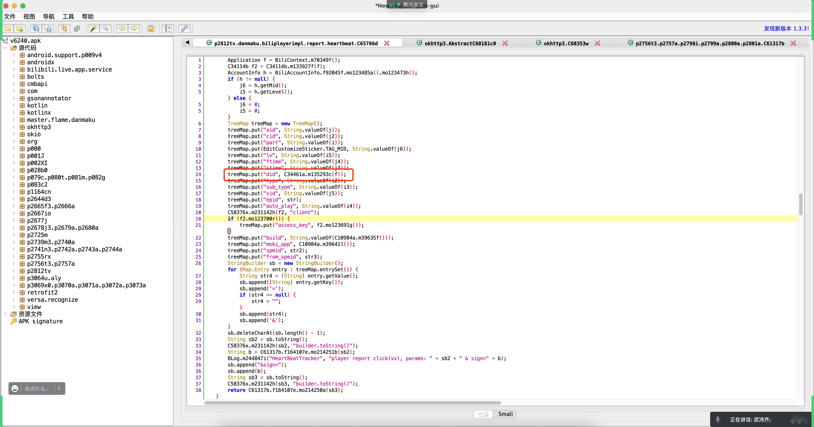

如何找到did？

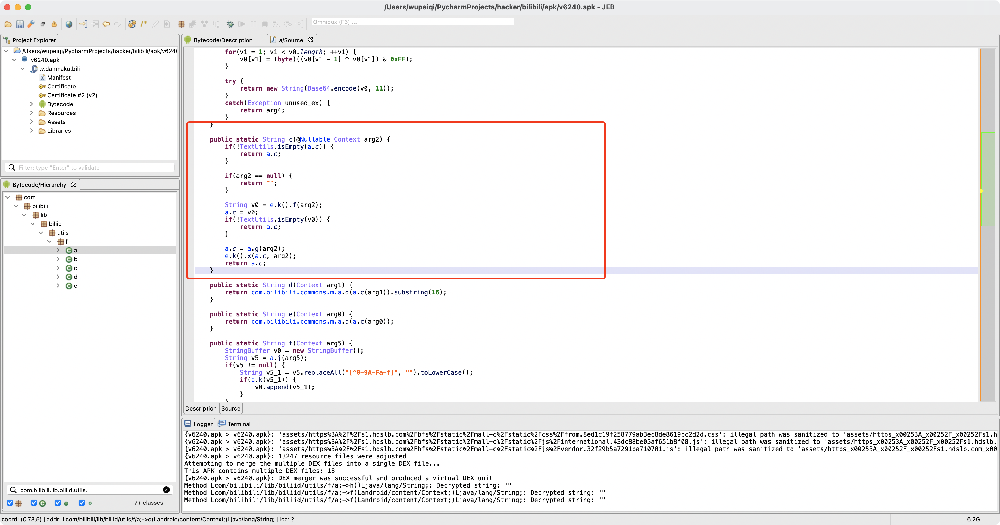

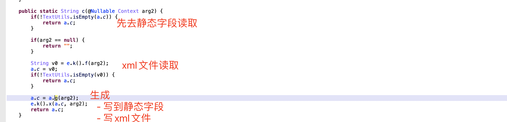


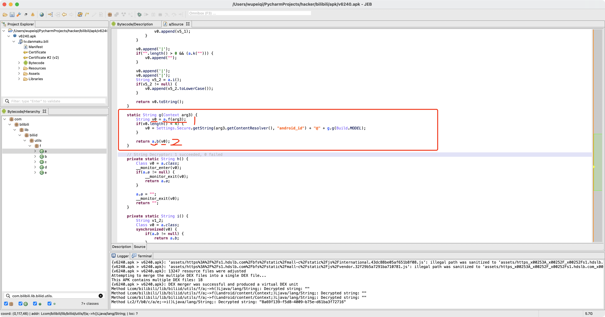


- a.f方法
  
- a.b方法


#### 3.4.1 a.f方法

```python
import frida
import sys

rdev = frida.get_remote_device()
session = rdev.attach("tv.danmaku.bili")

scr = """
Java.perform(function () {
    var b = Java.use("com.bilibili.lib.biliid.utils.f.a");


    b.f.implementation = function(context){
       var res = this.f(context);
       console.log("===>",res);
       return res;
    }

});
"""
script = session.create_script(scr)


def on_message(message, data):
    print(message, data)


script.on("message", on_message)
script.load()
sys.stdin.read()
```

```
080027f15e03|||zx1g42cpjd
```

```python
import random
import string


def create_random_mac(sep=":"):
    """ 随机生成mac地址 """

    def mac_same_char(mac_string):
        v0 = mac_string[0]
        index = 1
        while index < len(mac_string):
            if v0 != mac_string[index]:
                return False
            index += 1
        return True

    data_list = []
    for i in range(1, 7):
        part = "".join(random.sample("0123456789ABCDEF", 2))
        data_list.append(part)
    mac = sep.join(data_list)

    if not mac_same_char(mac) and mac != "02:00:00:00:00:00":
        return mac

    return create_random_mac(sep)


def gen_sn():
    return "".join(random.sample("123456789" + string.ascii_lowercase, 10))


mac_string = create_random_mac(sep="")
sn = gen_sn()

res = "{}|||{}".format(mac_string, sn)
print(res)
```


#### 3.4.2 a.b

```
a.b("080027f15e03|||zx1g42cpjd")
```

```java
public static String b(String arg4) {
    byte[] v0 = arg4.getBytes();
    v0[0] = (byte)(v0[0] ^ ((byte)(v0.length & 0xFF)));
    int v1;
    for(v1 = 1; v1 < v0.length; ++v1) {
        v0[v1] = (byte)((v0[v1 - 1] ^ v0[v1]) & 0xFF);
    }
    try {
        return new String(Base64.encode(v0, 11));
    }
    catch(Exception unused_ex) {
        return arg4;
    }
}
```

```python
import base64

def b(arg4):
    v0 = bytearray(arg4.encode('utf-8'))
    v0[0] = v0[0] ^ (len(v0) & 0xFF)
    for v1 in range(1, len(v0)):
        v0[v1] = (v0[v1 - 1] ^ v0[v1]) & 0xFF
    res = base64.encodebytes(bytes(v0))
    return res.strip().strip(b"==").decode('utf-8')


result = b("080027f15e03|||zx1g42cpjd")
print(result)  # b'KREhESMUckN2EyMQbBBsFm5fOAw+XS1HIw==\n'
```


## 总结

目标：刷播放。

- 参数构造

  ```
  {
    "aid": "467109917",  # 视频相关ID，发送请求获取各种ID
    "auto_play": "0",
    "build": "6240300",
    "cid": "544349271",  # 视频相关ID，发送请求获取各种ID
    "did": "KREhESMUckN2EyMQbBBsFm5fOAw-XS1HIw",   # 设备ID，算法生成。
    "epid": "",
    "from_spmid": "main.space-contribution.0.0",
    "ftime": "1646914092",  # 首次运行时间
    "lv": "0",
    "mid": "0",
    "mobi_app": "android",
    "part": "1",
    "sid": "0",
    "spmid": "main.ugc-video-detail.0.0",
    "stime": "1646917308",  # 当前时间
    "sub_type": "0",
    "type": "3"
  }
  ```

- sha256加密 （有序）

- 拼接sign=加密 （有序）

- AES加密

上述过程搞定后，请求体就算完成了...


**留给大家的问题，你就要去尝试找：**

- 找buvid等参数（请求头）
- 心跳中sign签名


