# day17 x站（中）

今日目标：刷播放

- 上节：请求体
- 本节：请求头


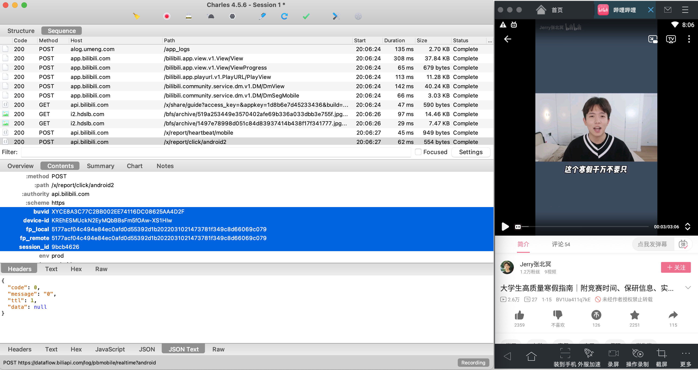

- buvid 【任务1】
- device-id = 上一节的did
- fp_local & fp_remote => 相同【任务1】
- session_id【任务2】

```
https://api.bilibili.com/x/report/click/android2
	- 请求体
	- 请求头
```


## 1.buvid

- 搜索关键字 & Hook
- 请求含有拦截器，请求体或公共的参数都会放在拦截器中实现。

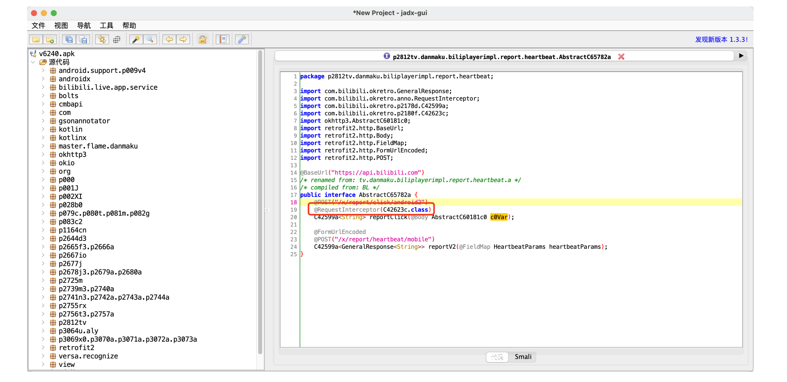

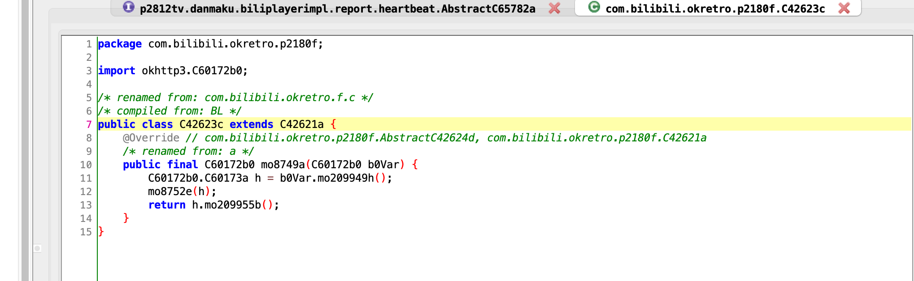

```python
class Foo(Base):
    def run():
        ..
    
在内部一定执行run方法。
```

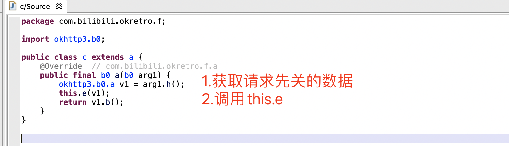

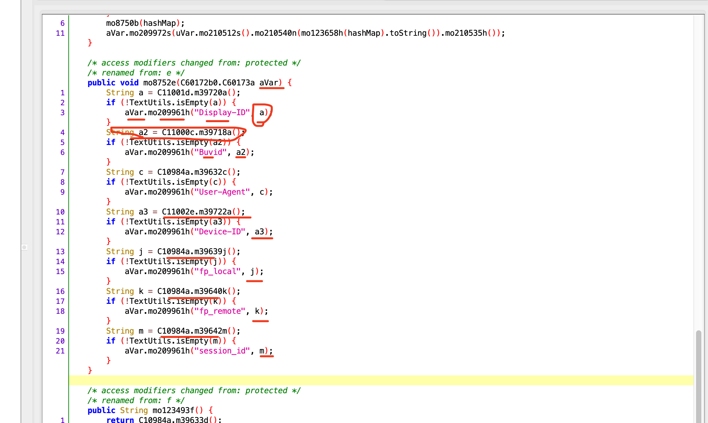

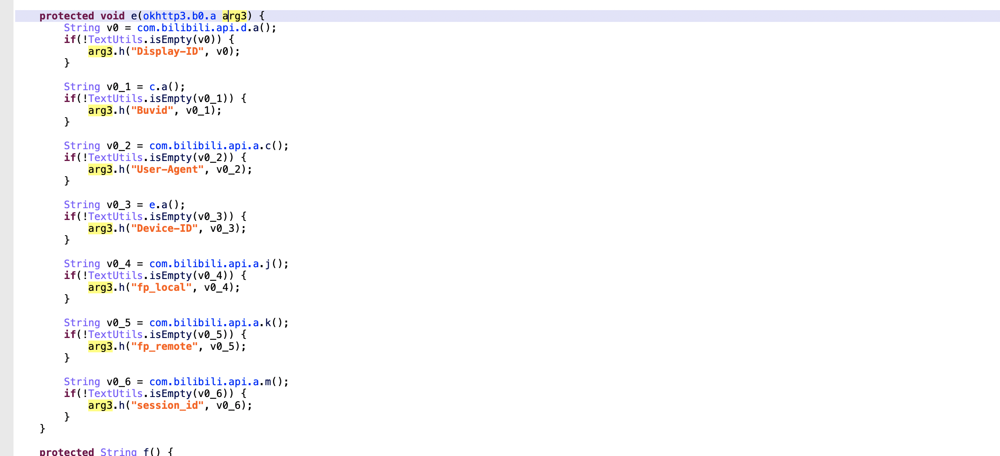

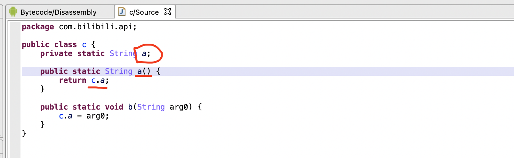


a值的生成规则和算法在哪里？

```
一定是人给静态字段赋值，后面才获取的到的值。
	- 其他地方调用b方法，将buvid当做参数传递过来。
	- 是否有可能，其他地方不调用b方法赋值，而是直接 c.a = "xxxxxx" ，是否有可能？【无】
```

下一步：到底是谁调用b做的赋值？我们怎么知道谁调用了b？

```
	- hook这个b方法，获取他的调用栈。 【更精准】
	- c.b                          
```

```python
import frida
import sys

rdev = frida.get_remote_device()
session = rdev.attach("tv.danmaku.bili")

scr = """
Java.perform(function () {
    var c = Java.use("com.bilibili.api.c");

    c.b.implementation = function(arg0){   
       console.log("buvid=",arg0);
       console.log(Java.use("android.util.Log").getStackTraceString(Java.use("java.lang.Throwable").$new()));
       this.b(arg0);
    }

});
"""
script = session.create_script(scr)


def on_message(message, data):
    print(message, data)


script.on("message", on_message)
script.load()
sys.stdin.read()
```

启动程序时，已经生成了。 清楚数据

```
buvid= XYCE8A3C77C2BB002EE74116DC08625AA4D2F

java.lang.Throwable
	at com.bilibili.api.c.b(Native Method)
	at c2.f.b0.c.a.d.e(BL:1)
	at c2.f.b0.c.a.d.a(BL:11)
	at tv.danmaku.bili.utils.x.a(BL:14)
	at tv.danmaku.bili.proc.y.f(BL:1)
	at tv.danmaku.bili.proc.c.run(lambda)
	at android.os.Handler.handleCallback(Handler.java:739)
	at android.os.Handler.dispatchMessage(Handler.java:95)
	at android.os.Looper.loop(Looper.java:148)
	at android.os.HandlerThread.run(HandlerThread.java:61)

buvid= XYCE8A3C77C2BB002EE74116DC08625AA4D2F
java.lang.Throwable
	at com.bilibili.api.c.b(Native Method)
	at c2.f.b0.c.a.d.e(BL:1)
	at c2.f.b0.c.a.d.a(BL:11)
	at tv.danmaku.bili.utils.BiliInitHelper$initConfig$2.invoke(BL:1)
	at tv.danmaku.bili.utils.BiliInitHelper$initConfig$2.invoke(BL)
```


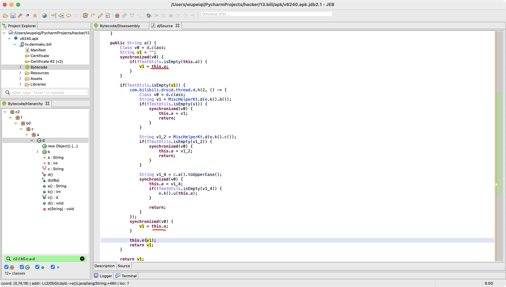

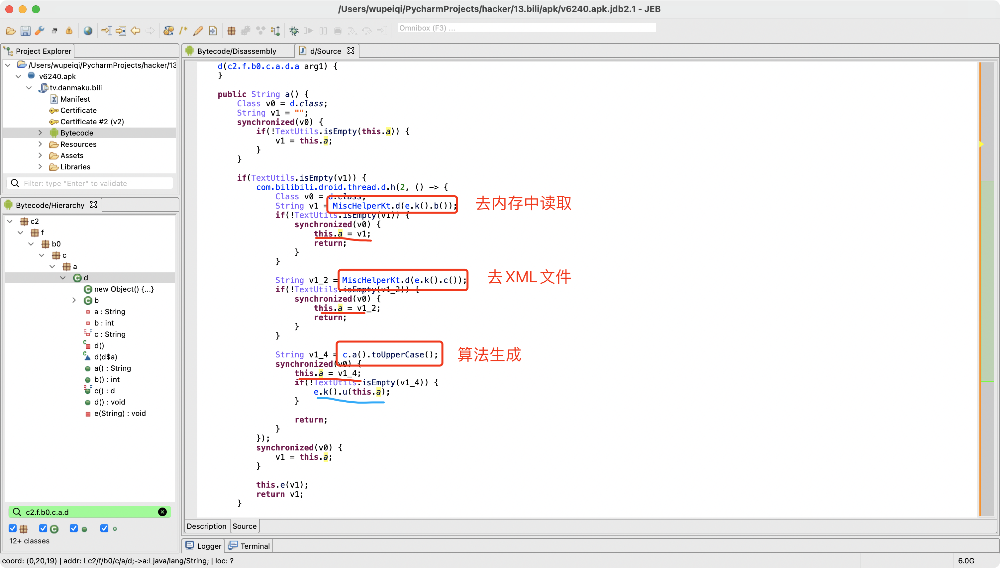

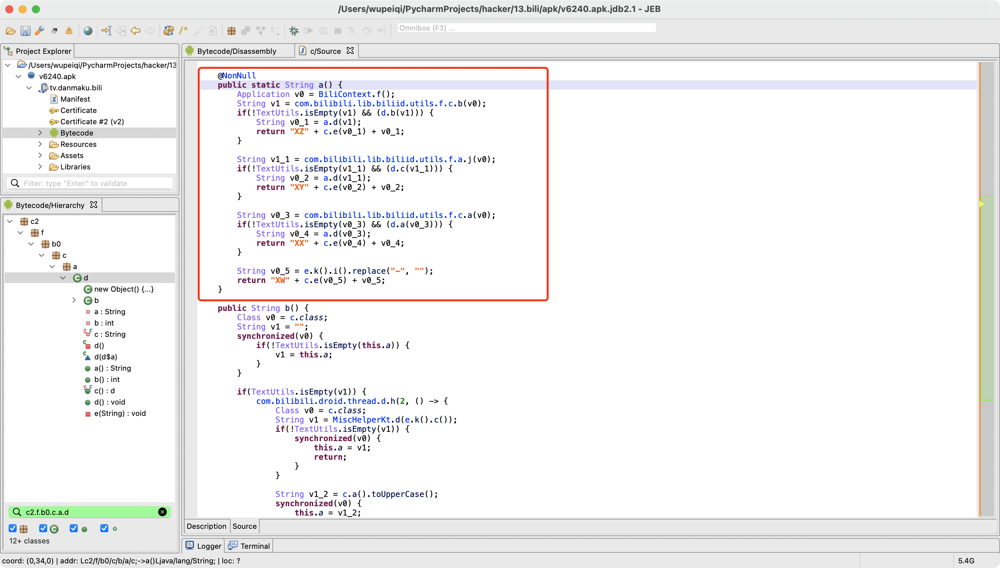

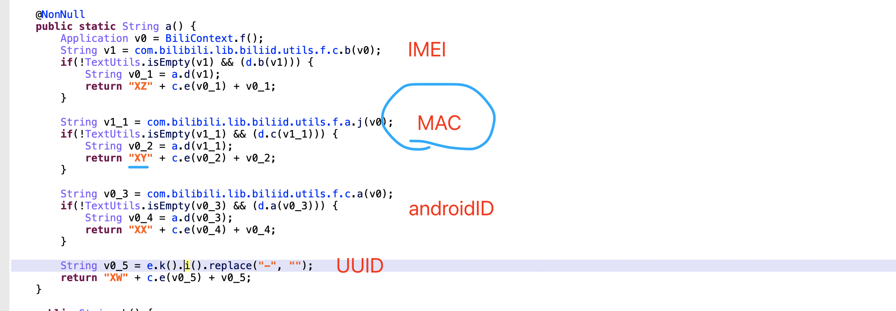


```
v1_1 = mac地址
结果 = a.d(mac地址)   -> a.d就是md5加密

xy + c.e(md5结果) + 结果
xy + md5结果[2] + md5结果[12] + md5结果[22] + 结果

再处理成大写。
```


```python
import uuid
import hashlib
import random


def create_random_mac(sep=":"):
    # 00:90:4C:11:22:33
    data_list = []
    for i in range(1, 7):
        part = "".join(random.sample("0123456789ABCDEF", 2))
        data_list.append(part)
    mac = sep.join(data_list)
    if mac != "00:90:4C:11:22:33":
        return mac
    return create_random_mac(sep)


def get_buvid_by_wifi_mac():
    mac = create_random_mac()
    md5 = hashlib.md5()
    md5.update(mac.encode('utf-8'))
    v0_1 = md5.hexdigest()
    return "XY{}{}{}{}".format(v0_1[2], v0_1[12], v0_1[22], v0_1).upper()


if __name__ == '__main__':
    buvid = get_buvid_by_wifi_mac()
    print(buvid)
```


## 2.session_id

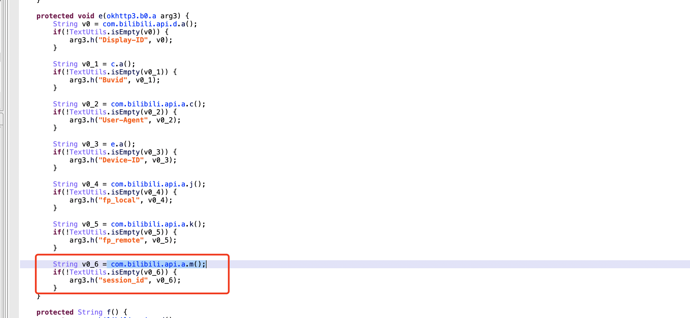

```
/* renamed from: m */
public static String m39642m() {
    m39630a();
    // 接口.getSessionId();
    return f27838b.getSessionId();   // f27838b是那个类？
}
```

```java
public interface AbstractC10986b {
    String getChannel();

    @NonNull
    String getSessionId();

    @Nullable
    /* renamed from: z */
    String mo61923z();
}
```


接下来怎么办？

```
- 找哪些类实现AbstractC10986b接口，在这个类中定义getSessionId方法去实现。
- 找a.b到底是那个类？
```

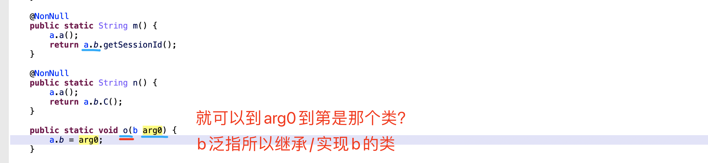

hook + 调用。

```
java.lang.Throwable
	at com.bilibili.api.a.o(Native Method)
	at tv.danmaku.bili.utils.p.b(BL:1)
	at tv.danmaku.bili.proc.MainBiliAppProc.v(BL:2)
	at tv.danmaku.bili.proc.k.invoke(lambda)
	at tv.danmaku.bili.delaytask.a.l(BL:3)
	at tv.danmaku.bili.delaytask.a.e(BL:2)
	at com.bilibili.base.util.a.e(BL:1)
	at tv.danmaku.bili.ui.main2.userprotocol.e.onClick(BL:4)
	at android.view.View.performClick(View.java:5204)
	at android.view.View$PerformClick.run(View.java:21153)
	at android.os.Handler.handleCallback(Handler.java:739)
	at android.os.Handler.dispatchMessage(Handler.java:95)
	at android.os.Looper.loop(Looper.java:148)
	at android.app.ActivityThread.main(ActivityThread.java:5647)
	at java.lang.reflect.Method.invoke(Native Method)
	at com.android.internal.os.ZygoteInit$MethodAndArgsCaller.run(ZygoteInit.java:745)
	at com.android.internal.os.ZygoteInit.main(ZygoteInit.java:635)
```

```
 a.o(new xx())
 
a.o(new xx(){
	成员..
	。。。

})
```

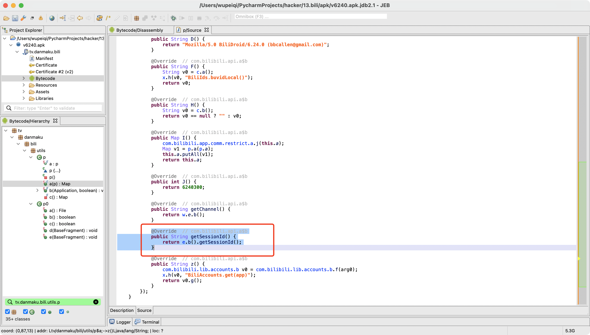

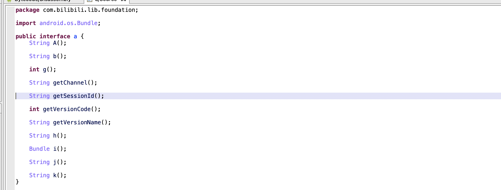

分析：

```
e.b().getSessionID()
e.b() 应该是实现接口的类的对象。
```

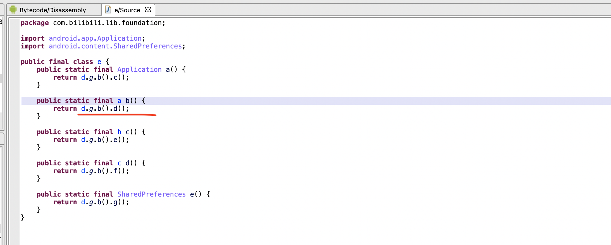

```
this.a = new DefaultApps(this.e.a());
```

```
new DefaultApps(this.e.a());
DefaultApps.getSessionID()
```

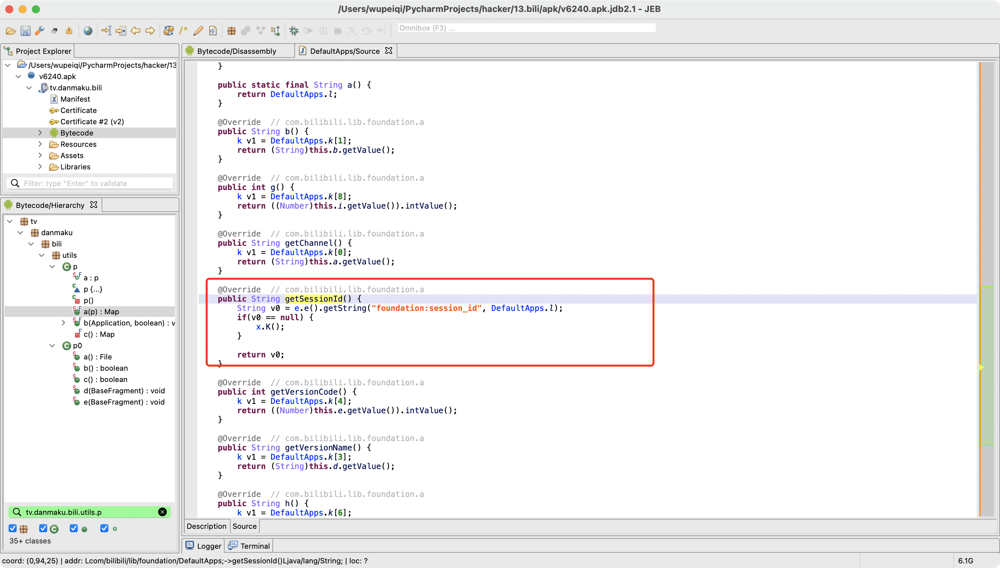

先去XML文件中读取，没有的话就用 DefaultApps.l为默认值。


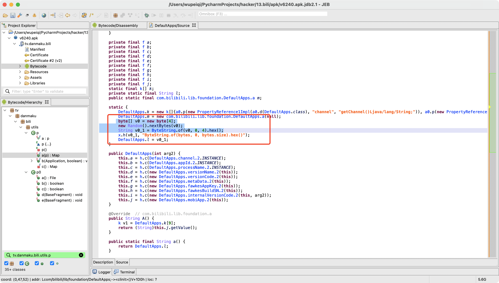

所以，这个session_id就是一个随机值。

```
import random

session_id = "".join([hex(item)[2:] for item in random.randbytes(4)])
print(session_id)
```


问题：

```
public Foo{

	public void setName(String v1){
		Foo.name = v1;
	}
	
	public String getName(){
		return Foo.name;
	}
}
```


## 3.fp_local

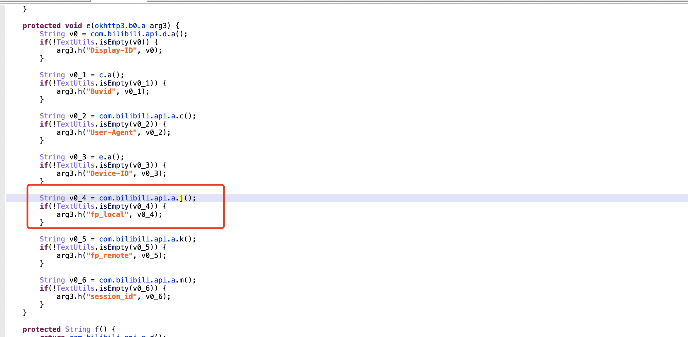

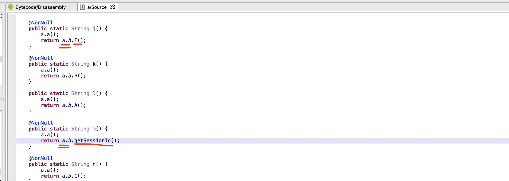


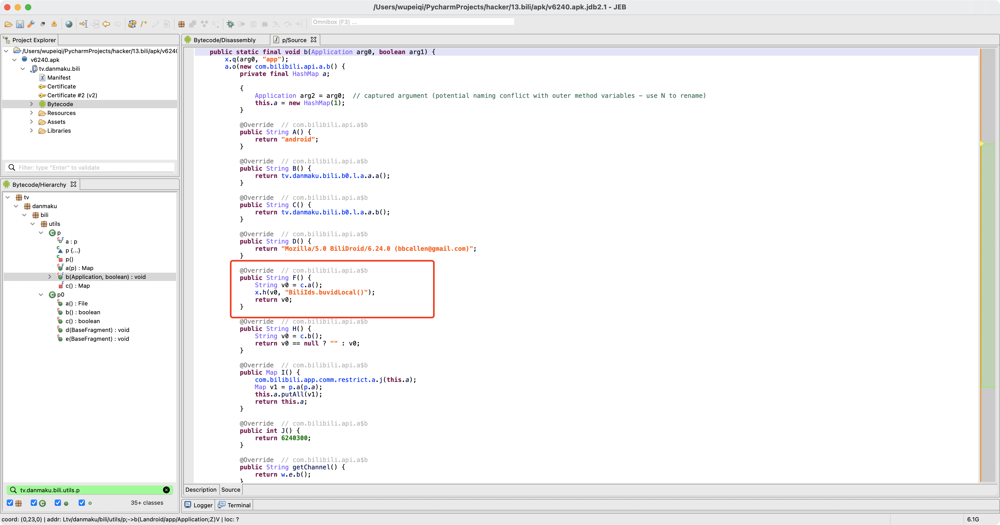

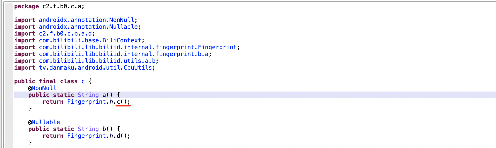

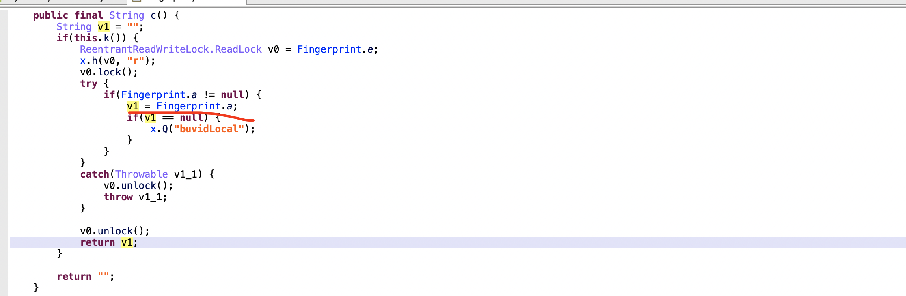

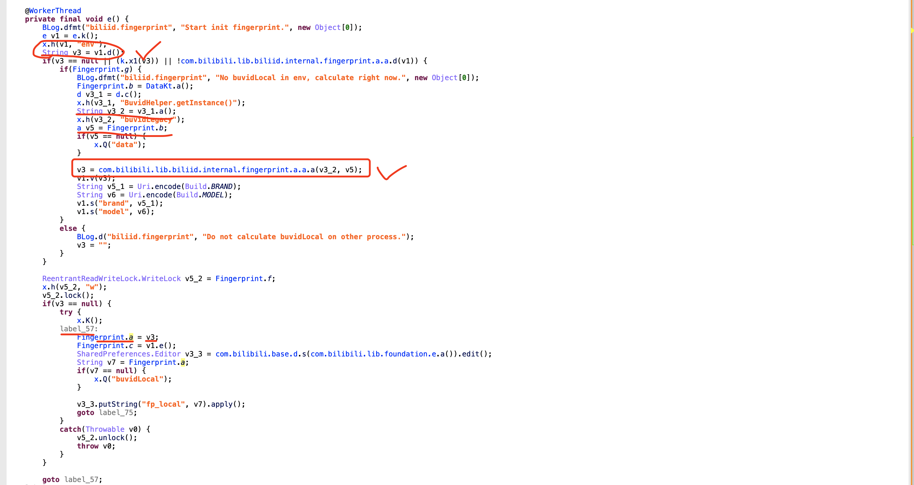

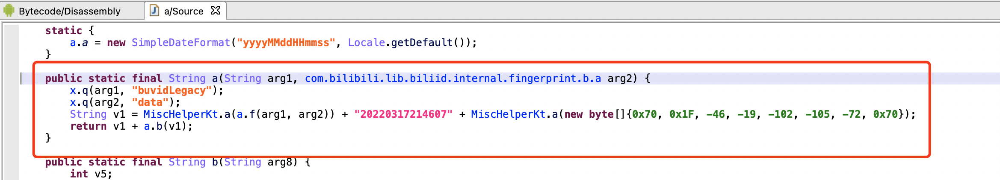

```
参数arg1= XYCE8A3C77C2BB002EE74116DC08625AA4D2F
         
```

- a.f(arg1, arg2)

  ```
  md5结果 = md5加密（buvid + 型号 + 品牌）
  ```

- MiscHelperKt.a

  ```
  MiscHelperKt.a ( md5结果 )
  + 
  "20220317214607" => 时间
  + 
  随机字符串
  ```

  ```python
  
  def misc_helper_kt_a(data_bytes):
      data_list = []
      v7 = len(data_bytes)
      v0 = 0
      while v0 < v7:
          v2 = data_bytes[v0]
          data_list.append("%02x" % v2)
          v0 += 1
          return ''.join(data_list)
  ```

  

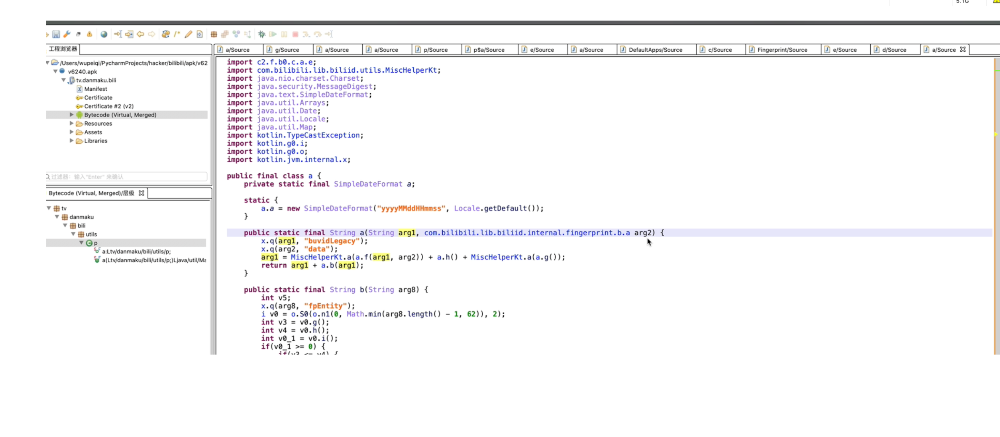

- 上一步结果 + a.b(上一步结果)   ----> fp_local

```python
import hashlib
import datetime
import random


def gen_local_v1(buvid, phone_model, phone_band):
    """
    fp_local和fp_remote都是用这个算法来生成的，在手机初始化阶段生成 fp_local，
    :param buvid: 根据算法生成的buvid，例如："XYBA4F3B2789A879EA8AEEDBE2E4118F78303"
    :param phone_model:  手机型号modal，例如："Mate 10 Pro"
    :param phone_band:  手机品牌band，在模拟器上是空字符串（我猜是程序员想要写成 brand ）哈哈哈哈
    :return:
    """
    def misc_helper_kt(data_bytes):
        data_list = []
        v7 = len(data_bytes)
        v0 = 0
        while v0 < v7:
            v2 = data_bytes[v0]
            data_list.append("%02x" % v2)
            v0 += 1
        return ''.join(data_list)

    data_string = "{}{}{}".format(buvid, phone_model, phone_band)
    hash_object = hashlib.md5()
    hash_object.update(data_string.encode('utf-8'))
    data = hash_object.digest()

    arg1 = misc_helper_kt(data)
    arg2 = datetime.datetime.now().strftime("%Y%m%d%H%M%S")
    arg3 = misc_helper_kt(random.randbytes(8))

    return "{}{}{}".format(arg1, arg2, arg3)
```


```
fp_local = v1 + a.b(v1)
```


## 留给你的任务：找到a.b到底干了啥？


## 作业

- a.b算法，搞不定也没关系 v1伪造fp_local。
- 所有代码连接，实现刷播放。


