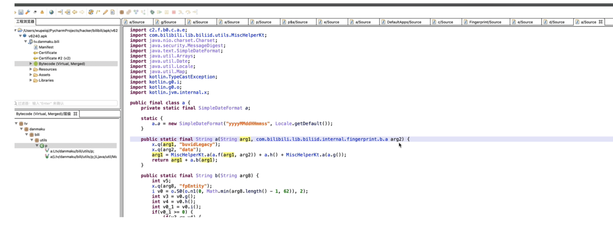
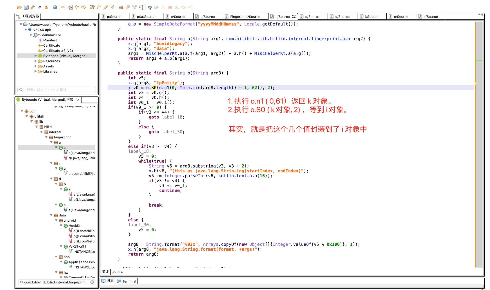

# day18 x站（下）

今日概要：

- 上节a.b算法，完整的刷播放。
- 写代码实现。


## 1.a.b算法





```python
arg8 = "ebd3c8c59b86464ebdbbc1c5a6fdfcde20211031221924d1d1602203c78c79"
v3 = 0
v4 = 60
v0_1 = 2
v5 = 0
while True:
    v6 = arg8[v3:v3 + 2]
    v5 += int(v6, base=16)
    if v3 != v4:
        v3 += v0_1
        continue
    break
data = "%02x" % (v5 % 0x100,)
print(data)
```


```
结果 = o.n1(0,61)
v0 = o.s0(结果,2)

v3 = v0.g()
v4 = v0.h()
```

- hook，是否是固定的值。
- 首先：正向去分析（简单，复杂） -> 5天

```python
"""
arg8参数-> ebd3c8c59b86464ebdbbc1c5a6fdfcde20211031221728cd035396399a661a
生成的值->v3= 0
生成的值->v4= 60
生成的值->v0_1= 2
生成的值-> 6a


arg8参数-> ebd3c8c59b86464ebdbbc1c5a6fdfcde202110312218403c321d4a34a9ba22
生成的值->v3= 0
生成的值->v4= 60
生成的值->v0_1= 2
生成的值-> 05


arg8参数-> ebd3c8c59b86464ebdbbc1c5a6fdfcde20211031221924d1d1602203c78c79
生成的值->v3= 0
生成的值->v4= 60
生成的值->v0_1= 2
生成的值-> 4f

"""

```


```python
import hashlib
import datetime
import random


def gen_local_v1(buvid, phone_model, phone_band):
    """
    fp_local和fp_remote都是用这个算法来生成的，在手机初始化阶段生成 fp_local，
    :param buvid: 根据算法生成的buvid，例如："XYBA4F3B2789A879EA8AEEDBE2E4118F78303"
    :param phone_model:  手机型号modal，例如："Mate 10 Pro"
    :param phone_band:  手机品牌band，在模拟器上是空字符串（我猜是程序员想要写成 brand ）哈哈哈哈
    :return:
    """
    def misc_helper_kt(data_bytes):
        data_list = []
        v7 = len(data_bytes)
        v0 = 0
        while v0 < v7:
            v2 = data_bytes[v0]
            data_list.append("%02x" % v2)
            v0 += 1
        return ''.join(data_list)

    data_string = "{}{}{}".format(buvid, phone_model, phone_band)
    hash_object = hashlib.md5()
    hash_object.update(data_string.encode('utf-8'))
    data = hash_object.digest()

    arg1 = misc_helper_kt(data)
    arg2 = datetime.datetime.now().strftime("%Y%m%d%H%M%S")
    arg3 = misc_helper_kt(random.randbytes(8))

    return "{}{}{}".format(arg1, arg2, arg3)

arg1 = gen_local_v1("XYBA4F3B2789A879EA8AEEDBE2E4118F78303", "Mate 10 Pro", "")
```


**fp_local最终实现的代码**

```python
import hashlib
import datetime
import random


def gen_local_v1(buvid, phone_model, phone_band):
    """
    fp_local和fp_remote都是用这个算法来生成的，在手机初始化阶段生成 fp_local，
    :param buvid: 根据算法生成的buvid，例如："XYBA4F3B2789A879EA8AEEDBE2E4118F78303"
    :param phone_model:  手机型号modal，例如："Mate 10 Pro"
    :param phone_band:  手机品牌band，在模拟器上是空字符串（我猜是程序员想要写成 brand ）哈哈哈哈
    :return:
    """

    def misc_helper_kt(data_bytes):
        data_list = []
        v7 = len(data_bytes)
        v0 = 0
        while v0 < v7:
            v2 = data_bytes[v0]
            data_list.append("%02x" % v2)
            v0 += 1
        return ''.join(data_list)

    data_string = "{}{}{}".format(buvid, phone_model, phone_band)
    hash_object = hashlib.md5()
    hash_object.update(data_string.encode('utf-8'))
    data = hash_object.digest()

    arg1 = misc_helper_kt(data)
    arg2 = datetime.datetime.now().strftime("%Y%m%d%H%M%S")
    arg3 = misc_helper_kt(random.randbytes(8))

    return "{}{}{}".format(arg1, arg2, arg3)


def a_b(arg8):
    v3 = 0
    v4 = 60
    v0_1 = 2
    v5 = 0
    while True:
        v6 = arg8[v3:v3 + 2]
        v5 += int(v6, base=16)
        if v3 != v4:
            v3 += v0_1
            continue
        break
    data = "%02x" % (v5 % 0x100,)
    return data


arg1 = gen_local_v1("XYBA4F3B2789A879EA8AEEDBE2E4118F78303", "Mate 10 Pro", "")
fp_local = arg1 + a_b(arg1)
print(fp_local)
```


至此，X站播放相关的算法全部搞定。


## 2.编码规范


### 2.1 关于main

```python
def func():
    data.append(123)


if __name__ == '__main__':
    data = []
    name = input("请输入输入：")
    data.append(name)
    func()
```

```python
# 全部变量大写
DATA_LIST = []


def run():
    """ 业务逻辑都写在函数 """
    pass


if __name__ == '__main__':
    run()
```


### 2.2 文件操作

别人给你 excel、txt文件，读取文件中内容。例如：现在1000个用户名、密码在txt文档中，获取每个用户名、密码进行登录。

```python
def task(args):
    pass


def get_data_list():
    data_list = []
    f = open('xx.txt')
    for line in f:
        data_list.append(line)
    return data_list


def run():
    # 读取txt文档，获取用户名和密码
    data_list = get_data_list()
    
    task(data_list)


if __name__ == '__main__':
    run()
```


是否学过生成器？ 1w个账号

```python
# 别人给你 excel、txt文件，读取文件中内容。例如：现在1000个用户名、密码在txt文档中，获取每个用户名、密码进行登录。

def task(gen_data_list):
    line = next(gen_data_list)


def get_data_list():
    f = open('xx.txt')
    for line in f:
        yield line


def run():
    # 生成器对象
    gen_data_list = get_data_list()

    task(gen_data_list)


if __name__ == '__main__':
    run()
```


### 2.3 代理IP+生成器

```
{"code":"0","msg":"ok","obj":[
	{"port":"22423","ip":"140.250.89.34"},
	{"port":"14609","ip":"220.178.218.44"},
	{"port":"20123","ip":"49.83.23.131"},
	{"port":"14064","ip":"117.11.10.121"},
	{"port":"18747","ip":"114.239.146.77"}
	],"errno":0,"data":[null]
}
```

10w次请求，每次1个IP，如果是你？你会怎么做？


```python
import requests


def register():
    res = requests.get("....")
    proxy_dict = res.json()['obj'][0]

    session = requests.Session()
    session.proxies = {
        "http": "{ip}:{port}".format(**proxy_dict),  # "59.63.107.231:19025"
        "https": "{ip}:{port}".format(**proxy_dict),  # "59.63.107.231:19025"
    }

    session.get("...")
    session.post("...")


def run():
    for i in range(1000000):
        register()


if __name__ == '__main__':
    run()
```


```python
import requests


def register(proxy_object):
    proxy_dict = next(proxy_object)

    session = requests.Session()
    session.proxies = {
        "http": "{ip}:{port}".format(**proxy_dict),  # "59.63.107.231:19025"
        "https": "{ip}:{port}".format(**proxy_dict),  # "59.63.107.231:19025"
    }

    session.get("...")
    session.post("...")


def get_proxy_object():
    while True:
        res = requests.get("....100")
        for item in res.json()['obj']: # 100
            # item = {"port":"19025","ip":"59.63.107.231"}
            yield item


def run():
    proxy_object = get_proxy_object()
    for i in range(1000000):
        register(proxy_object)


if __name__ == '__main__':
    run()
```


### 2.4 并发

做爬虫在进行并发操作时，就用线程。

- 线程（线程池）
- 线程 + 协程（写不好）


```python
import requests
from concurrent.futures import ThreadPoolExecutor
import threading

RLOCK = threading.RLock()


def task(password):
    """ 每个线程都会执行这个函数去完成注册 """
    # 1.requests发请求，给你一个手机（卡商 ）
    res = requests.get(".......")
    phone = res.json()['data']['phone']

    # 2.注册
    requests.post(
        url="...",
        data={
            'phone': phone,
            'password': password,
        }
    )

    RLOCK.acquire()  # 申请锁（40 -> 1 )  -> 加锁，排队，没有并发。
    # 3.写入文件
    with open('xxxx.txt', mode='a', encoding='utf-8') as f:
        f.write("{}----{}\n".format(phone, password))
    RLOCK.release()  # 释放锁


def run():
    # 注册10w个账号 ( 线程池来实现 ）  -> 生成文件 ->  手机号-密码

    password = "qwe123"
    pool = ThreadPoolExecutor(40)
    for i in range(100000):
        pool.submit(task, password)


if __name__ == '__main__':
    run()
```


```python
import requests
from concurrent.futures import ThreadPoolExecutor
import threading

RLOCK = threading.RLock()

DATA_LIST = []


def task(password):
    """ 每个线程都会执行这个函数去完成注册 """
    # 1.requests发请求，给你一个手机（卡商 ） （1）
    res = requests.get(".......")
    phone = res.json()['data']['phone']

    # 2.注册
    requests.post(
        url="...",
        data={
            'phone': phone,
            'password': password,
        }
    )

    DATA_LIST.append((phone, password)) # 线程安全，执行一般，电脑死机。


def run():
    # 注册10w个账号 ( 线程池来实现 ）  -> 生成文件 ->  手机号-密码  （2）

    password = "qwe123"
    pool = ThreadPoolExecutor(40)
    for i in range(100000):
        pool.submit(task, password)

    pool.shutdown() # 线程池中的所有任务执行完毕了

    # 读取DATA_LIST写入文件


if __name__ == '__main__':
    run()
```


你听过线程都有ID吗？

```python
import requests
from concurrent.futures import ThreadPoolExecutor
import threading
import os

RLOCK = threading.RLock()


def task(password):
    """ 每个线程都会执行这个函数去完成注册 """
    # 1.requests发请求，给你一个手机（卡商 ） （1）
    res = requests.get(".......")
    phone = res.json()['data']['phone']

    # 2.注册
    requests.post(
        url="...",
        data={
            'phone': phone,
            'password': password,
        }
    )

    # 放到 -> redis/kafka/rabbmitmq/数据库（第三方工具才能实现）

    file_name = "xxxx-{}.txt".format(threading.current_thread().ident)
    file_path = os.path.join("dist", file_name)
    with open(file_path, mode='a+', encoding='utf-8') as f:
        f.write(".....")


def run():
    # 注册10w个账号 ( 线程池来实现 ）  -> 生成文件 ->  手机号-密码  （2）

    password = "qwe123"
    pool = ThreadPoolExecutor(40)
    for i in range(100000):
        pool.submit(task, password)

    pool.shutdown()  # 线程池中的所有任务执行完毕了

    # 读取DATA_LIST写入文件 遍历目录下的所有文件，文件的内容读取到
    for name in os.listdir("xxx/xxx/xx/dist"):
        pass

if __name__ == '__main__':
    run()
```


### 2.5 异常+重试

```python
import requests
from concurrent.futures import ThreadPoolExecutor
import threading
import os

RLOCK = threading.RLock()


def task(password):
    """ 每个线程都会执行这个函数去完成注册 """

    # 1.requests发请求，给你一个手机（卡商 ） （1）    是否会遇到请求失败
    res = requests.get(".......")
    phone = res.json()['data']['phone']

    for i in range(5):
        try:
            res = requests.post(  # 是否会遇到请求失败
                url="...",
                data={
                    'phone': phone,
                    'password': password,
                }
            )
            # 成功
            if res.json()['status'] == "1":
                break
        except Exception as e:
            pass
    else:
        print("第二步执行失败")
        return

    # 3.注册
    requests.post(  # 是否会遇到请求失败
        url="...",
        data={
            'phone': phone,
            'password': password,
        }
    )

    # 放到 -> redis/kafka/rabbmitmq/数据库（第三方工具才能实现）

    file_name = "xxxx-{}.txt".format(threading.current_thread().ident)
    file_path = os.path.join("dist", file_name)
    with open(file_path, mode='a+', encoding='utf-8') as f:
        f.write(".....")


def run():
    # 注册10w个账号 ( 线程池来实现 ）  -> 生成文件 ->  手机号-密码  （2）

    password = "qwe123"
    pool = ThreadPoolExecutor(40)
    for i in range(100000):
        pool.submit(task, password)

    pool.shutdown()  # 线程池中的所有任务执行完毕了

    # 读取DATA_LIST写入文件 遍历目录下的所有文件，文件的内容读取到
    for name in os.listdir("xxx/xxx/xx/dist"):
        pass


if __name__ == '__main__':
    run()
```


### 2.6 面向对象和函数【B站播放】

- **函数（推荐）**

  ```python
  DATA_LIST = []
  
  def run():
      pass
  
  
  if __name__ == '__main__':
      run()
  ```

  ```python
  import hashlib
  import datetime
  import random
  
  import uuid
  import hashlib
  import random
  
  
  def create_random_mac(sep=":"):
      # 00:90:4C:11:22:33
      data_list = []
      for i in range(1, 7):
          part = "".join(random.sample("0123456789ABCDEF", 2))
          data_list.append(part)
      mac = sep.join(data_list)
      if mac != "00:90:4C:11:22:33":
          return mac
      return create_random_mac(sep)
  
  
  def gen_did():
      pass
  
  
  def get_buvid_by_wifi_mac():
      mac = create_random_mac()
      md5 = hashlib.md5()
      md5.update(mac.encode('utf-8'))
      v0_1 = md5.hexdigest()
      return "XY{}{}{}{}".format(v0_1[2], v0_1[12], v0_1[22], v0_1).upper()
  
  
  def gen_session_id():
      return "".join([hex(item)[2:] for item in random.randbytes(4)])
  
  
  def gen_fp_local(buvid, phone_model, phone_band):
      """
      fp_local和fp_remote都是用这个算法来生成的，在手机初始化阶段生成 fp_local，
      :param buvid: 根据算法生成的buvid，例如："XYBA4F3B2789A879EA8AEEDBE2E4118F78303"
      :param phone_model:  手机型号modal，例如："Mate 10 Pro"
      :param phone_band:  手机品牌band，在模拟器上是空字符串（我猜是程序员想要写成 brand ）哈哈哈哈
      :return:
      """
  
      def misc_helper_kt(data_bytes):
          data_list = []
          v7 = len(data_bytes)
          v0 = 0
          while v0 < v7:
              v2 = data_bytes[v0]
              data_list.append("%02x" % v2)
              v0 += 1
          return ''.join(data_list)
  
      def a_b(arg8):
          v3 = 0
          v4 = 60
          v0_1 = 2
          v5 = 0
          while True:
              v6 = arg8[v3:v3 + 2]
              v5 += int(v6, base=16)
              if v3 != v4:
                  v3 += v0_1
                  continue
              break
          return "%02x" % (v5 % 0x100,)
  
      data_string = "{}{}{}".format(buvid, phone_model, phone_band)
      hash_object = hashlib.md5()
      hash_object.update(data_string.encode('utf-8'))
      data = hash_object.digest()
  
      arg1 = misc_helper_kt(data)
      arg2 = datetime.datetime.now().strftime("%Y%m%d%H%M%S")
      arg3 = misc_helper_kt(random.randbytes(8))
  
      v1 = "{}{}{}".format(arg1, arg2, arg3)
      return v1 + a_b(v1)
  
  
  def run():
      phone_model, phone_band = "Mi x5", ""
      # 请求头
      buvid = get_buvid_by_wifi_mac()
      fp_local = gen_fp_local(buvid, phone_model, phone_band)
      session_id = gen_session_id()
  
      # 请求体 did/aes加密/sha256
  
      # 发送请求
  
  
  if __name__ == '__main__':
      run()
  ```

- 面向对象（不推荐）

  ```python
  import datetime
  import hashlib
  import random
  
  
  class Bili(object):
      def __init__(self):
          self.phone_model, self.phone_band = "Mi x5", ""
          # 请求头
          self.buvid = self.get_buvid_by_wifi_mac()
          self.fp_local = self.gen_fp_local()
          self.session_id = self.gen_session_id()
  
      def create_random_mac(self, sep=":"):
          # 00:90:4C:11:22:33
          data_list = []
          for i in range(1, 7):
              part = "".join(random.sample("0123456789ABCDEF", 2))
              data_list.append(part)
          mac = sep.join(data_list)
          if mac != "00:90:4C:11:22:33":
              return mac
          return self.create_random_mac(sep)
  
      def gen_did(self, ):
          pass
  
      def get_buvid_by_wifi_mac(self, ):
          mac = self.create_random_mac()
          md5 = hashlib.md5()
          md5.update(mac.encode('utf-8'))
          v0_1 = md5.hexdigest()
          return "XY{}{}{}{}".format(v0_1[2], v0_1[12], v0_1[22], v0_1).upper()
  
      def gen_session_id(self, ):
          return "".join([hex(item)[2:] for item in random.randbytes(4)])
  
      def gen_fp_local(self):
          """
          fp_local和fp_remote都是用这个算法来生成的，在手机初始化阶段生成 fp_local，
          :param buvid: 根据算法生成的buvid，例如："XYBA4F3B2789A879EA8AEEDBE2E4118F78303"
          :param phone_model:  手机型号modal，例如："Mate 10 Pro"
          :param phone_band:  手机品牌band，在模拟器上是空字符串（我猜是程序员想要写成 brand ）哈哈哈哈
          :return:
          """
  
          def misc_helper_kt(data_bytes):
              data_list = []
              v7 = len(data_bytes)
              v0 = 0
              while v0 < v7:
                  v2 = data_bytes[v0]
                  data_list.append("%02x" % v2)
                  v0 += 1
              return ''.join(data_list)
  
          def a_b(arg8):
              v3 = 0
              v4 = 60
              v0_1 = 2
              v5 = 0
              while True:
                  v6 = arg8[v3:v3 + 2]
                  v5 += int(v6, base=16)
                  if v3 != v4:
                      v3 += v0_1
                      continue
                  break
              return "%02x" % (v5 % 0x100,)
  
          data_string = "{}{}{}".format(self.buvid, self.phone_model, self.phone_band)
          hash_object = hashlib.md5()
          hash_object.update(data_string.encode('utf-8'))
          data = hash_object.digest()
  
          arg1 = misc_helper_kt(data)
          arg2 = datetime.datetime.now().strftime("%Y%m%d%H%M%S")
          arg3 = misc_helper_kt(random.randbytes(8))
  
          v1 = "{}{}{}".format(arg1, arg2, arg3)
          return v1 + a_b(v1)
  
      def do_request(self):
          # 请求体 did/aes加密/sha256
  
          # 发送请求
          pass
  
  
  def run():
      bili = Bili()
      bili.do_request()
  
  
  if __name__ == '__main__':
      run()
  ```


推荐教程：https://space.bilibili.com/283478842/channel/seriesdetail?sid=1747621


## 总结

- 自己的代码
- B站：
  - 之前知识点追上来
  - 回顾：JNI开发、C语言基础
  - 预习：1期课程


