# day19 x站（终）

目标：心跳的请求（java + c）

## 1.前戏


### 1.1 C代码

```c
#include <stdio.h>

int main() {
    char v34[80]; // [ , , , , , , , , , , , , ]
    char *v28;
    v28 = (char *) &v34;

    // [ 0, 1, 0, 2, 0, 4, , , , , , , ]
    sprintf(v28, "%02x", 1); // 1
    v28  += 2;

    sprintf(v28, "%02x", 2); // 02
    v28  += 2;

    sprintf(v28, "%02x", 4); // 04
    v28  += 2;

    sprintf(v28, "%02x", 'a'); 
    v28  += 2;

    sprintf(v28, "%02x", 'b');
    v28  += 2;

    printf(v34);
    return 0;

}
```


```c
#include <stdio.h>

int main() {
    char v36[] = {1, 2, 3, 'a', 'b', 'c', 'd', 'e', 'f', 'g',};
    char v34[80]; // [0,1,,,,,,]
    char *v28;
    v28 = (char *) &v34;

    int v29 = 0;
    do {
        sprintf(v28, "%02x", v36[v29++]); // 
        v28 += 2;
    } while (v29 != 10);

    printf(v34);
    return 0;

}
```

```
十六进制的转换和拼接。
讲Java MD5算法 ->  手动。
```


### 1.2 JNI开发

- 静态注册

  - java

    ```java
    package com.nb.s2long;
    
    class EncryptUtils {
    
        static {
            System.loadLibrary("encrypt");
        }
    
        public static native int s1(int v1, int v2);
    }
    ```

  - c

    ```c
    JNIEXPORT jint
    JNICALL Java_com_nb_s2long_EncryptUtils_s1(JNIEnv *env, jclass obj, jint v1, jint v2) {
        return v1 + v2;
    }
    ```

- 动态注册

  - java

    ```java
    package com.nb.s2long;
    
    class DynamicUtils {
    
        static {
            System.loadLibrary("dynamic");
        }
    
        public static native int add(int v1, int v2);
    }
    
    ```

  - c

    ```c
    jint plus(JNIEnv *env, jobject obj, jint v1, jint v2) {
        return v1 + v2;
    }
    
    
    static JNINativeMethod gMethods[] = {
            {"add", "(II)I", (void *) plus},
    };
    
    JNIEXPORT jint JNICALL JNI_OnLoad(JavaVM *vm, void *reserved) {
        
        JNIEnv *env = NULL;
    
        // 在java虚拟机中获取env
        if ((*vm)->GetEnv(vm, (void **) &env, JNI_VERSION_1_6) != JNI_OK) {
            return JNI_ERR;
        }
    
        // 找到Java中的类
        jclass clazz = (*env)->FindClass(env, "com/nb/s2long/DynamicUtils");
    
        // 将类中的方法注册到JNI中 (RegisterNatives)
        // clazz
        // gMethods ->  c <-> java
        int res = (*env)->RegisterNatives(env, clazz, gMethods, 1);
        if (res < 0) {
            return JNI_ERR;
        }
    
        return JNI_VERSION_1_6;
    }
    ```

    

  上述内容：

  - java调用函数，内置调用C语言的实现。

  - c调用java的函数（静态方法、示例方法、创建对象）

    ```
    // Java
    package com.nb.fucker;
    
    class Query {
        public static int getData(int v1, int v2) {
            return v1 + v2;
        }
        
        public static int getData(int v1) {
            return v1 + v2;
        }
    }
    
    // JNI
    jclass cls = (*env)->FindClass(env, "com/nb/fucker/Query");
    jmethodID mid = (*env)->GetStaticMethodID(env, cls, "getData", "(II)I");
    int res = (*env)->CallStaticIntMethod(env, cls, mid, 1,2);
    ```

    ```
    // java
    package com.nb.fucker;
    
    class Query {
        // 构造方法
        public Query(int arg1, int arg2, String arg3) {
    
        }
        // getData
        public String getData(int v1, int v2) {
            return String.valueOf(v1 + v2);
        }
    }
    
    // JNI
    // 1.创建对象
    jclass cls = (*env)->FindClass(env, "com/nb/fucker/Query");
    jmethodID init = (*env)->GetMethodID(env, cls, "<init>", "(IILjava/lang/String;)V");
    jobject cls_object = (*env)->NewObject(env, cls, init, 1, 2, (*env)->NewStringUTF(env, "哈哈哈哈"));
    
    // 2.对象调用方法
    jmethodID mid = (*env)->GetMethodID(env, cls, "getData", "(II)Ljava/lang/String;");
    jobject res = (*env)->CallObjectMethod(env, cls_object, mid, 11, 2);
    ```


例如：

```c
JNIEXPORT jint
JNICALL Java_com_nb_s2long_DynamicUtils_s(JNIEnv *env, jclass obj, jint v1, jint v2) {
    ...值
    jclass cls = (*env)->FindClass(env, "com/nb/s2long/SignedQuery");
    jmethodID init = (*env)->GetMethodID(env, cls, "<init>", "(II)V");
    
    jobject cls_object = (*env)->NewObject(env, cls, init, 值1, 值2);
    
    return cls_object;
}
```

```java
package com.nb.s2long;

class DynamicUtils {

    static {
        System.loadLibrary("bili");
    }

    public static native SignedQuery s(int v1, int v2);
}
```

```java
package com.nb.s2long;

public class SignedQuery {
    privte int s1;
    privte int s2;
	public SignedQuery(int arg1, int arg2) {
		s1 = arg1;
        s2 = arg2;
    }
    
    public String toString(){
        return String.valueOf(s1) + "&sign=" + String.valueOf(s2)
    }
}
```

```java
SignedQuery obj = DynamicUtils.s(11,22);
String dataString = obj.toString()
```


## 2.x站心跳

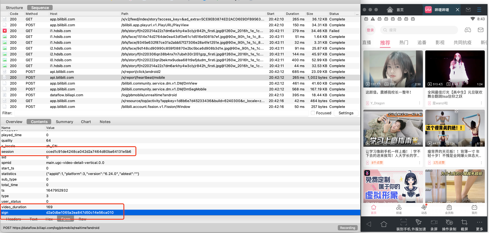

今日任务：

- session
- sign


## 3.session

- 关键字session搜索
- 关键字 url 去搜索
- 其他参数

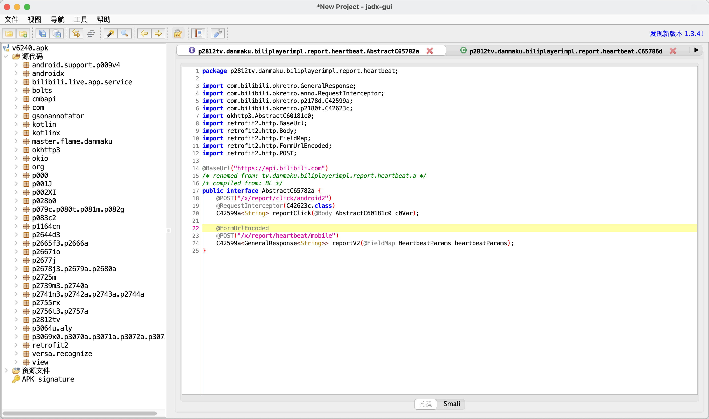

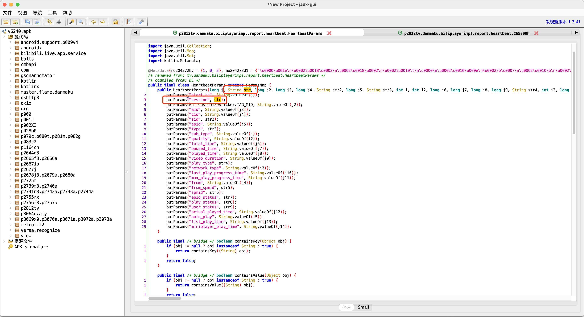


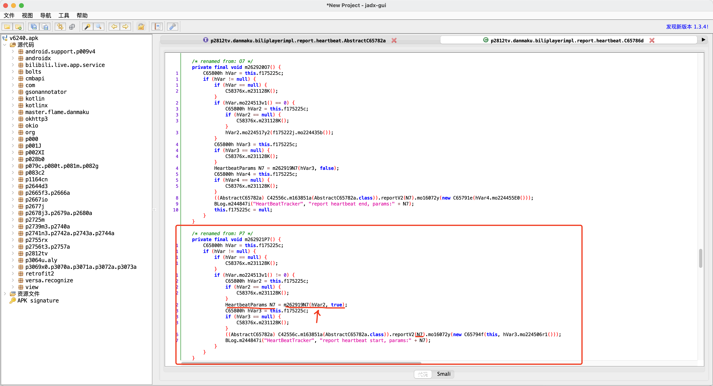

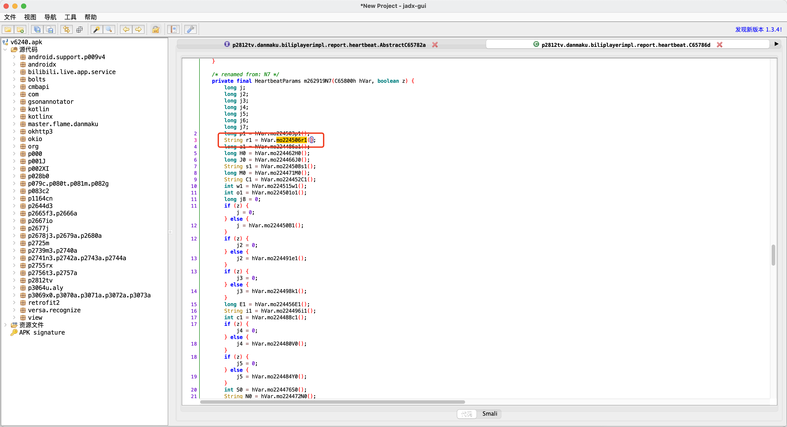

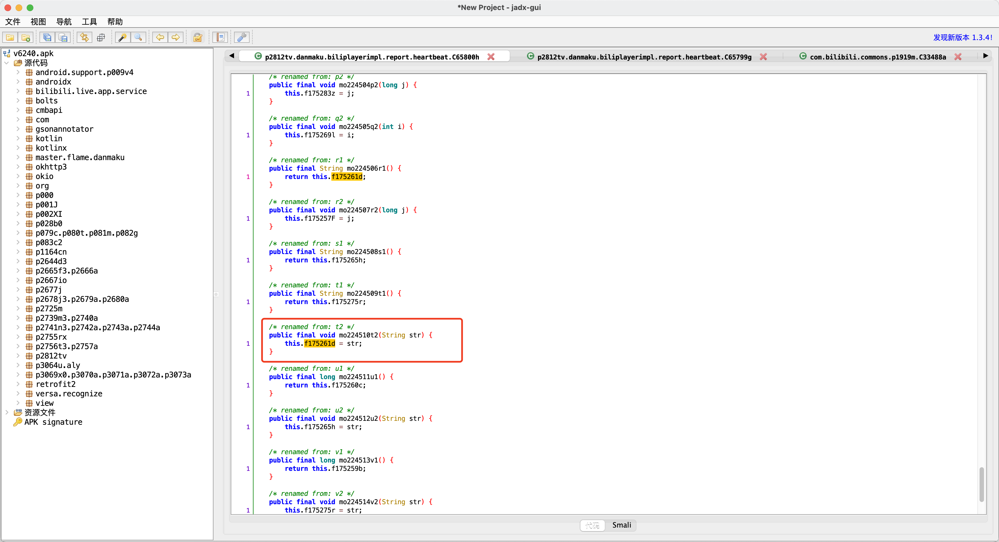


hook脚本：

```python
import frida
import sys

rdev = frida.get_remote_device()
session = rdev.attach("tv.danmaku.bili")

scr = """
Java.perform(function () {
var h = Java.use("tv.danmaku.biliplayerimpl.report.heartbeat.h");


h.t2.implementation = function(str){
    console.log("设置session",str);
    this.t2(str);
    //调用栈
   console.log(Java.use("android.util.Log").getStackTraceString(Java.use("java.lang.Throwable").$new()));
};

});
"""

script = session.create_script(scr)


def on_message(message, data):
    print(message)


script.on("message", on_message)
script.load()
sys.stdin.read()


```

```
设置session 2cc594764d2765a15a9a80c2697027e007768978
java.lang.Throwable
	at tv.danmaku.biliplayerimpl.report.heartbeat.h.t2(Native Method)
	at tv.danmaku.biliplayerimpl.report.heartbeat.h$a.b(BL:5)
	at tv.danmaku.biliplayerimpl.report.heartbeat.d.L7(BL:2)
	at tv.danmaku.biliplayerimpl.report.heartbeat.d.u7(BL:3)
	at tv.danmaku.biliplayerimpl.core.PlayerCoreServiceV2$l.onPrepared(BL:2)
	at t3.a.i.b.i$j.onPrepared(BL:6)
	at tv.danmaku.ijk.media.player.AbstractMediaPlayer.notifyOnPrepared(BL:2)
	at tv.danmaku.ijk.media.player.IjkMediaPlayer$EventHandler.handleMessage(BL:107)
	at android.os.Handler.dispatchMessage(Handler.java:102)
	at android.os.Looper.loop(Looper.java:148)
	at android.app.ActivityThread.main(ActivityThread.java:5647)
	at java.lang.reflect.Method.invoke(Native Method)
	at com.android.internal.os.ZygoteInit$MethodAndArgsCaller.run(ZygoteInit.java:745)
	at com.android.internal.os.ZygoteInit.main(ZygoteInit.java:635)
```


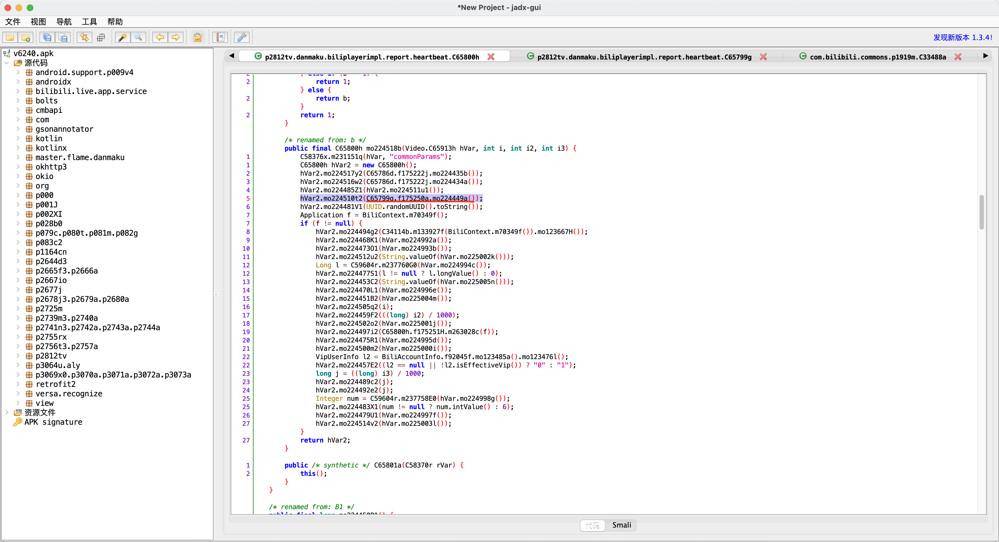

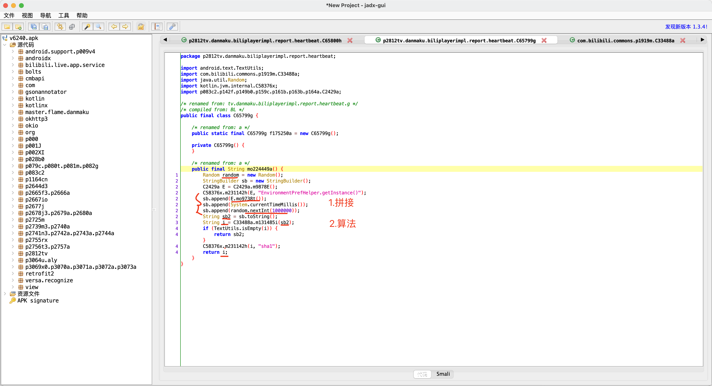


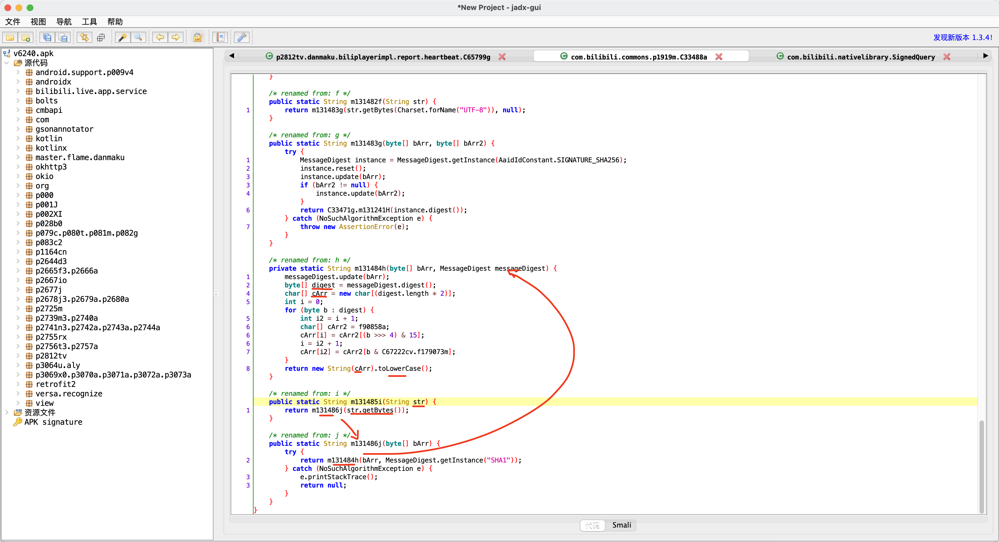

```
b >>> 4
```

```python
import random
import time
import hashlib
import ctypes


def gen_session_id():
    def int_overflow(val):
        maxint = 2147483647
        if not -maxint - 1 <= val <= maxint:
            val = (val + (maxint + 1)) % (2 * (maxint + 1)) - maxint - 1
        return val

    def unsigned_right_shitf(n, i):
        # 数字小于0，则转为32位无符号uint
        if n < 0:
            n = ctypes.c_uint32(n).value
        # 正常位移位数是为正数，但是为了兼容js之类的，负数就右移变成左移好了
        if i < 0:
            return -int_overflow(n << abs(i))
        # print(n)
        return int_overflow(n >> i)

    arg0 = str(int(time.time() * 1000)) + str(random.randint(1, 1000000));
    # sha1加密
    hash_object = hashlib.sha1()
    hash_object.update(arg0.encode('utf-8'))
    arg7 = hash_object.digest()
    v8 = [-1 for i in range(len(arg7) * 2)]
    v0 = len(arg7)
    v1 = 0
    v2 = 0
    while v1 < v0:
        v3 = arg7[v1]
        v4 = v2 + 1
        v5 = ['0', '1', '2', '3', '4', '5', '6', '7', '8', '9', 'A', 'B', 'C', 'D', 'E', 'F']
        index = unsigned_right_shitf(v3, 4) & 15
        v8[v2] = v5[index]
        v2 = v4 + 1
        v8[v4] = v5[v3 & 15]
        # ++v1
        v1 += 1

    data = "".join(v8)
    return data.lower()


if __name__ == '__main__':
    session_id = gen_session_id()
    print(session_id)
```


## 4.sign算法

- 


没发现参数，怎么办？

- sign   sign=  "sign"  "sign="
- 硬核分析 + Hook验证
- Hoop 代码中map、常见的算法。


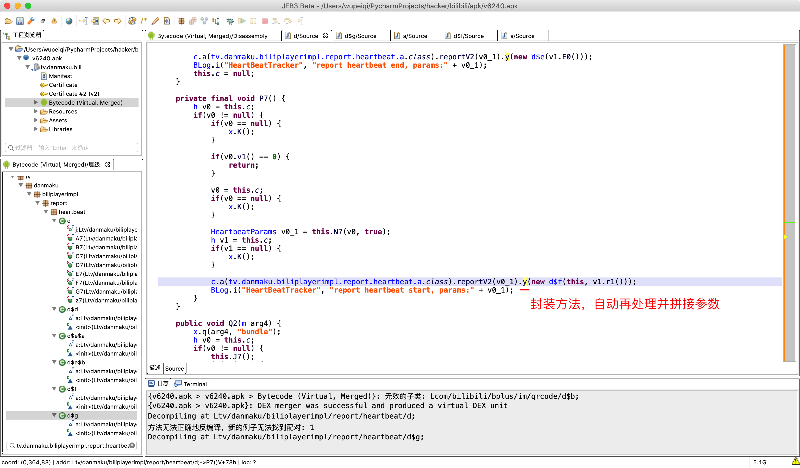

a$a【 c.a(......).reportV2(v0_1)，包含其他参数】


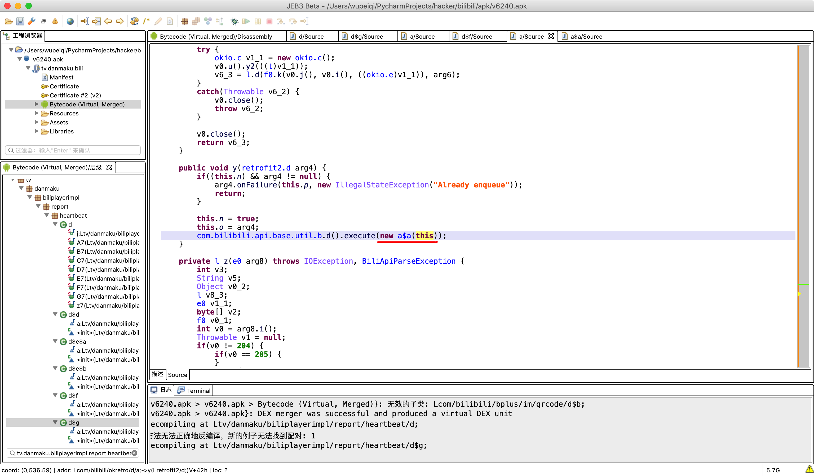


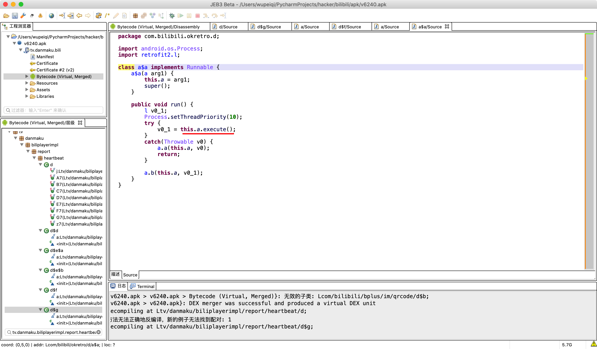


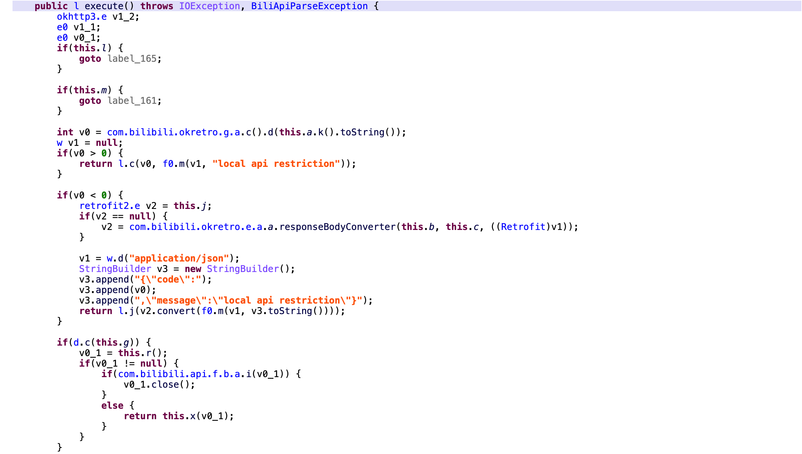

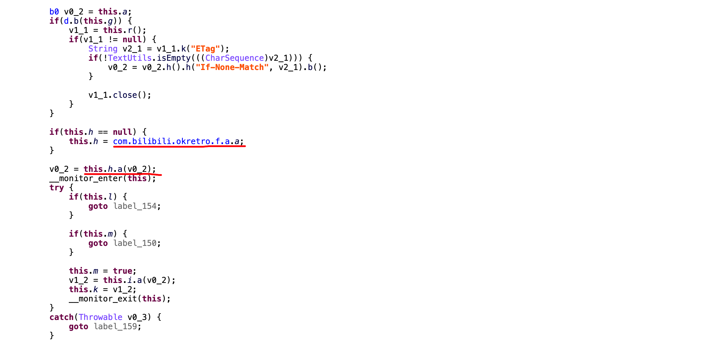


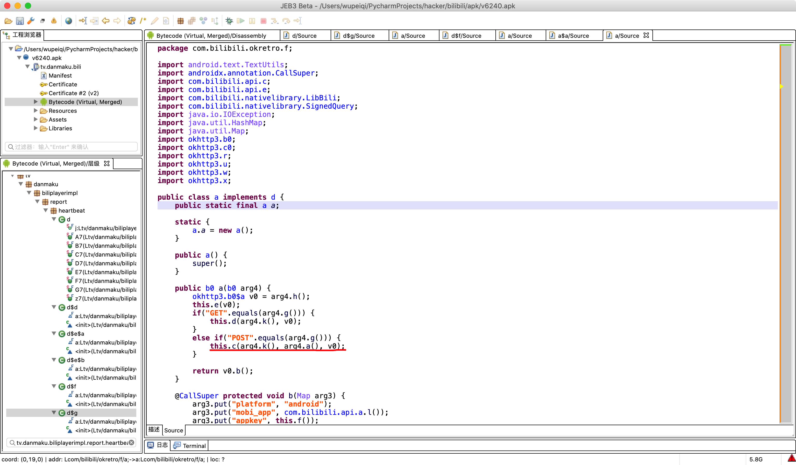


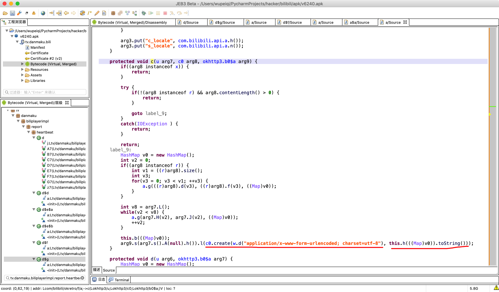


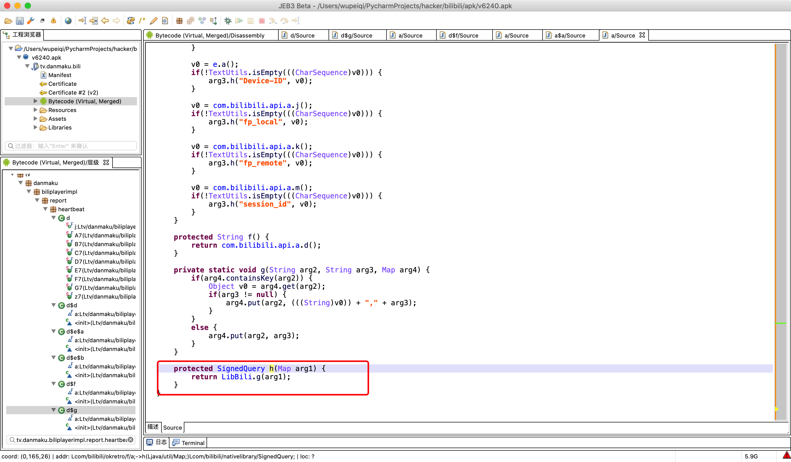


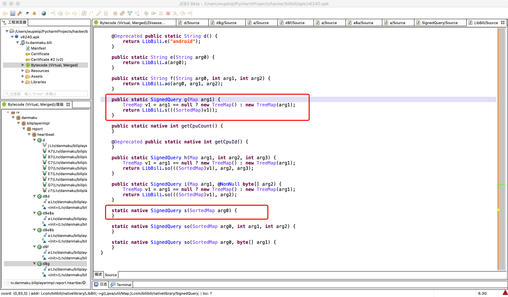

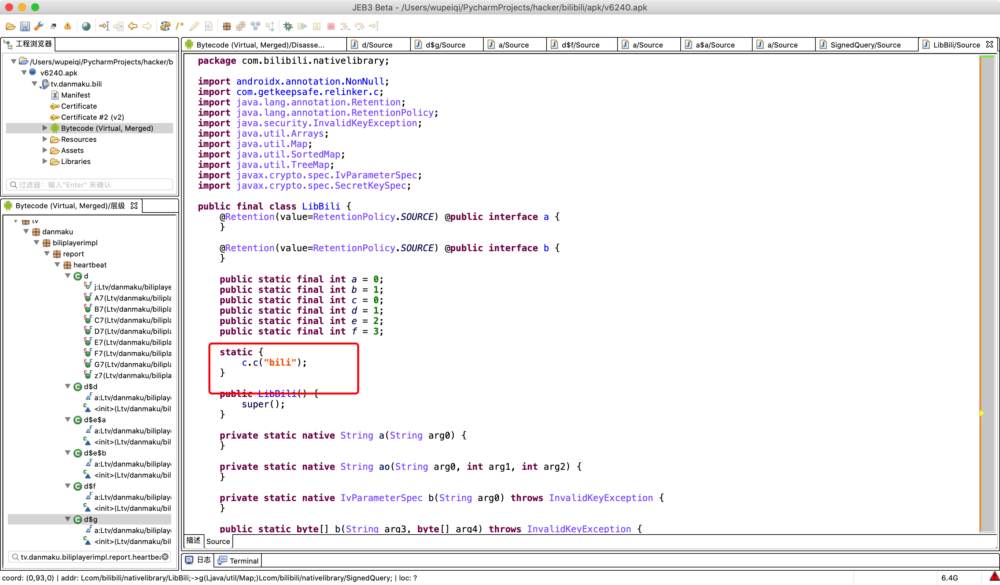


最关心的就是ths.h

```
SignedQuery obj = this.h(map)  【a=除了sign以外其他参数； b=sign签名的结果】
dataString = obj.toString()

actual_played_time=0&aid=466565149&appkey=1d8b6e7d45233436&auto_play=0&build=6240300&c_locale=zh_CN&channel=xxl_gdt_wm_253&cid=508746696&epid=0&epid_status=&from=6&from_spmid=tm.recommend.0.0&last_play_progress_time=0&list_play_time=0&max_play_progress_time=0&mid=0&miniplayer_play_time=0&mobi_app=android&network_type=1&paused_time=0&platform=android&play_status=0&play_type=1&played_time=0&quality=64&s_locale=zh_CN&session=cced1c91de4248ca042d2a7464d80ba64131e5b6&sid=0&spmid=main.ugc-video-detail-vertical.0.0&start_ts=0&statistics=%7B%22appId%22%3A1%2C%22platform%22%3A3%2C%22version%22%3A%226.24.0%22%2C%22abtest%22%3A%22%22%7D&sub_type=0&total_time=0&ts=1647952932&type=3&user_status=0&video_duration=169&sign=d2a0dbe1065a2ea847d50c14e56ca010
```


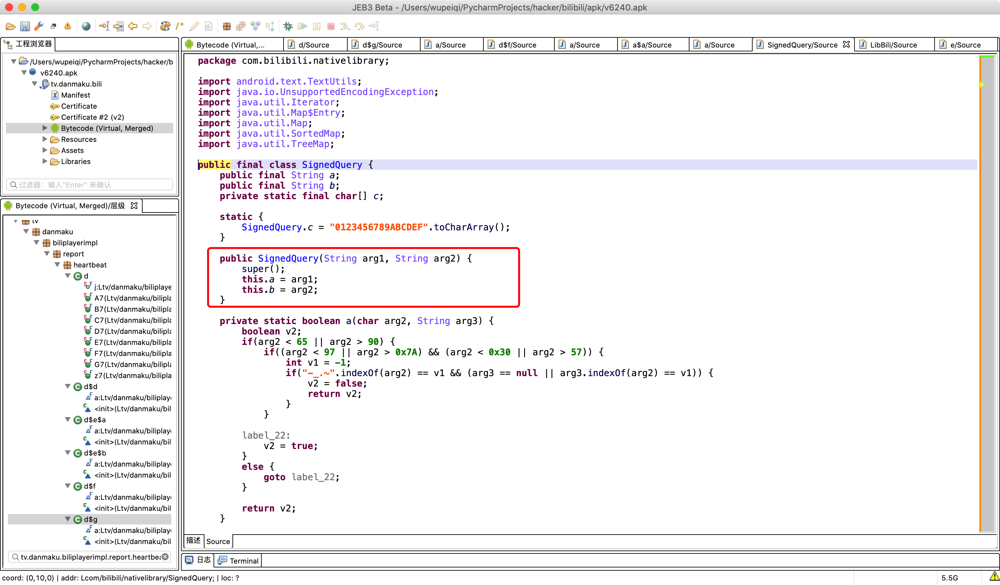

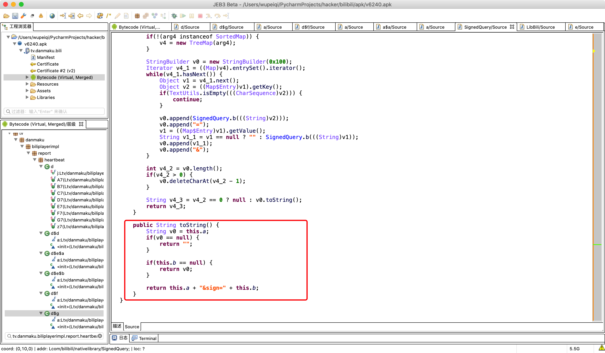


接下来的核心，找到 libbili.so文件中 s 方法的具体实现。

```
s内部是C代码，调用java类
在这个方法中会创建一个 SignedQuery 对象(原参数,sign值)
```


## 5.s的具体实现

我们知道他的动态注册，动态注册一定会调用，但是我们没找到。

```
int res = (*env)->RegisterNatives(env, clazz, gMethods, 1);
```

找RegisterNatives可以基于系统去找。

- libdvm.so
- libart.so


在JNI在进行动态注册时执行的 RegisterNatives 方法，就是在libart.so库中。


所以，如果想要hook RegisterNatives  方法，就必须要先找到他，所以，基于frida可以这么干。

基于frida中的模块来寻找。

```javascript
// 列举 libart.so 中的所有导出函数（成员列表）
var symbols = Module.enumerateSymbolsSync("libart.so");

// 获取 RegisterNatives 函数的内存地址，并赋值给addrRegisterNatives。
var addrRegisterNatives = null;

for (var i = 0; i < symbols.length; i++) {
    var symbol = symbols[i];
    console.log(symbol.name)
    //_ZN3art3JNI15RegisterNativesEP7_JNIEnvP7_jclassPK15JNINativeMethodi
    // 方式1：
    if (symbol.name.indexOf("art") >= 0 &&
        symbol.name.indexOf("JNI") >= 0 &&
        symbol.name.indexOf("RegisterNatives") >= 0 &&
        symbol.name.indexOf("CheckJNI") < 0) {
        
        addrRegisterNatives = symbol.address;
        console.log("RegisterNatives is at ", symbol.address, symbol.name);
    }
    
    
    // 方式2：
    var name = "_ZN3art3JNI15RegisterNativesEP7_JNIEnvP7_jclassPK15JNINativeMethodi";
    if(symbol.name.indexOf("art") >= 0){
        if(symbol.name.indexOf(name)>=0){
            addrRegisterNatives = symbol.address;
        }
    }
}
```

如果我们知道了底层RegisterNatives的内存地址，我们可以直接Hook这个RegisterNatives函数。

- JNI调用： RegisterNatives(env, clazz, gMethods, 1 )
- art.so中的RegisterNatives函数： RegisterNatives(env, clazz, gMethods, 1 )


如果我知道了一个函数的内存地址，如何对他进行Hook呢？

```

static JNINativeMethod gMethods[] = {
        {"add", "(II)I", (void *) plus},
};
```


```javascript
Interceptor.attach(addrRegisterNatives函数的内存地址, {
    onEnter: function (args) {
        var env = args[0];        // jni对象
        var java_class = args[1]; // 类
        // args[2]
        // args[3]
        var class_name = Java.vm.tryGetEnv().getClassName(java_class);

        // 只有类名为com.bilibili.nativelibrary.LibBili，才打印输出
        var taget_class = "com.bilibili.nativelibrary.LibBili";
        
        if(class_name === taget_class){
            console.log("\n[RegisterNatives] method_count:", args[3]);
            
            // args[2] 就是动态注册的对应关系。
            // ptr是new NativePointer(s) 的缩写。(C语言中的指针)
            var methods_ptr = ptr(args[2]);
            var method_count = parseInt(args[3]);
            
            for (var i = 0; i < method_count; i++) {
                // Java中函数名字的
                var name_ptr = Memory.readPointer(methods_ptr.add(i * Process.pointerSize * 3));
                // 参数和返回值类型
                var sig_ptr = Memory.readPointer(methods_ptr.add(i * Process.pointerSize * 3 + Process.pointerSize));
                // C中的函数指针
                var fnPtr_ptr = Memory.readPointer(methods_ptr.add(i * Process.pointerSize * 3 + Process.pointerSize * 2));

                var name = Memory.readCString(name_ptr);
                var sig = Memory.readCString(sig_ptr);
                var find_module = Process.findModuleByAddress(fnPtr_ptr);
                var offset = ptr(fnPtr_ptr).sub(find_module.base) // fnPtr_ptr - 模块基地址
                // console.log("[RegisterNatives] java_class:", class_name);
                // console.log("name:", name, "sig:", sig, "module_name:", find_module.name, "offset:", offset);
                console.log("name:", name, "module_name:", find_module.name, "offset:", offset);
        }
        }
    }
});
```


**完整脚本：**

```javascript
function hook_RegisterNatives() {
    var symbols = Module.enumerateSymbolsSync("libart.so");
    var addrRegisterNatives = null;
    for (var i = 0; i < symbols.length; i++) {
        var symbol = symbols[i];

        // _ZN3art3JNI15RegisterNativesEP7_JNIEnvP7_jclassPK15JNINativeMethodi
        if (symbol.name.indexOf("art") >= 0 &&
            symbol.name.indexOf("JNI") >= 0 &&
            symbol.name.indexOf("RegisterNatives") >= 0 &&
            symbol.name.indexOf("CheckJNI") < 0) {
            addrRegisterNatives = symbol.address;
            console.log("RegisterNatives is at ", symbol.address, symbol.name);
        }
    }

    if (addrRegisterNatives != null) {
        Interceptor.attach(addrRegisterNatives, {
            onEnter: function (args) {
                var env = args[0];
                var java_class = args[1];
                var class_name = Java.vm.tryGetEnv().getClassName(java_class);
                //console.log(class_name);
                // 只有类名为com.bilibili.nativelibrary.LibBili，才打印输出
                var taget_class = "com.bilibili.nativelibrary.LibBili";
                if (class_name === taget_class) {
                    console.log("\n[RegisterNatives] method_count:", args[3]);
                    var methods_ptr = ptr(args[2]);
                    var method_count = parseInt(args[3]);

                    for (var i = 0; i < method_count; i++) {
                        // Java中函数名字的
                        var name_ptr = Memory.readPointer(methods_ptr.add(i * Process.pointerSize * 3));
                        // 参数和返回值类型
                        var sig_ptr = Memory.readPointer(methods_ptr.add(i * Process.pointerSize * 3 + Process.pointerSize));
                        // C中的函数指针
                        var fnPtr_ptr = Memory.readPointer(methods_ptr.add(i * Process.pointerSize * 3 + Process.pointerSize * 2));

                        var name = Memory.readCString(name_ptr); // 读取java中函数名
                        var sig = Memory.readCString(sig_ptr); // 参数和返回值类型
                        var find_module = Process.findModuleByAddress(fnPtr_ptr); // 根据C中函数指针获取模块

                        var offset = ptr(fnPtr_ptr).sub(find_module.base) // fnPtr_ptr - 模块基地址
                        // console.log("[RegisterNatives] java_class:", class_name);
                        // console.log("name:", name, "sig:", sig, "module_name:", find_module.name, "offset:", offset);
                        console.log("name:", name, "module_name:", find_module.name, "offset:", offset);

                    }
                }
            }
        });
    }
}

setImmediate(hook_RegisterNatives);
```

上述脚本的执行有两点注意：

- 启动时间问题，自动启动app+hook

  ```
  frida -U --no-pause -f tv.danmaku.bili -l natives.js
  ```

- 去真机hook

输出：

```
RegisterNatives is at  0xac575721 _ZN3art3JNI15RegisterNativesEP7_JNIEnvP7_jclassPK15JNINativeMethodi
Spawned `tv.danmaku.bili`. Resuming main thread!                        
[Redmi 8A::tv.danmaku.bili]-> name: a module_name: libbili.so offset: 0x1c7d

name: ao module_name: libbili.so offset: 0x1c83
name: b module_name: libbili.so offset: 0x1c91
name: s module_name: libbili.so offset: 0x1c97  【这个s函数就在0x1c97地址】
name: so module_name: libbili.so offset: 0x1c9d
name: so module_name: libbili.so offset: 0x1cab
name: getCpuCount module_name: libbili.so offset: 0x1cb3
name: getCpuId module_name: libbili.so offset: 0x1cb7
```

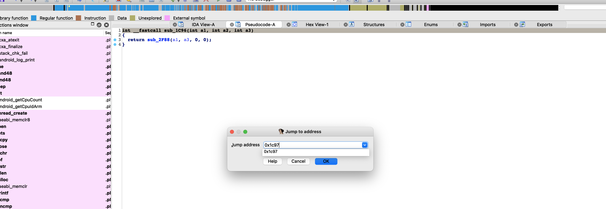

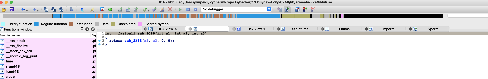


## 6.算法的实现


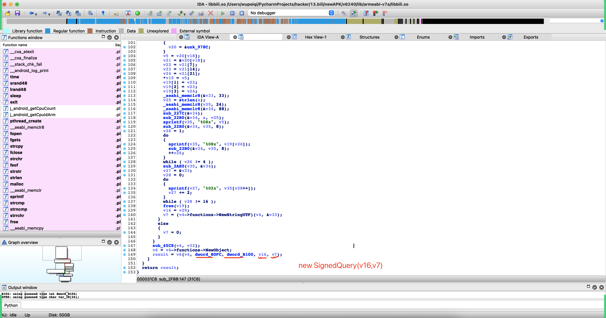


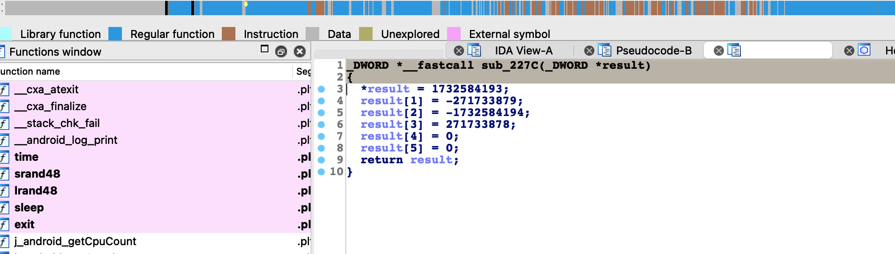


```
obj = hashlib.md5()
obj.update("xxx".encode('utf-8'))
obj.update("xxx".encode('utf-8'))
obj.update("xxx".encode('utf-8'))
obj.update("xxx".encode('utf-8'))
res = obj.hexdigist()
```


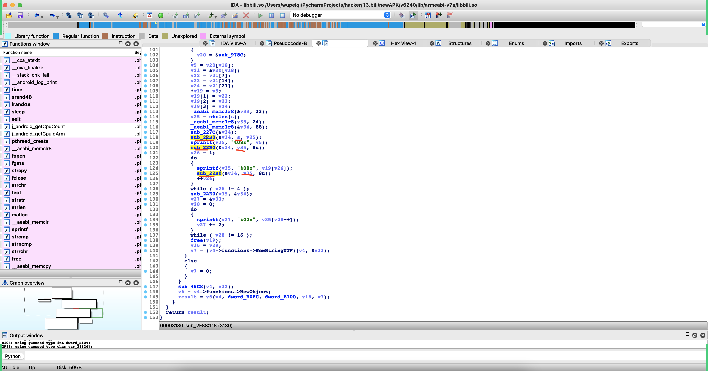


如果我们能hook    sub_22B0 方法，就可以把待加密的明文全都获取到。

```python
import frida
import sys

rdev = frida.get_remote_device()
session = rdev.attach("tv.danmaku.bili")

scr = """
Java.perform(function () {

    var libbili = Module.findBaseAddress("libbili.so");
    var s_func = libbili.add(0x22b0 + 1);
    console.log(s_func);
    
    Interceptor.attach(s_func, {
        onEnter: function (args) {
            // args[0]
            // args[1]，明文字符串
            // args[2]，明文字符串长度
            console.log("执行update，长度是：",args[2]);
            console.log(hexdump(args[1], {length: args[2].toInt32()}));
        },
        onLeave: function (args) {
            console.log("=======================结束===================");
        }
    });
});
"""
script = session.create_script(scr)


def on_message(message, data):
	pass

script.on("message", on_message)
script.load()
sys.stdin.read()
```


```
obj = hashlib.md5()
obj.update("xxx".encode('utf-8'))
obj.update("560c52cc".encode('utf-8'))
obj.update("d288fed0".encode('utf-8'))
obj.update("45859ed1".encode('utf-8'))
res = obj.hexdigist()
```


所以，最终sign签名的加密，在B站中本质：

```
请求参数凭借 + 560c52ccd288fed0d288fed08bffd973 ，然后再整体md5加密
```

```python
ordered_string = "&".join(["{}={}".format(key, param_dict[key]) for key in sorted(param_dict.keys())])
encrypt_string = ordered_string + "560c52ccd288fed045859ed18bffd973"
obj = hashlib.md5(encrypt_string.encode('utf-8'))
sign = obj.hexdigest()
```

```python
import hashlib

ordered_string = "access_key=b114d154e5e1049f4eb00e9a555c1531&actual_played_time=0&aid=682252361&appkey=1d8b6e7d45233436&auto_play=0&build=6240300&c_locale=zh_CN&channel=xxl_gdt_wm_253&cid=552719750&epid=0&epid_status=&from=7&from_spmid=tm.recommend.0.0&last_play_progress_time=0&list_play_time=0&max_play_progress_time=0&mid=336469068&miniplayer_play_time=0&mobi_app=android&network_type=1&paused_time=0&platform=android&play_status=0&play_type=1&played_time=0&quality=32&s_locale=zh_CN&session=8f772f3ccb4adf60f396df795110cde421ce2ab1&sid=0&spmid=main.ugc-video-detail.0.0&start_ts=0&statistics=%7B%22appId%22%3A1%2C%22platform%22%3A3%2C%22version%22%3A%226.24.0%22%2C%22abtest%22%3A%22%22%7D&sub_type=0&total_time=0&ts=1647961428&type=3&user_status=0&video_duration=231"
encrypt_string = ordered_string + "560c52ccd288fed045859ed18bffd973"
obj = hashlib.md5(encrypt_string.encode('utf-8'))
sign = obj.hexdigest()
print(sign)
```


