# day20 知乎

目标：知乎搜索

版本：v5.32.1

https://www.wandoujia.com/apps/584215/history_v1031


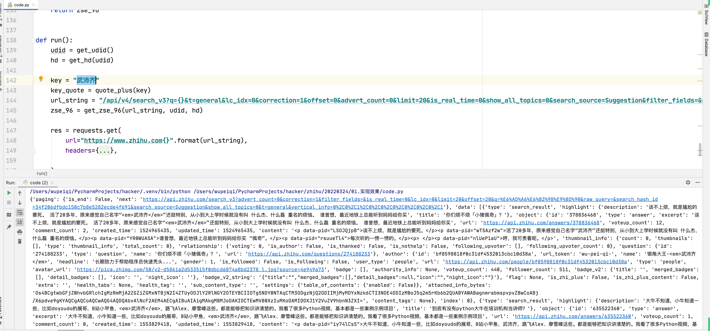


## 1.抓包

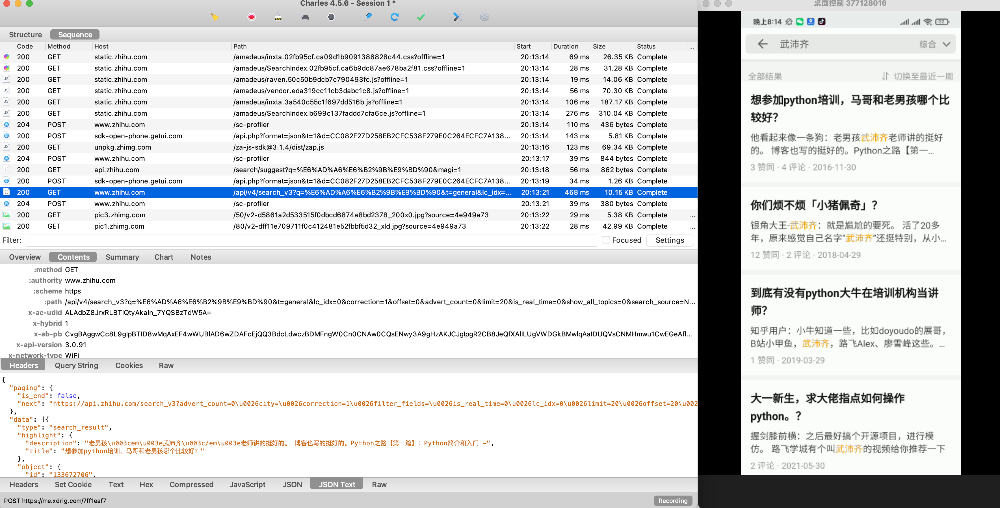

- 请求参数，关键字的转义
- 请求头中
  - x-udid = x-ac-udid
  - x-hd
  - x-zse-96

```python
import requests

res = requests.get(
    url="https://www.zhihu.com/api/v4/search_v3?q=%E5%93%88%E5%93%88%E5%93%88%E5%93%88&t=general&lc_idx=0&correction=1&offset=0&advert_count=0&limit=20&is_real_time=0&show_all_topics=0&search_source=Normal&filter_fields=&raw_query=",
    headers={
        "x-udid": "AIDQoejlCRRLBXqaH0Zjw4S5gqeSRdBIlEE=",
        "x-ac-udid": "AIDQoejlCRRLBXqaH0Zjw4S5gqeSRdBIlEE=",
        "x-hd": "bdf95f1eb35b1db1386535cff3adb645",
        "x-zse-96": "2.0_aTFBo4XyrLNXHhtBzwtyNgU8bH2fNhFBGMF0gvH0k_Of",
        "user-agent": "ZhihuHybrid com.zhihu.android/Futureve/5.32.1 Mozilla/5.0 (Linux; Android 10; Redmi 8A Build/QKQ1.191014.001; wv) AppleWebKit/537.36 (KHTML, like Gecko) Version/4.0 Chrome/87.0.4280.101 Mobile Safari/537.36",
        'x-app-version': "5.32.1",
        "x-zse-93": "101_4_2.0",
    }
)

print(res.text)
```


## 2.URL转义

```
https://www.zhihu.com/api/v4/search_v3?q=%E6%AD%A6%E6%B2%9B%E9%BD%90&t=general&lc_idx=0&correction=1&offset=0&advert_count=0&limit=20&is_real_time=0&show_all_topics=0&search_source=Normal&filter_fields=&city=&pin_flow=false&raw_query=
```

```python
from urllib.parse import unquote_plus, quote_plus

q = "%E6%AD%A6%E6%B2%9B%E9%BD%90"
v = unquote_plus(q) # 武沛齐
```


## 3.udid

x-udid = x-ac-udid

先搜索 `x-udid`

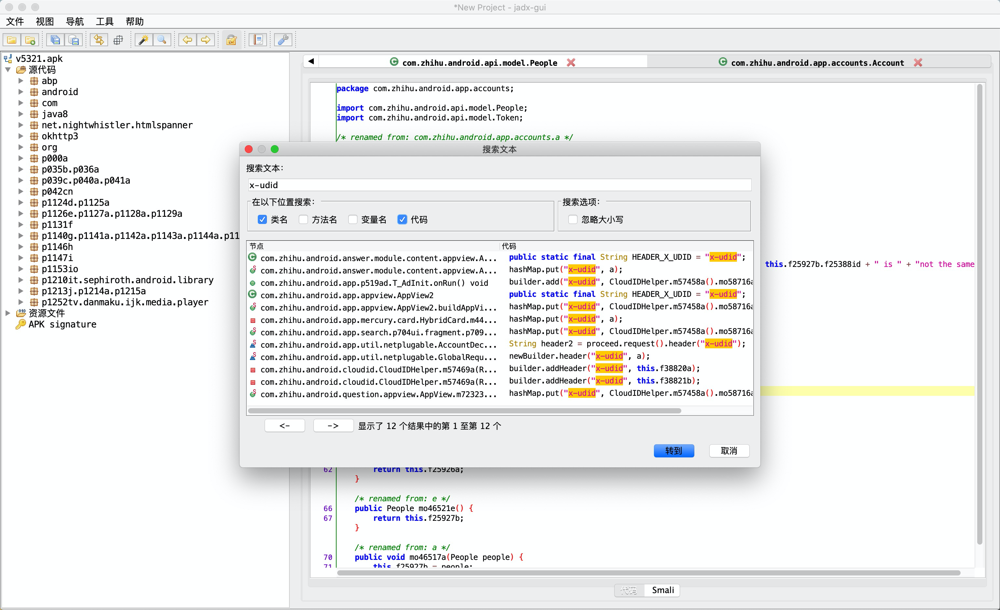

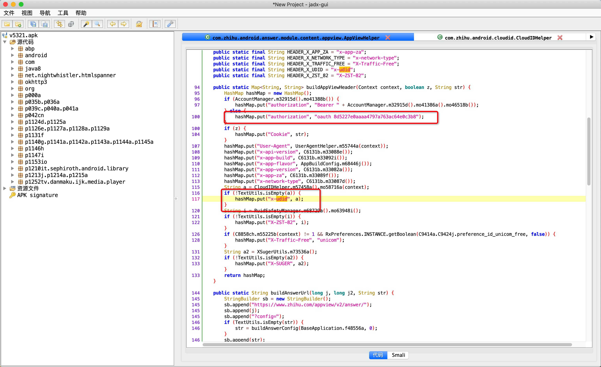

发现：

- 顺着 mo58716a分析udid
- authorization，是固定的 `"oauth 8d5227e0aaaa4797a763ac64e0c3b8"`


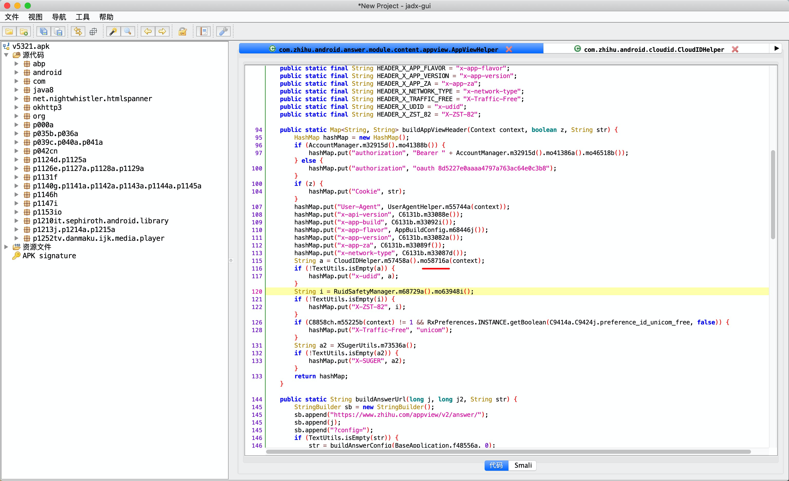

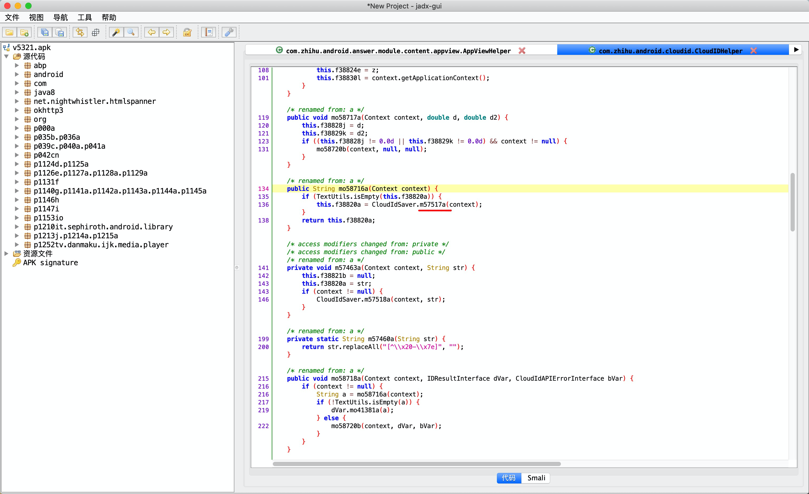


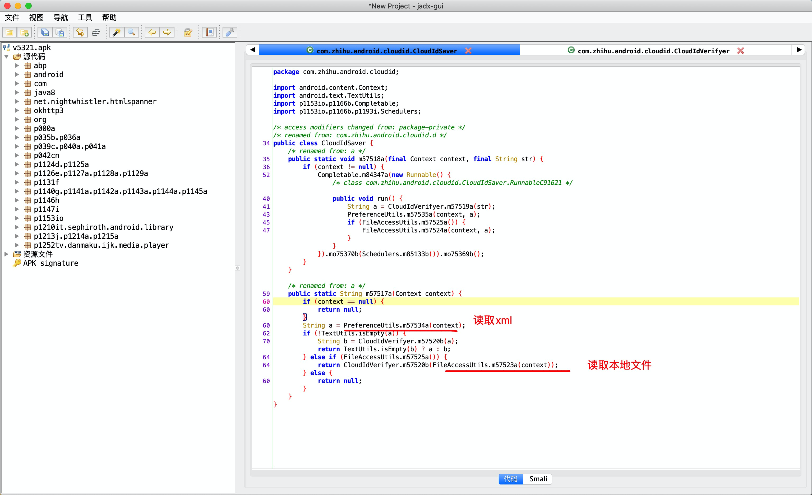

没有看到生成udid算法的逻辑，一定有人提前写入文件，一定是之前的请求。

- 内部算法生成

- 其他请求返回的。

  ```
  注册设备，第一次加载app时。
  ```

  

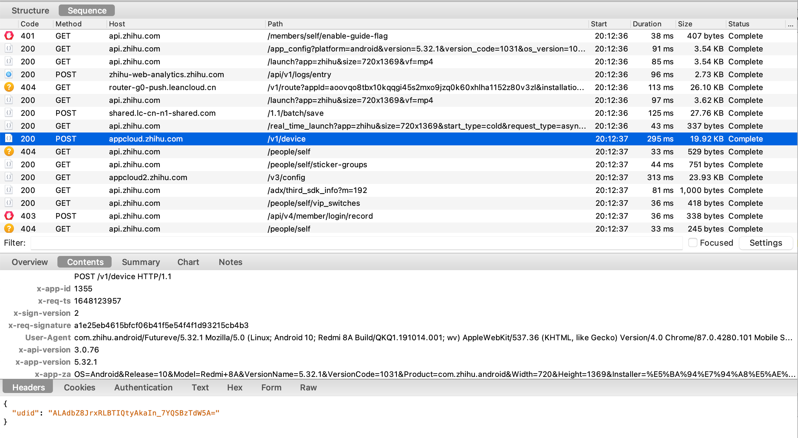

- 请求体：mac地址（搞定）
- 关键是请求头


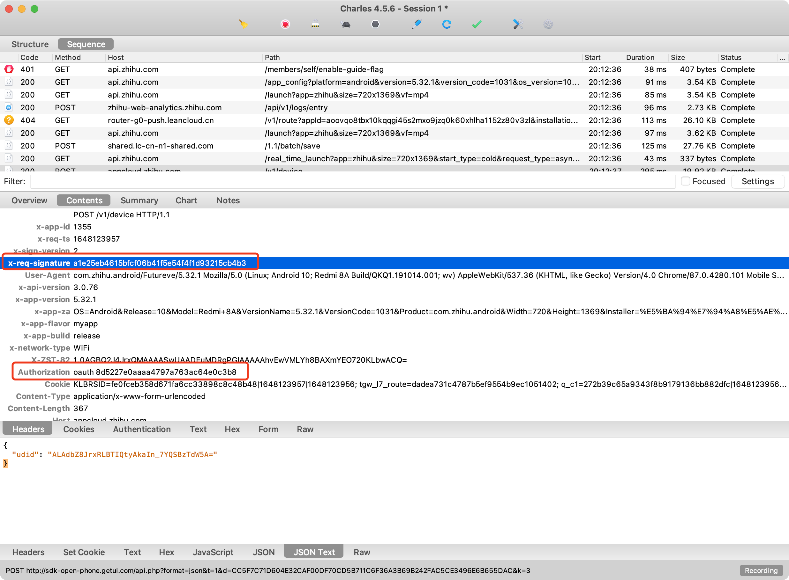


搜索：`x-req-signature`


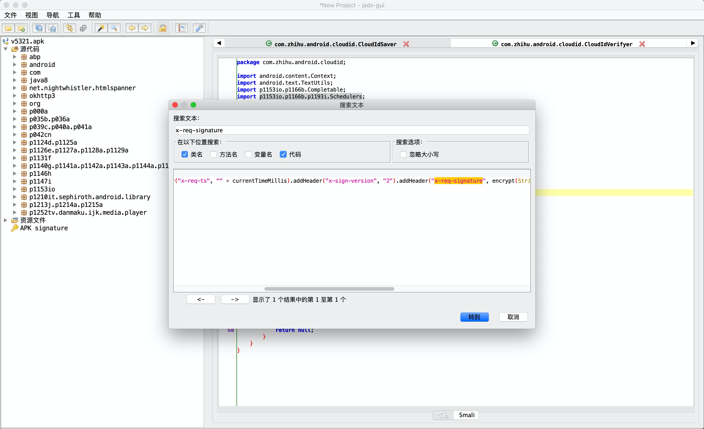

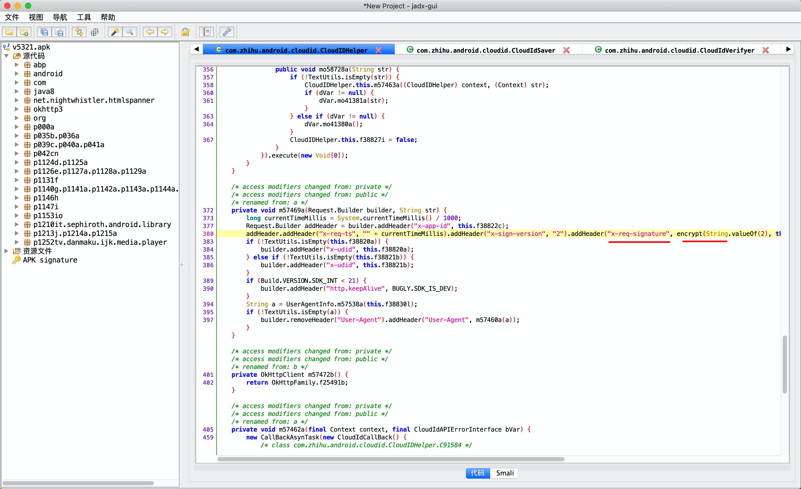

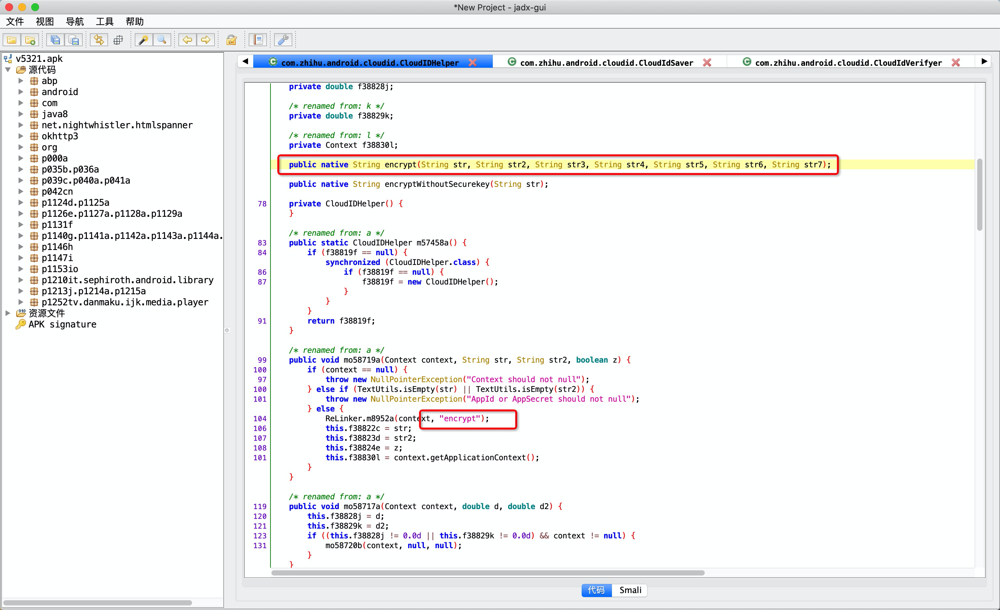

注意：ReLinker是一个加载本机so库的类库。

找libencrypt.so文件。

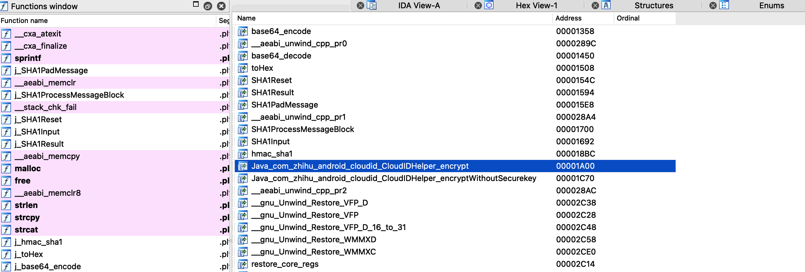

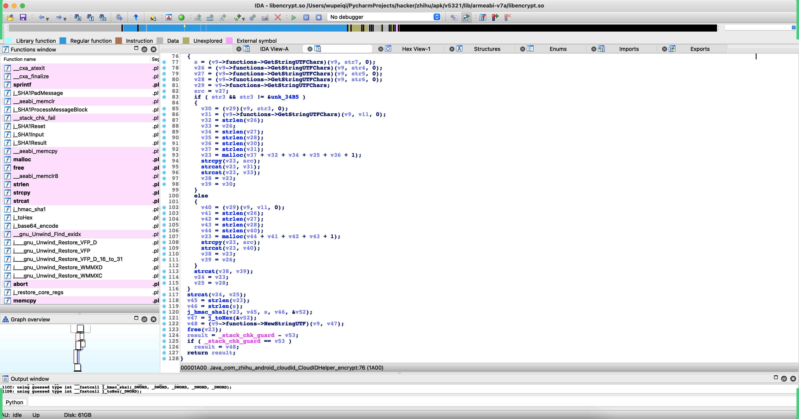


建议：

- 参数和返回值都是什么。
- 倒着分析。


接下来hook encrypt方法：

```python
import frida
import sys

rdev = frida.get_remote_device()
session = rdev.attach("com.zhihu.android")

scr = """
Java.perform(function () {
    var CloudIDHelper = Java.use("com.zhihu.android.cloudid.CloudIDHelper");

    CloudIDHelper.encrypt.implementation = function(str,str2,str3,str4,str5,str6,str7){
        console.log("参数str=",str);
        console.log("参数str2=",str2);
        console.log("参数str3=",str3);
        console.log("参数str4=",str4);
        console.log("参数str5=",str5);
        console.log("参数str6=",str6);
        console.log("参数str7=",str7);
        var res = this.encrypt(str,str2,str3,str4,str5,str6,str7);
        console.log("结果是：",res);
        return res;
    }

});
"""

script = session.create_script(scr)


def on_message(message, data):
    pass


script.on("message", on_message)
script.load()
sys.stdin.read()


```


```
参数str= 2
参数str2= null
参数str3= null
参数str4= app_build=1031&app_version=5.32.1&bt_ck=1&bundle_id=com.zhihu.android&cp_ct=8&cp_fq=2016000&cp_tp=0&cp_us=100.0&d_n=Redmi%208A&fr_mem=197&fr_st=36503&latitude=0.0&longitude=0.0&mc_ad=E0%3A1F%3A88%3AAA%3AB3%3A39&mcc=cn&nt_st=1&ph_br=Xiaomi&ph_md=Redmi%208A&ph_os=Android%2010&ph_sn=unknown&pvd_nm=%E4%B8%AD%E5%9B%BD%E8%81%94%E9%80%9A&tt_mem=256&tt_st=51140&tz_of=28800
参数str5= 1355
参数str6= 1648126419
参数str7= dd49a835-56e7-4a0f-95b5-efd51ea5397f
结果是： 039e423af2e5a217b19f872374bb5db888eb3a28
```

```
参数str= 2
参数str2= null
参数str3= null
参数str4= app_build=1031&app_version=5.32.1&bt_ck=1&bundle_id=com.zhihu.android&cp_ct=8&cp_fq=2016000&cp_tp=0&cp_us=100.0&d_n=Redmi%208A&fr_mem=197&fr_st=36503&latitude=0.0&longitude=0.0&mc_ad=E0%3A1F%3A88%3AAA%3AB3%3A39&mcc=cn&nt_st=1&ph_br=Xiaomi&ph_md=Redmi%208A&ph_os=Android%2010&ph_sn=unknown&pvd_nm=%E4%B8%AD%E5%9B%BD%E8%81%94%E9%80%9A&tt_mem=256&tt_st=51140&tz_of=28800
参数str5= 1355
参数str6= 1648126531 (时间戳)
参数str7= dd49a835-56e7-4a0f-95b5-efd51ea5397f（固定）

结果是： 23bc314eacb4a6baba590f9d315334a09c8b82b3
```


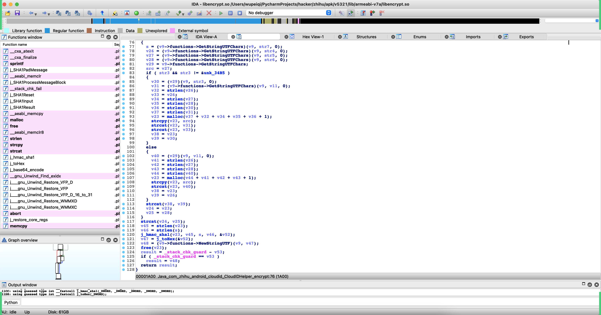

```
j_hmac_sha1(v23, v45, s, v46, &v52);
v47 = j_toHex(&v52);
```

```
j_hmac_sha1(v23, len(v23), s, len(s), &v52);
```

- s

  ```
  s = (v9->functions->GetStringUTFChars)(v9, str7, 0);
  s = "dd49a835-56e7-4a0f-95b5-efd51ea5397f"    -> 加盐
  ```

- v23

  ```
  v23 = src +  v40 +  v39 + v28
        str5 + str + str4 + str6
  ```

  ```
  参数str= 2
  参数str2= null
  参数str3= null
  参数str4= app_build=1031&app_version=5.32.1&bt_ck=1&bundle_id=com.zhihu.android&cp_ct=8&cp_fq=2016000&cp_tp=0&cp_us=100.0&d_n=Redmi%208A&fr_mem=197&fr_st=36503&latitude=0.0&longitude=0.0&mc_ad=E0%3A1F%3A88%3AAA%3AB3%3A39&mcc=cn&nt_st=1&ph_br=Xiaomi&ph_md=Redmi%208A&ph_os=Android%2010&ph_sn=unknown&pvd_nm=%E4%B8%AD%E5%9B%BD%E8%81%94%E9%80%9A&tt_mem=256&tt_st=51140&tz_of=28800
  参数str5= 1355
  参数str6= 1648126531 (时间戳)
  参数str7= dd49a835-56e7-4a0f-95b5-efd51ea5397f（固定）
  
  结果是： 23bc314eacb4a6baba590f9d315334a09c8b82b3
  ```


```python
import hmac
from hashlib import sha1

v23 = "1355" + "2" + "app_build=1031&app_version=5.32.1&bt_ck=1&bundle_id=com.zhihu.android&cp_ct=8&cp_fq=2016000&cp_tp=0&cp_us=100.0&d_n=Redmi%208A&fr_mem=197&fr_st=36503&latitude=0.0&longitude=0.0&mc_ad=E0%3A1F%3A88%3AAA%3AB3%3A39&mcc=cn&nt_st=1&ph_br=Xiaomi&ph_md=Redmi%208A&ph_os=Android%2010&ph_sn=unknown&pvd_nm=%E4%B8%AD%E5%9B%BD%E8%81%94%E9%80%9A&tt_mem=256&tt_st=51140&tz_of=28800" + "1648126531"

hmac_code = hmac.new("dd49a835-56e7-4a0f-95b5-efd51ea5397f".encode('utf-8'), v23.encode('utf-8'), sha1)
res = hmac_code.hexdigest()
print(res) # 23bc314eacb4a6baba590f9d315334a09c8b82b3
```


获取udid的代码如下:

```python
import hmac
import requests
import random
import time
from hashlib import sha1
from urllib.parse import quote_plus


def create_random_mac(sep=":"):
    """ 随机生成mac地址 """

    def mac_same_char(mac_string):
        v0 = mac_string[0]
        index = 1
        while index < len(mac_string):
            if v0 != mac_string[index]:
                return False
            index += 1
        return True

    data_list = []
    for i in range(1, 7):
        part = "".join(random.sample("0123456789ABCDEF", 2))
        data_list.append(part)
    mac = sep.join(data_list)

    if not mac_same_char(mac) and mac != "00:90:4C:11:22:33":
        return mac

    return create_random_mac(sep)


def encrypt(app_id, sign_version, ts, params_string):
    key = "dd49a835-56e7-4a0f-95b5-efd51ea5397f"
    str1 = sign_version
    str5 = app_id
    str6 = ts
    str4 = params_string
    # v23 = "1355" + "2" + "app_build=1031&app_version=5.32.1&bt_ck=1&bundle_id=com.zhihu.android&cp_ct=8&cp_fq=2016000&cp_tp=0&cp_us=100.0&d_n=Redmi%208A&fr_mem=202&fr_st=42809&latitude=0.0&longitude=0.0&mc_ad=E0%3A1F%3A88%3AAA%3AB3%3A39&mcc=cn&nt_st=1&ph_br=Xiaomi&ph_md=Redmi%208A&ph_os=Android%2010&ph_sn=unknown&pvd_nm=%E4%B8%AD%E5%9B%BD%E8%81%94%E9%80%9A&tt_mem=256&tt_st=51140&tz_of=28800" + "1636642368"
    v23 = "{}{}{}{}".format(str5, str1, str4, str6)
    hmac_code = hmac.new(key.encode('utf-8'), v23.encode('utf-8'), sha1)
    res = hmac_code.hexdigest()
    return res


def get_udid():
    app_id = "1355"
    sign_version = "2"

    ts = str(int(time.time()))
    mac_string = create_random_mac()
    mac_quote_string = quote_plus(mac_string)

    tpl = "app_build=1031&app_version=5.32.1&bt_ck=1&bundle_id=com.zhihu.android&cp_ct=8&cp_fq=2016000&cp_tp=0&cp_us=100.0&d_n=Redmi%208A&fr_mem=202&fr_st=42809&latitude=0.0&longitude=0.0&mc_ad={}&mcc=cn&nt_st=1&ph_br=Xiaomi&ph_md=Redmi%208A&ph_os=Android%2010&ph_sn=unknown&pvd_nm=%E4%B8%AD%E5%9B%BD%E8%81%94%E9%80%9A&tt_mem=256&tt_st=51140&tz_of=28800"
    form_string = tpl.format(mac_quote_string)

    sign = encrypt(app_id, sign_version, ts, form_string)

    res = requests.post(
        url="https://appcloud.zhihu.com/v1/device",
        data=form_string,
        headers={
            "x-req-signature": sign,
            "x-req-ts": ts,
            "x-app-id": app_id,
            "x-sign-version": "2",
            "user-agent": "ZhihuHybrid com.zhihu.android/Futureve/5.32.1 Mozilla/5.0 (Linux; Android 10; Redmi 8A Build/QKQ1.191014.001; wv) AppleWebKit/537.36 (KHTML, like Gecko) Version/4.0 Chrome/87.0.4280.101 Mobile Safari/537.36",
        }
    )
    udid = res.json()['udid']
    print(udid)
    return udid


if __name__ == '__main__':
    get_udid()
```


## 4.x-hd

搜索x-hd，发现没找到。

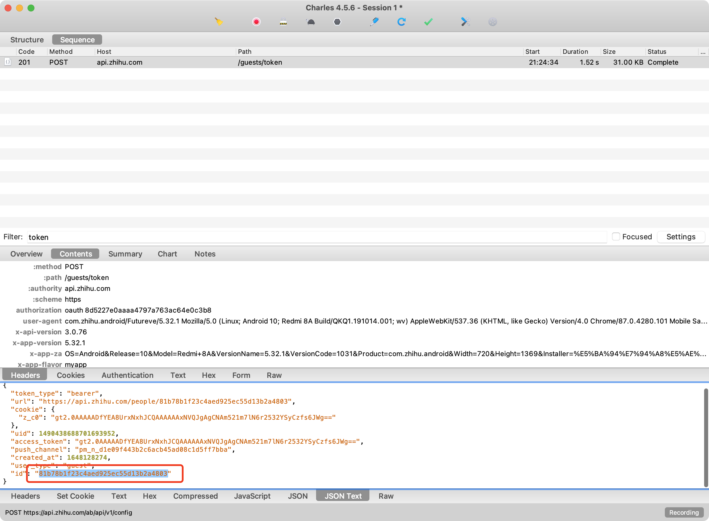


```python
import requests

res = requests.post(
    url="https://api.zhihu.com/guests/token",
    data={
        "source": "com.zhihu.android"
    },
    headers={
        "x-udid": "AGBQ9YDFAxRLBel97ZJuRX4mzPE3_trJT4k=",
        "user-agent": "ZhihuHybrid com.zhihu.android/Futureve/5.32.1 Mozilla/5.0 (Linux; Android 10; Redmi 8A Build/QKQ1.191014.001; wv) AppleWebKit/537.36 (KHTML, like Gecko) Version/4.0 Chrome/87.0.4280.101 Mobile Safari/537.36",
        'x-app-version': "5.32.1"
    },
)

print(res.text)
```


完整代码：

```python
import hmac
import requests
import random
import time
from hashlib import sha1
from urllib.parse import quote_plus


def create_random_mac(sep=":"):
    """ 随机生成mac地址 """

    def mac_same_char(mac_string):
        v0 = mac_string[0]
        index = 1
        while index < len(mac_string):
            if v0 != mac_string[index]:
                return False
            index += 1
        return True

    data_list = []
    for i in range(1, 7):
        part = "".join(random.sample("0123456789ABCDEF", 2))
        data_list.append(part)
    mac = sep.join(data_list)

    if not mac_same_char(mac) and mac != "00:90:4C:11:22:33":
        return mac

    return create_random_mac(sep)


def encrypt(app_id, sign_version, ts, params_string):
    key = "dd49a835-56e7-4a0f-95b5-efd51ea5397f"
    str1 = sign_version
    str5 = app_id
    str6 = ts
    str4 = params_string
    # v23 = "1355" + "2" + "app_build=1031&app_version=5.32.1&bt_ck=1&bundle_id=com.zhihu.android&cp_ct=8&cp_fq=2016000&cp_tp=0&cp_us=100.0&d_n=Redmi%208A&fr_mem=202&fr_st=42809&latitude=0.0&longitude=0.0&mc_ad=E0%3A1F%3A88%3AAA%3AB3%3A39&mcc=cn&nt_st=1&ph_br=Xiaomi&ph_md=Redmi%208A&ph_os=Android%2010&ph_sn=unknown&pvd_nm=%E4%B8%AD%E5%9B%BD%E8%81%94%E9%80%9A&tt_mem=256&tt_st=51140&tz_of=28800" + "1636642368"
    v23 = "{}{}{}{}".format(str5, str1, str4, str6)
    hmac_code = hmac.new(key.encode('utf-8'), v23.encode('utf-8'), sha1)
    res = hmac_code.hexdigest()
    return res


def get_hd(udid):
    res = requests.post(
        url="https://api.zhihu.com/guests/token",
        data={
            "source": "com.zhihu.android"
        },
        headers={
            "x-udid": udid,
            "user-agent": "ZhihuHybrid com.zhihu.android/Futureve/5.32.1 Mozilla/5.0 (Linux; Android 10; Redmi 8A Build/QKQ1.191014.001; wv) AppleWebKit/537.36 (KHTML, like Gecko) Version/4.0 Chrome/87.0.4280.101 Mobile Safari/537.36",
            'x-app-version': "5.32.1"
        },
    )

    # print(res.text)
    return res.json()['id']


def get_udid():
    app_id = "1355"
    sign_version = "2"

    ts = str(int(time.time()))
    mac_string = create_random_mac()
    mac_quote_string = quote_plus(mac_string)

    tpl = "app_build=1031&app_version=5.32.1&bt_ck=1&bundle_id=com.zhihu.android&cp_ct=8&cp_fq=2016000&cp_tp=0&cp_us=100.0&d_n=Redmi%208A&fr_mem=202&fr_st=42809&latitude=0.0&longitude=0.0&mc_ad={}&mcc=cn&nt_st=1&ph_br=Xiaomi&ph_md=Redmi%208A&ph_os=Android%2010&ph_sn=unknown&pvd_nm=%E4%B8%AD%E5%9B%BD%E8%81%94%E9%80%9A&tt_mem=256&tt_st=51140&tz_of=28800"
    form_string = tpl.format(mac_quote_string)

    sign = encrypt(app_id, sign_version, ts, form_string)

    res = requests.post(
        url="https://appcloud.zhihu.com/v1/device",
        data=form_string,
        headers={
            "x-req-signature": sign,
            "x-req-ts": ts,
            "x-app-id": app_id,
            "x-sign-version": "2",
            "user-agent": "ZhihuHybrid com.zhihu.android/Futureve/5.32.1 Mozilla/5.0 (Linux; Android 10; Redmi 8A Build/QKQ1.191014.001; wv) AppleWebKit/537.36 (KHTML, like Gecko) Version/4.0 Chrome/87.0.4280.101 Mobile Safari/537.36",
        }
    )
    udid = res.json()['udid']
    return udid


def run():
    udid = get_udid()
    hd = get_hd(udid)

    print(udid)
    print(hd)


if __name__ == '__main__':
    run()
```


## 5.x-zse-96

根据关键字没搜索。

但是请求中还是会携带，所以直接hook了HashMap，发现这个参数是调用的WebView生成的。

也就是，调用前端的js加密生成的，所以，要在js中分析。

```python
import frida
import sys

rdev = frida.get_remote_device()
session = rdev.attach("com.zhihu.android")

scr = """
Java.perform(function () {
    var HashMap = Java.use("java.util.HashMap");

    HashMap.put.implementation = function(key,value){
        if(key == "x-zse-96"){
            console.log(key,value);
            console.log(Java.use("android.util.Log").getStackTraceString(Java.use("java.lang.Throwable").$new()));
        }
        
        var res = this.put(key,value);
        
        return res;
    }

});
"""

script = session.create_script(scr)


def on_message(message, data):
    pass


script.on("message", on_message)
script.load()
sys.stdin.read()
```

```
# 输出的内容
x-zse-96 2.0_aLSqS7LqSR2XeTN8mXSqbA90NCSXF9F8YHtqrirqN9Sx

java.lang.Throwable
	at java.util.HashMap.put(Native Method)
	at SK.<init>(chromium-TrichromeWebViewGoogle.apk-stable-428010130:15)
	at org.chromium.android_webview.AwContentsBackgroundThreadClient.shouldInterceptRequestFromNative(chromium-TrichromeWebViewGoogle.apk-stable-428010130:1)
```

在app中嵌套了html页面，通过html+js动态生成。

- 知乎网站，寻找 x-zse-96  ---> 【错误】      【算法逻辑】+ 明文（后缀cookie）
- 找专属页面，寻找 x-zse-96  ---> 【正确】  【算法逻辑】+ 明文（ hd + udid）


### 5.1 错误的结果

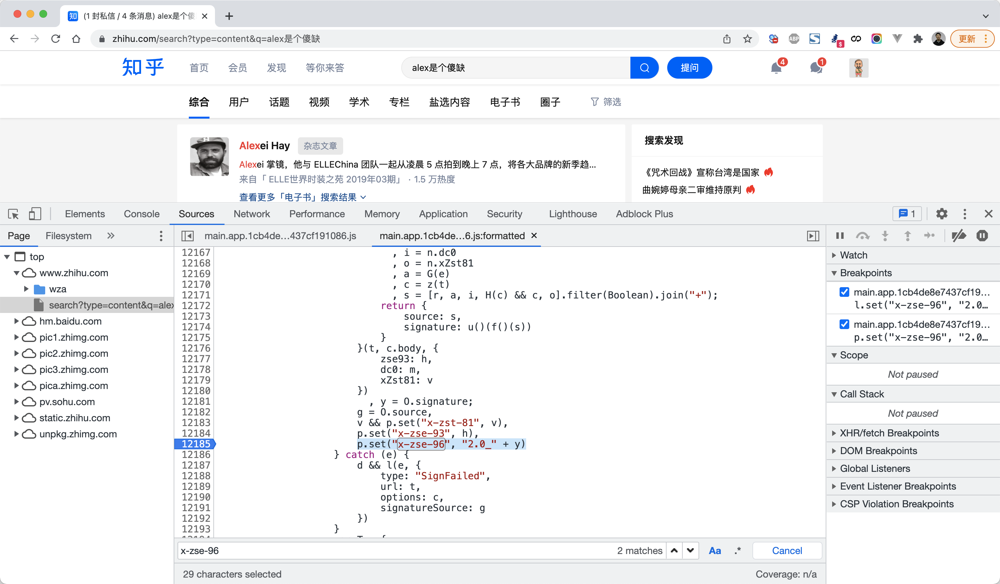


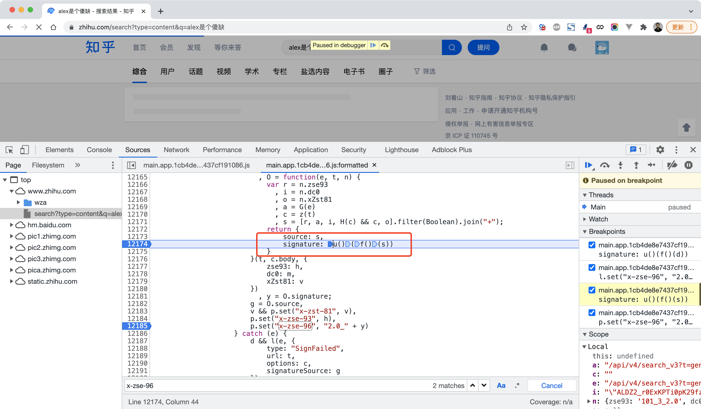


```
p.set("x-zse-96", "2.0_" + y)

y = u()(f()(s))
```

```
u()(   f() (s)   )
        md5加密
        
// 编译js实现
u() = b = function(e) {
	return __g._encrypt(encodeURIComponent(e))
};

// md5加密
f() = function m(e, t, n) {
	return t ? n ? g(t, e) : h(g(t, e)) : n ? v(e) : h(v(e))
}

s = "101_3_2.0+/api/v4/search_v3?t=general&q=%E5%93%88%E5%93%88%E5%93%88%E5%93%88%E5%93%88&correction=1&offset=0&limit=20&filter_fields=&lc_idx=0&show_all_topics=0&search_source=Normal+"ALDZ2_r0ExKPTi0pK29fzASLbErLqovVVMM=|1603356933""

"829a051fcc3589adfd17309e251ac8fc"
829a051fcc3589adfd17309e251ac8fc


函数(  f()(s)  )

函数(  函数(s)  )
```

```
s = "101_3_2.0+/api/v4/search_v3?t=general&q=%E5%93%88%E5%93%88%E5%93%88%E5%93%88%E5%93%88&correction=1&offset=0&limit=20&filter_fields=&lc_idx=0&show_all_topics=0&search_source=Normal+"ALDZ2_r0ExKPTi0pK29fzASLbErLqovVVMM=|1603356933""
```

- 获取s

  ```
  s = "101_3_2.0+/api/v4/search_v3?t=general&q=%E5%93%88%E5%93%88%E5%93%88%E5%93%88%E5%93%88&correction=1&offset=0&limit=20&filter_fields=&lc_idx=0&show_all_topics=0&search_source=Normal+"ALDZ2_r0ExKPTi0pK29fzASLbErLqovVVMM=|1603356933""
  
  s = x-zse-93 + 访问URL + cookie中d_c0的值
  ```

- 对s进行md5加密【搞定】

- sdk.js编译得到结果【搞定】


### 5.2 正确的结果

```
s = "101_3_2.0+/api/v4/search_v3?t=general&q=%E5%93%88%E5%93%88%E5%93%88%E5%93%88%E5%93%88&correction=1&offset=0&limit=20&filter_fields=&lc_idx=0&show_all_topics=0&search_source=Normal+"ALDZ2_r0ExKPTi0pK29fzASLbErLqovVVMM=|1603356933""

s = x-zse-93 + 访问URL + cookie中d_c0的值
```

```
p = "101_4_2.0+/udid+5.32.1+81b78b1f23c4aed925ec55d13b2a4803+AJCQhHETrxRLBdvL8b6PIxxm25yXIWITOi0="

p = 101_4_2.0 + 请求的URL + app版本 + hd  + udid
对p进行MD5加密
在js加密
```


```
u()(f()(s))
函数(结果)
```


