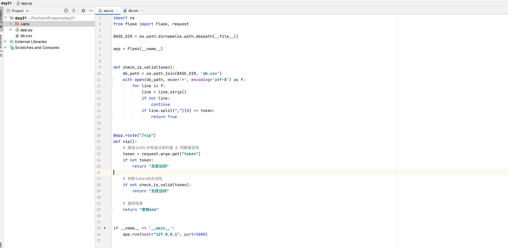
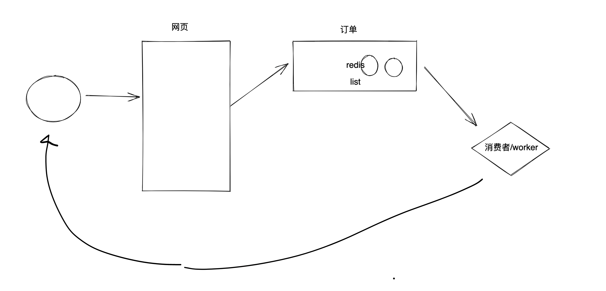

# day21 Flask

Flask轻量级的Web框架，写网站。

- 基本使用和概念
- 案例
  - 简易版本功能，实现对网站自动注册&登录&抢购（5次）。
  - 平台下单（待执行）   ->  【数据库&缓存&队列】    ->   取任务执行   


## 1.基本使用

### 1.1 安装

```
pip install flask
```

### 1.2 代码

```python
from flask import Flask

app = Flask(__name__)


# http://127.0.0.1:5000/hello
@app.route("/hello")
def index():
    return "老铁666"


if __name__ == '__main__':
    app.run(host="127.0.0.1", port=5000)
```

```python
from flask import Flask

app = Flask(__name__)


@app.route("/hello")
def hello():
    return "老铁666"


@app.route("/login")
def login():
    return "老铁666"


@app.route("/show")
def show():
    return "老铁666"


if __name__ == '__main__':
    app.run(host="127.0.0.1", port=5000)
```


## 2.案例


### 2.1 页面+提交信息

> 这个页面只能让他看见，不能让别人看见。

```
http://127.0.0.1:5000/vip?token=123asdasde89182as
```




### 2.2 页面

见代码。


### 2.3 下单




