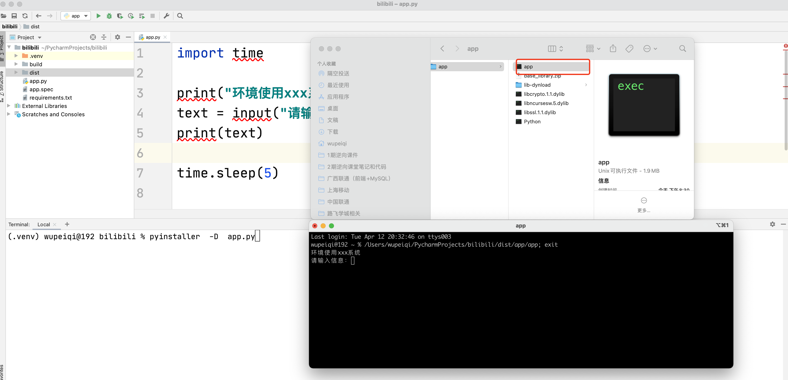
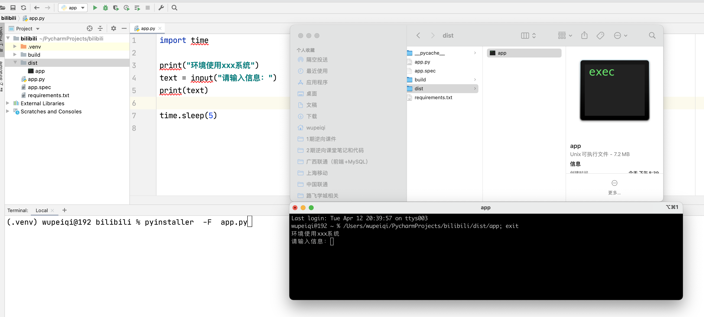
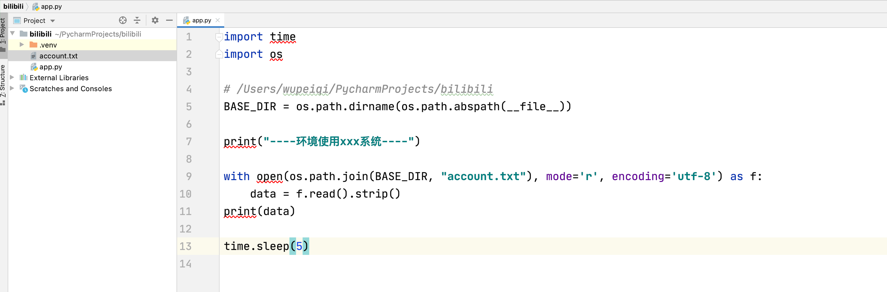
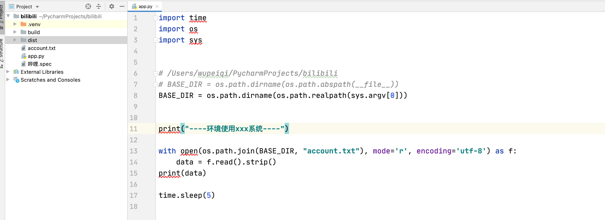
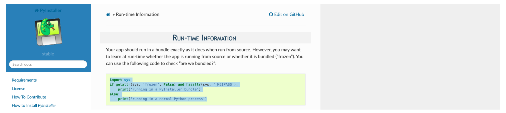
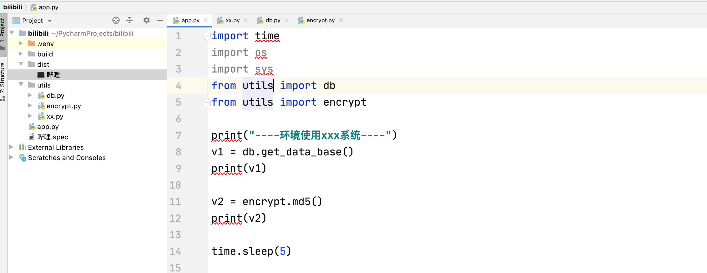
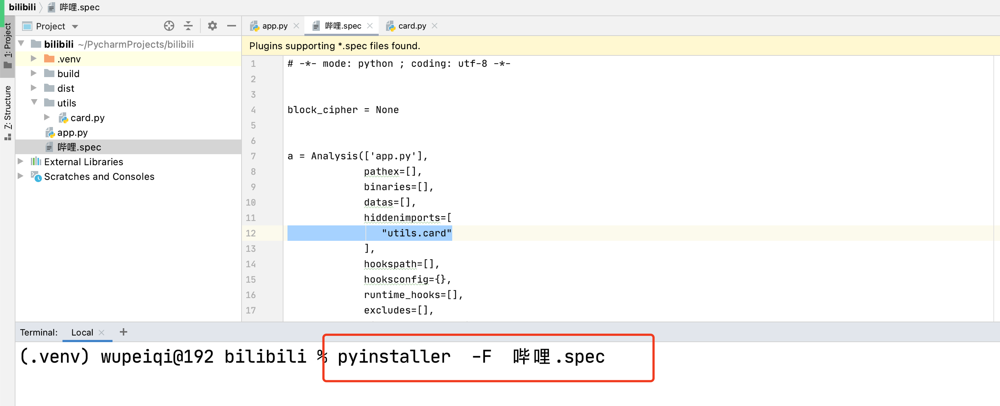
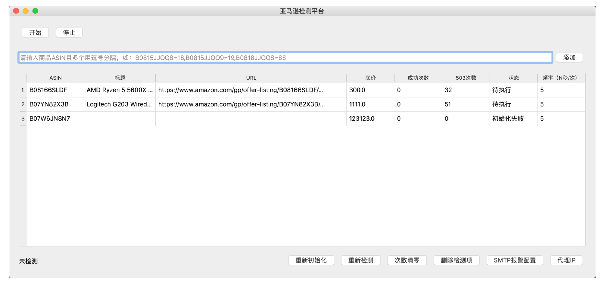
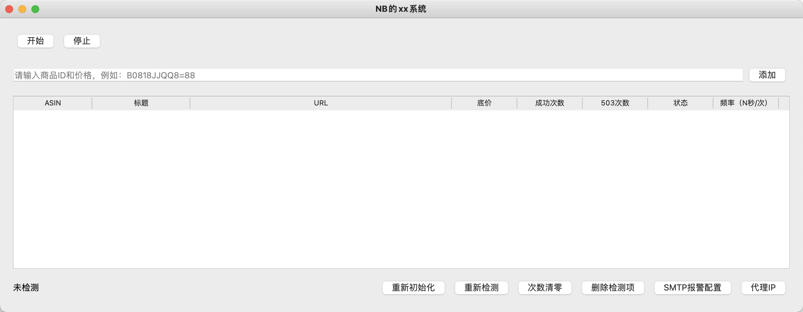

# day25 打包和Qt5

今日概要：

- 脚本打包 exe：win/mac【终端】
- qt5，开发桌面应用。
- 打包qt5程序【桌面应用】


## 1.exe打包

```
pip install pyinstaller
```

注意事项：

- 支持mac、win（windows建议使用python3.6.8）。

- 配合虚拟环境打包。

  ```
  1.在mac系统上开发（为他这个程序创建一个虚拟环境） bili
  2.开发....
  3.开发完毕后
  	pip freeze > reqirements.txt
  	
  4.打开win虚拟机
  5.创建虚拟环境 bili
  6.安装项目依赖
  	pip install -r reqirements.txt
  7.安装pyinstaller
  	pyinstaller -F xxxxx
  
  产出：  哔哩哔哩.exe
  ```

  ```
  1.创建虚拟环境+项目 bili
  2.开发
  3.安装pyinstaller
  	pyinstaller -F xxxxx
  产出： 哔哩哔哩.exe
  ```


### 1.1 多文件

```
pyinstaller  -D  app.py
```




注意：如果像看程序报错，先打开终端，在输入exe文件的路径即可。


### 1.2 单文件

```
pyinstaller -F app.py
```




```
pyinstaller  -D  app.py -n  哔哩
pyinstaller -F app.py -n 哔哩
```


### 1.3 路径问题



- 多文件打包，不会报错。

- 单文件打包，报错。

  ```
  为什么会报错？解析到临时目录问题。
  ```


#### 1.3.1 sys.argv




#### 1.3.2 frozen



```python
import sys
if getattr(sys, 'frozen', False):
    print('running in a PyInstaller bundle')
else:
    print('running in a normal Python process')
```

```python
import time
import os
import sys

if getattr(sys, 'frozen', False):
    BASE_DIR = os.path.dirname(sys.executable)
else:
    BASE_DIR = os.path.dirname(os.path.abspath(__file__))

print("----环境使用xxx系统----")

with open(os.path.join(BASE_DIR, "account.txt"), mode='r', encoding='utf-8') as f:
    data = f.read().strip()
print(data)

time.sleep(5)
```


### 1.4 关于模块




但是，如果遇到那种动态导入模块的代码时，他是无法找到关联的包。

```python
import time
import importlib

print("----环境使用xxx系统----")

# from utils import card
# card.get_number()

card = importlib.import_module("utils.card")
v1 = card.get_number()
print(v1)

time.sleep(5)
```




## 2.pyqt5

```
pip install pyqt5
```



```python
import sys
from PyQt5.QtWidgets import QApplication, QWidget, QDesktopWidget


class MainWindow(QWidget):
    def __init__(self):
        super().__init__()

        # 窗体标题和尺寸
        self.setWindowTitle('NB的xx系统')

        # 窗体的尺寸
        self.resize(980, 450)

        # 窗体位置
        qr = self.frameGeometry()
        cp = QDesktopWidget().availableGeometry().center()
        qr.moveCenter(cp)


if __name__ == '__main__':
    app = QApplication(sys.argv)

    window = MainWindow()
    window.show()

    sys.exit(app.exec_())
```

### 2.1 布局问题

- 垂直方向
- 水平方法





```python
import sys
from PyQt5.QtWidgets import QApplication, QWidget, QDesktopWidget, QHBoxLayout, QVBoxLayout
from PyQt5.QtWidgets import QPushButton, QLineEdit, QTableWidget, QTableWidgetItem, QLabel


class MainWindow(QWidget):
    def __init__(self):
        super().__init__()

        # 窗体标题和尺寸
        self.setWindowTitle('NB的xx系统')

        # 窗体的尺寸
        self.resize(1228, 450)

        # 窗体位置
        qr = self.frameGeometry()
        cp = QDesktopWidget().availableGeometry().center()
        qr.moveCenter(cp)

        # 创建布局
        layout = QVBoxLayout()

        # 1.创建顶部菜单布局
        header_layout = QHBoxLayout()
        # 1.1 创建按钮，加入 header_layout
        btn_start = QPushButton("开始")
        header_layout.addWidget(btn_start)

        btn_stop = QPushButton("停止")
        header_layout.addWidget(btn_stop)

        # 弹簧
        header_layout.addStretch()

        layout.addLayout(header_layout)

        # 2.创建上面标题布局
        form_layout = QHBoxLayout()

        # 2.1 输入框
        txt_asin = QLineEdit()
        txt_asin.setPlaceholderText("请输入商品ID和价格，例如：B0818JJQQ8=88")
        form_layout.addWidget(txt_asin)

        # 2.2 添加按钮
        btn_add = QPushButton("添加")
        form_layout.addWidget(btn_add)

        layout.addLayout(form_layout)

        # 3.创建中间的表格
        table_layout = QHBoxLayout()

        # 3.1 创建表格
        table_widget = QTableWidget(0, 8)
        table_header = [
            {"field": "asin", "text": "ASIN", 'width': 120},
            {"field": "title", "text": "标题", 'width': 150},
            {"field": "url", "text": "URL", 'width': 400},
            {"field": "price", "text": "底价", 'width': 100},
            {"field": "success", "text": "成功次数", 'width': 100},
            {"field": "error", "text": "503次数", 'width': 100},
            {"field": "status", "text": "状态", 'width': 100},
            {"field": "frequency", "text": "频率（N秒/次）", 'width': 100},
        ]
        for idx, info in enumerate(table_header):
            item = QTableWidgetItem()
            item.setText(info['text'])
            table_widget.setHorizontalHeaderItem(idx, item)
            table_widget.setColumnWidth(idx, info['width'])

        table_layout.addWidget(table_widget)

        layout.addLayout(table_layout)

        # 2.底部菜单
        footer_layout = QHBoxLayout()

        label_status = QLabel("未检测", self)
        footer_layout.addWidget(label_status)

        footer_layout.addStretch()

        btn_reinit = QPushButton("重新初始化")
        footer_layout.addWidget(btn_reinit)

        btn_recheck = QPushButton("重新检测")
        footer_layout.addWidget(btn_recheck)

        btn_reset_count = QPushButton("次数清零")
        footer_layout.addWidget(btn_reset_count)

        btn_delete = QPushButton("删除检测项")
        footer_layout.addWidget(btn_delete)

        btn_alert = QPushButton("SMTP报警配置")
        footer_layout.addWidget(btn_alert)

        btn_proxy = QPushButton("代理IP")
        footer_layout.addWidget(btn_proxy)

        layout.addLayout(footer_layout)

        # 弹簧
        # layout.addStretch()

        # 给窗体设置元素的排列方式
        self.setLayout(layout)


if __name__ == '__main__':
    app = QApplication(sys.argv)

    window = MainWindow()
    window.show()

    sys.exit(app.exec_())
```


### 2.2 表格数据初始化

- 有数据
- 表格中展示

详细见代码。


