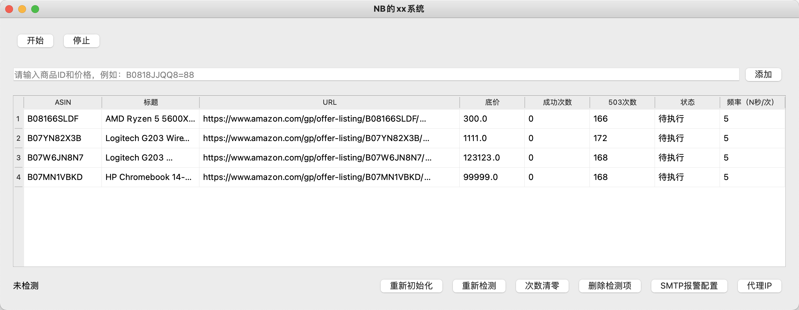
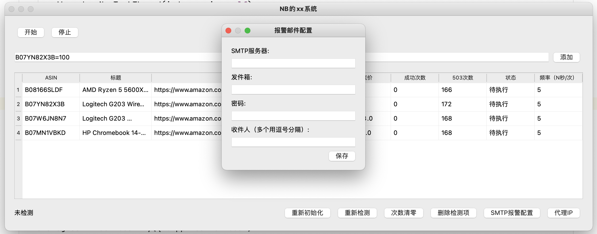
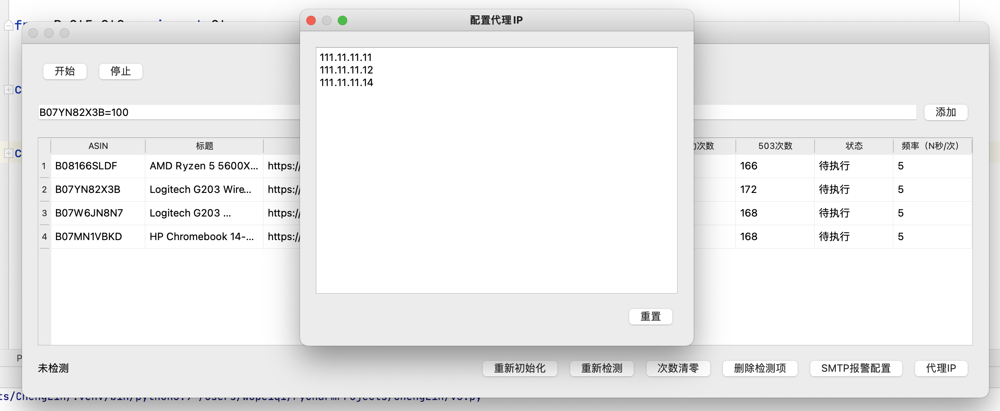
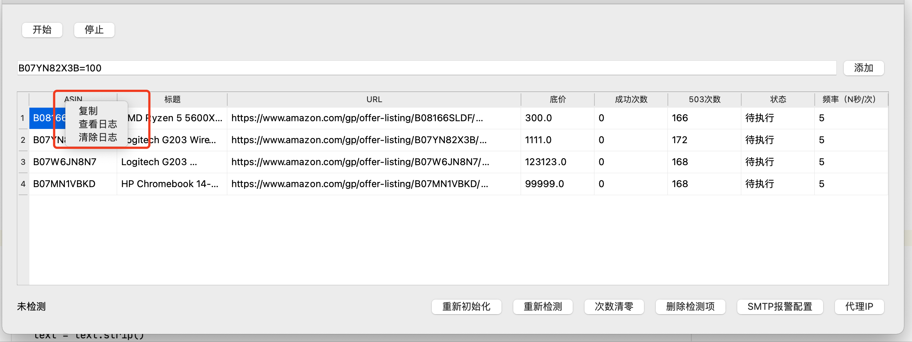

# day26 QT




```python
# 1.将Python内置的模块（功能导入）
import smtplib
from email.mime.text import MIMEText
from email.utils import formataddr

# 2.构建邮件内容
msg = MIMEText("领导早上好，领导今天辛苦了。", "html", "utf-8")  # 内容
msg["From"] = formataddr(["武沛齐", "yangliangran@126.com"])  # 自己名字/自己邮箱
msg['to'] = "424662508@qq.com"  # 目标邮箱
msg['Subject'] = "360一天"  # 主题

# 3.发送邮件
server = smtplib.SMTP_SSL("smtp.126.com")
server.login("yangliangran@126.com", "LAYEVIAPWQAVVDEP")  # 账户/授权码
server.sendmail("yangliangran@126.com", "424662508@qq.com", msg.as_string()) # 自己邮箱/目标邮箱/内容
server.quit()
```









