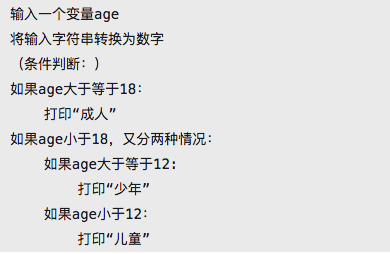
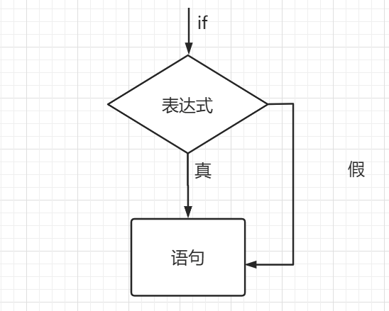
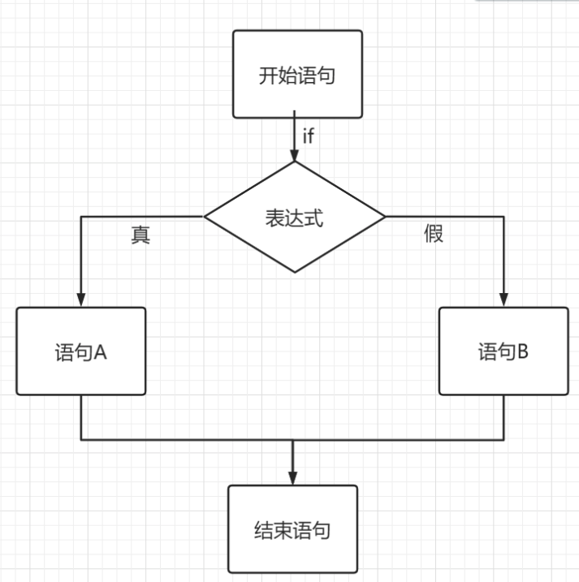
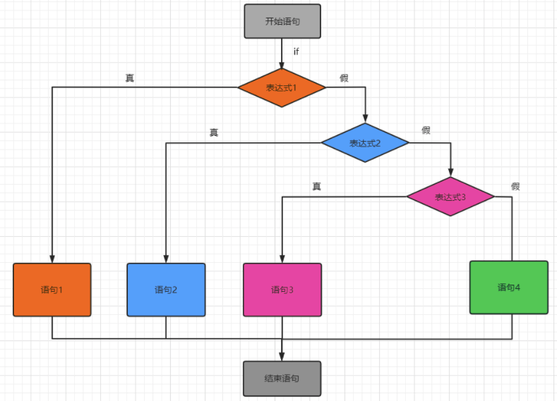
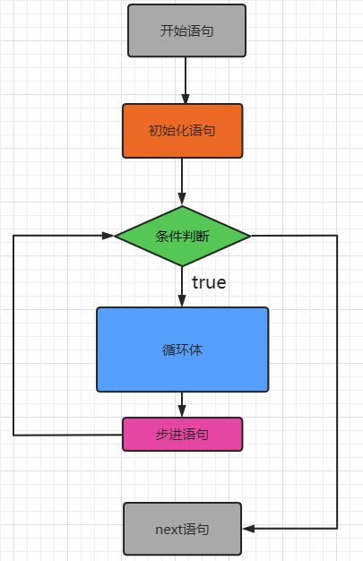

### 流程控制

- 流程控制指的是代码运行逻辑、分支走向、循环控制，是真正体现程序执行顺序的操作。

- 程序是由语句构成，而流程控制语句 是用来控制程序中每条语句执行顺序的语句。可以通过控制语句实现更丰富的逻辑以及更强大的功能。几乎所有编程语言都有流程控制语句，功能也都基本相似。

- 流程控制的意义
  
  - 流程控制体现了一种编程中的“因果关系”，也就是有什么样的因就产生什么样的果，例如有什么输入就会有相应的输出，同一个输入不管执行多少次必然得到同样的输出，所有的都是确定的、可控的。
  
- 流程控制的组成
  
  - 流程控制一般分为顺序执行、条件判断和循环控制。
  
- 伪代码

  - 伪代码(Pseudocode)是一种算法描述语言。使用伪代码的目的是使被描述的算法可以容易地以任何一种编程语言实现。因此，伪代码必须结构清晰、代码简单、可读性好，并且类似自然语言。 通俗简单地讲，就是用中文把你的程序先写出来，在检查过伪代码没有问题后，再用Python等语言将其真正实现。

  

上图中就是一组典型的流程控制操作，很明确的阐述了编程中的因果关系，同一个输入不管执行多少次必然会得到同样的输出结果。

#### 顺序执行

- 顾名思义，就是根据编写程序的上下顺序依次执行或者说是自上而下逐行顺序执行。


#### 条件判断

- 顺序结构的程序虽然能解决计算、输出等问题，但不能做判断再选择。对于要先做判断再选择的问题就要使用分支结构。

- 单分支语句

  - 语法：

  - ```
    if 表达式:
        代码块
    ```

  - > 说明：
    >
    > 1、“表达式”可以是一个单一的值或者复杂语句，形式不限，但解释器最后会通过`bool`获取一个`true`或者`false`的布尔值
    >
    > 2、“代码块”由：与具由相同缩进标识的若干条语句组成（一般是四个缩进）。

    

  ```python
  age = input('enter your age:')
  age = int(age) #将字符串形式的age转换成了数字类型
  if age > 18:
      print('成年')
      
  print('over!')
  ```
  
- 双分支语句

  - 双分支语句顾名思义，二条分支二选一执行！语法格式：

  - ```
    if 表达式：
        代码块 1
    else：
        代码块 2
    ```

  - 

- ```python
  age = input('enter a age:')#age是一个字符串类型
  #将字符串类型的age转换成整形
  age = int(age)
  
  if age >= 18: #if后面的表达式返回True说明该条件成立，否则说明该条件不成立
      print('成年')
  else:
      print('未成年')
  ```

- 多分支语句

  - 多分支即从比双分支更多的分支选择一支执行。语法格式：

  - ```
    if 表达式 1：
        代码块 1
    elif 表达式 2：
        代码块 2
    elif 表达式 3：
        代码块 3
    ...# 其它elif语句
    else：
        代码块 n
    ```

  - 

  - ```python
    age = input('enter a age:')#age是一个字符串类型
    #将字符串类型的age转换成整形
    age = int(age)
    
    if age >= 18: #if后面的表达式返回True说明该条件成立，否则说明该条件不成立
        print('成年')
    elif age >= 12:
        print('未成年')
    elif age >= 8:
        print('儿童')
    else:
        print('婴儿')
    ```
  
  - 案例:猜数字游戏
  
    - ```python
      #第一种写法
      true_num = 9 #标准答案
      num = input('please guess a num:')
      num = int(num)
      
      #用户猜数字只有三种可能：猜对了，猜小了和猜大了
      if num == true_num:#猜对了
          print('恭喜您，猜对了！')
      else:#包含了用户猜大了和猜小了两种可能
          # print('猜错了')
          if num < true_num:
              print('猜小了')
          else:#只剩下一种可能：猜大了
              print('猜大了')
      
      print('一轮游戏结束！')
      ```
      
    - ```python
      #第二种写法：
      true_num = 9 #标准答案
      num = input('please guess a num:')
      num = int(num)
      
      #用户猜数字只有三种可能：猜对了，猜小了和猜大了
      if num == true_num:#猜对了
          print('恭喜您，猜对了！')
      elif num < true_num:
          print('猜小了')
      else:
          print('猜大了')
      
      print('一轮游戏结束！')
      ```

#### 循环控制语句

在不少实际问题中有许多具有规律性的重复操作，因此在程序中就需要重复执行某些语句。一组被重复执行的语句称之为循环体，能否继续重复，决定循环的终止条件。

Python语言中的循环语句支持 while循环（条件循环）和for循环（遍历循环）。

##### while循环

- 语法：

- ```
  while 表达式:
      循环体
  ```

- 

- 案例：循环打印十遍"hello world"

  ```python
  i = 0
  while i < 10:
      print('hello world!')
      #步进语句
      i += 1  #i = i + 1
  ```

- 让猜数字游戏多次执行

- ```python
  true_num = 9 #标准答案
  i = 0
  while i < 5:
      num = input('please guess a num:')
      num = int(num)
      #用户猜数字只有三种可能：猜对了，猜小了和猜大了
      if num == true_num:#猜对了
          print('恭喜您，猜对了！')
      elif num < true_num:
          print('猜小了')
      else:
          print('猜大了')
      i += 1 #步进语句
  
  print('一轮游戏结束！')
  ```

- 案例：求解1-3累加和

- ```python
  #案例：求解1-3累加和
  sum = 0 #保存累加后的结果
  i = 1
  while i <= 3:
      sum = sum + i
      i += 1
  print(sum)
  
  #第一次循环结束：sum = 1  i = 2
  #第二次循环结束：sum = 3  i = 3
  #第三次循环结束：sum = 6  i = 4
  ```
  
- 想要计算n！(5! = 5 * 4 * 3 * 2 * 1)

- ```python
  s = 1 #前n个数的积
  i = 1
  while i <= 5:
      s = s * i
      i += 1
  
  print(s)
  ```

- ```python
  x = input('您想要计算几的阶乘呢，请录入：')
  x = int(x)
  
  s = 1 #前n个数的积
  i = 1
  while i <= x:
      s = s * i
      i += 1
  
  print(s)
  ```

- 找出1-100之间所有的偶数,将其存储到一个列表中

- ```python
  #找出1-100之间所有的偶数,将其存储到一个列表中
  alist = [] #存放所有符合条件的偶数
  i = 1
  while i <= 100:
      #判断偶数
      if i % 2 == 0:#i可以被2整除
          alist.append(i) #将偶数添加到指定的列表中
      i += 1
  
  print(alist)
  ```

##### for循环

- 语法格式

- ```
  for 迭代变量 in 字符串|列表|元组|字典|集合：
    代码块
  ```

- 格式中，迭代变量用于存放从序列类型变量中读取出来的元素，所以一般不会在循环中对迭代变量手动赋值；代码块指的是具有相同缩进格式的多行代码（和 while 一样），由于和循环结构联用，因此代码块又称为循环体。

- ```python
  alist = [1,2,3,4,5]
  #item变量不需要提前声明/定义
  #循环次数取决于in后面那个数据结构中元素的个数
  for item in alist: #遍历列表元素
      print(item) #循环体
  
  ```
  
  ```python
  alist = [1,2,3,4,5]
  #item变量不需要提前声明/定义
  #循环次数取决于in后面那个数据结构中元素的个数
  for item in alist: #遍历列表元素
      print('hello world') #循环体
  ```

- 计算1-5之和

- ```python
  alist = [1,2,3,4,5]
  sum = 0
  for item in alist:
      sum += item
  print(sum)
  ```

- 遍历字典

- ```python
  dic = {
      'name':'bobo',
      'age':20,
      'address':'Bj'
  }
  #keys返回的是一个列表，列表中存储的是字典中所有的key
  for key in dic.keys():
      print(dic[key])
      
  for key,value in dic.items():
      print(key,value)
  ```

- 遍历字符串

- ```python
  s = 'hello bobo'
  for item in s:
      print(item)
  ```

- 总结：
  - 如果遍历一个数据结构，则最好使用for循环
  - 如果一个需求循环次数不确定最好使用while
  - 如果一个需求循环次数确定最好使用for

##### 死循环

- 永远都不会结束的循环。

- 但有我们是会需要无限循环。例如Web服务器响应客户端的实时请求。

- ```python
  while True:
  	pass #循环体
  
  while 1:
    pass #循环体
  
  ```

##### 循环嵌套

- if判断可以嵌套，while和for当然也可以嵌套。但是建议大家不要嵌套3层以上，那样的效率会很低。

- ```python
  #查看下述的print会被循环执行多少次
  i = 0
  while i < 3:
      j = 0
      while j < 2:
          print('hello world!') #会被打印6次
          j += 1
      i += 1
  ```


- ```python
  alist = [1,2,3,4,5]
  for i in alist:
      for j in alist:
          print('hello') #重复执行25次
  ```

##### 退出循环

如果想提前结束循环（在不满足结束条件的情况下结束循环），可以使用break或continue关键字。

- break

  - 通常情况下的循环要么执行出错，要么死循环，要么就只能老老实实等它把所有的元素循环一遍才能退出。如果想在循环过程中退出循环，怎么办？用break语句！
  - break只能用于循环体内。其效果是直接结束并退出当前循环，剩下的未循环的工作全部被忽略和取消。注意当前两个字，Python的break只能退出一层循环，对于多层嵌套循环，不能全部退出。

- ```python
  alist = [1,2,3,4,5]
  for i in alist:
      print('hello world')
      if i == 3:
          break #终止整个循环

- continue

  - 与break不同，continue语句用于跳过当前循环的剩余部分代码，直接开始下一轮循环。它不会退出和终止循环，只是提前结束当前轮次的循环。同样的，continue语句只能用在循环内。

  - ```python
    alist = [1,2,3,4,5]
    for i in alist:
        if i == 3:
            continue #结束当次循环，开始下一次新的循环
        print(i)
    ```

- 注意：break和continue只可以作用在离其最近的那一层循环中。

- ```python
  alist = [1,2,3]
  for i in alist:
      for j in alist:
          print('inner')
          if j == 1:
              break
      print('outer')
  ```

##### else从句

- while的else从句
  - while循环还可以增加一个else从句。当while循环正常执行完毕，会执行else语句。但如果是被break等机制强制提前终止的循环，不会执行else语句。注意else与while平级的缩进方式！
  
  - ```python
    i = 0
    while i < 5:
        print(i)
        if i == 3:
            break
        i += 1
    else: #只有当循环被正常结束，才会执行else从句
        print('while循环正常结束！')
    ```
- for的else从句
  - 与while一样，for循环也可以有else子句。同样是正常结束循环时，else子句执行。被中途break时，则不执行。
  
  - ```python
    alist = [1,2,3,4,5]
    for i in alist:
        print(i)
        if i == 2:
            break
    else:
        print('for循环正常结束！')
    ```
    
    

1.实现完整的猜数字游戏：

规则如下：

​	可以不间断的进行猜数字游戏环节，找到猜对了，结束程序，猜不对，可以不断的进行游戏，并且需要提示用户猜大了还是猜小了。

拓展功能实现：

​	1.最后需要统计出，用户猜了多少次才猜对。

​	2.每一个用户的初始分数为100，每猜错一次扣5分，最后程序结束，统计用户的得分。

```python
import random
score = 100 #初始分值
count = 0 #用来统计循环了多少次
#随机产生一个1-100之间的数字
num = int(random.random() * 100)
while True:
    count += 1
    guessNum = int(input('enter a num:'))
    if guessNum == num:
        print('猜对了')
        break
    elif guessNum < num:
        if score > 0:
            score -= 5
        else:
            break
        print('猜小了')
    else:
        if score > 0:
            score -= 5
        else:
            break
        print('猜大了')
        
print('一共猜了%d次,总得分为：%d'%(count,score))
```


### 排序算法

- 冒泡排序

  - 1.将序列中的元素两两比较，然后实现将序列中的最大值逐一偏移到序列的末尾位置。

  - ```python
    alist = [3,8,5,7,6]
    for i in range(len(alist)-1):
        if alist[i] > alist[i+1]:
            #将两个元素交换位置
            alist[i],alist[i+1] = alist[i+1],alist[i]
    print(alist)
    ```

  - 2.将上述步骤1的核心操作重复执行n次就可以实现有序效果

    ```python
    alist = [3,8,5,7,6]
    for j in range(len(alist)-1):
        for i in range(len(alist)-1-j):
            if alist[i] > alist[i+1]:
                #将两个元素交换位置
                alist[i],alist[i+1] = alist[i+1],alist[i]
    print(alist)
    ```

- 选择排序

  - 1.将序列中的元素两两比较，找出最大值，将最大值和序列中最后一个元素交换位置。

  - ```
    alist = [3,8,5,7,6]
    #一开始假设最大值的小标为0
    max_index = 0 #保存最大元素的小标
    for i in range(len(alist)-1):#i的取值为0，1，2，3
        if alist[max_index] < alist[i+1]:
            max_index = i+1
    
    alist[max_index],alist[len(alist)-1] =  alist[len(alist)-1],alist[max_index]
    print(alist)
    ```

  - 将上述步骤1的核心操作重复执行n次就可以实现有序效果

  - ```
    alist = [3,8,5,7,6]
    for j in range(len(alist)-1):
        #一开始假设最大值的小标为0
        max_index = 0 #保存最大元素的小标
        for i in range(len(alist)-1-j):#i的取值为0，1，2，3
            if alist[max_index] < alist[i+1]:
                max_index = i+1
        alist[max_index],alist[len(alist)-1-j] =  alist[len(alist)-1-j],alist[max_index]
    
    print(alist)
    ```

  - 插入排序

    - 假设将列表分为两部分：
      - 有序部分：默认情况下，列表的第一个元素为有序部分
      - 无序部分：默认情况下，列表的非第一个元素为无序部分

  - ```
    [3,   8,5,7,6] #初始列表
    [3,8,   5,7,6] #第一次插入
    [3,5,8,   7,6] #第二次插入
    [3,5,7,8,   6] #第三次插入
    [3,5,6,7,8   ] #第四次插入
    ```

    - 定义一个变量i，i的初始值为1.变量i表示的是有序部分的元素个数。

    - i = 1的情况：

      - ```
        i = 1
        alist = [3,8,5,7,6]
        #alist[i]无序部分的第一个元素
        #alist[i-1]有序部分最后一个元素
        if alist[i] < alist[i-1]:
            alist[i],alist[i-1] = alist[i-1],alist[i]
        ```

    - i = 2 或者说i>1的情况

      - ```
        #alist[i]无序部分的第一个元素
        #alist[i-1]有序部分最后一个元素
        while i > 0:
            if alist[i] < alist[i-1]:
                alist[i],alist[i-1] = alist[i-1],alist[i]
                i -= 1
            else:
                break
        ```

    - 完整代码：

    - ```
      alist = [3,8,5,7,6,2,1,0]
      for i in range(1,len(alist)):
          while i > 0:
              if alist[i] < alist[i-1]:
                  alist[i],alist[i-1] = alist[i-1],alist[i]
                  i -= 1
              else:
                  break
      print(alist)
      ```

  - 二分查找

    - 只可以作用在有序序列中

    - ```
      isFind = False
      #假设现在查找2是否存在于当前列表中
      toFind = input('enter a num of you want to find:')
      toFind = int(toFind)
      alist = [1,2,3,4,5,6]
      low = 0 #第一个元素下标
      high = len(alist)-1 #最后一个元素下标
      while low <= high:
          #mid保存中间元素下标
          mid = (low + high) // 2
          #如果条件成立，则可以去中间元素右侧查找
          if toFind > alist[mid]:
              low = mid + 1
          elif toFind < alist[mid]:#查找的元素可能存在中间元素左侧
              high = mid - 1
          else: #中间元素等于查找的元素
              isFind = True
              break
              
      print(isFind)
      
      ```

    

  - 衡量算法性能好坏优劣的指标：

    - 时间复杂度

      - 量化算法执行步骤的数量。

    - 例子：

    - ```
      n = 5  #1
      while n > 0: #2n
      	print('haha')
      	a -= 1
      print('over!')#1
      
      #上述算法量化出执行步骤的数量：2+2n
      ```

    - 时间复杂度最终是通过大O记法来表示：

      - 将量化出的表达式取出最有意义的一项，放入在大O后面的括号中即可。
      - 2+2*n：最优意义的一项是n，该算法就可以表示为：O(n)
