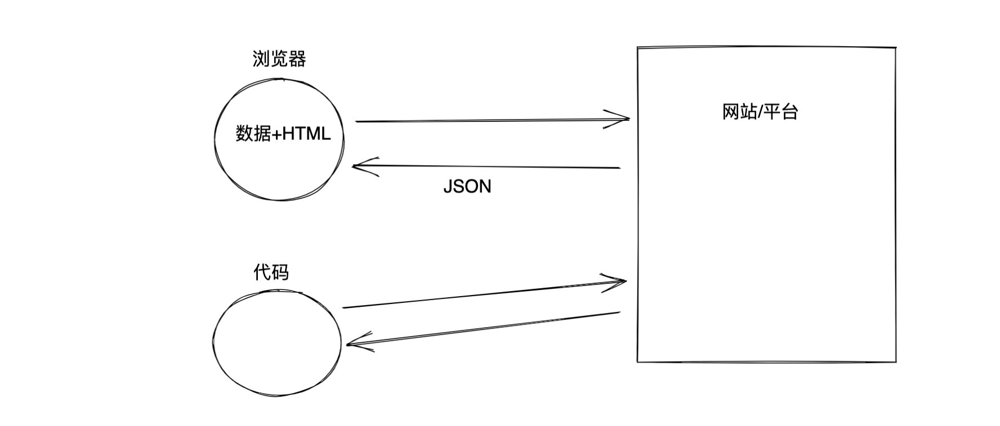
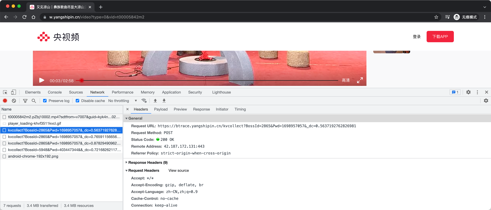
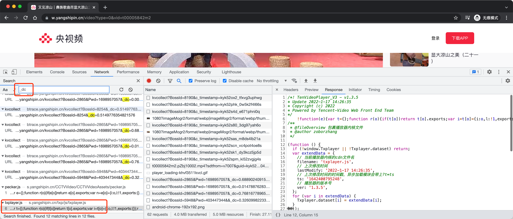
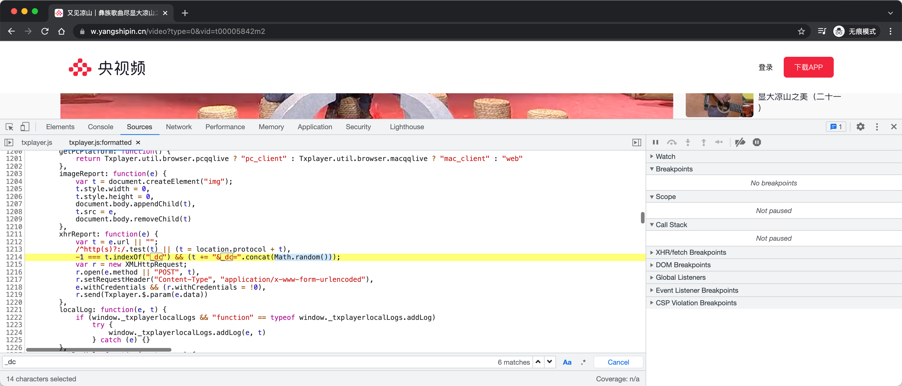
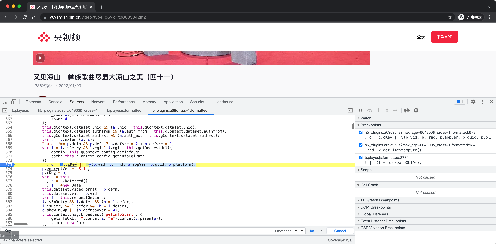
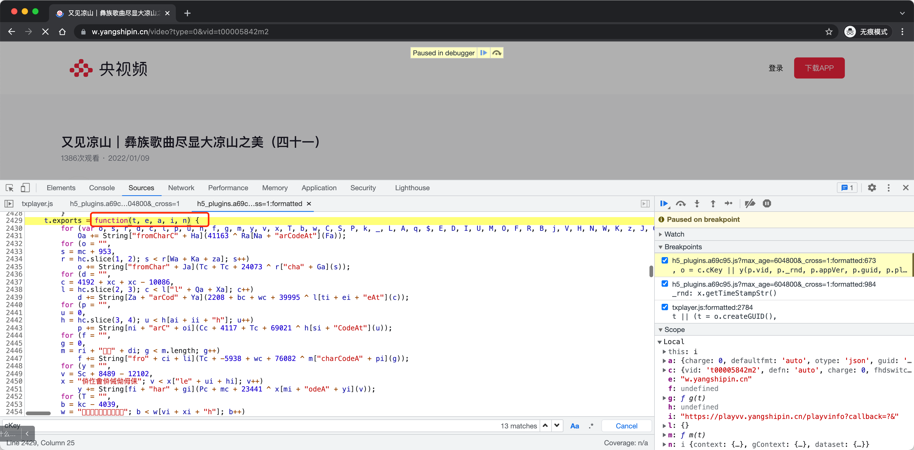
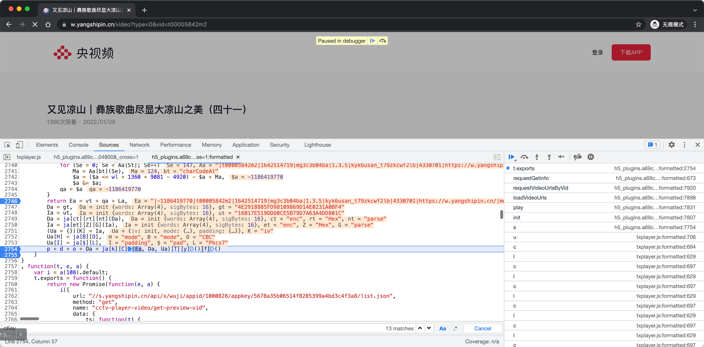

# day03 x视频

目标：x视频播放的算法（腾讯）


## 1. 前置知识点


### 1.1 JSONP

什么是JSON？

```
本质字符串，例如：
	data_dict = '{"k1":123,"k2":[11,22,33]}'
```




```python
import requests

bvid = "BV1XA411779D"
res = requests.get(
    url="https://api.bilibili.com/x/player/pagelist?bvid={}&jsonp=jsonp".format(bvid),
)

print(res.text)
```


JSON和JSONP有什么不一样呢?

```
返回值的样子是不同。
 - JSON格式
 	{"code":0,"message":"0","ttl":1}
 	
 - JSONP
 	xxxxx({"code":0,"message":"0","ttl":1})
```

```
如果你想某个站发送请求，获取JSONP格式，你会怎么办？
- 切片+序列化
- re正则取括号里面的数据
- replace
- eval内置函数对数据进行编译（当成代码来编译）
```

```python
def xxxxx(arg):
    print(arg)

data_string = 'xxxxx({"code":0,"message":"0","ttl":1})';
eval(data_string) # 相当于写了python代码，那么xxxxx就会被立即调用。
```


### 1.2 范围问题

- Java、C语言 整型会分为有符号和无符号。

  ```
  int32 -> 32 二进制表示：2**32=4294967296
  
  无符号：          0 ~ 4294967296
  有符号：-2147483648 ~ 2147483647
  ```

- Python中没有这个概念，没有了范围的限制。


案例：

- JavaScript

  ```javascript
  var v1 = 11119229123812344;
  var v2 = 11119229123812344 << 5;
  console.log(v2); // -1019511040
  ```

- Python

  ```
  >>> v1 = 11119229123812344
  >>> v2 = 11119229123812344 << 5
  >>> v2
  355815331961995008
  >>>
  ```

  ```python
  import ctypes
  
  v1 = 11119229123812344
  v2 = 11119229123812344 << 5
  
  data = ctypes.c_int32(v2).value
  print(data) # -1019511040
  ```

  

### 1.3 AES加密

```
pip install pycryptodome
```


- AES加密（utf-8字节处理）

  ```python
  from Crypto.Cipher import AES
  from Crypto.Util.Padding import pad
  
  def aes_encrypt(data_string):
      key_string = "fd6b639dbcff0c2a1b03b389ec763c4b"
      key = key_string.encode('utf-8')
      
      iv_string = "77b07a672d57d64c"
      iv = iv_string.encode('utf-8')
      
      data = data_string.encode("utf-8")
      
      aes = AES.new(
          key=key,
          mode=AES.MODE_CBC,
          iv=iv
      )
      raw = pad(data, 16)
      return aes.encrypt(raw)
  
  data = "|878975262|d000035rirv|1631615607|mg3c3b04ba|1.3.5|ktjwlm89_to920weqpg|433070"
  
  result = aes_encrypt(data)
  print(result)
  ```

- AES加密（十六进制字节处理）

  ```python
  import binascii
  
  v1 = "4E2918885FD98109869D14E0231A0BF4"
  
  """
  bs = bytearray() # []
  for i in range(0, len(v1), 2):
      item_hex = v1[i:i + 2]
      item_int = int(item_hex, base=16)
      bs.append(item_int)
  v3 = bytes(bs)
  print(v3) # b'N)\x18\x88_\xd9\x81\t\x86\x9d\x14\xe0#\x1a\x0b\xf4'
  """
  v3 = binascii.a2b_hex(v1)
  print(v3) # b'N)\x18\x88_\xd9\x81\t\x86\x9d\x14\xe0#\x1a\x0b\xf4'
  
  
  v4 = v2.encode("utf-8")
  print(v4) # b"4E2918885FD98109869D14E0231A0BF4"
  ```

  ```python
  from Crypto.Cipher import AES
  from Crypto.Util.Padding import pad
  import binascii
  
  def aes_encrypt(data_string):
      key_string = "4E2918885FD98109869D14E0231A0BF4"
      key = binascii.a2b_hex(key_string)
  
      iv_string = "16B17E519DDD0CE5B79D7A63A4DD801C"
      iv = binascii.a2b_hex(iv_string)
  
      aes = AES.new(
          key=key,
          mode=AES.MODE_CBC,
          iv=IV
      )
      raw = pad(data_string.encode('utf-8'), 16)
      aes_bytes = aes.encrypt(raw)
      return binascii.b2a_hex(aes_bytes).decode().upper()
  
  
  data = "|878975262|d000035rirv|1631615607|mg3c3b04ba|1.3.5|ktjwlm89_to920weqpg|4330701|https://w.yangshipin.cn/|mozilla/5.0 (macintosh; ||Mozilla|Netscape|MacIntel|"
  
  result = aes_encrypt(data)
  print(result)
  ```

  


## 2.x视频的逆向

x视频，没有网站（app中找到某个视频&连接&电脑）。

```
https://w.yangshipin.cn/video?type=0&vid=t00005842m2
```




- URL

  ```
  https://btrace.yangshipin.cn/kvcollect?BossId=2865&Pwd=1698957057&_dc=0.5637192762826981
  ```

  ```
  BossId=2865             [固定]
  Pwd=1698957057          [固定]
  _dc=0.5637192762826981
  ```

- 请求体

  ```
  pid: kyk4ns3m_dsyncvl5fr
  guid: kyk4nryf_l658x53y50p
  vurl: https://mp4playcloud-cdn.ysp.cctv.cn/t00005842m2.pZbj10002.mp4?sdtfrom=v7007&guid=kyk4nryf_l658x53y50p&vkey=3783AF0CBF617A0400F3F1EE28AC205D3C74B01DC30C32BAF17C63BFAD61CD14E5D57782C153E962B2B82B509FC562E95BF0961CFE02D269CE28B1CC0D60A3116C3B9CCABB297A35714AAF63A5FD2E6EED8309FEC9A654D309DA922EB6834B6B05830AFC9241BD59EDCC2C6F9102A80EA42F6A069179A669D0262BCFA5ED6F0C&platform=2
  ```


## 3._dc

搜索时：_dc、getDc、get_dc、gendc、genaratedc、createdc






```python
import random

_dc = random.random()
```


## 4.guid

```javascript
 createGUID: function() {
     var e = (new Date).getTime().toString(36)
     , t = Math.random().toString(36).replace(/^0./, "");
     return "".concat(e, "_").concat(t)
 }
```


## 5.pid

```python
 createGUID: function() {
     var e = (new Date).getTime().toString(36)
     , t = Math.random().toString(36).replace(/^0./, "");
     return "".concat(e, "_").concat(t)
 }
```


```python
"""
pip install pyexecjs
"""
import execjs

javascript_file = execjs.compile('''
function createGUID() {
    var e = (new Date).getTime().toString(36)
      , t = Math.random().toString(36).replace(/^0./, "");
    return "".concat(e, "_").concat(t)
}
''')

guid = javascript_file.call('createGUID')
print(guid)

pid = javascript_file.call('createGUID')
print(pid)
```


## 6.vurl

```
vurl: https://mp4playcloud-cdn.ysp.cctv.cn/t00005842m2.pZbj10002.mp4?sdtfrom=v7007&guid=kyk4nryf_l658x53y50p&vkey=3783AF0CBF617A0400F3F1EE28AC205D3C74B01DC30C32BAF17C63BFAD61CD14E5D57782C153E962B2B82B509FC562E95BF0961CFE02D269CE28B1CC0D60A3116C3B9CCABB297A35714AAF63A5FD2E6EED8309FEC9A654D309DA922EB6834B6B05830AFC9241BD59EDCC2C6F9102A80EA42F6A069179A669D0262BCFA5ED6F0C&platform=2

```

```
sdtfrom=v7007
guid=kyk4nryf_l658x53y50p
platform=2
vkey=......                ? vkey
t00005842m2.pZbj10002.mp4  ? fn
```

- 请求返回
- 算法生成


任务变成了要搞定：

```
https://playvv.yangshipin.cn/playvinfo...
```

获取结果并得到：fn、fvkey


### 6.1 分析playvinfo

解决URL即可：

```
https://playvv.yangshipin.cn/playvinfo?callback=txplayerJsonpCallBack_getinfo_858191&&charge=0&defaultfmt=auto&otype=json&guid=kyk5dprc_e85trhxhx9k&flowid=kyk5dpw1_axsl0e17wl7_4330701&platform=4330701&sdtfrom=v7007&defnpayver=0&appVer=1.3.5&host=w.yangshipin.cn&ehost=https%3A%2F%2Fw.yangshipin.cn%2Fvideo&refer=w.yangshipin.cn&sphttps=1&sphls=&_rnd=1642512292&spwm=4&vid=t00005842m2&defn=auto&fhdswitch=&show1080p=false&dtype=1&clip=4&defnsrc=&fmt=auto&defsrc=1&encryptVer=8.1&cKey=--016262A0CE430C5A72FF4644890666CFD8F089AFF3252905ECAD49946673791226B6B290F7D6C5C2B1F5416120DDE46242904CDE3184D6C957F2736BF352597DAAEBCFE704B6E4F6BC45143BD2779D8E93389612B7B32451DE9D7F0C584DA3DDCD3AF44B93CAAA0FFC9D9DAFEE189A6C09493CA06E2A92908BC99B0C1F4E9DD35E9D423416204965377003726DE2D55DB6FCE79F8ACB686184EA79EDBE72927D9B&_1642512292301=
```

```
flowid: kyk5dpw1_axsl0e17wl7_4330701
_rnd: 1642512292
cKey: --016262A0CE430C5A72FF4644890666CFD8F089AFF3252905ECAD49946673791226B6B290F7D6C5C2B1F5416120DDE46242904CDE3184D6C957F2736BF352597DAAEBCFE704B6E4F6BC45143BD2779D8E93389612B7B32451DE9D7F0C584DA3DDCD3AF44B93CAAA0FFC9D9DAFEE189A6C09493CA06E2A92908BC99B0C1F4E9DD35E9D423416204965377003726DE2D55DB6FCE79F8ACB686184EA79EDBE72927D9B
```


### 6.2 flowid

```
flowid = "".concat(w.dataset.playerId, "_").concat(w.dataset.platform);
```

```python
"""
pip install pyexecjs
"""
import execjs

javascript_file = execjs.compile('''
function createGUID() {
    var e = (new Date).getTime().toString(36)
      , t = Math.random().toString(36).replace(/^0./, "");
    return "".concat(e, "_").concat(t)
}
''')

guid = javascript_file.call('createGUID')
print(guid)

pid = javascript_file.call('createGUID')
print(pid)

# flowid = "{}_4330701".format(pid)
flowid = f"{pid}_4330701"
```


### 6.3 _rnd

```
_rnd: x.getTimeStampStr()
```

```javascript
getTimeStampStr: function(e) {
    e = e || 10;
    var t = "".concat(parseInt(+new Date));
    if (t.length === e)
        return t;
    
    if (t.length > e)
        return t.substring(0, e);
    for (var r = e - t.length; r > 0; )
        t = "0".concat(t),
            r--;
    return t
},
```

```python
import time
_rnd = int(time.time())
```


### 6.4 cKey




```
y(p.vid, p._rnd, p.appVer, p.guid, p.platform);
```







```
p + d + o + Oa + ja[k][C](Ea, Da, Ua)[T][y]()[f]()
-   -   0    1   AES加密.toString().upperCase()

Ea = "|-1186419770|t00005842m2|1642514719|mg3c3b04ba|1.3.5|kyk6usan_t79zkcwf2lb|4330701|https://w.yangshipin.cn/|mozilla/5.0 (macintosh; ||Mozilla|Netscape|MacIntel|"

Da = "4E2918885FD98109869D14E0231A0BF4"   # key
Ua = "16B17E519DDD0CE5B79D7A63A4DD801C"   # IV

返回值：
"--01D85960E2D3C081967B85DE1F2F242FAA090C87AC37D53DCB126990E1D3E9387ACC4F1A0EE4A4F9003531F6AE08B1302C68AD34DA1954584410CB7BA07B7791EA578DD655C85FBF2262B8BDE37935F736EA8D1C2140E0772D445E92FB8AE81D004347E529F2E2BF1BA8F74FE66638F99F8D5F2A875525F4A118945A33E3E31C0CB62F160DE7D6DBDBE61FB863798D5091F4782AF87FA75F5CEBFFD3BC50929DA4"
```


Ea到底是个啥?

```javascript
Ea = vt + qa + La
Ea = "|" + "-1186419770" + "|t00005842m2|1642514719|mg3c3b04ba|1.3.5|kyk6usan_t79zkcwf2lb|4330701|https://w.yangshipin.cn/|mozilla/5.0 (macintosh; ||Mozilla|Netscape|MacIntel|"
```


```javascript
Aa = "|t00005842m2|1642514719|mg3c3b04ba|1.3.5|kyk6usan_t79zkcwf2lb|4330701|https://w.yangshipin.cn/|mozilla/5.0 (macintosh; ||Mozilla|Netscape|MacIntel|"

$a = 0
wl = -5516
for (Se = 0; Se < Aa["length"]; Se++){
    Ma = Aa["charCodeAt"](Se);
    $a = ($a << wl + 1360 + 9081 - 4920) - $a + Ma;
    $a &= $a;
}
qa = $a

# 1940170587
```

```python
import execjs

javascript_file = execjs.compile('''
function createQa(Aa) {
    $a = 0
    wl = -5516
    for (Se = 0; Se < Aa["length"]; Se++){
        Ma = Aa["charCodeAt"](Se);
        $a = ($a << wl + 1360 + 9081 - 4920) - $a + Ma,
        $a &= $a
    }
    qa = $a
    return qa;
}
''')

Aa = "|t00005842m2|1642515896|mg3c3b04ba|1.3.5|kyk6usan_t79zkcwf2lb|4330701|https://w.yangshipin.cn/|mozilla/5.0 (macintosh; ||Mozilla|Netscape|MacIntel|"
qa = javascript_file.call('createQa', Aa)
print(qa) # 1940170587
```

```python
import ctypes


def create_qa(data_string):
    a = 0
    for i in data_string:
        _char = ord(i)
        a = (a << 5) - a + _char
        a = ctypes.c_int32(a).value
        a &= a
    return a


Aa = "|t00005842m2|1642515896|mg3c3b04ba|1.3.5|kyk6usan_t79zkcwf2lb|4330701|https://w.yangshipin.cn/|mozilla/5.0 (macintosh; ||Mozilla|Netscape|MacIntel|"
qa = create_qa(Aa)
print(qa)
```


## 7.整合代码

```python
import time
import random
import ctypes
import datetime
import binascii
from urllib.parse import urlparse, parse_qs, urlencode

import execjs
import requests
from Crypto.Cipher import AES
from Crypto.Util.Padding import pad

javascript_file = execjs.compile('''
function createGUID() {
    var e = (new Date).getTime().toString(36)
      , t = Math.random().toString(36).replace(/^0./, "");
    return "".concat(e, "_").concat(t)
}
''')


def create_qa(data_string):
    """
    原算法
        Aa = "|d000035rirv|1622526980|mg3c3b04ba|1.3.2|df553a055bb06eda3653173ee5a010bf|4330701|https://w.yangshipin.cn/|mozilla/5.0 (macintosh; ||Mozilla|Netscape|MacIntel|"
        wl = -5516
        $a=0
        for (Se = 0; Se < Aa[St]; Se++)
                Ma = Aa[bt](Se), Ae["charCodeAt"]()
                $a = ($a << wl + 1360 + 9081 - 4920) - $a + Ma,
                $a &= $a;
            qa = $a
    """

    a = 0
    for i in data_string:
        _char = ord(i)
        a = (a << 5) - a + _char
        a = ctypes.c_int32(a).value
        a &= a
    return a


def aes_encrypt(data_string):
    key = binascii.a2b_hex("4E2918885FD98109869D14E0231A0BF4")
    iv = binascii.a2b_hex("16B17E519DDD0CE5B79D7A63A4DD801C")
    aes = AES.new(
        key=key,
        mode=AES.MODE_CBC,
        iv=iv
    )
    raw = pad(data_string.encode('utf-8'), 16)
    aes_bytes = aes.encrypt(raw)
    return binascii.b2a_hex(aes_bytes).decode()


def create_ckey(vid, rnd, app_version, guid, platform):
    wt = "mg3c3b04ba"
    ending = "https://w.yangshipin.cn/|mozilla/5.0 (macintosh; ||Mozilla|Netscape|MacIntel|"

    # 1.拼接字符串
    data_list = ["", vid, rnd, wt, app_version, guid, platform, ending]
    data_string = "|".join(data_list)
    # 根据data_string生成qa
    qa = create_qa(data_string)
    encrypt_string = "|{}{}".format(qa, data_string)

    # 2.AES加密
    ckey = "--01" + aes_encrypt(encrypt_string).upper()
    return ckey


def fetch_vkey(vid, rnd, app_ver, platform, flow_id, guid, ckey):
    params = {
        "callback": "txplayerJsonpCallBack_getinfo_711482",
        "charge": "0",
        "defaultfmt": "auto",
        "otype": "json",
        "guid": guid,
        "flowid": flow_id,
        "platform": platform,
        "sdtfrom": "v7007",
        "defnpayver": "0",
        "appVer": app_ver,
        "host": "w.yangshipin.cn",
        "ehost": "https://w.yangshipin.cn/video",
        "refer": "w.yangshipin.cn",
        "sphttps": "1",
        "_rnd": rnd,  # _rnd: x.getTimeStampStr(),
        "spwm": "4",
        "vid": vid,
        "defn": "auto",
        "show1080p": "false",
        "dtype": "1",
        "clip": "4",
        "fmt": "auto",
        "defnsrc": "",
        "fhdswitch": "",
        "defsrc": "1",
        "sphls": "",
        "encryptVer": "8.1",
        "cKey": ckey,
    }

    headers = {
        'user-agent': 'Mozilla/5.0 (iPhone; CPU iPhone OS 13_2_3 like Mac OS X) AppleWebKit/605.1.15 (KHTML, '
                      'like Gecko) Version/13.0.3 Mobile/15E148 Safari/604.1',
        'referer': 'https://m.yangshipin.cn/',
    }

    url = "https://playvv.yangshipin.cn/playvinfo"

    with requests.get(url=url, params=params, headers=headers) as res:
        # 2.evel直接编译并执行函数
        return eval(res.text)


def txplayerJsonpCallBack_getinfo_711482(info_dict):
    return info_dict['vl']['vi'][0]['fn'], info_dict['vl']['vi'][0]['fvkey']


def play(video_url, vid, pid, guid, fn, vkey):
    download_params = {
        "sdtfrom": "v7007",
        "guid": guid,
        "vkey": vkey,
        "platform": "2",
    }
    # 视频下载连接视频
    vurl = "https://mp4playcloud-cdn.ysp.cctv.cn/{}?{}".format(fn, urlencode(download_params))

    params = {
        "BossId": 2865,
        "Pwd": 1698957057,
        "_dc": random.random()  # "&_dc=".concat(Math.random()))
    }
    data = {
        "uin": "",
        "vid": vid,
        "coverid": "",
        "pid": pid,
        "guid": guid,
        "unid": "",
        "vt": "0",
        "type": "3",
        # "url": "https://w.yangshipin.cn/video?type=0&vid=d000035rirv",
        "url": video_url,
        "bi": "0",
        "bt": "0",
        "version": "1.3.5",
        "platform": "4330701",
        "defn": "0",
        # "ctime": "2021-06-02 09:30:01",
        "ctime": datetime.datetime.now().strftime("%Y-%m-%d %H:%M:%S"),
        "ptag": "",
        "isvip": "-1",
        "tpid": "13",
        "pversion": "h5",
        "hc_uin": "",
        "hc_vuserid": "",
        "hc_openid": "",
        "hc_appid": "",
        "hc_pvid": "0",
        "hc_ssid": "",
        "hc_qq": "",
        "hh_ua": "Mozilla/5.0 (Macintosh; Intel Mac OS X 10_15_7) AppleWebKit/537.36 (KHTML  like Gecko) Chrome/90.0.4430.212 Safari/537.36",
        "ua": "Mozilla/5.0 (Macintosh; Intel Mac OS X 10_15_7) AppleWebKit/537.36 (KHTML  like Gecko) Chrome/90.0.4430.212 Safari/537.36",
        "ckey": "",
        "iformat": "0",
        "hh_ref": video_url,
        "vuid": "",
        "vsession": "",
        "format_ua": "other",
        "common_rcd_info": "",
        "common_ext_info": "",
        "v_idx": "0",
        "rcd_info": "",
        "extrainfo": "",
        "c_channel": "",
        "vurl": vurl,
        "step": "6",
        "val": "164",
        "val1": "1",
        "val2": "1",
        "idx": "0",
        "c_info": "",
        "isfocustab": "0",
        "isvisible": "0",
        "fact1": "",
        "fact2": "",
        "fact3": "",
        "fact4": "",
        "fact5": "",
        "cpay": "0",
        "tpay": "0",
        "dltype": "1"
    }

    res = requests.post(
        url="https://btrace.yangshipin.cn/kvcollect",
        params=params,
        data=data,
        headers={
            'user-agent': 'Mozilla/5.0 (iPhone; CPU iPhone OS 13_2_3 like Mac OS X) AppleWebKit/605.1.15 (KHTML, '
                          'like Gecko) Version/13.0.3 Mobile/15E148 Safari/604.1',
            'referer': 'https://m.yangshipin.cn/',
        }
    )
    res.close()


def run():
    video_url = "https://w.yangshipin.cn/video?type=0&vid=t00005842m2"

    vid = parse_qs(urlparse(video_url).query)['vid'][0]

    app_version = "1.3.5"
    platform = "4330701"

    guid = javascript_file.call('createGUID')
    pid = javascript_file.call('createGUID')
    flow_id = "{}_{}".format(pid, platform)
    rnd = str(int(time.time()))

    # 1.创建ckey
    ckey = create_ckey(vid, rnd, app_version, guid, platform)

    # 2.拿着ckey去发送请求从而获得
    # fn是资源地址  "u000058lp0z.ZKuq10002.mp4"
    # vkey=...
    fn, vkey = fetch_vkey(vid, rnd, app_version, platform, flow_id, guid, ckey)

    # 3.去播放
    play(video_url, vid, pid, guid, fn, vkey)


if __name__ == '__main__':
    run()
```


一般情况下：

- 请求时：https://wwwww.com.......?callback=x2

- 响应式：

  ```
  x2({...})
  ```

  


