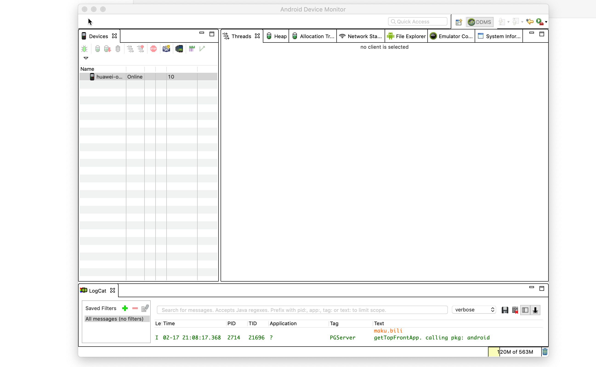
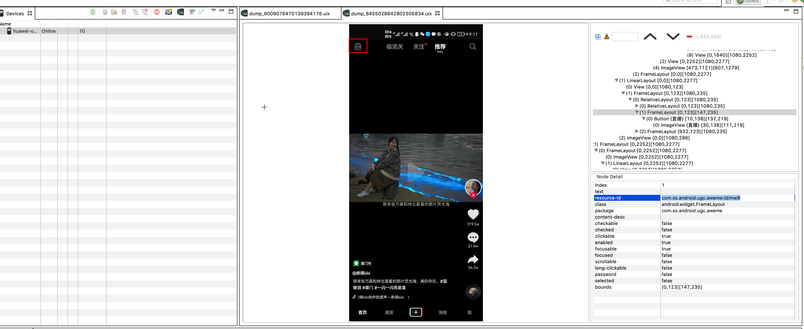
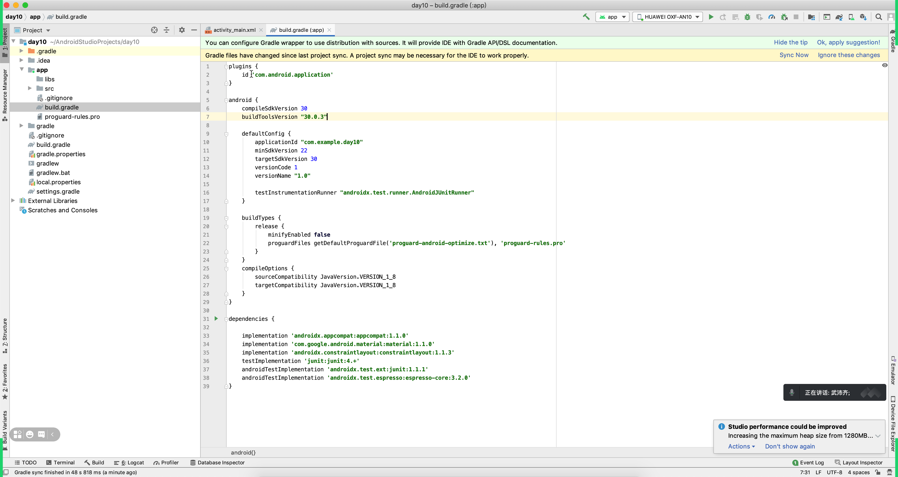
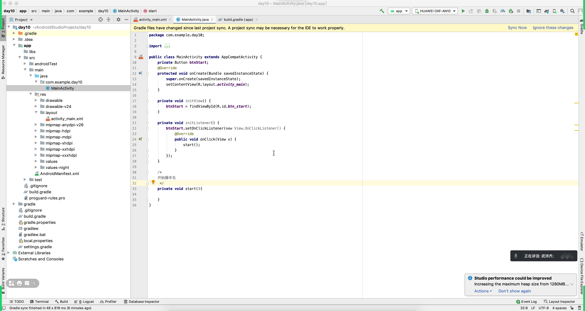
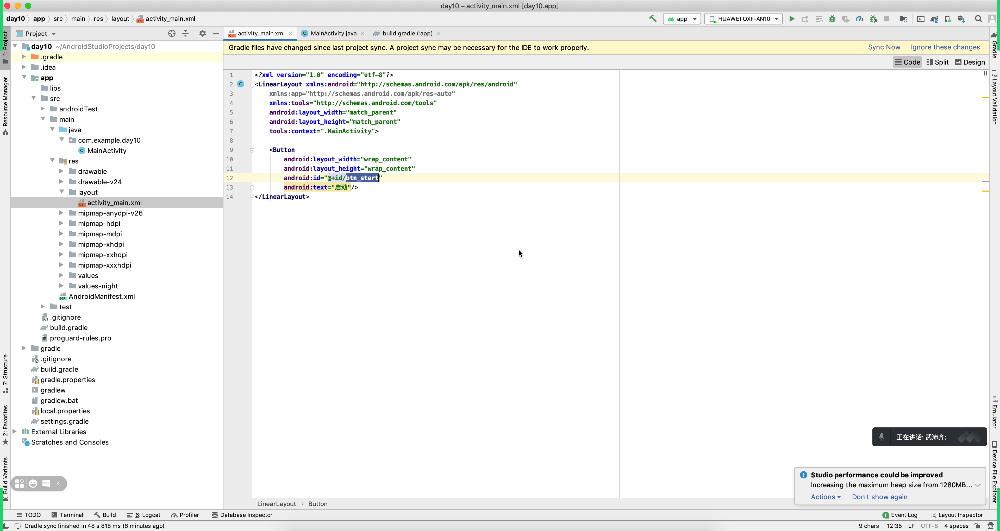

# day10 安卓和薅羊毛

今日内容：

- 安卓
  - okhttp
  - retrofit
- 薅羊毛


## 1.okhttp

```
1.引入，在build.gradle中 implementation "com.squareup.okhttp3:okhttp:4.9.1"
2.配置，在AndroidManifest.xml中 <uses-permission android:name="android.permission.INTERNET"/>
3.支持http（仅测试使用）
```

### 1.1 POST

```
user=wupeiqi&age=99&size18
```

```java
new Thread() {
    @Override
    public void run() {
        OkHttpClient client = new OkHttpClient();
        
        FormBody form = new FormBody.Builder()
                .add("user", dataMap.get("username"))
                .add("pwd", dataMap.get("password"))
                .add("sign", dataMap.get("sign")).build();

        Request req = new Request.Builder().url("http://192.168.0.6:9999/login").post(form).build();
        Call call = client.newCall(req);
        try {
            Response res = call.execute();
            ResponseBody body = res.body();
            // 字符串={"status": true, "token": "fffk91234ksdujsdsd", "name": "武沛齐"}
            String dataString = body.string();

            // 对字符串进行反序列化，获取成对象。
            HttpResponse context = new Gson().fromJson(dataString, HttpResponse.class);

            // 将用户token和信息保存到特殊XML文件（写入）
            SharedPreferences sp = getSharedPreferences("sp_mds", MODE_PRIVATE);
            SharedPreferences.Editor editor = sp.edit();
            editor.putString("token", context.token);
            editor.commit();

            // 跳转到其他页面 IndexActivity
            Intent in = new Intent(mContext, IndexActivity.class);
            startActivity(in);

            // Log.e("MDS", "请求成功获取返回值=" + dataString);
        } catch (IOException ex) {
            Log.e("MDS", "网络请求错误");
        }
    }
}.start();
```


```
{
	name:"wupeiqi",
	age:18,
	size:18
}
```

```java
new Thread() {
    @Override
    public void run() {
        OkHttpClient client = new OkHttpClient();
			
        // dataMap = {"username":"wupeiqi","password":"123","sign":"用户名和密码的md5值"}
        JSONObject json = new JSONObject(dataMap);
        String jsonString = json.toString();
        
        
        // RequestBody form = RequestBody.create(MediaType.parse("application/json;charset=utf-8"),jsonString);
         RequestBody form = RequestBody.create(MediaType.parse("application/json;charset=utf-8"),jsonString);

        Request req = new Request.Builder().url("http://192.168.0.6:9999/login").post(form).build();
        Call call = client.newCall(req);
        try {
            Response res = call.execute();
            ResponseBody body = res.body();
            String dataString = body.string();
            Log.i("登录", dataString);
        } catch (IOException e) {
            e.printStackTrace();
        }
    }
}.start();
```


### 1.2 GET

```java
new Thread() {
    @Override
    public void run() {
        OkHttpClient client = new OkHttpClient();
        Request req = new Request.Builder().url("https://www.httpbin.org/get?xx=123&oo=999").build();
        Call call = client.newCall(req);
        try {
            Response res = call.execute();
            ResponseBody body = res.body();
            String dataString = body.string();
            Log.i("登录", dataString);
        } catch (IOException e) {
            e.printStackTrace();
        }
    }
}.start();
```


### 1.3 拦截器

假设开发app，发送10个请求，每个请求中需要携带特殊的请求头：xxxx。

将所有请求公共的操作都放在拦截器里面。

```java
// 创建拦截器
Interceptor interceptor = new Interceptor() {
    @NotNull
    @Override
    public Response intercept(@NotNull Chain chain) throws IOException {
        Request request = chain.request().newBuilder().addHeader("hah","123").addHeader("oo","fff").build();

        // 请求前
        Response response = chain.proceed(request);
        // 请求后
        return response;
    }
};


// 创建线程去发送请求
new Thread() {
    @Override
    public void run() {
        // OkHttpClient client = new OkHttpClient();
        OkHttpClient client = new OkHttpClient.Builder().addInterceptor(interceptor).build();

        JSONObject json = new JSONObject(dataMap);
        String jsonString = json.toString();
        // RequestBody form = RequestBody.create(MediaType.parse("application/json;charset=utf-8"),jsonString);
        RequestBody form = RequestBody.create(MediaType.parse("application/json;charset=utf-8"), jsonString);

        Request req = new Request.Builder().url("https://www.httpbin.org/post").addHeader("xx", "123").post(form).build();
        Call call = client.newCall(req);
        try {
            Response res = call.execute();
            ResponseBody body = res.body();
            String dataString = body.string();
            Log.i("登录", dataString);
        } catch (IOException e) {
            e.printStackTrace();
        }
    }
}.start();
```


注意：抓包抓到一些参数/请求头，定位到某个请求，只发现一部分的参数；找相关的拦截器。


## 2.retrofit

内部封装了okhttp，让你用的更加的简单（B站）。

- 引入

  ```
  // implementation "com.squareup.okhttp3:okhttp:4.9.1"
  
  implementation "com.squareup.retrofit2:retrofit:2.9.0"
  ```

- 写接口，声明网络请求

  ```java
  package com.nb.mds;
  
  import okhttp3.RequestBody;
  import okhttp3.ResponseBody;
  import retrofit2.Call;
  import retrofit2.http.Body;
  import retrofit2.http.Field;
  import retrofit2.http.FormUrlEncoded;
  import retrofit2.http.POST;
  import retrofit2.http.GET;
  import retrofit2.http.Query;
  
  public interface HttpReq {
  	
      // 向/api/v1/post 发送POST请求name=xx&pwd=xxx
      @POST("/api/v1/post")
      @FormUrlEncoded
      Call<ResponseBody> postLogin(@Field("name") String userName, @Field("pwd") String password);
  
      @GET("/api/v2/xxx")
      Call<ResponseBody> getInfo(@Query("age") String age);
  		
      // 向/post/users 发送POST请求 {name:xxxx,age:123}
      @POST("/post/users")
      Call<ResponseBody> postLoginJson(@Body RequestBody body);
  
      @GET("/index")
      Call<ResponseBody> getIndex(@Query("age") String age);
  }
  
  ```

- 发送请求

  ```java
  new Thread() {
      @Override
      public void run() {
          // http://api.baidu.com/api/v2/xxx?age=123
          Retrofit retrofit = new Retrofit.Builder().baseUrl("http://api.baidu.com/").build();
          HttpReq req = retrofit.create(HttpReq.class);
          Call<ResponseBody> call = req.getInfo("123");
          try {
              ResponseBody responseBody = call.execute().body();
              String responseString = responseBody.string();
              Log.e("Retrofit返回的结果", responseString);
  
          } catch (Exception e) {
              e.printStackTrace();
          }
      }
  }.start();
  ```

  

注意：以后如果根据关键字搜索 `/api/v1/post`，下一步应该找 postLogin 被谁调用了。


## 3.薅羊毛案例

- 案例：使用安卓开发 + 无障碍模式

- 提前准备：

  - 手机 + 开发者模式 + USB调试 + 数据线连接电脑 + 开发APP自动安装并运行。

  - 下载抖音（v15.4版本）

    ```
    https://www.wandoujia.com/apps/7461948/history_v150401
    ```

  - 手动登录账号

  - 手机UI查看器（找到页面上某个位置，点击、获取文本）

    ```
    如果电脑上已安装安卓SDK，去安卓SDK安装目录下，找到 monitor 的文件。
    ```

    

### 3.1 手机安装抖音

https://www.wandoujia.com/apps/7461948/history_v150401

关闭手机中软件的自动更新的功能（应用市场）。


### 3.2 手机和电脑连接

开发者模式 + USB调试 + 数据线连接电脑


### 3.3 启动monitor







**提醒**：新的版本资源的ID动态，最好找到固定的版本。


### 3.4 创建项目

创建空项目。










### 3.5 引导开启无障碍

- 无障碍功能，手机自动操作。

当你打开咱们 day10 app时，自动跳转到手机的无障碍界面，选择并开启，回退到app界面，在去点击开始。


- 将app安装到手机上
- 引导开启无障碍
- 回退
- 启动，控制是否开始进行无障碍操作。


### 3.6 抖音逻辑

- 点击启动
- 新创建线程去做薅羊毛


