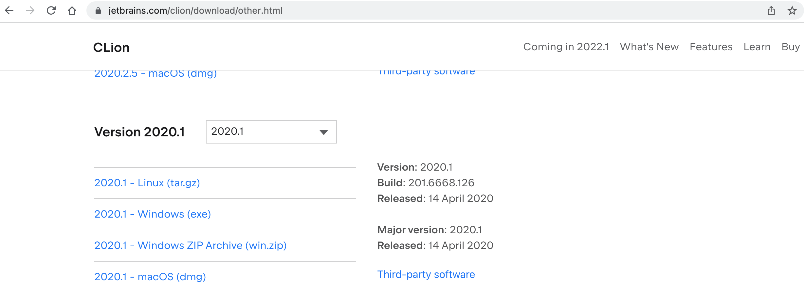
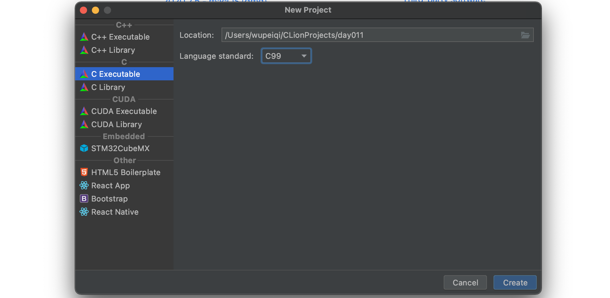
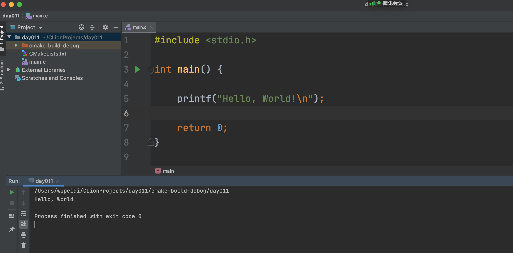
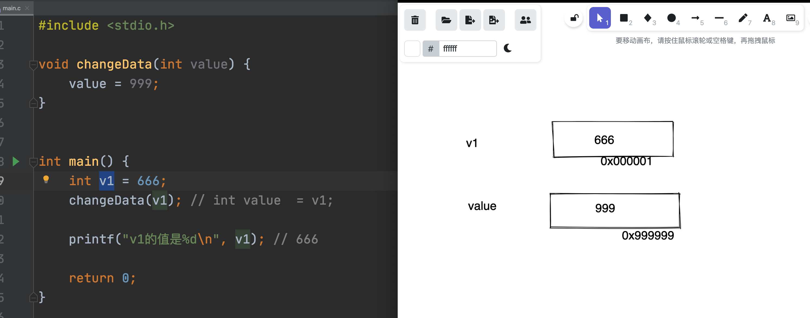
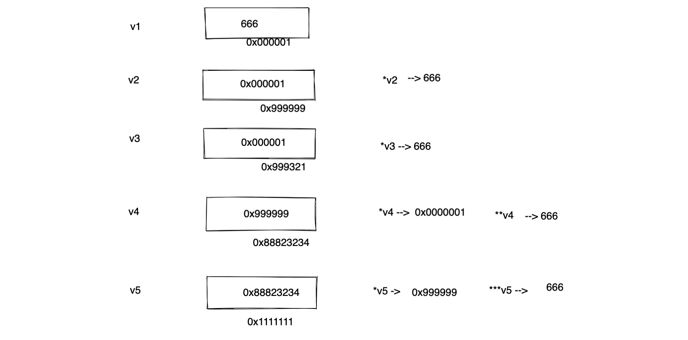

# day11 JNI开发

- 以前我们将安卓开发时，用户登录功能，用户名和密码拼接 + md5加密，然后当做sign参数传递到后台。

  ```
  你：安卓开发，apk
  我：爬虫开发，jadx对你的apk进行反编译，反编译后就可以获得java代码。
  ```

- NB点的安卓开发，Java编写安卓的业务逻辑 + 核心的算法 或 调用手机底层硬件功能选择用C实现。

  ```
  你：安卓开发，apk
  我：爬虫开发，
  	- jadx对你的apk进行反编译，反编译后就可以获得java代码。
  	- ida工具你的C文件反编译，反编译后就可以获得c代码。
  ```

JNI（java native interface），java本地开发接口，实现Java和C/C++代码之间的相互调用。


今日概要：

- C语言基础
- JNI开发（环境的搭建 + 初步使用）


## 1.C语言基础

单独讲的C语言。目前与安卓、Java毫无关系。

### 1.1 编译器

- 在你自己电脑上安装相关语言的编译器：Visual C++、GCC

  ```
  mac，默认clang（mac用户自带C编译器），如果没有就去直接安装xcode。
  	 xcode:https://developer.apple.com/xcode/
  
  win，MinGV
  	https://www.cnblogs.com/longxinyv/p/12309561.html
  ```

- 学习编程语法: `main.c`

  ```c
  # include <stdio.h>
  
  int main(int argc, char const *argv[]) {
      printf("hello world");
      return 0;
  }
  ```


在终端：

```
>>>gcc main.c 
>>>./a.out
```


### 1.2 IDE

快速编写C代码。




### 1.3 运行







### 1.4 常见类型和功能


#### 1.4.1 字符串相关

在C语言中没有字符串。

用字符数组创造出字符串出来（每个字符占1个字节）。

```C
#include <stdio.h>

int main() {

    char v1 = 'w';

    char v2[4] = {'w', 'u', 'p', '\0'};

    char v3[] = "wupeiqi";

    char v4[] = "武沛齐";  // x1 x2 x3

    printf("Hello, World!\n");

    return 0;
}
```


对于数组来说，内部元素是挨个存放，内存地址相邻。

```C
#include <stdio.h>

int main() {

    char v1[8] = {'w', 'u', 'p', 'e', 'i', 'q', 'i', '\0'};
    char v3[] = "wupeiqi";
    
    printf("第0个位置值：%c，内存地址：%p \n", v3[0], &v3[0]);
    printf("第0个位置值：%c，内存地址：%p \n", v3[1], &v3[1]);
    printf("第0个位置值：%c，内存地址：%p \n", v3[2], &v3[2]);

    return 0;
}
```


#### 1.4.2 整数相关

- short	2字节
- int         4字节
- long      8字节

```C
#include <stdio.h>

int main() {

    short v1 = 12;
    printf("长度:%lu", sizeof(v1));

    return 0;
}
```


#### 1.4.3 指针


```C
int v1 = 666;

int* v2 = &v1;   // 取地址符，得到是指针。
```

```c
#include <stdio.h>

int main() {

    int v1 = 666;
    int *v2 = &v1;


    printf("v1对应的值：%d，内存地址是：%p \n", v1, &v1);
    printf("v1对应的值：%p，内存地址是：%p \n", v2, &v2);

    return 0;
}
```

```
v1对应的值：666，内存地址是：0x7ff7b3d08678 
v1对应的值：0x7ff7b3d08678，内存地址是：0x7ff7b3d08670 
```


示例1：

```c
#include <stdio.h>

int main() {

    char v1 = 'x';
    char* v2 = &v1;


    printf("v1对应的值：%c，内存地址是：%p \n", v1, &v1);
    printf("v1对应的值：%p，内存地址是：%p \n", v2, &v2);

    return 0;
}

```

```
v1对应的值：x，内存地址是：0x7ff7b45e567b 
v1对应的值：0x7ff7b45e567b，内存地址是：0x7ff7b45e5670 
```


示例2：


```
int v1 = 666;
int* v2 = &v1;

如果你有一个指针类型的变量v2，内部存储肯定是内存地址，如何获取次内存地址中存储的值呢？
int v3 = *v2;
```

注意：`&变量`，获取变量指向数据的内存地址。`*变量`，根据变量中存储的内存地址去获取次内存地址中存储的值。


示例3：

```c
#include <stdio.h>

int main() {

    int v1 = 666;
    int *v2 = &v1;
    int *v3 = &v1;

    v1 = 999;

    printf("v2指针关联的值：%d \n", *v2);
    printf("v3指针关联的值：%d \n", *v3);

    return 0;
}
```


示例4：

```C
#include <stdio.h>


int main() {
    int v1 = 666;
    v1 = 999;
    printf("v1的值是%d\n", v1); // 999
    return 0;
}
```





以后在分析别人的C语言代码时，你一定要当心。

```c
v1 = 123;
doEncrypt(&v1);  

# 后面v1的值很可能已经发生变化了。
```

```c
v1 = 123;
doEncrypt(v1);  

# v1一定还是123
```


#### 1.4.4 指针的指针

白话指针，内部存储了一个别人的数据的内存地址。


```c
int v1 = 666;

int* v2 = &v1;

int* v3 = &v1;

int** v4 = &v2;  // 指针的指针

int*** v5 = &v4;  // 指针的指针
```





本质上，指针其实就是咱们说的根据内存地址对数据进行操作。


#### 1.4.5 结构体

表示一组数据，利用结构体来实现。

```c
#include <stdio.h>

struct Person {
    char name[30];
    int age;
};


int main() {
    struct Person v1 = {"alex", 18};
    struct Person v2 = {"路飞学城", 3};
    struct Person v3 = {"李杰", 31};

    printf("值是：%s", v1.name);
    return 0;
}
```

```c
#include <stdio.h>

struct Person {
    char name[30];
    int age;
};


int main() {

    struct Person v1 = {"alex", 18};
    printf("值是：%s \n", v1.name);

    struct Person *pp = &v1;  // pp是一个变量，他是一个指针类型。 *pp
    printf("值是：%s \n", (*pp).name);
    printf("值是：%s \n", pp->name);
    
    return 0;
}
```


扩展：

```
- Python解释器，是有C编写的。
- 在Python中创建了
	v1 = [11,22]      ->   结构体 {size:2,item:[11的内存地址,22的内存地址], 引用计数器:2 }
	v2 = v1
	
	v2 = 123
	v3 = "武沛齐"
```


##### 单向链表


```c
struct Node
{
    int data;
    struct Node *next;
}

struct Node v3 = {33};
struct Node v2 = {22, &v3};
struct Node v1 = {11, &v2};


v1.data;        		// 11
v1.next->data;   		// 22
v1.next->next->data;    // 33
```

```c
# include <stdio.h>

struct Person
{
    int data;
    struct Person *next;
};

int main(int argc, char const *argv[])
{   
    struct Person p3 = { 33 };
    struct Person p2 = { 22, &p3 };
    struct Person p1 = { 11, &p2 };
    
    printf("p1的值: %d\n", p1.data);
    printf("p2的值: %d\n", p1.next->data);
    printf("p3的值: %d\n", p1.next->next->data);

    return 0;
}
```

注意：将数组时，里面的每个元素都是连续的；构造一个动态的容器。


##### 双向链表


```c
# include <stdio.h>

struct Person
{
    int data;
    struct Person *next;
    struct Person *prev;
};

int main()
{   
    struct Person p3 = { 33 };
    struct Person p2 = { 22 };
    struct Person p1 = { 11 };
    p1.next = &p2;

    p2.next = &p3;
    p2.prev = &p1;

    p3.prev = &p2;

    printf("p1的值: %d\n", p1.data);
    printf("p2的值: %d\n", p1.next->data);
    printf("p3的值: %d\n", p1.next->next->data);

    printf("p3的值: %d\n", p3.data);
    printf("p2的值: %d\n", p3.prev->data);
    printf("p1的值: %d\n", p3.prev->prev->data);

    return 0;
}
```


##### 双向环状链表


```c
# include <stdio.h>

struct Person
{
    int data;
    struct Person *next;
    struct Person *prev;
};

int main()
{   
    struct Person p3 = { 33 };
    struct Person p2 = { 22 };
    struct Person p1 = { 11 };
    p1.next = &p2;
    p1.prev = &p3;

    p2.next = &p3;
    p2.prev = &p1;

    p3.prev = &p2;
    p3.next = &p1;

    printf("p1的值: %d\n", p1.data);
    printf("p2的值: %d\n", p1.next->data);
    printf("p3的值: %d\n", p1.next->next->data);

    printf("p1的值: %d\n", p1.next->next->next->data);
    printf("p2的值: %d\n", p1.next->next->next->next->data);
    printf("p3的值: %d\n", p1.next->next->next->next->next->data);

    return 0;
}
```


#### 1.4.6 预处理和头文件

 预处理，在程序编译之前会先运行的。

```
# include <stdio.h>
# include "utils.h"

# define ME  999

int main() {

    int data = ME + 100;
    printf(VAL);

    return 0;
}
```

比如后期，我们要进行JNI开发时，我们会在自己的c文件用去引入C语言中提供、JNI中提供一些头文件，才能使用头文件中的功能。


