# day12 JNI开发

java native interface ，Java本地开发接口，实现JAVA和C语言之间的相互调用。

今日概要：

- 静态注册
- 动态注册


## 1.NDK

NDK，Native Develop Kits，本地开发工具（在Android Studio中下载即可）。


- 以前的程序：Empty Activity（Java） 
- JNI的程序：Native C++（Java + C）


## 2.创建项目

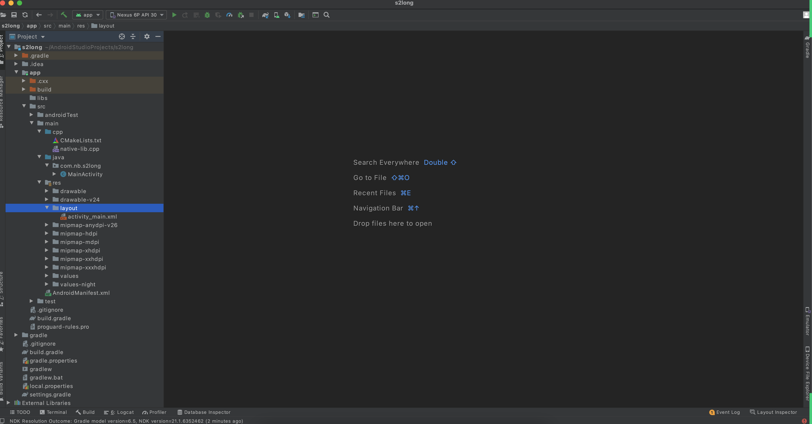


示例1：

- 项目中调用某个函数（C语言实现）

  ```java
  int result = Utils.add(1,2);
  ```

- Java的类型

  ```java
  package com.nb.s2long
  
  class Utils{
      // 因为有native，具体实现应该是在C或者C++做具体实现
      public static native int add(int v1,int v2);
  }
  ```

- C/C++函数

  ```C
  Java_com_nb_s2long_Utils_add(){
      // 用C或者C++做具体实现
      // 调用java中的某个方法
      return 123;
  }
  ```

  

示例2：

- 项目中调用某个函数（C语言实现）

  ```java
  QueryString result = Utils.add(1,2);
  ```

- Java的类型

  ```java
  package com.nb.s2long
  
  class Utils{
      // 因为有native，具体实现应该是在C或者C++做具体实现
      public static native QueryString add(int v1,int v2);
  }
  
  class QueryString{
      public QueryString (){
          ...
      }
  }
  ```

- C/C++函数

  ```C
  Java_com_nb_s2long_Utils_add(){
      // 用C或者C++做具体实现，方法必须返回QueryString类型的对象。
      // C语言中调用Java中的某个类/类中的成员
      return 123;
  }
  ```

  


## 3.编写算法


### 3.1 新建类【Java]

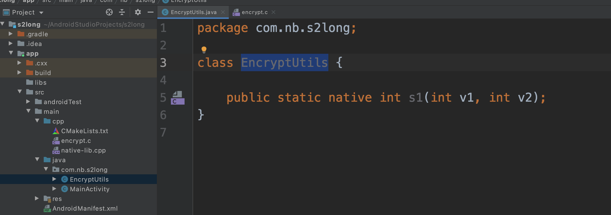


### 3.2 创建C文件

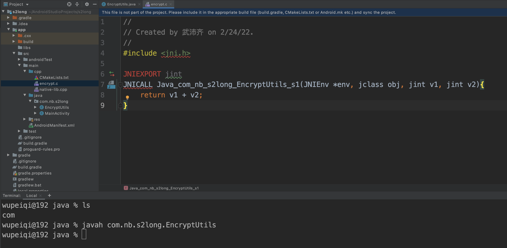


### 3.3 配置

C、C++编写的代码最终都会编译成 xxx.so 文件 。

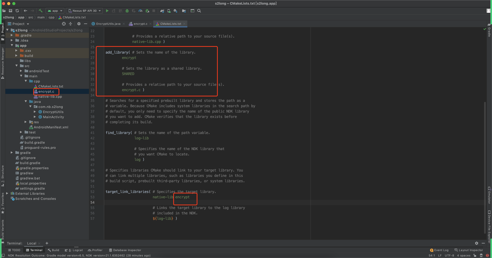


如果你要进行编译，就会生成一个 libencrypt.so 文件。


### 3.4 记得加载C文件

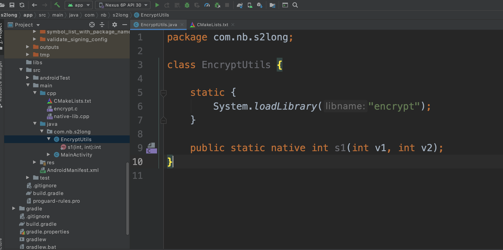


### 3.5 java调用C

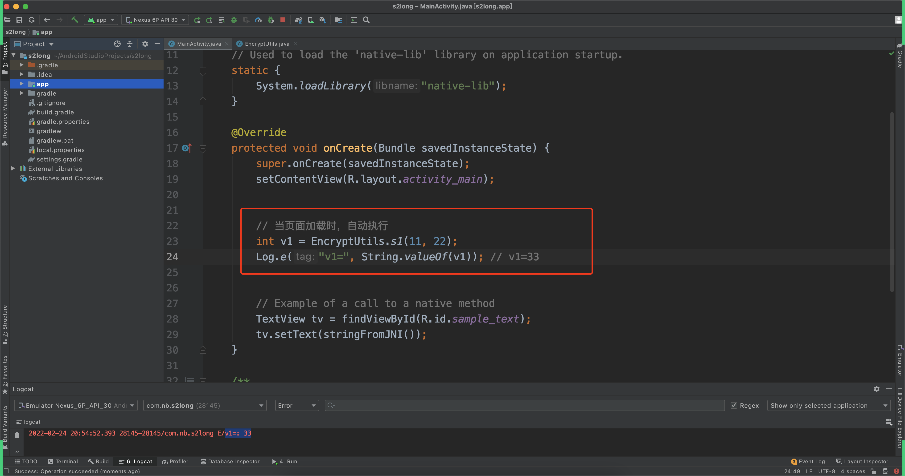


### 3.6 补充

- 我，假设我写了个app：`app-debug.apk`

- 你，逆向。

  - 反编译：Jadx反编译java代码

  - 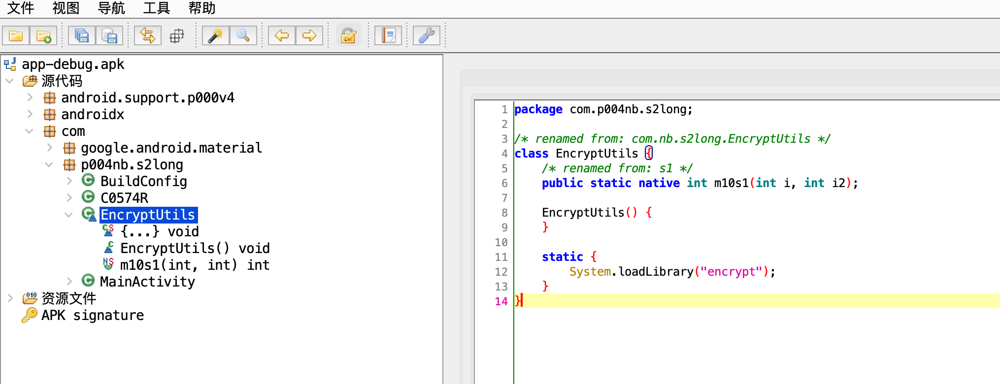

  - 反编译：ida反编译c代码
    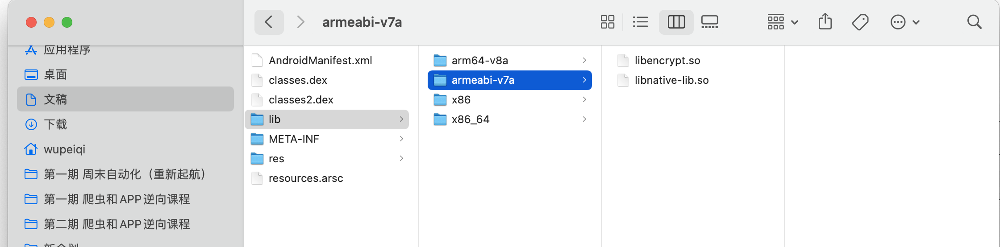

    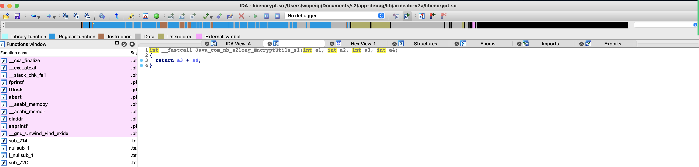


### 3.7 补充

我的s2long项目。

自动生成的native-lib可以删除。


## 4.一波案例

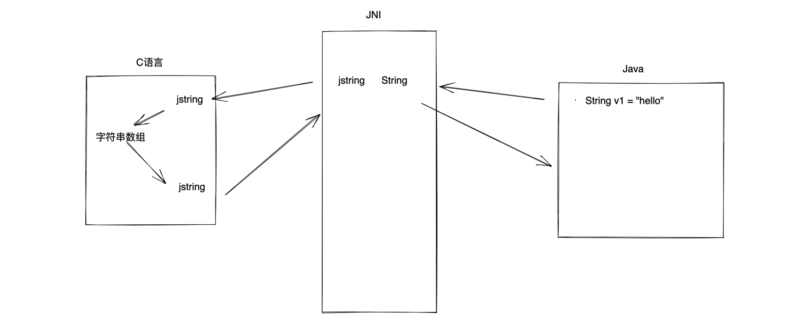


```C
char v1[] = {11,22,33};
char *p1 = v1;
```


```
Java类型			JNI类型			     JNI签名
 String           jstring          Ljava/lang/String;
```

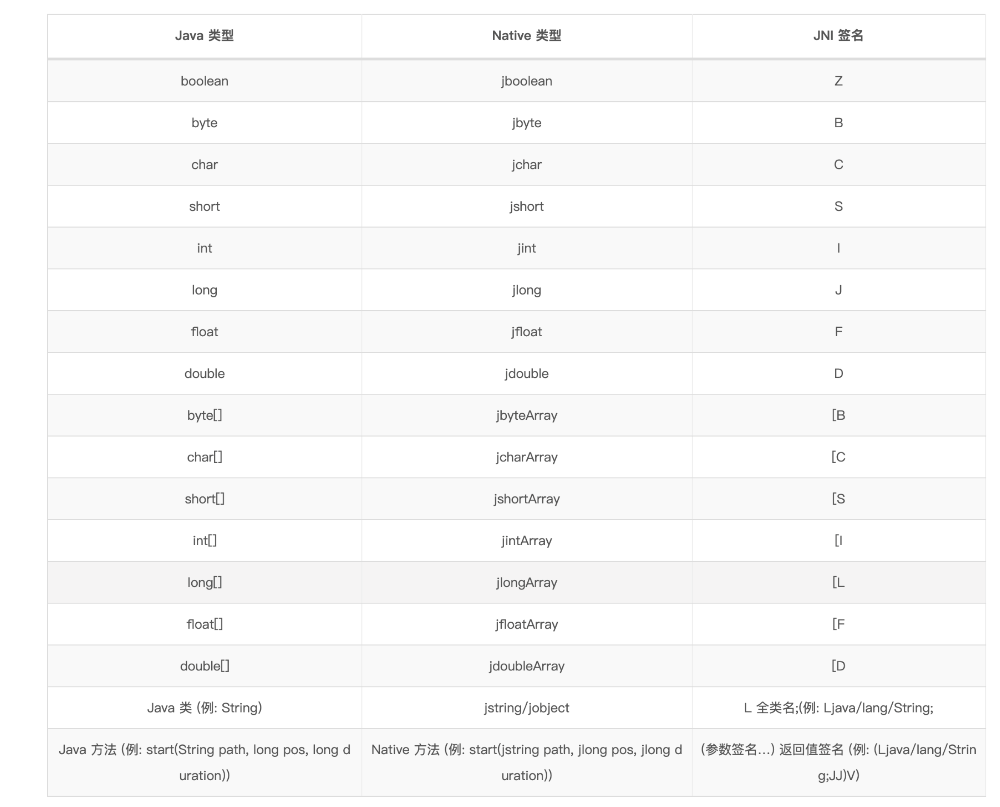


### 静态注册

在JNI开发时候，java代码调用C代码。

```java
package com.nb.s2long;

class EncryptUtils {

    static {
        System.loadLibrary("encrypt");
    }

    public static native int s1(int v1, int v2);
}
```

```c
//
// Created by 武沛齐 on 2/24/22.
//
#include <jni.h>
#include <string.h>
#include <stdio.h>

JNIEXPORT jint
JNICALL Java_com_nb_s2long_EncryptUtils_s1(JNIEnv *env, jclass obj, jint v1, jint v2) {
    return v1 + v2;
}
```


如果你现在是逆向工程师，拿到别的java反编译和so反编译之后。

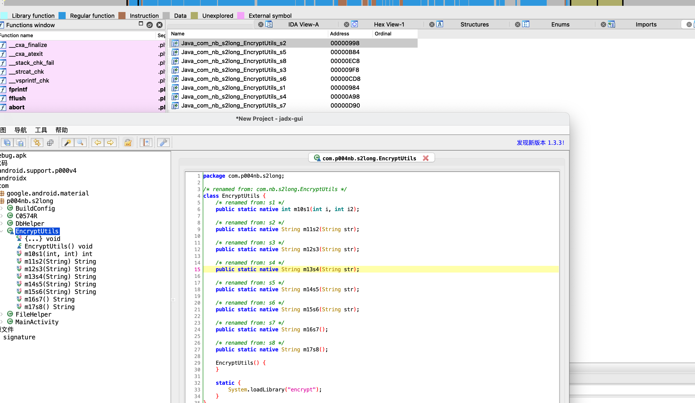


如果你是：

- 安卓：算法这么写比较简单。
- 逆向：非常愿意看到这种模式，逆向时，很容已找到C函数。


### 动态注册

为了防止别人逆向，找到jav凹函数与c含的对应关系，选择用动态注册来完成注册。


## 总结

- JNI开发是什么？

- NDK是一个工具包，用于JNI开发。

- 静态注册，IDA打开so文件时，在导出函数就可以看到.

  ```
  add              Java_com_nb_xx_xx_add
  ```

- 动态注册，IDA打开so文件时，在导出函数就可以看到.

  ```
  JNI_Onload
  
  RegisterNatives
  ```

- Java数据类型、JNI类型、JNI签名


