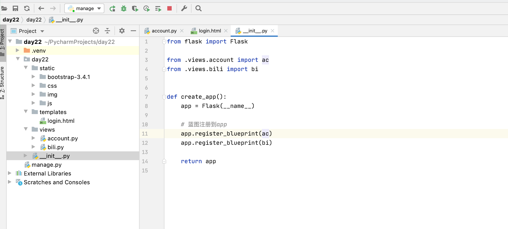
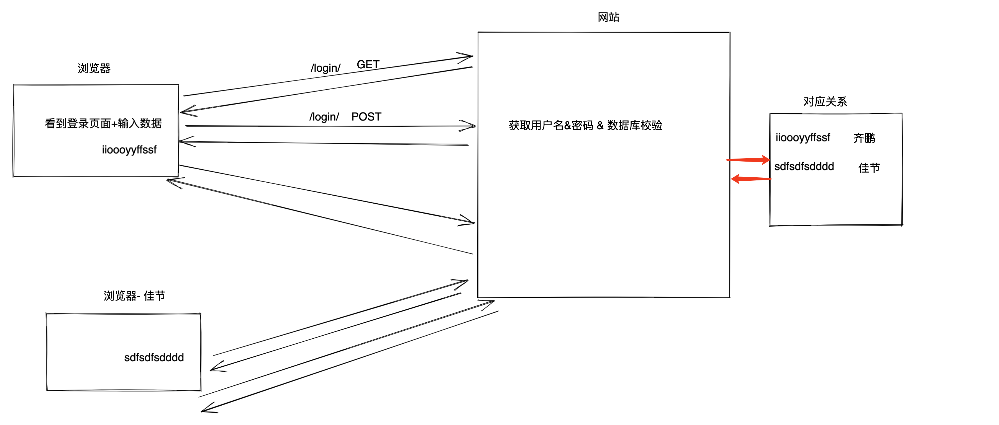
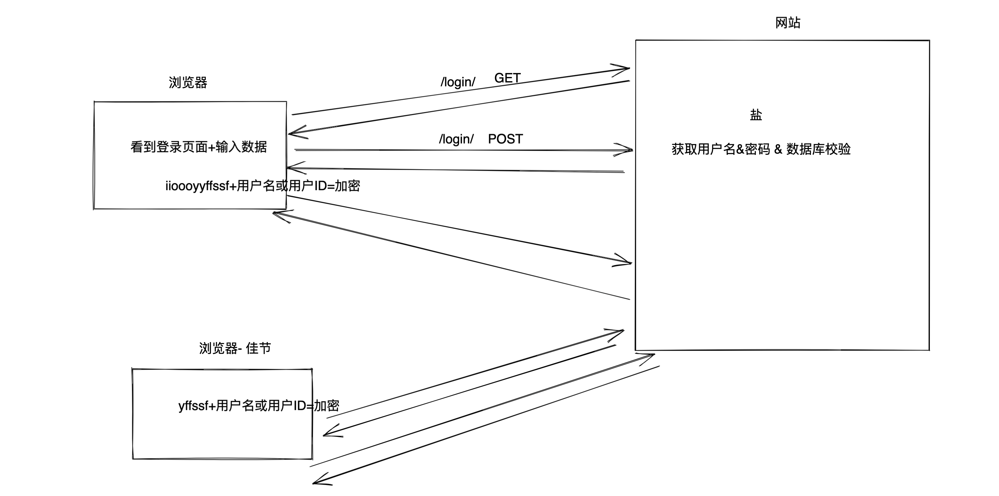
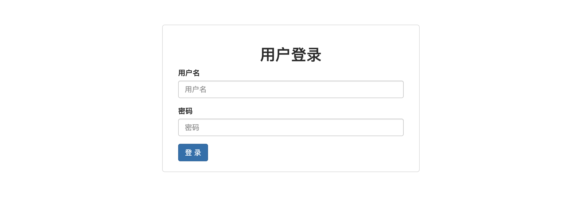
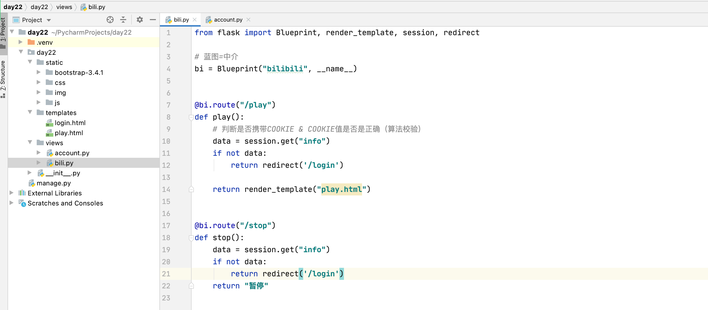

# day22 Flask

今日概要：

- Flask集成：HTML、CSS、JS、BootStrap
- Flask蓝图
- Cookie & Session & 页面


## 1.集成资源

```python
from flask import Flask, render_template

app = Flask(__name__)


@app.route('/index')
def index():
    return render_template('index.html')


if __name__ == '__main__':
    app.run()
```


- BootStrap（集成很多的样式）【CSS】
- JavaScript + jQuery
  - 引入jQuery + JS文件


平台 & 加密。


## 2.Flask蓝图

```python
from flask import Flask, render_template

app = Flask(__name__)

app1-蓝图1(URL+函数)
app1-蓝图2(URL+函数)

if __name__ == '__main__':
    app.run()
```




## 3.功能

> 使用用户登录，用户登录成功之后，才能进入后台管理。



- cookie，浏览器上存储键值对 + 再次去访问域名

  ```
  ss=iioooyyffssf
  ss=sdfsdfsdddd
  ```

- session，内存字典 & 文件 & 数据库 & redis

  ```
  xxxxx
  ```


**基于另外的一个模式来处理后端的对应关系（Flask默认）**




### 3.1 登录页面




### 3.2 平台页面


```thml
<div style="background-color: #f0ad4e;">
    <div style="width: 1190px;background-color: #2e6da4;margin: 0 auto;">f</div>
</div>
```





可以扩展方向：

- HTML、CSS、JavaScript、jQuery、BootStrap
- Flask框架/Django框架
- MySQL、redis等


