# day23 抖音（上）

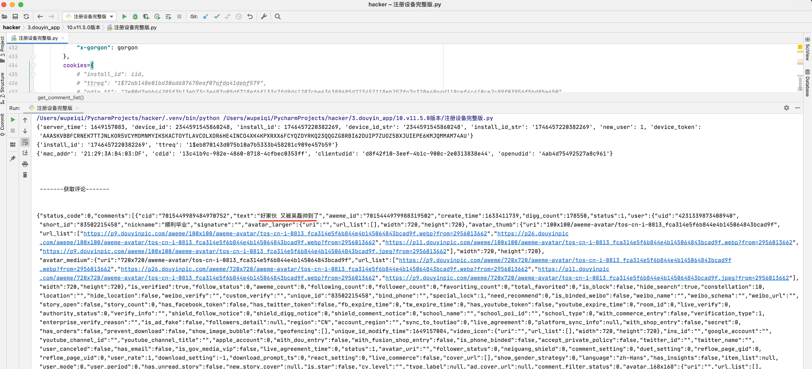

- 目标：获取评论
- 抖音版本：v11.5.0（真机）


## 1.抓包

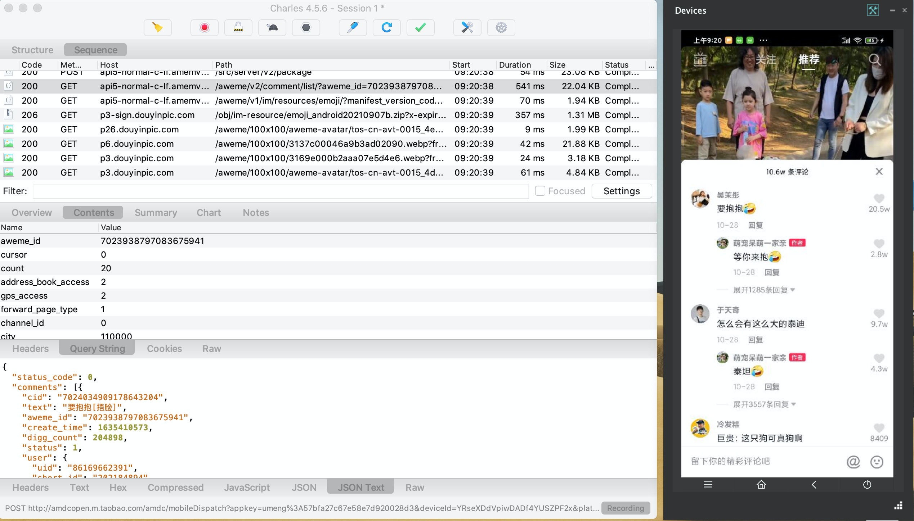

- URL参数

  ```
  固定
  ```

  ```
  aweme_id，抖音ID
  ts，时间戳（秒）
  _rticket，时间戳（毫秒）
  mac_address，搞定
  ```

  ```
  cdid
  oaid
  openudid
  iid
  deviceid
  ```

- 请求头

  ```
  x-khronos: 1649156015
  x-gorgon: 040458430001ad4959f1fde099fb0d2ed5e07c7e9c46fb54524e
  ```

- cookie（可不带）

  ```
  cookie: install_id=449039179999342
  cookie: ttreq=1$96e2b0be6c886bc769f7f0c21d476c6d4d24a400
  cookie: odin_tt
  ```


## 2.参数cdid

根据关键字搜索 `cdid`。

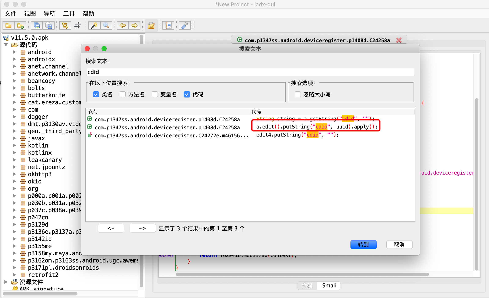

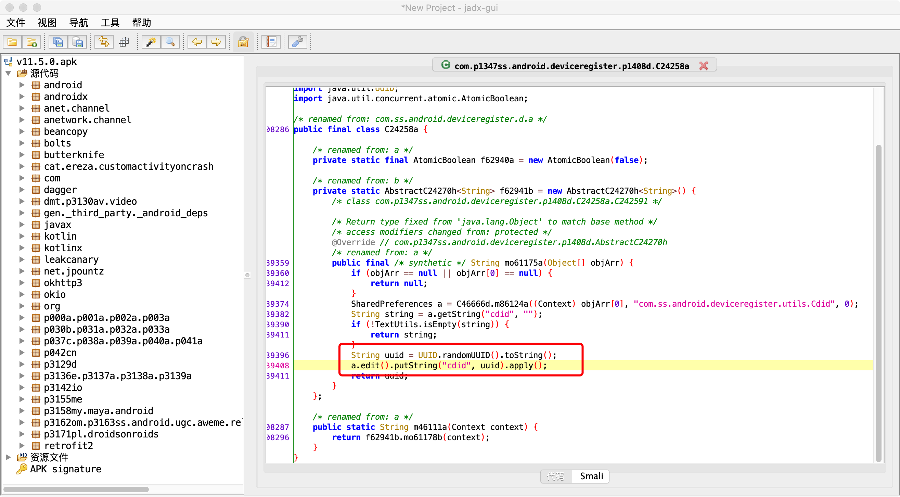

想要验证就要hook，hook谁？怎么hook？

- mo61175a -> a ，a是那个类中的方法？

  ```
  com.ss.android.deviceregister.d.a$1
  a
  ```

  ```
  实在不知道了，hook random的toString，找到调用栈。
  ```

- 清空数据，再hook


此处看到了 `SharedPreferences`，分析一下应该是：优先去xml文件中读取，如果没有的话，就使用 UUID 生成一个新的返回（同时写入到xml文件中）。

```python
import uuid

cdid = str(uuid.uuid4())
```


接下来：

- 想要验证的话，就可以在此处进行hook【清除手机数据后，再打开】。
- 此处获取调用栈，也可以知道是谁调用的 `cdid`，根据调用栈也可以找到生成其他参数的地方。


Hook UUID

```python
import frida
import sys

rdev = frida.get_remote_device()
session = rdev.attach("com.ss.android.ugc.aweme")

scr = """
Java.perform(function () {
    var UUID = Java.use("java.util.UUID");
    UUID.randomUUID.implementation = function(){
        var res = this.randomUUID();
        console.log(res,res.toString());
        console.log(Java.use("android.util.Log").getStackTraceString(Java.use("java.lang.Throwable").$new()));
        console.log('-------------');
        return res;
    }
});
"""
script = session.create_script(scr)


def on_message(message, data):
    print(message, data)


script.on("message", on_message)
script.load()
sys.stdin.read()
```

```
4ad06c6d-6d84-49a1-a749-d8485832df61 4ad06c6d-6d84-49a1-a749-d8485832df61
529c42b5-ef56-4866-8bc1-c53d55638953 529c42b5-ef56-4866-8bc1-c53d55638953
java.lang.Throwable
	at java.util.UUID.randomUUID(Native Method)
	at com.ss.android.ugc.aweme.shortvideo.e.a.b(SourceFile:458894)
	at com.ss.android.ugc.aweme.services.AVPublishServiceImpl.lambda$tryRestorePublish$0$AVPublishServiceImpl(SourceFile:393258)
	at com.ss.android.ugc.aweme.services.AVPublishServiceImpl$$Lambda$0.call(Unknown Source:21)
	at bolts.Task$10.run(SourceFile:262164)
	at com.ss.android.ugc.aweme.bs.c.run(SourceFile:459000)
	at java.util.concurrent.ThreadPoolExecutor.runWorker(ThreadPoolExecutor.java:1167)
	at java.util.concurrent.ThreadPoolExecutor$Worker.run(ThreadPoolExecutor.java:641)
	at com.ss.android.ugc.aweme.bs.e$3$1.run(SourceFile:262193)
	at java.lang.Thread.run(Thread.java:919)

-------------
java.lang.Throwable 这个
	at java.util.UUID.randomUUID(Native Method)
	at com.ss.android.deviceregister.d.a$1.a(SourceFile:17039392)
	at com.ss.android.deviceregister.d.h.b(SourceFile:16973833)
	at com.ss.android.deviceregister.d.a.a(SourceFile:16908296)
	
	at com.ss.android.common.applog.NetUtil.putCommonParams(SourceFile:34079342)
	
	at com.ss.android.ugc.aweme.legoImp.task.CrashSdkInitTask$a.a(SourceFile:262176)
	at com.bytedance.crash.runtime.c.b(SourceFile:393225)
	at com.bytedance.crash.upload.e.run(SourceFile:393410)
	
	at android.os.Handler.handleCallback(Handler.java:883)
	at android.os.Handler.dispatchMessage(Handler.java:100)
	at android.os.Looper.loop(Looper.java:223)
	at com.bytedance.crash.runtime.q$c.onLooperPrepared(SourceFile:327712)
	at android.os.HandlerThread.run(HandlerThread.java:66)


```


```python
import frida
import sys

rdev = frida.get_remote_device()
session = rdev.attach("com.ss.android.ugc.aweme")

scr = """
Java.perform(function () {
    var cls = Java.use("com.ss.android.deviceregister.d.a$1");
    cls.a.implementation = function(arg4){
        var res = this.a(arg4);
        console.log("获取cdid=",res);
        console.log(Java.use("android.util.Log").getStackTraceString(Java.use("java.lang.Throwable").$new()));
        console.log('-------------');
        return res;
    }
});
"""
script = session.create_script(scr)


def on_message(message, data):
    print(message, data)


script.on("message", on_message)
script.load()
sys.stdin.read()
```


hook后的结果是：

```
获取cdid= 7236424f-bf31-4bb5-9147-fd17b10aedbf
java.lang.Throwable
	at com.ss.android.deviceregister.d.a.a(Native Method)
	at com.ss.android.common.applog.NetUtil.putCommonParams(SourceFile:34079342)
	at com.ss.android.ugc.aweme.net.interceptor.CommonParamsInterceptorTTNet.intercept(SourceFile:17170479)
	...
```

分析：在代码中应该写了拦截器，对公共参数进行处理。


顺着调用栈向上找：

```
at com.ss.android.common.applog.NetUtil.putCommonParams(SourceFile:34079342)
```

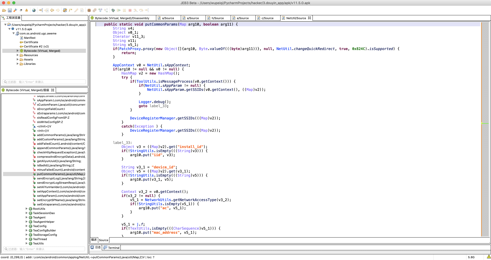


所有的参数都在这里了，所以从这里就可以开始找各个参数了。


## 3.参数oaid


这个就是去读取手机上的虚拟身份ID，可以在手机上进行关闭。

【设置】-> 【搜索：虚拟】-> 【虚拟身份管理】


```
关于OAID要从获取android设备唯一标识说起。
Android设备唯一标识包含IMEI，ANDROID_ID，Mac 地址等，随着国外对隐私保护的越来越看重，这些唯一标识要么无法获取，要么就是无效值，亦或者像ANDROID_ID各个应用获取到的是不同值，但总有一些场景需要唯一标识一台设备，尤其是CPI广告（CPI广告是按照实际的安装数量结算，需要唯一标识来确保没有重复计算），所以移动安全联盟搞了这个OAID，其本质是一个设备唯一标识。
```

关闭后，再次发送请求。

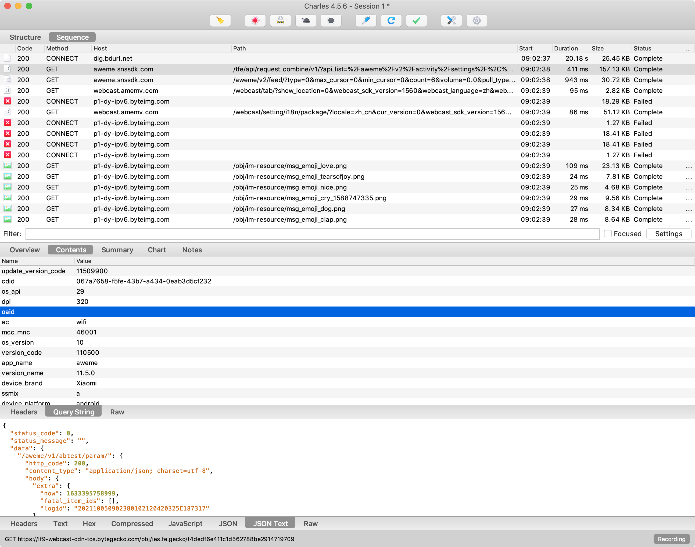


## 4.参数openudid

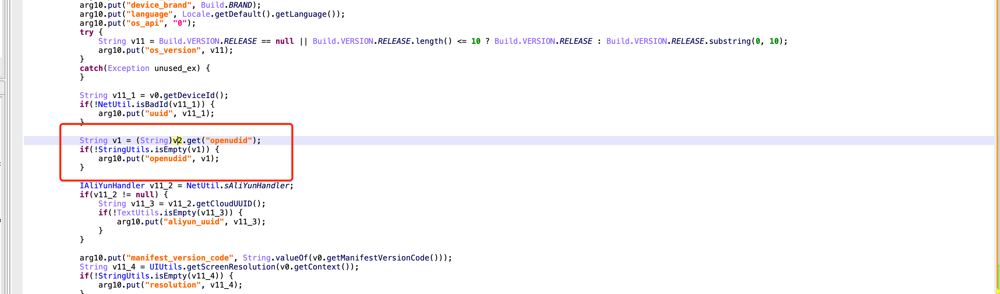


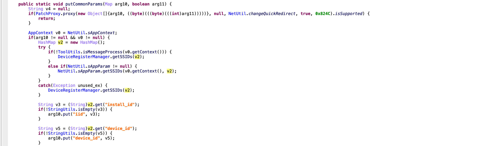


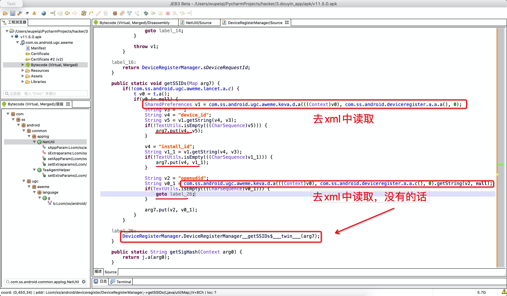


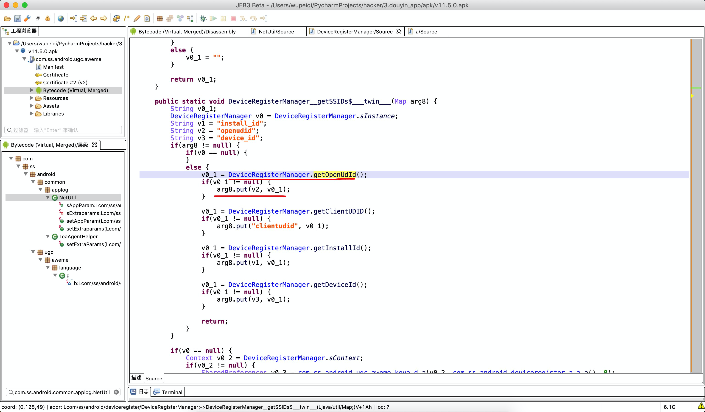


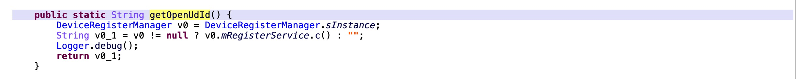

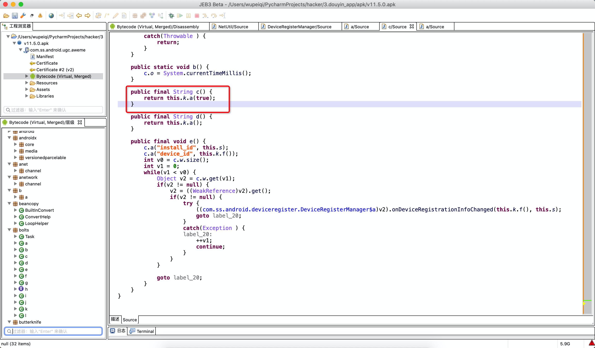

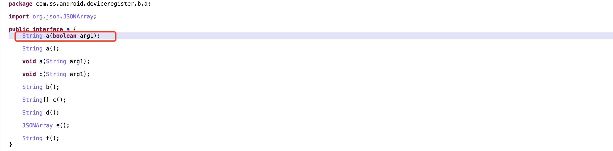

注意事项：如果想要通过hook去获取this.k

```python

import frida
import sys

rdev = frida.get_remote_device()
session = rdev.attach("com.ss.android.ugc.aweme")

scr = """
Java.perform(function () {
    var cls = Java.use("xxxx.xxxx.xxx.xx");
    cls.c.implementation = function(){
    	//console.log(this.k); // 默认是去找k函数
    	console.log(this.k.value); // 默认是去找k函数
        return this.c();
    }
});
"""
script = session.create_script(scr)


def on_message(message, data):
    print(message, data)


script.on("message", on_message)
script.load()
sys.stdin.read()


```


此处去调用一个接口，那么实现这个接口的类是谁呢？

- 可以分析

  

- 可以用JADX寻找引用
  


找到类之后，就来看其中的a方法。

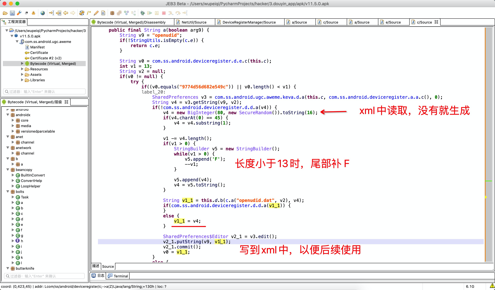


如果想要验证，就需要让代码走这里。怎么搞呢？

可以hook  SharedPreferences，读取 openudid时，如果为空，肯定就会重新生成了。

```python
import frida
import sys

rdev = frida.get_remote_device()
session = rdev.attach("com.ss.android.ugc.aweme")

scr = """
Java.perform(function () {
    var SharedPreferences = Java.use("android.content.SharedPreferences");
    
    var c = Java.use("com.ss.android.deviceregister.c");
    var e = Java.use("com.ss.android.deviceregister.d.e");
    var BigInteger = Java.use("java.math.BigInteger");
    
    SharedPreferences.getString.implementation = function(key,a2){
    	// 获取openudid为空
        if(key==="openudid"){
            return "";
        }
        return this.getString(a1,a2);
    }
    
    
    c.a.overload('boolean').implementation = function(a9){
    	// 调用a方法
        var res = this.a(a9);
        console.log("获取openudid，值为：",res);
        return res;
    }
    
    e.c.overload('android.content.Context').implementation = function(ctx){
        // 在a方法中确保，v0为空
        return null;
    }
    
    BigInteger.toString.overload('int').implementation = function(arg){
        var res = this.toString(arg);
        console.log(res);
        console.log(arg);
        console.log(Java.use("android.util.Log").getStackTraceString(Java.use("java.lang.Throwable").$new()));
        console.log('-------------');
        return res;
    }
});
"""
script = session.create_script(scr)


def on_message(message, data):
    print(message, data)


script.on("message", on_message)
script.load()
sys.stdin.read()
```


实现代码：

```python
import random
open_udid = "".join([hex(i)[2:] for i in random.randbytes(10) ])
print(open_udid) # 长度20
```

```java
import java.math.BigInteger;
import java.security.SecureRandom;
import java.util.ArrayList;

public class Hello {

    public static void main(String[] args) {
		// 随机生成80位，10个字节
        BigInteger v4 = new BigInteger(80, new SecureRandom());
        // 让字节以16进制展示
        System.out.println(v4.toString(16));

    }
}
```


## 5.参数device_id和iid

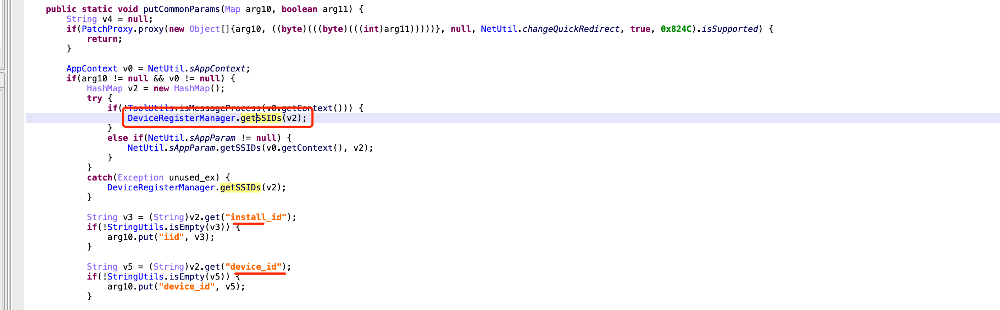

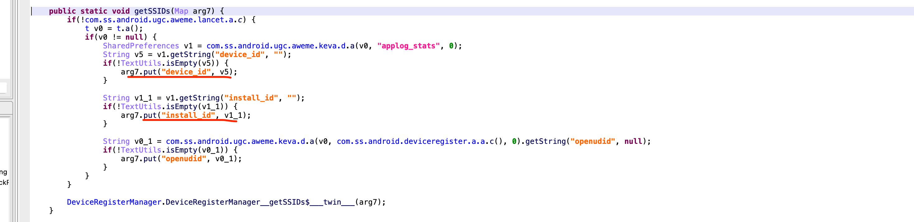


发现 device_id 和 install_id （包括cookie中的值）是发送请求 `/service/2/device_register/` 获得的返回值。

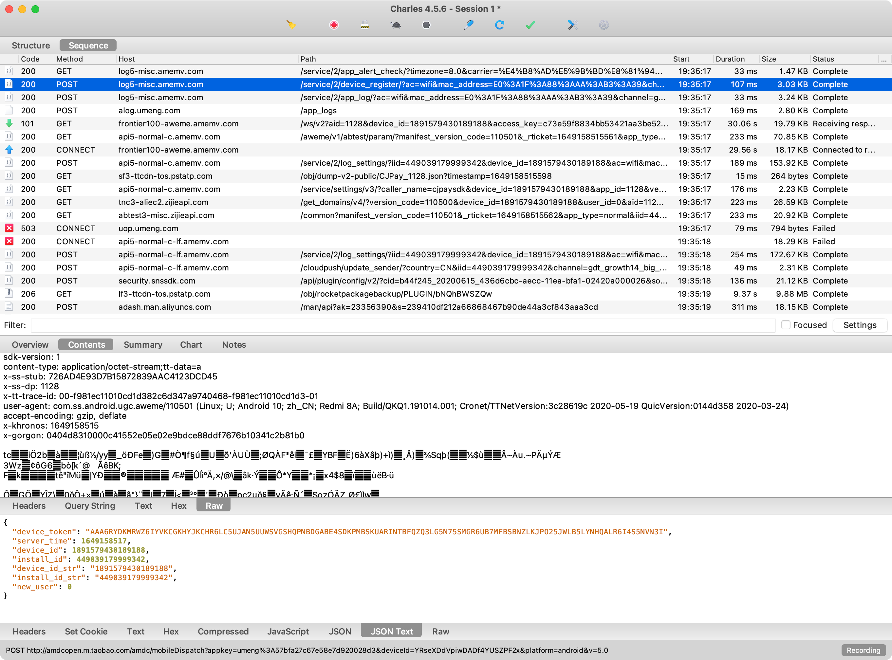


要解决这个之后，才能获取评论信息。

- URL参数，搞定

- 请求体，密文？

- 请求头

  ```
  x-ss-stub: 726AD4E93D7B15872839AAC4123DCD45
  x-khronos: 1649158515
  x-gorgon: 0404d8310000c41552e05e02e9bdce88ddf7676b10341c2b81b0
  ```

  

### 5.1 请求体密文

所以，在jeb中搜索：`device_register`


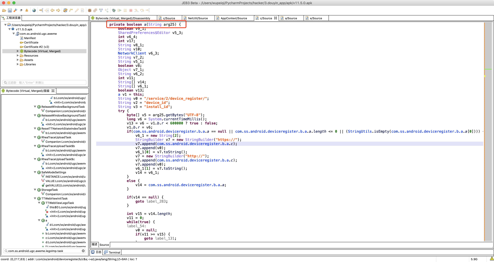


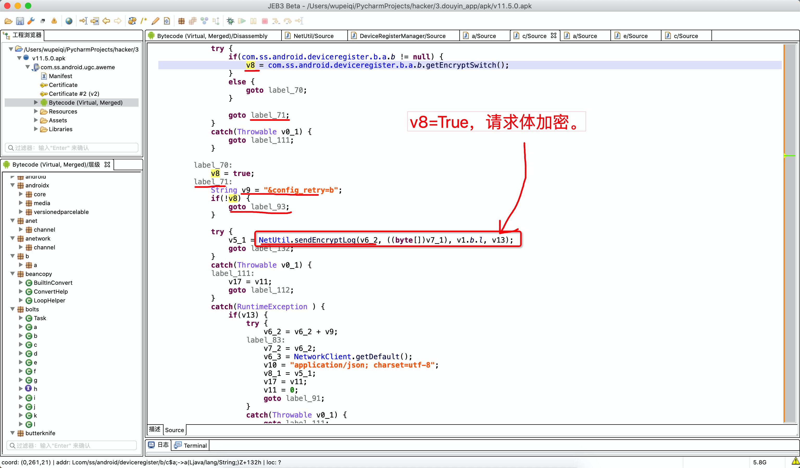


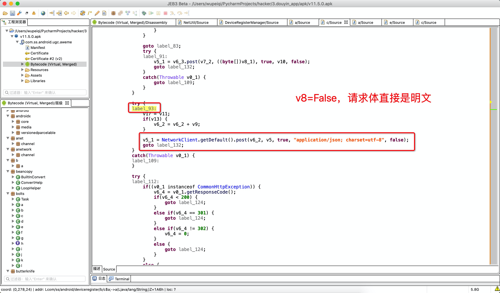


### 5.2 变明文

对 getLogEncryptSwitch 进行hook，强制返回 False，这样就可以让注册过程发送明文。

```python
import frida
import sys

rdev = frida.get_remote_device()
session = rdev.attach("com.ss.android.ugc.aweme")

scr = """
Java.perform(function () {
    var AppLog = Java.use("com.ss.android.common.applog.AppLog");
    AppLog.getLogEncryptSwitch.implementation = function(){
        var res = this.getLogEncryptSwitch();
        console.log(res);
        return false;
    }
});
"""
script = session.create_script(scr)


def on_message(message, data):
    print(message, data)


script.on("message", on_message)
script.load()
sys.stdin.read()
```


发送的请求的数据如下：

- URL

  ```
  https://log3-misc.amemv.com/service/2/device_register/?ac=wifi&mac_address=E0%3A1F%3A88%3AAA%3AB3%3A39&channel=gdt_growth14_big_yybwz&aid=1128&app_name=aweme&version_code=110500&version_name=11.5.0&device_platform=android&ssmix=a&device_type=Redmi+8A&device_brand=Xiaomi&language=zh&os_api=29&os_version=10&openudid=2348574b5d8a004d&manifest_version_code=110501&resolution=720*1369&dpi=320&update_version_code=11509900&_rticket=1633699391792&mcc_mnc=46001&cpu_support64=false&host_abi=armeabi-v7a&app_type=normal&ts=1633699391&cdid=4e33229a-53d4-4a23-9c18-b182738d64e2&oaid&manifest_version_code=110501&_rticket=1633699391844&app_type=normal&channel=gdt_growth14_big_yybwz&device_type=Redmi%208A&language=zh&cpu_support64=false&host_abi=armeabi-v7a&resolution=720*1369&openudid=2348574b5d8a004d&update_version_code=11509900&cdid=4e33229a-53d4-4a23-9c18-b182738d64e2&os_api=29&mac_address=E0%3A1F%3A88%3AAA%3AB3%3A39&dpi=320&oaid=&ac=wifi&mcc_mnc=46001&os_version=10&version_code=110500&app_name=aweme&version_name=11.5.0&device_brand=Xiaomi&ssmix=a&device_platform=android&aid=1128&ts=1633699391
  ```

- 请求体

  ```
  {"magic_tag":"ss_app_log","header":{"display_name":"抖音短视频","update_version_code":11509900,"manifest_version_code":110501,"app_version_minor":"","aid":1128,"channel":"gdt_growth14_big_yybwz","appkey":"57bfa27c67e58e7d920028d3","package":"com.ss.android.ugc.aweme","app_version":"11.5.0","version_code":110500,"sdk_version":"2.14.0-alpha.4","sdk_target_version":29,"git_hash":"c1aa4085","os":"Android","os_version":"10","os_api":29,"device_model":"Redmi 8A","device_brand":"Xiaomi","device_manufacturer":"Xiaomi","cpu_abi":"armeabi-v7a","release_build":"b44f245_20200615_436d6cbc-aecc-11ea-bfa1-02420a000026","density_dpi":320,"display_density":"xhdpi","resolution":"1369x720","language":"zh","mc":"E0:1F:88:AA:B3:39","timezone":8,"access":"wifi","not_request_sender":0,"carrier":"中国联通","mcc_mnc":"46001","rom":"MIUI-V12.0.3.0.QCPCNXM","rom_version":"miui_V12_V12.0.3.0.QCPCNXM","cdid":"4e33229a-53d4-4a23-9c18-b182738d64e2","sig_hash":"aea615ab910015038f73c47e45d21466","openudid":"2348574b5d8a004d","clientudid":"f96392a8-81c8-4a9c-a1a4-39a1ee4de7e0","sim_serial_number":[],"region":"CN","tz_name":"Asia\/Shanghai","tz_offset":28800,"sim_region":"cn","oaid":{"req_id":"bf3d0cf4-4a87-452e-9f02-42189c3104e7","hw_id_version_code":"null","take_ms":"52","is_track_limited":"null","query_times":"1","id":"","time":"1633699382168"},"oaid_may_support":true,"req_id":"7847b04b-2a79-4544-b321-ac0d0d49fc8b","custom":{"filter_warn":0,"web_ua":"Mozilla\/5.0 (Linux; Android 10; Redmi 8A Build\/QKQ1.191014.001; wv) AppleWebKit\/537.36 (KHTML, like Gecko) Version\/4.0 Chrome\/87.0.4280.101 Mobile Safari\/537.36"},"apk_first_install_time":1633661064526,"is_system_app":0,"sdk_flavor":"china"},"_gen_time":1633699391789}
  ```


### 5.3 参数是什么

```python
body_tpl = '{"magic_tag":"ss_app_log","header":{"display_name":"抖音短视频","update_version_code":11509900,"manifest_version_code":110501,"app_version_minor":"","aid":1128,"channel":"gdt_growth14_big_yybwz","appkey":"57bfa27c67e58e7d920028d3","package":"com.ss.android.ugc.aweme","app_version":"11.5.0","version_code":110500,"sdk_version":"2.14.0-alpha.4","sdk_target_version":29,"git_hash":"c1aa4085","os":"Android","os_version":"10","os_api":29,"device_model":"Redmi 8A","device_brand":"Xiaomi","device_manufacturer":"Xiaomi","cpu_abi":"armeabi-v7a","release_build":"b44f245_20200615_436d6cbc-aecc-11ea-bfa1-02420a000026","density_dpi":320,"display_density":"xhdpi","resolution":"1369x720","language":"zh","mc":"%s","timezone":8,"access":"wifi","not_request_sender":0,"carrier":"中国联通","mcc_mnc":"46001","rom":"MIUI-V12.0.3.0.QCPCNXM","rom_version":"miui_V12_V12.0.3.0.QCPCNXM","cdid":"%s","sig_hash":"aea615ab910015038f73c47e45d21466","openudid":"%s","clientudid":"%s","sim_serial_number":[],"region":"CN","tz_name":"Asia\/Shanghai","tz_offset":28800,"sim_region":"cn","oaid":{"req_id":"f0959dbb-1be0-4e11-b020-edde265e4aa1","hw_id_version_code":"null","take_ms":"95","is_track_limited":"null","query_times":"1","id":"","time":"1633765787228"},"oaid_may_support":true,"req_id":"8f29815c-a81e-48d0-843b-7c3d17d4f6ef","custom":{"filter_warn":0},"apk_first_install_time":1633765712501,"is_system_app":0,"sdk_flavor":"china"},"_gen_time":%d}'


body = body_tpl % (mac_addr, cdid, openudid, clientudid, _rticket) # clientudid也是uuid
```

```python
param_string_tpl = "ac=wifi&mac_address={mac_addr}&channel=gdt_growth14_big_yybwz&aid=1128&app_name=aweme&version_code=110500&version_name=11.5.0&device_platform=android&ssmix=a&device_type=Redmi+8A&device_brand=Xiaomi&language=zh&os_api=29&os_version=10&openudid={openudid}&manifest_version_code=110501&resolution=720*1369&dpi=320&update_version_code=11509900&_rticket={_rticket}&mcc_mnc=46001&cpu_support64=false&host_abi=armeabi-v7a&app_type=normal&ts={ts}&cdid={cdid}&oaid&manifest_version_code=110501&_rticket={_rticket}&app_type=normal&channel=gdt_growth14_big_yybwz&device_type=Redmi%208A&language=zh&cpu_support64=false&host_abi=armeabi-v7a&resolution=720*1369&openudid=2348574b5d8a004d&update_version_code=11509900&cdid={cdid}&os_api=29&mac_address={mac_addr}&dpi=320&oaid=&ac=wifi&mcc_mnc=46001&os_version=10&version_code=110500&app_name=aweme&version_name=11.5.0&device_brand=Xiaomi&ssmix=a&device_platform=android&aid=1128&ts={ts}"

param_string = param_string_tpl.format(
        mac_addr=quote_plus(mac_addr),
        openudid=openudid,
        _rticket=_rticket,
        ts=ts,
        cdid=cdid,
    )
```


### 5.4 请求体gzip压缩

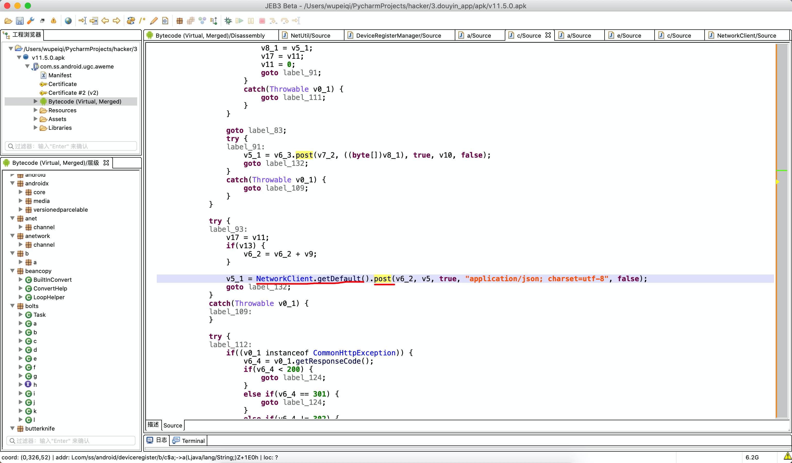


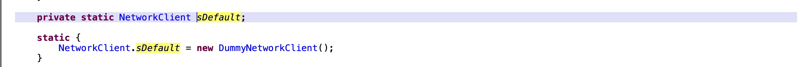


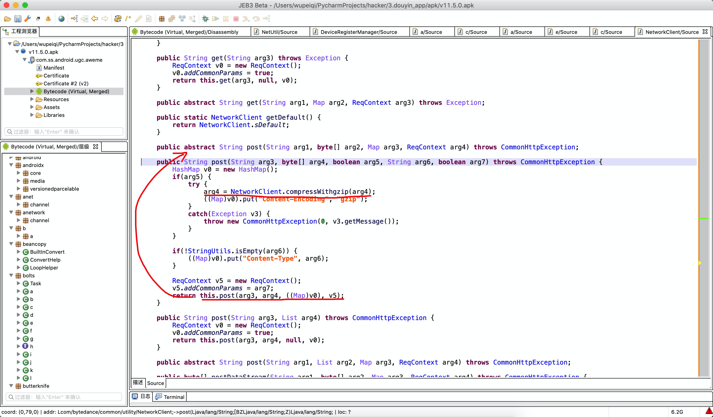


Python中实现gzip压缩的算法：

```python
import base64
import gzip


# 压缩
s_in = "我是武沛齐".encode('utf-8')
s_out = gzip.compress(s_in)
print([i for i in s_out])

"""
# 解压缩
res = gzip.decompress(s_out)
print(res)
print(res.decode('utf-8'))
"""


# 解，java中gzip压缩的结果 -> OK
"""
data_list = [31, -117, 8, 0, 0, 0, 0, 0, 0, 0, 123, -42, 49, -15, -39, -116, -11, -49, -42, 46, 123, -74, 105, -10, -53, -67, 19, 0, 44, -81, 125, -121, 15, 0, 0, 0]
res_list = [256+item if item<0 else item for item in data_list]
print(res_list)

res = gzip.decompress(bytearray(res_list))
print(res)
print(res.decode('utf-8'))
"""

```

```java
import java.io.ByteArrayInputStream;
import java.io.ByteArrayOutputStream;
import java.io.IOException;
import java.math.BigInteger;
import java.security.SecureRandom;
import java.util.ArrayList;
import java.util.Arrays;
import java.util.HashMap;
import java.io.OutputStream;
import java.util.zip.GZIPInputStream;
import java.util.zip.GZIPOutputStream;

public class Hello {

    public static void main(String[] args) throws IOException {

        // 压缩
        String data = "我是武沛齐";
        System.out.println(Arrays.toString(data.getBytes()));
        ByteArrayOutputStream v0_1 = new ByteArrayOutputStream();
        GZIPOutputStream v1 = new GZIPOutputStream((v0_1));
        v1.write(data.getBytes());
        v1.close();
        byte[] arg6 = v0_1.toByteArray();
        System.out.println(Arrays.toString(arg6));

        // 解压缩
        ByteArrayOutputStream out = new ByteArrayOutputStream();
        ByteArrayInputStream in = new ByteArrayInputStream(arg6);
        GZIPInputStream ungzip = new GZIPInputStream(in);
        byte[] buffer = new byte[256];
        int n;
        while ((n = ungzip.read(buffer)) >= 0) {
            out.write(buffer, 0, n);
        }
        byte[] res = out.toByteArray();
        System.out.println(Arrays.toString(res));
        System.out.println(out.toString("UTF-8"));

    }
}
```

提醒：Java和Python进行gzip压缩时，会发现有些字节是不同（不影响他的结果）

```
# java
[31, -117, 8, 0, 0, 0, 0, 0, 0, 0, 123, -42, 49, -15, -39, -116, -11, -49, -42, 46, 123, -74, 105, -10, -53, -67, 19, 0, 44, -81, 125, -121, 15, 0, 0, 0]

[31, 139, 8, 0, 0, 0, 0, 0, 0, 0, 123, 214, 49, 241, 217, 140, 245, 207, 214, 46, 123, 182, 105, 246, 203, 189, 19, 0, 44, 175, 125, 135, 15, 0, 0, 0]

# python
[31, 139, 8, 0, 0, 0, 0, 0, 0, 0, 123, 214, 49, 241, 217, 140, 245, 207, 214, 46, 123, 182, 105, 246, 203, 189, 19, 0, 44, 175, 125, 135, 15, 0, 0, 0]


[31, 139, 8, 0, 100, 108, 138, 97, 2, 255, 123, 214, 49, 241, 217, 140, 245, 207, 214, 46, 123, 182, 105, 246, 203, 189, 19, 0, 44, 175, 125, 135, 15, 0, 0, 0]
```


为了统一，可以处理：

```python
body = "xxxxxxxxxxxx"
gzip_body = gzip.compress(body.encode('utf-8'))
java_gzip_body = bytearray(gzip_body)
java_gzip_body[3:10] = [0, 0, 0, 0, 0, 0, 0]
java_data = bytes(java_gzip_body)
```


### 5.5 发送请求

使用jadx查询继承 `NetworkClient`的类   或  Hook输出 `NetworkClient.getDefault()` ，就会发现：

```
com.ss.android.ugc.aweme.statistic.AppLogNetworkClient
```

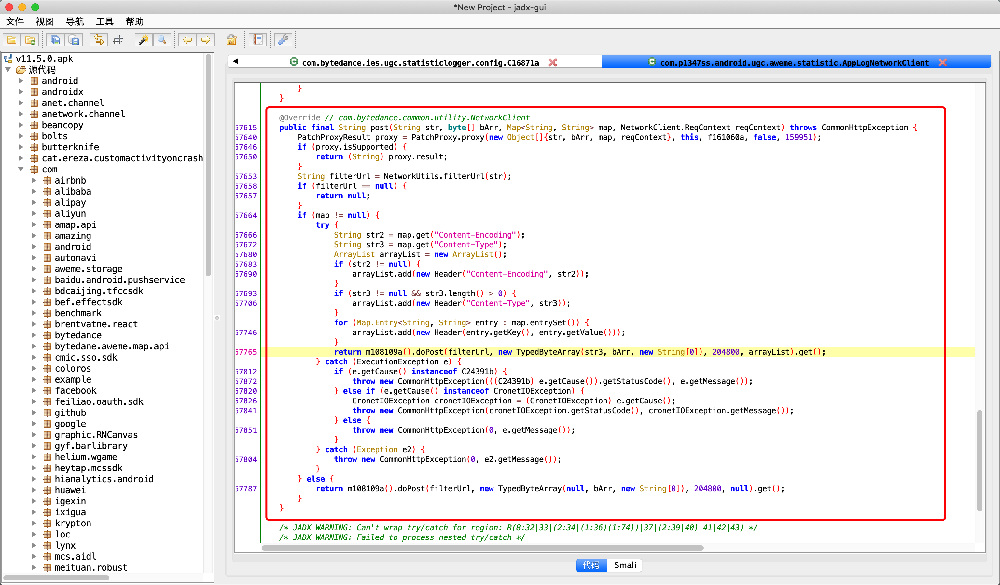


对于请求体：发送明文 -> 字节 -> gzip压缩。


